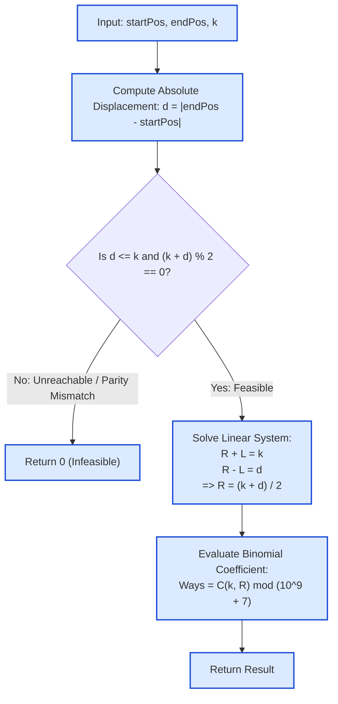

# Guided Example: Number of Ways to Reach a Position After Exactly k Steps

## 1. Problem Overview & Representative Instance

We are placed at coordinate $\text{startPos}$ on an infinite one-dimensional integer number line. At each step, we must move exactly one unit either to the left ($-1$) or to the right ($+1$). Both positive and negative coordinates may be visited during the journey.

We are given an exact step count $k$ ($1 \le k \le 1000$) and a target coordinate $\text{endPos}$ ($1 \le \text{endPos} \le 1000$). Two paths are considered distinct if their sequence of moves differs at any step index $t \in \{1, \dots, k\}$.

Our goal is to compute the total number of distinct valid $k$-step paths that start at $\text{startPos}$ and terminate precisely at $\text{endPos}$ at step $k$. Because the answer can be enormous, the result must be returned modulo $10^9 + 7$. If it is impossible to reach $\text{endPos}$ in exactly $k$ steps, return $0$.

Consider the representative instance:
$$\text{startPos} = 1, \quad \text{endPos} = 2, \quad k = 3$$

Here, the net displacement required is $\Delta = 2 - 1 = +1$ within exactly $3$ steps.

## 2. Mathematical & Algorithmic Principles

1. **System of Step Equations:**
   Let $d = |\text{endPos} - \text{startPos}|$ be the absolute distance between the start and destination coordinates.
   Let $R$ denote the number of moves in the direction of the destination, and $L$ denote the number of moves in the opposite direction.
   Every valid sequence must satisfy two simultaneous linear equations:
   $$\begin{cases} R + L = k & \text{(Total step budget)} \\ R - L = d & \text{(Net displacement)} \end{cases}$$
   Adding the two equations yields:
   $$2R = k + d \implies R = \frac{k + d}{2}$$
   Subtracting them yields:
   $$2L = k - d \implies L = \frac{k - d}{2}$$

2. **Feasibility Gating & Invariance:**
   For an integer solution with $R, L \ge 0$ to exist:
   - **Distance Bound:** $d \le k$. If the distance strictly exceeds the available steps ($d > k$), the destination is unreachable.
   - **Parity Invariant:** $(k + d)$ must be an even integer (equivalently, $k$ and $d$ must share the same parity: $(k - d) \equiv 0 \pmod 2$). Because each move changes coordinate parity by $1$, after $k$ steps the coordinate parity must match $(\text{startPos} + k) \pmod 2$. If parities mismatch, reaching the destination is strictly impossible.

3. **Bijection to Combinations (Binomial Coefficient):**
   When the feasibility conditions hold, any valid path of length $k$ is uniquely determined by choosing which $R$ of the $k$ time slots are allocated to moves in the positive direction:
   $$\text{Ways} = \binom{k}{R} = \frac{k!}{R! \, (k - R)!} \pmod{10^9 + 7}$$
   This can be evaluated in $\mathcal{O}(k)$ time using precomputed factorials and modular inverse via Fermat's Little Theorem, or in $\mathcal{O}(k^2)$ using Pascal's recurrence:
   $$\binom{n}{r} = \left( \binom{n-1}{r-1} + \binom{n-1}{r} \right) \pmod{10^9 + 7}$$

## 3. Step-by-Step Walkthrough with Intermediate State

We trace the representative instance: $\text{startPos} = 1$, $\text{endPos} = 2$, $k = 3$.

- **Step 1: Metric Calculations:**
  - Absolute displacement: $d = |2 - 1| = 1$.
  - Total steps: $k = 3$.

- **Step 2: Feasibility & Parity Gating:**
  - Reachability check: $d = 1 \le 3 = k \implies$ **Pass**.
  - Parity check: $(k + d) = 3 + 1 = 4$.
  - $4 \pmod 2 = 0 \implies$ **Even (Pass)**.

- **Step 3: Move Decomposition:**
  - Forward moves: $R = \frac{k + d}{2} = \frac{3 + 1}{2} = 2$.
  - Backward moves: $L = \frac{k - d}{2} = \frac{3 - 1}{2} = 1$.
  - Check: $R + L = 2 + 1 = 3$ and $R - L = 2 - 1 = 1$.

- **Step 4: Path Combinations:**
  - We must select $R = 2$ right moves out of $k = 3$ total moves.
  - Formula: $\binom{3}{2} = \frac{3 \cdot 2 \cdot 1}{(2 \cdot 1) \cdot 1} = 3$.
  - The three distinct paths are:
    1. $(\text{Right}, \text{Right}, \text{Left}) \implies 1 \to 2 \to 3 \to 2$.
    2. $(\text{Right}, \text{Left}, \text{Right}) \implies 1 \to 2 \to 1 \to 2$.
    3. $(\text{Left}, \text{Right}, \text{Right}) \implies 1 \to 0 \to 1 \to 2$.

- **Conclusion:** All $3$ paths arrive at coordinate $2$ at step $3$. Output is $3 \pmod{10^9 + 7} = 3$.

## 4. Comprehensive State Trace

The path enumeration and step trajectories for the representative instance are detailed below:

| Path ID | Step 1 Direction ($t=1$) | Step 2 Direction ($t=2$) | Step 3 Direction ($t=3$) | Coordinate Sequence | Final Position | Valid Target? |
|---|---|---|---|---|---|---|
| Path 1 | Right ($+1$) | Right ($+1$) | Left ($-1$) | $1 \to 2 \to 3 \to 2$ | 2 | **Yes** |
| Path 2 | Right ($+1$) | Left ($-1$) | Right ($+1$) | $1 \to 2 \to 1 \to 2$ | 2 | **Yes** |
| Path 3 | Left ($-1$) | Right ($+1$) | Right ($+1$) | $1 \to 0 \to 1 \to 2$ | 2 | **Yes** |
| Path 4 | Right ($+1$) | Left ($-1$) | Left ($-1$) | $1 \to 2 \to 1 \to 0$ | 0 | No |
| Path 5 | Left ($-1$) | Right ($+1$) | Left ($-1$) | $1 \to 0 \to 1 \to 0$ | 0 | No |
| Path 6 | Left ($-1$) | Left ($-1$) | Right ($+1$) | $1 \to 0 \to -1 \to 0$ | 0 | No |
| Path 7 | Right ($+1$) | Right ($+1$) | Right ($+1$) | $1 \to 2 \to 3 \to 4$ | 4 | No |
| Path 8 | Left ($-1$) | Left ($-1$) | Left ($-1$) | $1 \to 0 \to -1 \to -2$ | -2 | No |

Out of $2^3 = 8$ total trajectories, exactly $\binom{3}{2} = 3$ reach coordinate $2$.

The combinatorial parameter evaluation across multiple representative scenarios is summarized below:

| Instance $(\text{startPos}, \text{endPos}, k)$ | Distance $d$ | Sum $k + d$ | Parity Check ($(k+d)\%2$) | Target Moves $R$ | Binomial Expression $\binom{k}{R}$ | Result Modulo $10^9+7$ |
|---|---|---|---|---|---|---|
| $(1, 2, 3)$ | 1 | 4 | Even ($0$) | 2 | $\binom{3}{2}$ | 3 |
| $(2, 5, 10)$ | 3 | 13 | **Odd ($1$)** | — | Infeasible | **0** |
| $(5, 2, 5)$ | 3 | 8 | Even ($0$) | 4 | $\binom{5}{4}$ | 5 |
| $(1, 1, 4)$ | 0 | 4 | Even ($0$) | 2 | $\binom{4}{2}$ | 6 |
| $(1, 10, 5)$ | 9 | 14 | Even ($0$) | — | Infeasible ($d > k$) | **0** |
| $(1, 2, 999)$ | 1 | 1000 | Even ($0$) | 500 | $\binom{999}{500}$ | $668{,}054{,}388$ |

## 5. Algorithmic Correctness & Soundness

1. **Parity Conservation Theorem:**
   Every step alters coordinate parity: $X_t \equiv X_{t-1} + 1 \pmod 2$. By induction, $X_k \equiv X_0 + k \pmod 2$.
   Reaching $\text{endPos}$ requires $\text{endPos} \equiv \text{startPos} + k \pmod 2$, which is algebraically equivalent to $(\text{endPos} - \text{startPos}) \equiv k \pmod 2 \iff (k - d) \equiv 0 \pmod 2$.
   Any odd difference $(k - d)$ has no trajectories, proving that returning $0$ on odd $(k + d)$ is strictly sound.
2. **Bijection to Word Combinations:**
   Every path of length $k$ is a string over the alphabet $\{+1, -1\}^k$. A string produces net displacement $d$ if and only if the count of $+1$ symbols is $R = (k + d) / 2$. The number of binary words of length $k$ with Hamming weight $R$ is exactly $\binom{k}{R}$.
3. **Algebraic Independence of Origin:**
   Because movement on the integer line is translation-invariant, the number of paths depends solely on $d = |\text{startPos} - \text{endPos}|$ and $k$, not on the absolute coordinate values.

## 6. Edge Cases & Anti-Patterns

- **Distance Greater Than Steps ($d > k$):** Moving strictly towards the target for all $k$ steps yields at most $k < d$ distance. Always returns $0$.
- **Parity Mismatch ($k + d$ odd):** Every path lands on a coordinate of opposite parity to $\text{endPos}$. Always returns $0$.
- **Zero Displacement ($d = 0$, start equals end):** Requires returning to the origin in $k$ steps. Valid if and only if $k$ is even, yielding $\binom{k}{k/2}$.
- **Unidirectional Path ($d = k$):** Every step must be towards the target ($R = k$). Exactly $\binom{k}{k} = 1$ path.
- **Modulo Arithmetic Overflow:** Modular reduction must be applied at every addition/multiplication step to prevent 64-bit integer overflow during factorial or Pascal triangle calculations.
- **Anti-Pattern: Exponential Backtracking ($\mathcal{O}(2^k)$):** Recursively simulating all left/right choices yields $2^{1000} \approx 10^{301}$ operations. Dynamic programming or the direct combinatorial formula computes the answer in under a millisecond.

## 7. Complexity Analysis

- **Time Complexity:**
  - Computing $d$ and checking parity takes $\mathcal{O}(1)$ time.
  - Computing the binomial coefficient $\binom{k}{R} \pmod{10^9 + 7}$:
    - Using Pascal's Triangle DP takes $\mathcal{O}(k^2)$ time.
    - Using factorials with modular inverse via binary exponentiation takes $\mathcal{O}(k + \log(\text{MOD}))$ time.
  - With $k \le 1000$, both approaches run in under $2$ milliseconds.
- **Space Complexity:**
  - With direct factorial arrays or rolling Pascal rows, auxiliary space is $\mathcal{O}(k)$ or $\mathcal{O}(1)$.
  - Total auxiliary space complexity is $\mathcal{O}(k)$ or $\mathcal{O}(1)$.