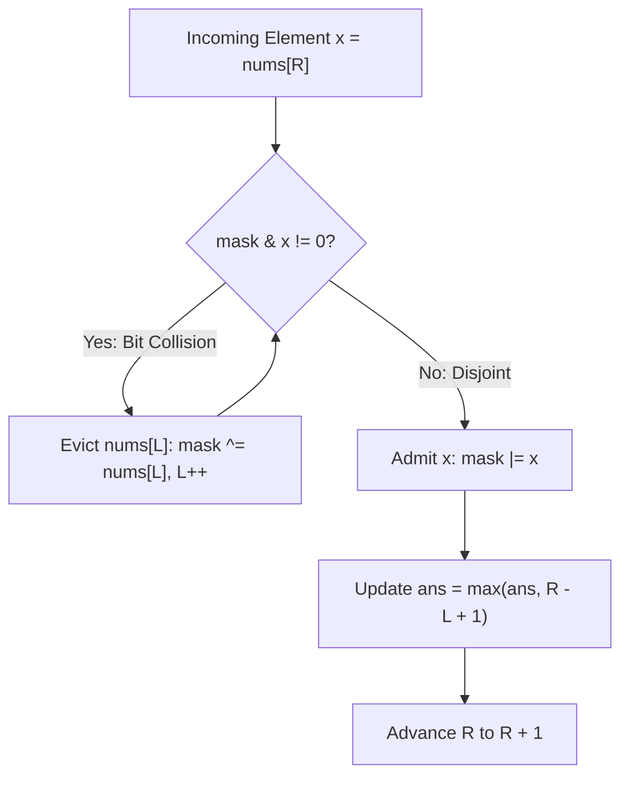

# Guided Example: Longest Nice Subarray

## 1. Problem Overview & Representative Instance

A subarray of an integer array $nums$ is defined as **nice** if the bitwise $\text{AND}$ of every pair of distinct elements in the subarray evaluates to zero:
$$\forall \, i, j \text{ with } L \le i < j \le R, \quad nums[i] \ \& \ nums[j] = 0$$

Equivalently, across all elements in the contiguous subarray $nums[L \dots R]$, no bit position can be set by more than one number. Each bit column in the binary expansion of the subarray elements must sum to at most $1$. We seek the maximum length $R - L + 1$ among all nice subarrays.

### Representative Instance
Consider the input:
- $nums = [1, 3, 8, 48, 10]$
- Binary representations:
  - $nums[0] = 1 = 000001_2$
  - $nums[1] = 3 = 000011_2$
  - $nums[2] = 8 = 001000_2$
  - $nums[3] = 48 = 110000_2$
  - $nums[4] = 10 = 001010_2$

Expected output: `3` (corresponding to the contiguous subarray $[3, 8, 48]$).

---

## 2. Mathematical & Algorithmic Principles

### Pairwise Disjoint Bitsets & Cumulative Bitwise OR
The condition that all pairs satisfy $A \& B = 0$ is logically equivalent to asserting that the sum of the elements equals their bitwise $\text{OR}$:
$$\sum_{k=L}^{R} nums[k] = \bigvee_{k=L}^{R} nums[k]$$
When maintaining an active sliding window $nums[L \dots R]$, we can represent the union of all set bits in the window by a single integer accumulator $\text{mask} = \bigvee_{k=L}^{R} nums[k]$.
When an incoming element $x = nums[R]$ arrives:
1. **Feasibility Check:** If $(\text{mask} \ \& \ x) = 0$, $x$ shares zero set bits with any element already in the window. The element can be admitted by updating $\text{mask} \leftarrow \text{mask} \mid x$.
2. **Conflict Resolution:** If $(\text{mask} \ \& \ x) \ne 0$, at least one bit position conflicts. Because the active window elements were mutually bitwise disjoint, removing the leftmost element $nums[L]$ from the accumulator is accomplished via bitwise $\text{XOR}$:
   $$\text{mask} \leftarrow \text{mask} \oplus nums[L], \quad L \leftarrow L + 1$$
   We repeatedly evict $nums[L]$ until $(\text{mask} \ \& \ x) = 0$.

### The 30-Bit Capacity Bounding Lemma
Every integer $nums[i] \le 10^9 < 2^{30}$, meaning each number is composed of at most 30 bits. Because each element in a valid nice subarray must claim at least one distinct bit position (positive integers have $\ge 1$ set bit), the length of any valid nice subarray cannot exceed $30$. Consequently, the while-loop evicting elements runs at most $30$ times across any window, ensuring strict linear execution.

---

## 3. Step-by-Step Walkthrough with Intermediate State

We initialize $L = 0$, $\text{mask} = 0$, and $\text{ans} = 0$.

### Step 1: Process $R = 0, nums[0] = 1$ ($000001_2$)
- Bit overlap test: $\text{mask} \ \& \ 1 = 0 \ \& \ 1 = 0$.
- No conflict. Admit $nums[0]$:
  $$\text{mask} = 0 \mid 1 = 1 \quad (000001_2)$$
- Active window: $[0 \dots 0] \implies [1]$, length $0 - 0 + 1 = 1$.
- Global best: $\text{ans} = \max(0, 1) = 1$.

### Step 2: Process $R = 1, nums[1] = 3$ ($000011_2$)
- Bit overlap test: $\text{mask} \ \& \ 3 = 1 \ \& \ 3 = 1 \ne 0$.
- Bit 0 conflicts with $nums[0] = 1$.
- Evict from left:
  $$\text{mask} \leftarrow \text{mask} \oplus nums[0] = 1 \oplus 1 = 0, \quad L \leftarrow 1$$
- Re-check: $\text{mask} \ \& \ 3 = 0 \ \& \ 3 = 0$. Feasible.
- Admit $nums[1]$:
  $$\text{mask} = 0 \mid 3 = 3 \quad (000011_2)$$
- Active window: $[1 \dots 1] \implies [3]$, length $1 - 1 + 1 = 1$.
- Global best: $\text{ans} = \max(1, 1) = 1$.

### Step 3: Process $R = 2, nums[2] = 8$ ($001000_2$)
- Bit overlap test: $\text{mask} \ \& \ 8 = 3 \ \& \ 8 = 0$.
- Disjoint set bits ($3 = 2^0 + 2^1$, $8 = 2^3$).
- Admit $nums[2]$:
  $$\text{mask} = 3 \mid 8 = 11 \quad (001011_2)$$
- Active window: $[1 \dots 2] \implies [3, 8]$, length $2 - 1 + 1 = 2$.
- Global best: $\text{ans} = \max(1, 2) = 2$.

### Step 4: Process $R = 3, nums[3] = 48$ ($110000_2$)
- Bit overlap test: $\text{mask} \ \& \ 48 = 11 \ \& \ 48 = 0$.
- Set bits in 48 are $\{4, 5\}$, set bits in 11 are $\{0, 1, 3\}$. Mutually disjoint.
- Admit $nums[3]$:
  $$\text{mask} = 11 \mid 48 = 59 \quad (111011_2)$$
- Active window: $[1 \dots 3] \implies [3, 8, 48]$, length $3 - 1 + 1 = 3$.
- Global best: $\text{ans} = \max(2, 3) = 3$.

### Step 5: Process $R = 4, nums[4] = 10$ ($001010_2$)
- Bit overlap test: $\text{mask} \ \& \ 10 = 59 \ \& \ 10 = 10 \ne 0$.
- Number $10$ has bits $\{1, 3\}$ set. In the current window $[3, 8, 48]$, bit 1 comes from $3$ and bit 3 comes from $8$.
- Eviction iteration 1:
  $$\text{mask} \leftarrow \text{mask} \oplus nums[1] = 59 \oplus 3 = 56 \quad (111000_2), \quad L \leftarrow 2$$
  Test: $56 \ \& \ 10 = 8 \ne 0$ (bit 3 still collides with $8$).
- Eviction iteration 2:
  $$\text{mask} \leftarrow \text{mask} \oplus nums[2] = 56 \oplus 8 = 48 \quad (110000_2), \quad L \leftarrow 3$$
  Test: $48 \ \& \ 10 = 0$. Conflict fully resolved!
- Admit $nums[4]$:
  $$\text{mask} = 48 \mid 10 = 58 \quad (111010_2)$$
- Active window: $[3 \dots 4] \implies [48, 10]$, length $4 - 3 + 1 = 2$.
- Global best: $\text{ans} = \max(3, 2) = 3$.

Final maximum nice subarray length: `3`.

---

## 4. Comprehensive State Trace

| Step | $R$ | $nums[R]$ | Binary | Pre-Admit Collision ($\text{mask} \ \& \ x$) | Evicted $nums[L]$ | Post-Eviction $L$ | Final $\text{mask}$ | Active Window | Window Length | Running $\text{ans}$ |
|---|---|---|---|---|---|---|---|---|---|---|
| 0 | - | - | - | - | - | 0 | 0 | $\emptyset$ | 0 | 0 |
| 1 | 0 | 1 | $000001_2$ | None ($0$) | None | 0 | 1 | $[1]$ | 1 | 1 |
| 2 | 1 | 3 | $000011_2$ | Bit 0 ($1$) | $nums[0] = 1$ | 1 | 3 | $[3]$ | 1 | 1 |
| 3 | 2 | 8 | $001000_2$ | None ($0$) | None | 1 | 11 | $[3, 8]$ | 2 | 2 |
| 4 | 3 | 48 | $110000_2$ | None ($0$) | None | 1 | 59 | $[3, 8, 48]$ | 3 | 3 |
| 5 | 4 | 10 | $001010_2$ | Bits 1, 3 ($10$) | $nums[1]=3, nums[2]=8$ | 3 | 58 | $[48, 10]$ | 2 | 3 |

---

## 5. Algorithmic Correctness & Soundness

### Soundness
Every window evaluated at the end of loop iteration $R$ satisfies:
$$\forall \, i, j \in [L, R] \text{ with } i \ne j, \quad nums[i] \ \& \ nums[j] = 0$$
This holds inductively:
1. Base case: Window $[0 \dots 0]$ has a single element, satisfying pairwise disjointness vacuously.
2. Inductive step: Assume $nums[L \dots R-1]$ is pairwise disjoint. When $nums[R]$ is considered, all elements in $nums[L \dots R-1]$ that share any bit with $nums[R]$ are removed in order from index $L$ upwards until the residual mask shares zero bits with $nums[R]$. Removing elements from a pairwise disjoint set preserves disjointness among the remaining subset. Admitting $nums[R]$ adds no shared bits. Hence, $nums[L \dots R]$ is guaranteed nice.

### Completeness
For any right boundary $R$, let $L^*(R)$ be the smallest index such that $nums[L^*(R) \dots R]$ is nice. Because subarray niceness is monotonic with respect to prefix inclusion (any subsegment of a nice subarray is nice), all nice subarrays ending at $R$ are subsegments of $[L^*(R) \dots R]$. The two-pointer contraction moves $L$ forward only when a bit collision with $nums[R]$ exists, never moving $L$ past $L^*(R)$. Thus the longest valid subarray ending at $R$ is exactly evaluated.

---

## 6. Edge Cases & Anti-Patterns

| Category | Concrete Example | Failure Mode | Correct Principle |
|---|---|---|---|
| Subtraction vs XOR Eviction | Inverted bits in subtraction | Arithmetic carry bugs when subtracting non-disjoint values | Because all elements in window are bitwise disjoint, $\text{mask} \ \& \ nums[L] = nums[L]$; thus $\text{mask} \oplus nums[L]$ cleanly clears precisely those bits. |
| Stale Left Pointer Jump | Jumping $L$ directly to collision index without clearing intervening elements | Internal bitmask retains intermediate evicted elements | Must contract $L$ sequentially while clearing each evicted element from $\text{mask}$ via $\text{mask} \oplus nums[L]$. |
| Single-Element Input | $nums = [42]$ | Returning 0 or skipping loop | Single elements are trivially nice; answer is 1. |
| Maximum Capacity Plateau | Array with 30 disjoint powers of 2 | Buffer overflow or unnecessary break | Maximum window length reaches at most 30 without exceeding 32-bit register bounds. |

---

## 7. Complexity Analysis

- **Time Complexity:** $\mathcal{O}(N)$. The right pointer $R$ advances $N$ times. The left pointer $L$ advances at most $N$ times over the entire execution. Because no nice subarray can exceed 30 elements, the inner while loop executes at most $\min(N, 30)$ times per right-pointer step, making total operations bounded by $30N = \mathcal{O}(N)$.
- **Auxiliary Space Complexity:** $\mathcal{O}(1)$. Only three integer scalar variables ($L$, $\text{mask}$, $\text{ans}$) are maintained.