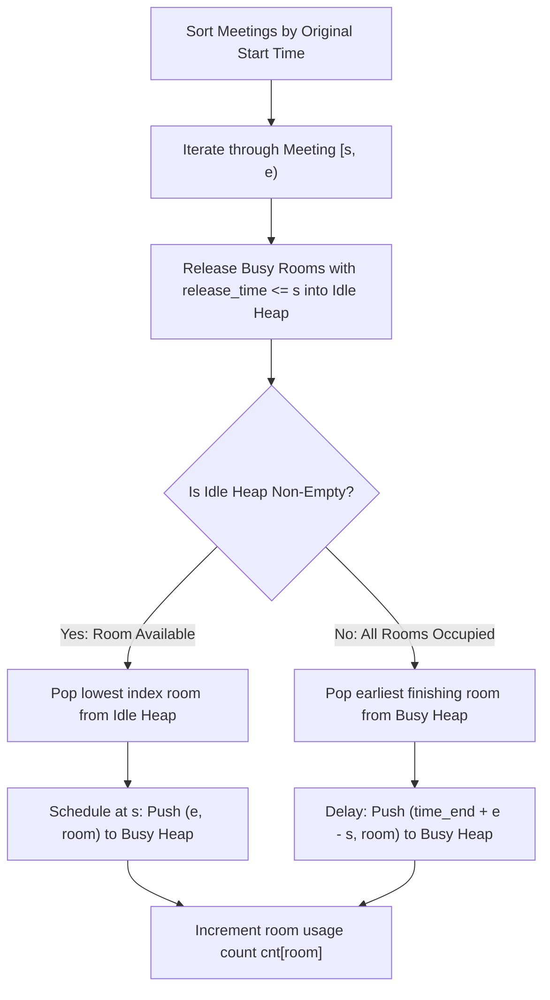

# Guided Example: Meeting Rooms III

## 1. Problem Overview & Representative Instance

We are given an integer $n$ indicating $n$ distinct meeting rooms indexed $0$ through $n - 1$, and a 2D array of meetings where $\text{meetings}[i] = [\text{start}_i, \text{end}_i)$ denotes a half-open interval during which a meeting must take place.

The scheduling environment adheres to strict operational rules:
1. **FIFO by Original Start Time:** Meetings are allocated in strictly ascending order of their original start times $\text{start}_i$.
2. **Idle Room Selection:** When a meeting is ready to start, it is assigned to the available idle room with the lowest room index.
3. **Delay Invariant:** If no room is available at $\text{start}_i$, the meeting is delayed until the earliest room becomes available. The meeting retains its original duration $\text{end}_i - \text{start}_i$, beginning immediately at the room release time $\text{time}_{\text{free}}$ and concluding at $\text{time}_{\text{free}} + (\text{end}_i - \text{start}_i)$.
4. **Simultaneous Freeing Tie-Breaking:** If multiple rooms become free at the same timestamp, the room with the smallest room index is chosen.
5. **Goal:** Determine which room hosted the maximum total number of meetings. In case of ties in count, return the room with the lowest index.

### Representative Instance
- Number of rooms: $n = 2$ (Rooms $0$ and $1$)
- Meeting intervals: $\text{meetings} = [[0, 10], [1, 5], [2, 7], [3, 4]]$

Expected result: Room `0` (Rooms 0 and 1 both hold 2 meetings; room 0 wins by lower index).

---

## 2. Mathematical & Algorithmic Principles

### Dual Min-Heap Coordination
Simulating the timeline linearly across discrete seconds is infeasible because intervals extend up to $10^5$. Instead, an event-driven priority architecture partitions rooms into two complementary min-heaps:
1. **Idle Rooms Heap ($\mathcal{H}_{\text{idle}}$):** Stores integers representing unused room indices $\{0, 1, \dots, n-1\}$, ordered by room index. Peeking or popping always extracts the minimum index in $\mathcal{O}(\log n)$ time.
2. **Busy Rooms Heap ($\mathcal{H}_{\text{busy}}$):** Stores pairs $(\text{release\_time}, \text{room\_id})$ sorted lexicographically first by earliest release time, then by lowest room index.

### Transition Mechanics
For each meeting $[\text{start}, \text{end})$ with duration $d = \text{end} - \text{start}$:
1. **Eager Reclamation:** While $\mathcal{H}_{\text{busy}}$ is non-empty and the top room finishes at $\text{release\_time} \le \text{start}$, pop the pair and insert its $\text{room\_id}$ into $\mathcal{H}_{\text{idle}}$.
2. **Immediate Assignment:** If $\mathcal{H}_{\text{idle}}$ contains rooms, pop the minimum index $i$. The meeting runs from $\text{start}$ to $\text{end}$. Push $(\text{end}, i)$ into $\mathcal{H}_{\text{busy}}$, and increment $\text{cnt}[i]$.
3. **Delayed Assignment:** If $\mathcal{H}_{\text{idle}}$ is empty, pop the earliest finishing room $(t_{\text{end}}, i)$ from $\mathcal{H}_{\text{busy}}$. The meeting starts at $t_{\text{end}}$ and finishes at $t_{\text{end}} + d$. Push $(t_{\text{end}} + d, i)$ into $\mathcal{H}_{\text{busy}}$, and increment $\text{cnt}[i]$.

---

## 3. Step-by-Step Walkthrough with Intermediate State

Initial configuration:
- $\mathcal{H}_{\text{idle}} = [0, 1]$
- $\mathcal{H}_{\text{busy}} = \emptyset$
- Usage counters: $\text{cnt} = [0, 0]$
- Meetings sorted: $M_0: [0, 10]$ (duration 10), $M_1: [1, 5]$ (duration 4), $M_2: [2, 7]$ (duration 5), $M_3: [3, 4]$ (duration 1).

### Meeting $M_0: [0, 10]$ ($s = 0, e = 10, d = 10$)
- Eager reclamation at time $s = 0$: $\mathcal{H}_{\text{busy}}$ is empty; no rooms freed.
- Availability check: $\mathcal{H}_{\text{idle}} = [0, 1]$ is non-empty.
- Lowest idle room extracted: Room $0$.
- Scheduling: Room $0$ is occupied from time $0$ to $10$.
  - Push $(10, 0)$ into $\mathcal{H}_{\text{busy}}$.
  - $\text{cnt}[0] = 1$.
- State after $M_0$:
  - $\mathcal{H}_{\text{idle}} = [1]$
  - $\mathcal{H}_{\text{busy}} = [(10, 0)]$
  - $\text{cnt} = [1, 0]$

### Meeting $M_1: [1, 5]$ ($s = 1, e = 5, d = 4$)
- Eager reclamation at time $s = 1$: Top of $\mathcal{H}_{\text{busy}}$ is $(10, 0)$ with $10 > 1$. No rooms freed.
- Availability check: $\mathcal{H}_{\text{idle}} = [1]$ is non-empty.
- Lowest idle room extracted: Room $1$.
- Scheduling: Room $1$ is occupied from time $1$ to $5$.
  - Push $(5, 1)$ into $\mathcal{H}_{\text{busy}}$.
  - $\text{cnt}[1] = 1$.
- State after $M_1$:
  - $\mathcal{H}_{\text{idle}} = \emptyset$
  - $\mathcal{H}_{\text{busy}} = [(5, 1), (10, 0)]$
  - $\text{cnt} = [1, 1]$

### Meeting $M_2: [2, 7]$ ($s = 2, e = 7, d = 5$)
- Eager reclamation at time $s = 2$: Earliest release is $5 > 2$. No room is free.
- Availability check: $\mathcal{H}_{\text{idle}}$ is empty. All rooms are busy.
- Delayed room selection: Pop earliest finishing room from $\mathcal{H}_{\text{busy}}$: $(5, 1)$ is retrieved.
  - Room $1$ becomes available at time $5$.
  - The meeting is delayed to start at time $5$.
  - New end time: $5 + d = 5 + 5 = 10$.
  - Push $(10, 1)$ into $\mathcal{H}_{\text{busy}}$.
  - $\text{cnt}[1] = 1 + 1 = 2$.
- State after $M_2$:
  - $\mathcal{H}_{\text{idle}} = \emptyset$
  - $\mathcal{H}_{\text{busy}} = [(10, 0), (10, 1)]$ (both finish at $t = 10$; lexicographical order prioritizes room $0$)
  - $\text{cnt} = [1, 2]$

### Meeting $M_3: [3, 4]$ ($s = 3, e = 4, d = 1$)
- Eager reclamation at time $s = 3$: Both rooms in $\mathcal{H}_{\text{busy}}$ finish at $10 > 3$. No room is free.
- Availability check: $\mathcal{H}_{\text{idle}}$ is empty.
- Delayed room selection: Pop top of $\mathcal{H}_{\text{busy}}$. Both rooms release at $10$; the heap tie-breaker selects the smaller index: Room $0$ with pair $(10, 0)$ is extracted.
  - Room $0$ becomes available at time $10$.
  - Meeting starts at $10$, ends at $10 + d = 10 + 1 = 11$.
  - Push $(11, 0)$ into $\mathcal{H}_{\text{busy}}$.
  - $\text{cnt}[0] = 1 + 1 = 2$.
- State after $M_3$:
  - $\mathcal{H}_{\text{idle}} = \emptyset$
  - $\mathcal{H}_{\text{busy}} = [(10, 1), (11, 0)]$
  - $\text{cnt} = [2, 2]$

### Final Result Resolution
Iterate through room counts:
- Room 0: count = 2
- Room 1: count = 2
Because the maximum count is 2 and Room 0 has the strictly lower index, Room 0 is selected.

---

## 4. Comprehensive State Trace

| Meeting Index | Original Interval $[s, e)$ | Duration $d$ | Eagerly Freed Rooms | Active $\mathcal{H}_{\text{idle}}$ | Assigned Room | Actual Time Interval | $\mathcal{H}_{\text{busy}}$ After Step | Updated Counts $[\text{cnt}_0, \text{cnt}_1]$ |
|---|---|---|---|---|---|---|---|---|
| Initial | - | - | - | $[0, 1]$ | - | - | $\emptyset$ | $[0, 0]$ |
| $M_0$ | $[0, 10)$ | 10 | None | $[0, 1]$ | Room 0 | $[0, 10)$ | $[(10, 0)]$ | $[1, 0]$ |
| $M_1$ | $[1, 5)$ | 4 | None | $[1]$ | Room 1 | $[1, 5)$ | $[(5, 1), (10, 0)]$ | $[1, 1]$ |
| $M_2$ | $[2, 7)$ | 5 | None | $\emptyset$ (delayed) | Room 1 | $[5, 10)$ | $[(10, 0), (10, 1)]$ | $[1, 2]$ |
| $M_3$ | $[3, 4)$ | 1 | None | $\emptyset$ (delayed) | Room 0 | $[10, 11)$ | $[(10, 1), (11, 0)]$ | $[2, 2]$ |

---

## 5. Algorithmic Correctness & Soundness

### Soundness of Eager Heap Reclamation
Before assigning an arriving meeting at time $s$, all busy rooms satisfying $t_{\text{end}} \le s$ must be transferred to $\mathcal{H}_{\text{idle}}$. If we only reclaimed one room, a lower-indexed room that also freed up before $s$ could remain marooned in $\mathcal{H}_{\text{busy}}$, violating the rule that the lowest available room index must always be chosen.

### Soundness of Delayed Meeting Assignment
When all rooms are busy, no room can possibly accept a meeting earlier than $\min_{(t, i) \in \mathcal{H}_{\text{busy}}} t$. Popping the min-element gives the earliest feasible start time. By tuple ordering $(t_{\text{end}}, i)$, any tie in earliest completion automatically resolves to the lowest room index. The meeting preserves its original duration $d$, exactly matching the physical delay invariant.

---

## 6. Edge Cases & Anti-Patterns

| Failure Pattern | Mechanism | Concrete Vulnerability | Correct Principle |
|---|---|---|---|
| Single Busy Queue | Merging idle and busy rooms into one min-heap | Inability to separate "lowest room index" from "earliest finish time" | Maintain two disjoint heaps: one for idle rooms ordered by ID, one for busy rooms ordered by (end time, ID). |
| Partial Eager Reclamation | Only popping one room from busy heap when multiple rooms freed before $s$ | High-indexed room gets assigned while a lower-indexed room was already free | Run `while busy and busy[0][0] <= s` to transfer every freed room before picking. |
| Duration Distortion | Setting delayed end time to $e$ instead of $t_{\text{free}} + (e - s)$ | Meeting duration shrinks under delays, invalidating subsequent room release times | Duration is an invariant: new end time must strictly be $t_{\text{free}} + (e - s)$. |
| Large Timestamp Overflow | $t_{\text{free}} + d$ exceeding 32-bit signed limits | Integer overflow on languages with fixed-width integers | End times accumulate up to $M \times \max(d) \approx 10^5 \times 10^5 = 10^{10}$, requiring 64-bit integer tracking. |

---

## 7. Complexity Analysis

- **Time Complexity:** $\mathcal{O}(M \log M + M \log N)$, where $M$ is the number of meetings and $N$ is the number of rooms.
  - Sorting $M$ meetings by start time requires $\mathcal{O}(M \log M)$.
  - Each meeting is pushed into and popped from the room heaps a constant number of times. With heap capacity bounded by $N$, each heap push or pop takes $\mathcal{O}(\log N)$.
  - Finding the maximum booking count takes $\mathcal{O}(N)$ post-processing.
- **Auxiliary Space Complexity:** $\mathcal{O}(N)$. The idle heap, busy heap, and usage frequency array store at most $N$ elements each.
