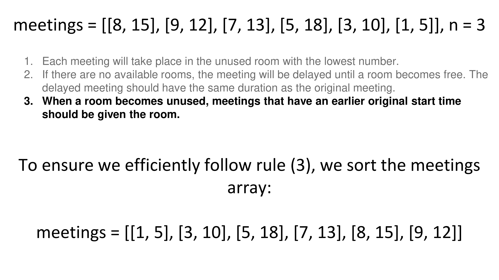
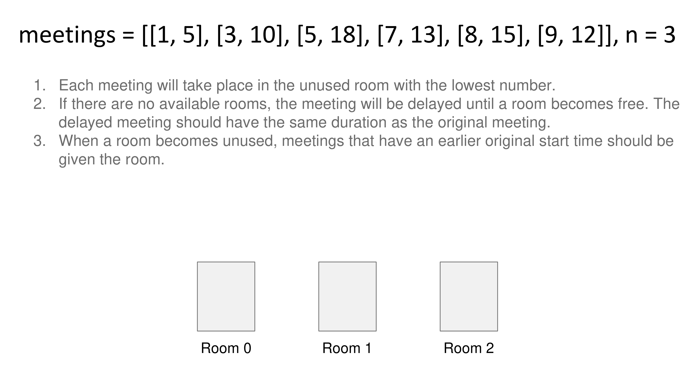
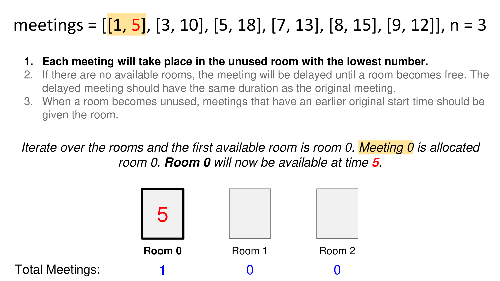
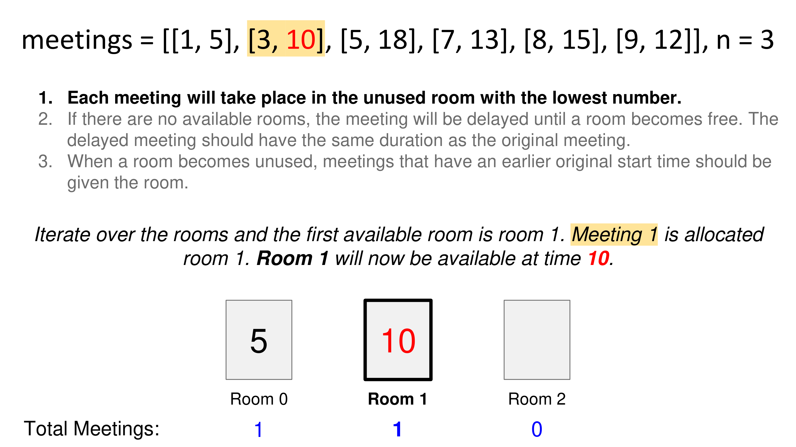
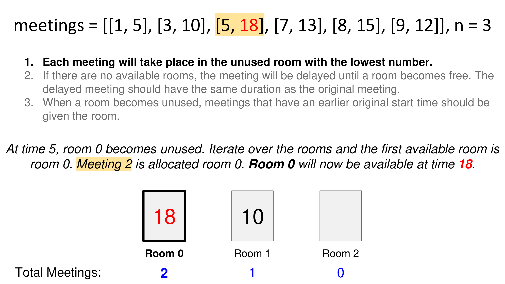
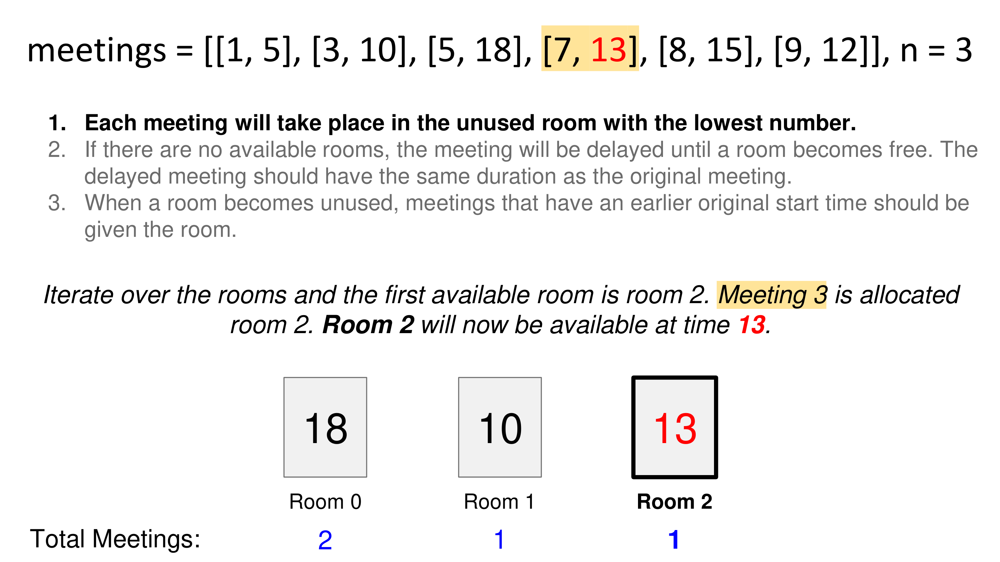
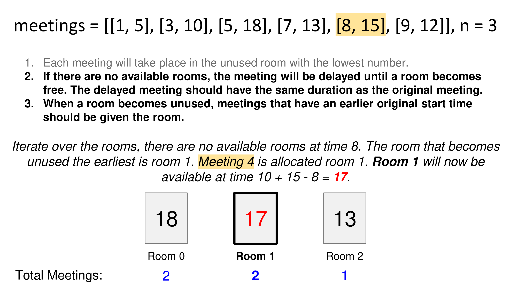
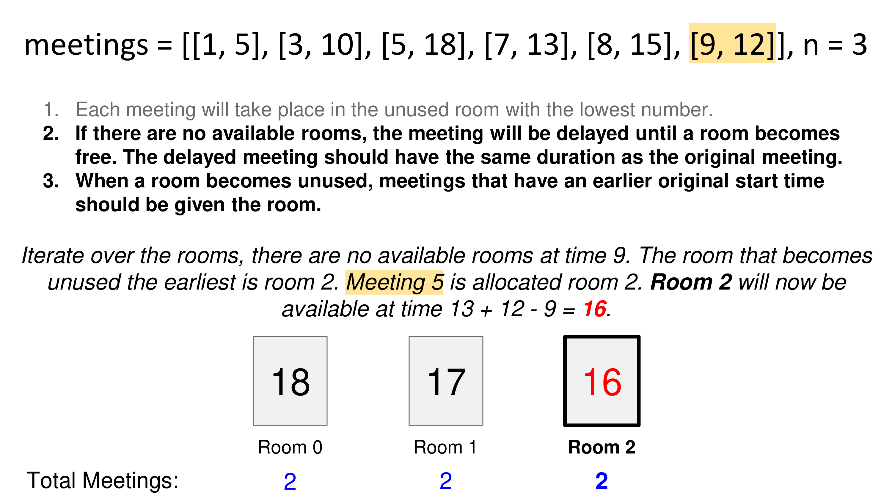
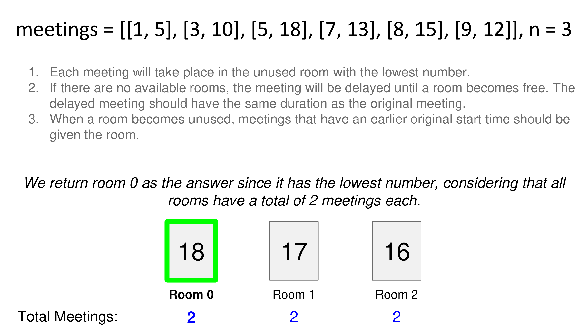

## Solution

---

### Overview

This problem involves the efficient allocation of meeting rooms to a set of scheduled meetings, each defined by a start and end time. The goal is to determine the room number that hosts the maximum number of meetings. If multiple rooms hold the same maximum number of meetings, the solution should return the room with the lowest number. By addressing this problem, algorithms developed for this type of scheduling challenge can be adapted to improve efficiency in real-world scenarios where resource allocation and scheduling are essential components.

---

### Approach 1: Sorting and Counting

#### Intuition

To tackle this problem, we first observe that the meetings are allocated to rooms based on two primary rules. The first rule dictates that each meeting is assigned to the unused room with the lowest number. This implies a sequential allocation strategy, ensuring that meetings are placed in rooms in ascending order. The second rule comes into play when there are no available rooms; in such cases, the meeting is delayed until a room becomes free, and when a room becomes unused, meetings with earlier original start times take precedence.

We can employ a systematic approach to implement these rules efficiently. We initialize two arrays: `room_availability_time` and $\text{meeting}_{count}$. The former tracks the availability time of each room, while the latter records the number of meetings held in each room.

We iterate through the sorted meetings(sorted by start time), adhering to the rule that meetings should be allocated based on their start times. Sorting the meetings based on their start times is crucial to effectively implement Rule 3, which states that when a room becomes unused, meetings with an earlier original start time should be given priority for that room. Consider a situation where meetings are not sorted, and the algorithm encounters a scenario where a room becomes available after hosting a meeting. Without the sorting, the algorithm might select the next meeting arbitrarily, possibly one with a later original start time, thus violating Rule 3.

For each meeting, we identify the room with the earliest availability using a nested loop.
 * If we find an available room: The currently selected meeting is allocated to that room, and the room's availability time is updated. Since we iterate over the $N$ rooms in sequential order, we are guaranteed to identify the available room with the lowest index first. This update involves assigning the end time of the currently selected meeting as the new availability time for the room. This adjustment is made because the room can only be utilized for the next meeting after the currently assigned meeting is finished.
 * If we *don't* find an available room: we must search for the room that will become available soonest. Therefore, we are seeking the room with the earliest available time. The duration of the currently selected meeting is then added to the availability time of this identified room. This ensures that the delayed meeting has the same duration as the original meeting and updates the room's availability time accordingly.

Throughout the process, we keep track of meeting counts in each room. Finally, we identify the room that held the most meetings and, in the case of a tie, select the room with the lowest number.



















#### Algorithm

1. Initialize two arrays, `room_availability_time` and $\text{meeting}_{count}$, both of size `n`, to keep track of the availability time for each room and the count of meetings held in each room, respectively.
2. Iterate through each meeting in the sorted order based on their start times.
3. For each meeting, find the earliest available room by iterating through the `room_availability_time` array. If a room is available (its availability time is less than or equal to the current meeting's start time), allocate the meeting to that room, update the meeting count for that room, and set the room's availability time to the meeting's end time. Break out of the loop.
4. If no available room is found (i.e., `found_unused_room` is False), find the room with the earliest availability time (`min_room_availability_time`). Update the availability time for that room to accommodate the delayed meeting, and increment the meeting count for that room.
5. After processing all meetings, return the index of the room with the maximum meeting count using. If there are multiple rooms with the same maximum meeting count, return the room with the lowest index.

#### Implementation

```python
class Solution:
    def mostBooked(self, n: int, meetings: List[List[int]]) -> int:
        room_availability_time = [0] * n
        meeting_count = [0] * n
        for start, end in sorted(meetings):
            min_room_availability_time = inf
            min_available_time_room = 0
            found_unused_room = False
            for i in range(n):
                if room_availability_time[i] <= start:
                    found_unused_room = True
                    meeting_count[i] += 1
                    room_availability_time[i] = end
                    break
                if min_room_availability_time > room_availability_time[i]:
                    min_room_availability_time = room_availability_time[i]
                    min_available_time_room = i
            if not found_unused_room:
                room_availability_time[min_available_time_room] += end - start
                meeting_count[min_available_time_room] += 1

        return meeting_count.index(max(meeting_count))
```

#### Complexity Analysis

Let $N$ be the number of rooms.
Let $M$ be the number of meetings.

* Time complexity: $O(M\cdot logM + M\cdot N)$.

    Sorting `meetings` will incur a time complexity of $O(M\cdot logM)$. Iterating over `meetings` will incur a time complexity of $O(M)$. The inner for loop within the iterations over `meetings` has a worst-case time complexity of $O(N)$. To illustrate this, envision a scenario where all rooms are initially occupied and remain so throughout the process. In such a case, there is no possibility of breaking out of the loop prematurely.

    For example: $n = 3, meetings = [[1, 10001], [2, 10001], [3, 10001], [4, 10001], [5, 10001], [6, 10001],... [1000, 10001]]$. In this case, after the first three meetings are assigned to the three rooms, their availability times will be `[10001, 10001, 10001]`. In this scenario, breaking out of the inner loop early for the remaining meetings becomes unattainable, compelling the algorithm to search for the room that becomes unused earliest. Consequently, the inner loop incurs a worst-case time complexity of $O(N)$.

    Thus the overall time complexity for iterating over `meetings` is $O(M\cdot N)$. The overall time complexity of the algorithm is $O(M\cdot logM + M\cdot N)$.

* Space complexity: $O(N + sort)$.

    Initializing `room_availability_time` and $\text{meeting}_{count}$ will incur a space complexity of $O(N)$. Some extra space is used when we sort an array of size $N$ in place. The space complexity of the sorting algorithm depends on the programming language.
- In Python, the `sort` method sorts a list using the Timsort algorithm which is a combination of Merge Sort and Insertion Sort and has a space complexity of $O(N)$.
- In C++, the sort() function is implemented as a hybrid of Quick Sort, Heap Sort, and Insertion Sort, with a worst-case space complexity of $O(\log N)$.
- In Java, Arrays.sort() is implemented using a variant of the Quick Sort algorithm which has a space complexity of $O(\log N)$.

---

### Approach 2: Sorting, Counting using Priority Queues

#### Intuition

In the preceding solution, the iteration over all $N$ rooms occurs within the nested loop, resulting in an overall time complexity of $O(M \cdot N)$ for the `for` loop. To enhance efficiency we must explore avenues for optimization. We need to devise a method to obtain the next available room without the necessity of iterating over all $N$ rooms. To do this we can maintain two crucial structures: $\text{unused}_{rooms}$ and $\text{used}_{rooms}.$ These structures are essentially priority queues or heaps, with $\text{unused}_{rooms}$ representing available rooms sorted by room number, and $\text{used}_{rooms}$ storing rooms in use along with the time they become available again.

We start by initialization of $\text{unused}_{rooms}$ as a priority queue containing all room numbers and $\text{used}_{rooms}$ as an empty priority queue.

$\text{unused}_{rooms}$ is ordered in ascending order according to room numbers. This arrangement guarantees that when an element is popped from this, it returns the unused room with the lowest number. This is important to follow rule 1, which states that each meeting will take place in the unused room with the lowest number.

$\text{used}_{rooms}$ is a priority queue that contains elements in the form of ${room_availability_time, \text{room}_{number}}$. Here, `room_availability_time` signifies the time at which this room becomes unused. This priority queue is ordered in ascending order based on both `room_availability_time` and $\text{room}_{number}$. This ensures that when an element is popped from it, the room returned is the one that becomes unused earliest. This assists in adhering to rules 2 and 3 while allocating a meeting to the room that becomes unused earliest when all rooms are currently in use.

Then we proceed to iterate through the meetings after sorting them based on their start times, adhering to the rule that meetings should be allocated based on their start times. Within this loop, a cascading series of decisions unfolds to handle various scenarios.

When iterating through meetings we first manage the release of rooms that have become unused. We iterate through $\text{used}_{rooms}$, popping rooms from the heap if their availability time is earlier than or equal to the start time of the current meeting. Released rooms are then pushed into $\text{unused}_{rooms}$.

Subsequently, we check if there are available rooms in $\text{unused}_{rooms}$. If so, the room with the lowest number is assigned to the current meeting. This follows the principle of allocating meetings to the unused room with the lowest number.

In the event that no rooms are available in $\text{unused}_{rooms}$, we resort to delaying the current meeting. We find the room with the earliest availability time (derived from the first item in $\text{used}_{rooms}$.) We then adjust the availability time of this room based on the duration of the delayed meeting, and push the room back into $\text{used}_{rooms}$. This ensures that meetings with earlier original start times are given priority when rooms become available and delayed meetings have the same duration as the original meeting.

Throughout this process, a crucial aspect is tracking of the count of meetings held in each room using the $\text{meeting}_{count}$ array. This array is instrumental in determining the room that hosted the most meetings. After we have selected the room that hosts the meeting, we increment the count of meetings that occurred in that room.

Finally, we identify the room that held the most meetings and, in the case of a tie, select the room with the lowest number.

#### Algorithm

1. Create two priority queues, $\text{unused}_{rooms}$ and $\text{used}_{rooms}$, representing the available and currently used rooms, respectively. Create an array $\text{meeting}_{count}$ of size `n` to keep track of the number of meetings held in each room.
2. Use the `heapify` function to convert $\text{unused}_{rooms}$ into a min heap, ensuring the room with the lowest number is at the top.
3. Iterate through the meetings sorted by start times.
4. While there are used rooms ($\text{used}_{rooms}$) and the first room's meeting has already concluded (meeting end time <= current meeting start time), remove the room from $\text{used}_{rooms}$ and add it back to $\text{unused}_{rooms}$.
5. Check if there are available rooms ($\text{unused}_{rooms}$). If available, pop the room with the lowest number from $\text{unused}_{rooms}$ and allocate the meeting to that room. Update $\text{used}_{rooms}$ with the meeting end time and the room number.
6. If no available rooms, pop the room with the earliest availability time from $\text{used}_{rooms}$. Adjust the availability time for the room to accommodate the delayed meeting. Update $\text{used}_{rooms}$ with the adjusted availability time and room number.
7. Increment the meeting count for the allocated room.
8. After processing all meetings, return the index of the room with the maximum meeting count using. If there are multiple rooms with the same maximum meeting count, return the room with the lowest index.

#### Implementation

```python
class Solution:
    def mostBooked(self, n: int, meetings: List[List[int]]) -> int:
        unused_rooms, used_rooms = list(range(n)), []
        heapify(unused_rooms)
        meeting_count = [0] * n
        for start, end in sorted(meetings):
            while used_rooms and used_rooms[0][0] <= start:
                _, room = heappop(used_rooms)
                heappush(unused_rooms, room)
            if unused_rooms:
                room = heappop(unused_rooms)
                heappush(used_rooms, [end, room])
            else:
                room_availability_time, room = heappop(used_rooms)
                heappush(
                    used_rooms,
                    [room_availability_time + end - start, room]
                )
            meeting_count[room] += 1
        return meeting_count.index(max(meeting_count))
```

#### Complexity Analysis

Let $N$ be the number of rooms.
Let $M$ be the number of meetings.

* Time complexity: $O(M \cdot \log M + M \cdot \log N + N \cdot \log N)$

    Sorting `meetings` will incur a time complexity of $O(M \cdot \log M)$.

    Popping and pushing into the priority queue will each cost $O(\log N)$. These priority queue operations run inside a for loop that runs at most $M$ times, leading to a time complexity of $O(M \cdot \log N)$.

    The inner nested loop will incur a time complexity of $O(\log N)$. Additionally, initializing the heap of unused rooms takes $O(N \cdot \log N)$ time in languages like C++ and Java.

    The combined time complexity is $O(M \cdot \log M + M \cdot \log N + N \cdot \log N)$. As per the constraints, $N$ is small, so the term $O(M \cdot \log M)$ will typically dominate.

* Space complexity: $O(N + sort)$.

    Initializing $\text{unused}_{rooms}$ and $\text{meeting}_{count}$ will incur a space complexity of $O(N)$. Some extra space is used when we sort an array of size $N$ in place. The space complexity of the sorting algorithm depends on the programming language.

- In Python, the `sort` method sorts a list using the Timsort algorithm which is a combination of Merge Sort and Insertion Sort and has a space complexity of $O(N)$.

- In C++, the sort() function is implemented as a hybrid of Quick Sort, Heap Sort, and Insertion Sort, with a worst-case space complexity of $O(\log N)$.

- In Java, Arrays.sort() is implemented using a variant of the Quick Sort algorithm which has a space complexity of $O(\log N)$.

---