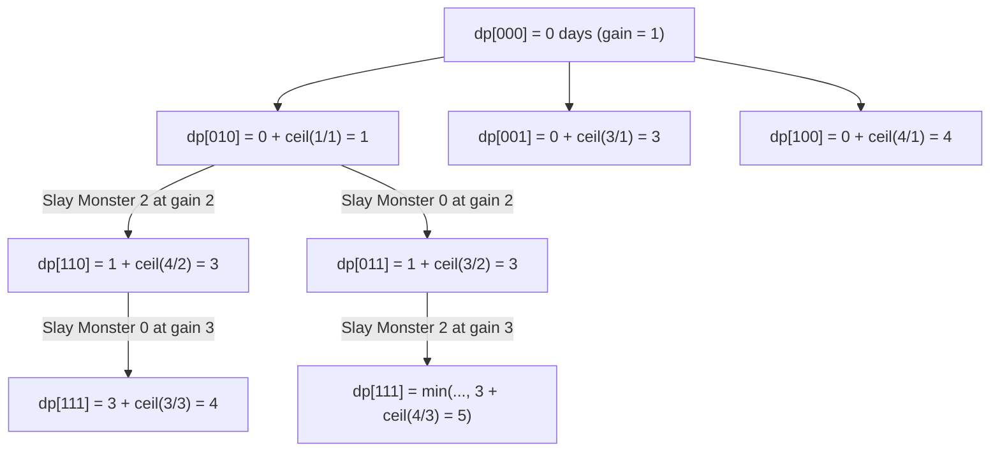

# Guided Example: Minimum Time to Kill All Monsters

## 1. Problem Overview & Representative Instance

We are given an array $power$ of length $n$, where each element $power[i]$ represents the mana required to defeat monster $i$.

The combat rules proceed under the following constraints:
1. Mana starts at $0$.
2. Mana gain per day starts at $1$ unit per day.
3. Each day, current daily gain is added to accumulated mana.
4. When accumulated mana is at least $power[i]$, you may slay monster $i$.
5. Slaying a monster immediately resets accumulated mana to $0$ and permanently increments daily mana gain by $1$.
6. You may defeat monsters in any order. The goal is to determine the minimum total number of days required to defeat all $n$ monsters.

### Representative Instance
Consider the input:
- $power = [3, 1, 4]$
- $n = 3$ monsters:
  - Monster 0: $power[0] = 3$
  - Monster 1: $power[1] = 1$
  - Monster 2: $power[2] = 4$

Expected output: `4` (defeat sequence: Monster 1 $\to$ Monster 2 $\to$ Monster 0).

---

## 2. Mathematical & Algorithmic Principles

### Daily Mana Gain & Ceiling Division
Because accumulated mana is completely wiped to $0$ upon every defeat, there is never any benefit to waiting past the exact day a monster's power threshold is met.
If $k$ monsters have already been slain ($0 \le k < n$), the current daily mana gain is:
$$\text{gain} = k + 1$$
To defeat a monster with power $P$ starting from $0$ mana at rate $\text{gain}$, the number of days required is:
$$\Delta t(P, \text{gain}) = \left\lceil \frac{P}{\text{gain}} \right\rceil = \left\lfloor \frac{P + \text{gain} - 1}{\text{gain}} \right\rfloor$$

### Bitmask Dynamic Programming Formulation
Since $n \le 17$, the total subset space of defeated monsters is $2^n \le 2^{17} = 131{,}072$.
Let a bitmask $S \in [0, 2^n - 1]$ represent the set of monsters already defeated, where the $i$-th bit is $1$ if monster $i$ is dead, and $0$ if monster $i$ is alive.
- The number of slain monsters is given by the population count $k = \text{popcount}(S)$.
- The active mana rate for slaying the next monster is $\text{gain} = k + 1$.
- Let $dp[S]$ denote the minimum days needed to defeat the subset of monsters in $S$.
- Base case: $dp[0] = 0$.
- Transition: For any unslain monster $j$ ($j$-th bit of $S$ is $0$):
  $$dp[S \mid 2^j] = \min \left( dp[S \mid 2^j], \, dp[S] + \left\lceil \frac{power[j]}{k + 1} \right\rceil \right)$$

---

## 3. Step-by-Step Walkthrough with Intermediate State

We evaluate subsets by strictly increasing Hamming weight (population count $k \in \{0, 1, 2\}$).

### Layer $k = 0$ (Initial State)
- Subsets of size 0: $S = 000_2$.
- $dp[000_2] = 0$. Gain for next kill is $k + 1 = 1$.

### Layer $k = 1$ (One Monster Slayed at $\text{gain} = 1$)
Each candidate transition from $000_2$:
1. Slay Monster 0 ($power[0] = 3$):
   $$\text{cost} = \left\lceil \frac{3}{1} \right\rceil = 3 \implies dp[001_2] = 0 + 3 = 3$$
2. Slay Monster 1 ($power[1] = 1$):
   $$\text{cost} = \left\lceil \frac{1}{1} \right\rceil = 1 \implies dp[010_2] = 0 + 1 = 1$$
3. Slay Monster 2 ($power[2] = 4$):
   $$\text{cost} = \left\lceil \frac{4}{1} \right\rceil = 4 \implies dp[100_2] = 0 + 4 = 4$$

### Layer $k = 2$ (Two Monsters Slayed at $\text{gain} = 2$)
Active daily mana gain is $1 + 1 = 2$.
1. **Mask $011_2$ (Monsters $\{0, 1\}$ defeated):**
   - Via Monster 1 from $001_2$: $dp[001_2] + \lceil 1 / 2 \rceil = 3 + 1 = 4$.
   - Via Monster 0 from $010_2$: $dp[010_2] + \lceil 3 / 2 \rceil = 1 + 2 = 3$.
   - Optimal: $dp[011_2] = \min(4, 3) = 3$ (path: Monster 1 then 0).
2. **Mask $101_2$ (Monsters $\{0, 2\}$ defeated):**
   - Via Monster 2 from $001_2$: $dp[001_2] + \lceil 4 / 2 \rceil = 3 + 2 = 5$.
   - Via Monster 0 from $100_2$: $dp[100_2] + \lceil 3 / 2 \rceil = 4 + 2 = 6$.
   - Optimal: $dp[101_2] = \min(5, 6) = 5$ (path: Monster 0 then 2).
3. **Mask $110_2$ (Monsters $\{1, 2\}$ defeated):**
   - Via Monster 2 from $010_2$: $dp[010_2] + \lceil 4 / 2 \rceil = 1 + 2 = 3$.
   - Via Monster 1 from $100_2$: $dp[100_2] + \lceil 1 / 2 \rceil = 4 + 1 = 5$.
   - Optimal: $dp[110_2] = \min(3, 5) = 3$ (path: Monster 1 then 2).

### Layer $k = 3$ (All Three Monsters Slayed at $\text{gain} = 3$)
Active daily mana gain is $2 + 1 = 3$. Mask to form: $111_2$.
1. Slay Monster 2 last (from mask $011_2$):
   $$\text{cost} = dp[011_2] + \left\lceil \frac{4}{3} \right\rceil = 3 + 2 = 5$$
2. Slay Monster 1 last (from mask $101_2$):
   $$\text{cost} = dp[101_2] + \left\lceil \frac{1}{3} \right\rceil = 5 + 1 = 6$$
3. Slay Monster 0 last (from mask $110_2$):
   $$\text{cost} = dp[110_2] + \left\lceil \frac{3}{3} \right\rceil = 3 + 1 = 4$$

Taking the minimum across all incoming branches:
$$dp[111_2] = \min(5, 6, 4) = 4$$
The global minimum days required is `4`.

---

## 4. Comprehensive State Trace

| Step | Bitmask $S$ | Slain Monsters | Mask Popcount $k$ | Slaying Monster $j$ | Power $power[j]$ | Applicable $\text{gain}$ | Additional Days $\lceil P / \text{gain} \rceil$ | Target Mask $S \cup \{j\}$ | Resulting Cost |
|---|---|---|---|---|---|---|---|---|---|
| 0 | $000_2$ | $\emptyset$ | 0 | Init | - | - | - | $000_2$ | 0 |
| 1 | $000_2$ | $\emptyset$ | 0 | 0 | 3 | 1 | 3 | $001_2$ | 3 |
| 2 | $000_2$ | $\emptyset$ | 0 | 1 | 1 | 1 | 1 | $010_2$ | 1 |
| 3 | $000_2$ | $\emptyset$ | 0 | 2 | 4 | 1 | 4 | $100_2$ | 4 |
| 4 | $010_2$ | $\{1\}$ | 1 | 0 | 3 | 2 | 2 | $011_2$ | $1 + 2 = 3$ |
| 5 | $001_2$ | $\{0\}$ | 1 | 1 | 1 | 2 | 1 | $011_2$ | $3 + 1 = 4$ (suboptimal) |
| 6 | $010_2$ | $\{1\}$ | 1 | 2 | 4 | 2 | 2 | $110_2$ | $1 + 2 = 3$ |
| 7 | $100_2$ | $\{2\}$ | 1 | 1 | 1 | 2 | 1 | $110_2$ | $4 + 1 = 5$ (suboptimal) |
| 8 | $001_2$ | $\{0\}$ | 1 | 2 | 4 | 2 | 2 | $101_2$ | $3 + 2 = 5$ |
| 9 | $110_2$ | $\{1, 2\}$ | 2 | 0 | 3 | 3 | 1 | $111_2$ | $3 + 1 = 4$ (optimal) |
| 10 | $011_2$ | $\{0, 1\}$ | 2 | 2 | 4 | 3 | 2 | $111_2$ | $3 + 2 = 5$ (suboptimal) |

---

## 5. Algorithmic Correctness & Soundness

### Subproblem Disjointness & Equivalence
The total time needed to eliminate remaining monsters depends strictly on:
1. Which specific monsters have already been eliminated (the bitmask $S$).
2. The count of eliminated monsters $|S|$, which uniquely defines the current mana rate $\text{gain} = |S| + 1$.
The order in which monsters within $S$ were killed does not alter the remaining options or the subsequent mana rates; it affects only the accumulated cost $dp[S]$. By Bellman's Principle of Optimality, choosing $\min$ over all permutations leading to $S$ guarantees global optimality for all extended states.

### Ceiling Arithmetic Precision
Days elapsed must be calculated with integer ceiling:
$$\lceil P / G \rceil = (P + G - 1) // G$$
Using floating-point division risks precision loss when $P \approx 10^9$, while truncated floor division would prematurely underestimate required days.

---

## 6. Edge Cases & Anti-Patterns

| Category | Example / Trap | Concrete Consequence | Resolution / Invariant |
|---|---|---|---|
| Greedy Choice by Power | Killing monsters in purely ascending order $[1, 3, 4]$ | Gives $1 + \lceil 3/2 \rceil + \lceil 4/3 \rceil = 1 + 2 + 2 = 5 > 4$ | Greedy is provably suboptimal; DP evaluates all permutation topologies. |
| Floating Point Division | `math.ceil(P / G)` with $P = 10^9$ | Double-precision rounding errors on large values | Use integer floor arithmetic: `(P + G - 1) // G`. |
| 1-Monster Edge Case | $power = [7]$ | Loop failure or off-by-one gain | Popcount is 0, $\text{gain} = 1$, days $= \lceil 7 / 1 \rceil = 7$. |
| Duplicate Powers | $power = [1, 1, 4]$ | Premature deduplication | Bitmask tracks indices, not values; duplicate values correctly occupy distinct bit positions. |

---

## 7. Complexity Analysis

- **Time Complexity:** $\mathcal{O}(n \cdot 2^n)$. There are $2^n$ distinct bitmasks. From each mask of popcount $k$, there are $n - k$ valid transitions to successor masks. The sum over all masks is $\sum_{k=0}^{n} \binom{n}{k}(n - k) = n \cdot 2^{n-1} = \mathcal{O}(n \cdot 2^n)$. For $n = 17$, $17 \times 2^{16} = 17 \times 65{,}536 \approx 1.11 \times 10^6$ operations, which evaluates in under $0.2$ seconds.
- **Auxiliary Space Complexity:** $\mathcal{O}(2^n)$. An array or memoization table of size $2^n$ entries ($131{,}072$ integers) stores optimal subproblem costs.
