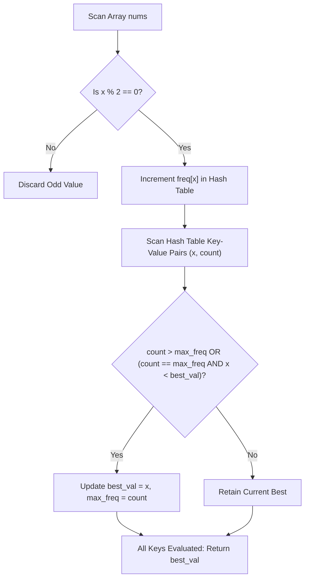

# Guided Example: Most Frequent Even Element

## 1. Problem Overview & Representative Instance

We are given an integer array $nums$. Our goal is to determine the most frequent even element in the array:
1. An integer $x$ is eligible if and only if $x \pmod 2 = 0$. Note that $0$ is considered even.
2. If multiple even elements achieve the same maximum frequency, we break the tie by choosing the numerically smallest even element.
3. If no even elements exist in $nums$, we must return $-1$.

### Representative Instance
Consider the input array:
$$nums = [0, 1, 2, 2, 4, 4, 1]$$

- Even elements present: $0$ (occurs 1 time), $2$ (occurs 2 times), and $4$ (occurs 2 times).
- Odd elements ignored: $1$ (occurs 2 times).
- Both $2$ and $4$ share the maximum frequency of $2$.
- Tie-breaking: $\min(2, 4) = 2$.

Expected output: `2`.

---

## 2. Mathematical & Algorithmic Principles

### Dual-Key Maximization
Let $\mathcal{E} = \{ x \in nums \mid x \pmod 2 = 0 \}$ be the multiset of all even elements, and let $\text{freq}(x)$ denote the number of times $x$ appears in $\mathcal{E}$.
We seek the element $x^* \in \mathcal{E}$ satisfying:
$$x^* = \arg\max_{x \in \text{distinct}(\mathcal{E})} \left( \text{freq}(x), -x \right)$$
where the tuple $(\text{freq}(x), -x)$ is ordered lexicographically. The first key maximizes occurrence count, while the second key minimizes element value.

### Sentinel State
We initialize tracking variables:
- $\text{ans} = -1$ (the sentinel indicating no even element found)
- $\text{mx} = 0$ (the baseline maximum frequency)

Because any existing even element will have $\text{freq}(x) \ge 1 > 0$, the very first evaluated even element will strictly satisfy $\text{freq}(x) > \text{mx}$ and overwrite the sentinel $-1$. If the array contains zero even numbers, the iteration never executes and the algorithm correctly returns the initial sentinel $-1$.

---

## 3. Step-by-Step Walkthrough with Intermediate State

### Phase 1: Frequency Aggregation
We filter the input array $nums = [0, 1, 2, 2, 4, 4, 1]$ for even elements:
- $nums[0] = 0$: $0 \pmod 2 = 0 \implies \text{freq}[0] = 1$
- $nums[1] = 1$: $1 \pmod 2 = 1 \implies$ skip odd
- $nums[2] = 2$: $2 \pmod 2 = 0 \implies \text{freq}[2] = 1$
- $nums[3] = 2$: $2 \pmod 2 = 0 \implies \text{freq}[2] = 2$
- $nums[4] = 4$: $4 \pmod 2 = 0 \implies \text{freq}[4] = 1$
- $nums[5] = 4$: $4 \pmod 2 = 0 \implies \text{freq}[4] = 2$
- $nums[6] = 1$: $1 \pmod 2 = 1 \implies$ skip odd

Resulting hash table of even elements:
$$\text{cnt} = \{ 0: 1, \, 2: 2, \, 4: 2 \}$$

### Phase 2: Lexicographical Candidate Selection
Initial state: $\text{ans} = -1, \text{mx} = 0$.

1. **Candidate $(x = 0, v = 1)$:**
   - Condition check: $v > \text{mx} \implies 1 > 0$ (True).
   - Action: Overwrite sentinel.
   - New state: $\text{ans} = 0, \text{mx} = 1$.

2. **Candidate $(x = 2, v = 2)$:**
   - Condition check: $v > \text{mx} \implies 2 > 1$ (True).
   - Action: Strictly higher frequency observed.
   - New state: $\text{ans} = 2, \text{mx} = 2$.

3. **Candidate $(x = 4, v = 2)$:**
   - Condition check 1: $v > \text{mx} \implies 2 > 2$ (False).
   - Condition check 2 (Tie-break): $v = \text{mx}$ ($2 = 2$) and $\text{ans} > x$ ($2 > 4$) (False, since $2 < 4$).
   - Action: Candidate $4$ does not beat candidate $2$ numerically. Retain current state.
   - State remains: $\text{ans} = 2, \text{mx} = 2$.

Final answer: `2`.

---

## 4. Comprehensive State Trace

| Step | Candidate Key $x$ | Frequency $v$ | Current Best $(\text{ans}, \text{mx})$ | Condition Evaluated | Decision / Action | Resulting $(\text{ans}, \text{mx})$ |
|---|---|---|---|---|---|---|
| Initial | - | - | $(-1, 0)$ | Baseline sentinel | Ready | $(-1, 0)$ |
| 1 | 0 | 1 | $(-1, 0)$ | $1 > 0$ | Overwrite sentinel with first even element | $(0, 1)$ |
| 2 | 2 | 2 | $(0, 1)$ | $2 > 1$ | New strictly higher frequency found | $(2, 2)$ |
| 3 | 4 | 2 | $(2, 2)$ | $2 == 2$ but $2 < 4$ | Tie in frequency, but $x=4$ is greater than existing $\text{ans}=2$ | $(2, 2)$ |

---

## 5. Algorithmic Correctness & Soundness

### Soundness of Tie-Breaking Condition
The predicate for updating the current best is:
$$\text{update} \iff (v > \text{mx}) \lor (v = \text{mx} \land x < \text{ans})$$
- If $v > \text{mx}$, the candidate appears strictly more times than any previously evaluated number, regardless of numeric value.
- If $v = \text{mx}$, the frequency matches the current highest; the sub-clause $x < \text{ans}$ enforces strict minimization on value, ensuring that smaller numbers displace larger numbers.
Because the relation forms a strict total order over pairs $(v, -x)$, every comparison is unambiguous and transitive.

### Completeness
Every element in $nums$ is examined during table construction. Every distinct even element is visited during the candidate scan. Because the operation finds the global supremum of a finite set under a total order, the optimal element is guaranteed to be found.

---

## 6. Edge Cases & Anti-Patterns

| Scenario | Input Example | Vulnerability / Anti-Pattern | Correct Handling |
|---|---|---|---|
| No Even Numbers | $nums = [1, 3, 5, 7, 9]$ | Index error or throwing exception when hash table is empty | Loop over empty table does not run; returns initialized sentinel $-1$. |
| Zero as Element | $nums = [0, 1, 3, 0]$ | Forgetting that $0 \pmod 2 = 0$ or confusing $0$ with falsy / missing | $0$ is an even number; correctly enters table with count 2 and returns $0$. |
| Sorting Overhead | $nums$ of size $10^5$ | Sorting all elements costs $\mathcal{O}(N \log N)$ | Hash table aggregation and linear scan runs in $\mathcal{O}(N)$ average time. |
| Negative Sentinel in Min-Check | $nums = [-2, 4]$ | If negative numbers were permitted, initial $\text{ans} = -1$ could corrupt $x < \text{ans}$ | Problem constraints specify $nums[i] \ge 0$. First element always triggers $v > 0$, replacing $-1$ before any tie check occurs. |

---

## 7. Complexity Analysis

- **Time Complexity:** $\mathcal{O}(N)$, where $N$ is the number of elements in $nums$.
  - Traversing $nums$ to build the frequency map of even elements takes $\mathcal{O}(N)$ operations on average.
  - Iterating over the distinct even keys in the map takes $\mathcal{O}(U)$ where $U \le N$ is the number of unique even values.
  - Overall runtime is linear in the array size.
- **Auxiliary Space Complexity:** $\mathcal{O}(U)$, where $U \le \min(N, 10^5)$ is the number of distinct even numbers stored in the hash map.
