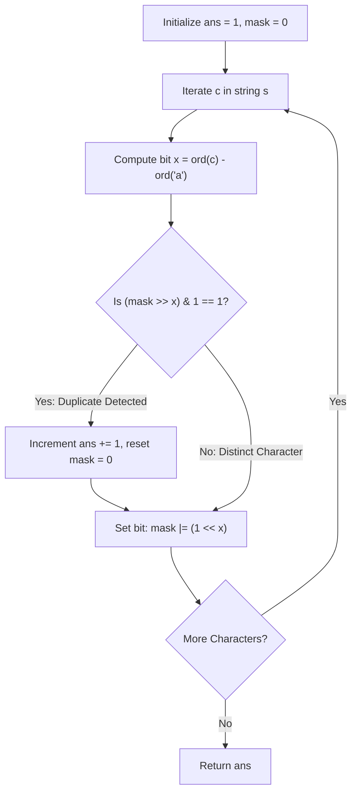

# Guided Example: Optimal Partition of String

## 1. Problem Overview & Representative Instance

We are given a string $s$ consisting of lowercase English letters.
We must partition $s$ into one or more contiguous substrings such that:
1. No letter appears more than once within any individual substring.
2. The total number of substrings in the partition is minimized.

### Representative Instance
Consider the string:
$$s = \text{"abacaba"}$$

- At index $0$: character `'a'`
- At index $1$: character `'b'`
- At index $2$: character `'a'` (conflicts with `'a'` at index 0)
- At index $3$: character `'c'`
- At index $4$: character `'a'` (conflicts with earlier `'a'`)
- At index $5$: character `'b'`
- At index $6$: character `'a'`

Expected minimal partition: `["ab", "ac", "ab", "a"]`, yielding a total of `4` substrings.

---

## 2. Mathematical & Algorithmic Principles

### Greedy Choice Property
A string partition can be viewed as choosing a minimal set of cut points.
Suppose we are forming a valid substring beginning at index $L$. Can making the substring strictly shorter than the maximum valid prefix starting at $L$ ever yield fewer total substrings for the entire suffix?
No:
- Let $R$ be the earliest index such that $s[R]$ duplicates an earlier character in $s[L \dots R-1]$.
- Any valid substring starting at $L$ cannot extend past $R - 1$.
- Ending the substring at any index $M < R - 1$ leaves a remaining suffix $s[M+1 \dots |s|-1]$ that is a strict superset of $s[R \dots |s|-1]$.
- A longer remaining suffix cannot require fewer cuts than a shorter remaining suffix under subset containment of prefix constraints.
Hence, extending each substring as far to the right as legally possible without duplicate characters is globally optimal.

### 26-Bit Integer Bitmask
Because $s$ consists solely of lowercase English letters, there are at most 26 distinct characters.
An integer `mask` tracks character presence:
- Character $c$ maps to bit offset $x = \text{ord}(c) - \text{ord}(\text{'a'}) \in [0, 25]$.
- Duplicate test: `(mask >> x) & 1 == 1`.
- Inclusion: `mask |= (1 << x)`.
- Reset on cut: `mask = 0`.

---

## 3. Step-by-Step Walkthrough with Intermediate State

Initial state:
- String: $s = \text{"abacaba"}$ ($|s| = 7$)
- Substring count: $\text{ans} = 1$ (accounting for the initial segment)
- Active bitmask: $\text{mask} = 00000000_2$

### Character 0: $s[0] = \text{'a'}$ ($x = 0$)
- Query: $\text{mask} \gg 0 \ \& \ 1 = 0 \ \& \ 1 = 0$ (No collision).
- Set bit 0: $\text{mask} = 00000001_2 = 1$.
- Active partition segment: `"a"`.

### Character 1: $s[1] = \text{'b'}$ ($x = 1$)
- Query: $\text{mask} \gg 1 \ \& \ 1 = 0 \ \& \ 1 = 0$ (No collision).
- Set bit 1: $\text{mask} = 00000011_2 = 3$.
- Active partition segment: `"ab"`.

### Character 2: $s[2] = \text{'a'}$ ($x = 0$)
- Query: $\text{mask} \gg 0 \ \& \ 1 = 3 \ \& \ 1 = 1$ (Collision detected: `'a'` already present!).
- Action:
  1. Cut the current segment. The first substring `"ab"` is sealed.
  2. Increment segment counter: $\text{ans} = 1 + 1 = 2$.
  3. Reset mask: $\text{mask} = 0$.
  4. Insert current `'a'`: $\text{mask} = 00000001_2 = 1$.
- Active partition segment: `"a"`.

### Character 3: $s[3] = \text{'c'}$ ($x = 2$)
- Query: $\text{mask} \gg 2 \ \& \ 1 = 0 \ \& \ 1 = 0$ (No collision).
- Set bit 2: $\text{mask} = 00000101_2 = 5$.
- Active partition segment: `"ac"`.

### Character 4: $s[4] = \text{'a'}$ ($x = 0$)
- Query: $\text{mask} \gg 0 \ \& \ 1 = 5 \ \& \ 1 = 1$ (Collision detected: `'a'` already present!).
- Action:
  1. Cut the current segment. Second substring `"ac"` is sealed.
  2. Increment segment counter: $\text{ans} = 2 + 1 = 3$.
  3. Reset mask: $\text{mask} = 0$.
  4. Insert current `'a'`: $\text{mask} = 00000001_2 = 1$.
- Active partition segment: `"a"`.

### Character 5: $s[5] = \text{'b'}$ ($x = 1$)
- Query: $\text{mask} \gg 1 \ \& \ 1 = 0 \ \& \ 1 = 0$ (No collision).
- Set bit 1: $\text{mask} = 00000011_2 = 3$.
- Active partition segment: `"ab"`.

### Character 6: $s[6] = \text{'a'}$ ($x = 0$)
- Query: $\text{mask} \gg 0 \ \& \ 1 = 3 \ \& \ 1 = 1$ (Collision detected: `'a'` already present!).
- Action:
  1. Cut the current segment. Third substring `"ab"` is sealed.
  2. Increment segment counter: $\text{ans} = 3 + 1 = 4$.
  3. Reset mask: $\text{mask} = 0$.
  4. Insert current `'a'`: $\text{mask} = 00000001_2 = 1$.
- Active partition segment: `"a"`.

Final partition: `["ab", "ac", "ab", "a"]`.
Final value: $\text{ans} = 4$.

---

## 4. Comprehensive State Trace

| Index $i$ | Character $s[i]$ | Bit Index $x$ | Pre-check Mask | Collision? | Substring Count $\text{ans}$ | Mask Reset? | Post-update Mask | Active Substring |
|---|---|---|---|---|---|---|---|---|
| Initial | - | - | $0$ | - | 1 | - | $0$ | `""` |
| 0 | `'a'` | 0 | $00000000_2$ | No | 1 | No | $00000001_2$ | `"a"` |
| 1 | `'b'` | 1 | $00000001_2$ | No | 1 | No | $00000011_2$ | `"ab"` |
| 2 | `'a'` | 0 | $00000011_2$ | Yes (bit 0 set) | 2 | Yes $\to 0$ | $00000001_2$ | `"a"` |
| 3 | `'c'` | 2 | $00000001_2$ | No | 2 | No | $00000101_2$ | `"ac"` |
| 4 | `'a'` | 0 | $00000101_2$ | Yes (bit 0 set) | 3 | Yes $\to 0$ | $00000001_2$ | `"a"` |
| 5 | `'b'` | 1 | $00000001_2$ | No | 3 | No | $00000011_2$ | `"ab"` |
| 6 | `'a'` | 0 | $00000011_2$ | Yes (bit 0 set) | 4 | Yes $\to 0$ | $00000001_2$ | `"a"` |

---

## 5. Algorithmic Correctness & Soundness

### Formal Optimality by Induction
Let $\Pi^* = (I_1^*, I_2^*, \dots, I_m^*)$ be any valid partition of $s$ with minimal size $m$, where each $I_k^*$ is a substring $[l_k, r_k]$.
Let $\Pi = (I_1, I_2, \dots, I_p)$ be the partition produced by the greedy maximal-extension policy:
1. For the first substring $I_1 = [0, r_1]$, by greedy definition $r_1$ is the largest index such that $s[0 \dots r_1]$ has no duplicates. Therefore $r_1 \ge r_1^*$.
2. The suffix remaining after $I_1$, namely $s[r_1 + 1 \dots |s|-1]$, is a sub-suffix of the suffix remaining after $I_1^*$, namely $s[r_1^* + 1 \dots |s|-1]$.
3. By induction on the remaining suffix length, the greedy strategy leaves fewer or equal characters to be partitioned in all subsequent steps.
Hence, $p \le m$, proving that the greedy partition achieves the global minimum number of substrings.

---

## 6. Edge Cases & Anti-Patterns

| Category | Input Scenario | Potential Failure | Resolution |
|---|---|---|---|
| Identical Characters | $s = \text{"aaaaaa"}$ | Missing reset on every step | Every character after the first triggers a collision, producing 6 substrings of length 1. |
| Completely Distinct String | $s = \text{"abcdefg"}$ | Premature cutting | No collision occurs; $\text{ans}$ remains 1 and mask sets 7 bits. |
| Single Character | $s = \text{"z"}$ | Returning 0 or unhandled loop | $\text{ans}$ initialized to 1; loop sets bit and returns 1. |
| Repeating Alphabet | $s = 26 \times \text{"a...z"}$ repeated | Mask overflow | Bitmask fits within standard 32-bit integer ($2^{26} - 1 < 2^{31}$). |
| Unset After Reset | Omitting `mask \|= 1 << x` after reset | Colliding character omitted from new substring | Current character is the first element of the new part; its bit must be set immediately after resetting mask to 0. |

---

## 7. Complexity Analysis

- **Time Complexity:** $\mathcal{O}(N)$, where $N = |s|$ is the length of the string.
  - We scan the string once from left to right.
  - For each character, calculating $x = \text{ord}(c) - \text{ord}(\text{'a'})$ and evaluating bitwise shifts and bitwise OR takes $\mathcal{O}(1)$ time.
- **Auxiliary Space Complexity:** $\mathcal{O}(1)$.
  - The bitmask requires a single 32-bit integer (`mask`), consuming strictly constant auxiliary space.
