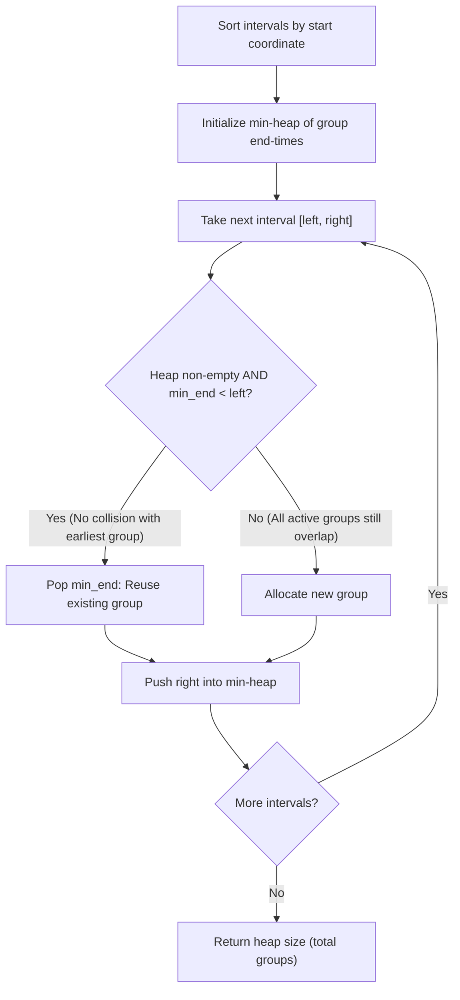

# Guided Example: Divide Intervals Into Minimum Number of Groups

## 1. Problem Overview & Representative Instance

We are given a 2D array $intervals$ where each element $intervals[i] = [left_i, right_i]$ represents an inclusive interval on the real line.
We must partition the intervals into the minimum number of groups such that:
1. Every interval belongs to exactly one group.
2. No two intervals in the same group intersect.
3. Two intervals $[a, b]$ and $[c, d]$ intersect if and only if they share at least one point, meaning $a \le d$ and $c \le b$. If $b = c$, they intersect at the single point $b$.

### Representative Instance
Consider the input:
$$intervals = [[5, 10], [6, 8], [1, 5], [2, 3], [1, 10]]$$

After sorting by starting coordinate:
1. $[1, 5]$
2. $[1, 10]$
3. $[2, 3]$
4. $[5, 10]$
5. $[6, 8]$

Expected minimum number of groups: `3`.

---

## 2. Mathematical & Algorithmic Principles

### Equivalence to Maximum Point Overlap
By Dilworth's Theorem and the chordal property of interval graphs, the chromatic number of an interval graph (the minimum number of independent sets needed to partition its vertices) is strictly equal to its clique number (the maximum number of pairwise intersecting intervals):
$$\chi(G) = \omega(G) = \max_{x \in \mathbb{R}} \sum_{i=1}^n \mathbf{1}_{left_i \le x \le right_i}$$
Therefore, the minimum number of collision-free groups equals the peak number of intervals that overlap simultaneously at any point in time.

### Greedy Allocation via Priority Queue
If we process intervals in ascending order of start time $left$:
- A group whose latest interval ended at $end$ can accept the new interval $[left, right]$ without conflict if and only if $end < left$.
- If multiple groups are free ($end < left$), picking the one with the smallest $end$ is optimal because it preserves groups with larger end times for intervals that might arrive even later.
- If the earliest-ending group has $end \ge left$, then every existing group overlaps with $[left, right]$, forcing the creation of a new group.
We maintain the latest end time of each allocated group in a min-heap.

---

## 3. Step-by-Step Walkthrough with Intermediate State

Sorted order of intervals:
- Interval 1: $[1, 5]$
- Interval 2: $[1, 10]$
- Interval 3: $[2, 3]$
- Interval 4: $[5, 10]$
- Interval 5: $[6, 8]$

Min-heap $q$ stores group boundary endpoints. Initial state: $q = []$.

### Step 1: Interval $[1, 5]$
- Heap $q = []$ is empty.
- Allocate Group 1.
- Push end coordinate $5$.
- Heap state: $q = [5]$. Active group count: 1.

### Step 2: Interval $[1, 10]$
- Heap minimum is $5$.
- Check reuse condition: $5 < 1$ (False, intervals overlap on $[1, 5]$).
- All active groups collide with $[1, 10]$. Allocate Group 2.
- Push end coordinate $10$.
- Heap state: $q = [5, 10]$. Active group count: 2.

### Step 3: Interval $[2, 3]$
- Heap minimum is $5$.
- Check reuse condition: $5 < 2$ (False, Group 1 $[1, 5]$ covers $x = 2$).
- Allocate Group 3.
- Push end coordinate $3$.
- Heap state: $q = [3, 10, 5]$. Active group count: 3.

### Step 4: Interval $[5, 10]$
- Heap minimum is $3$ (Group 3).
- Check reuse condition: $3 < 5$ (True! Group 3 ended at $3$, strictly before $5$).
- Group 3 is free to accept $[5, 10]$. Pop $3$.
- Push updated end coordinate $10$.
- Heap state: $q = [5, 10, 10]$. Active group count: 3.

### Step 5: Interval $[6, 8]$
- Heap minimum is $5$ (Group 1).
- Check reuse condition: $5 < 6$ (True! Group 1 ended at $5$, strictly before $6$).
- Group 1 is free to accept $[6, 8]$. Pop $5$.
- Push updated end coordinate $8$.
- Heap state: $q = [8, 10, 10]$. Active group count: 3.

All intervals have been placed. Total groups required: $|q| = 3$.

---

## 4. Comprehensive State Trace

| Step | Interval $[left, right]$ | Min-Heap Top $q[0]$ | Condition $q[0] < left$ | Group Action | Popped End | Pushed End | Min-Heap Elements | Total Groups |
|---|---|---|---|---|---|---|---|---|
| Initial | - | - | - | Init | - | - | `[]` | 0 |
| 1 | $[1, 5]$ | None | False (empty) | Allocate Group 1 | None | 5 | `[5]` | 1 |
| 2 | $[1, 10]$ | 5 | $5 < 1$ (False) | Allocate Group 2 | None | 10 | `[5, 10]` | 2 |
| 3 | $[2, 3]$ | 5 | $5 < 2$ (False) | Allocate Group 3 | None | 3 | `[3, 5, 10]` | 3 |
| 4 | $[5, 10]$ | 3 | $3 < 5$ (True) | Reuse Group 3 | 3 | 10 | `[5, 10, 10]` | 3 |
| 5 | $[6, 8]$ | 5 | $5 < 6$ (True) | Reuse Group 1 | 5 | 8 | `[8, 10, 10]` | 3 |

---

## 5. Algorithmic Correctness & Soundness

### Strict Boundary Non-Intersection
Problem specifications state that two intervals sharing a boundary point (e.g. $[1, 5]$ and $[5, 10]$) intersect.
Hence, an existing group ending at $right_{\text{old}}$ cannot accept a new interval starting at $left_{\text{new}}$ unless:
$$right_{\text{old}} < left_{\text{new}}$$
Using $\le$ instead of $<$ would erroneously group touching intervals together, violating the non-intersection invariant.

### Optimality of Heap Reuse
When multiple groups are available with $end < left$, assigning the new interval to the group with minimum $end$ leaves groups with larger ends intact. Because larger end values are tighter bounds for future intervals, greedily resetting the smallest available end preserves maximum flexibility for upcoming intervals.

---

## 6. Edge Cases & Anti-Patterns

| Category | Concrete Example | Vulnerability / Anti-Pattern | Correct Handling |
|---|---|---|---|
| Touching Endpoints | $[1, 5]$ and $[5, 8]$ | Using $end \le start$ allows single-point collision | Strict inequality $end < start$ correctly forces separate groups (result: 2). |
| Completely Disjoint | $[1, 2], [3, 4], [5, 6]$ | Failing to reuse single group | Min-heap top is popped on each step; heap size stays 1 (result: 1). |
| Point Intervals | $[2, 2], [2, 2], [2, 2]$ | Zero-length intervals treated as open | Intervals $[2, 2]$ contain point 2; all 3 overlap at 2 (result: 3). |
| Fully Nested Intervals | $[1, 10], [2, 9], [3, 8]$ | Overlooking common interior point | All intervals contain $x = 3$; heap continuously expands to size 3. |

---

## 7. Complexity Analysis

- **Time Complexity:** $\mathcal{O}(N \log N)$, where $N$ is the number of intervals.
  - Sorting $N$ intervals by left coordinate takes $\mathcal{O}(N \log N)$ time.
  - Processing each interval performs at most one heap push and at most one heap pop on a heap of size at most $N$. Each heap operation costs $\mathcal{O}(\log N)$, contributing $\mathcal{O}(N \log N)$ overall.
- **Auxiliary Space Complexity:** $\mathcal{O}(N)$.
  - The min-heap stores at most $N$ endpoints corresponding to active groups.
