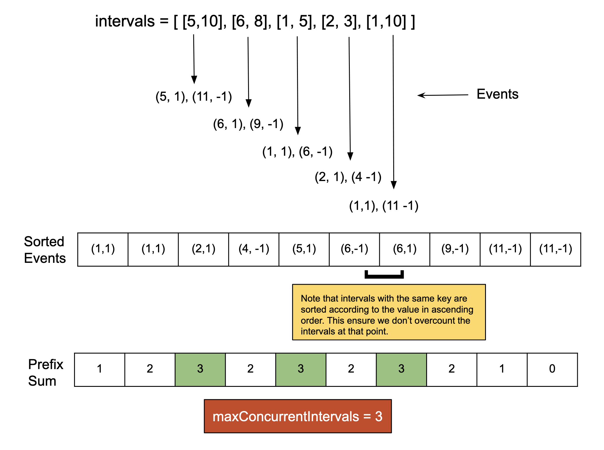

## Solution

---

### Approach 1: Sorting or Priority Queue

#### Intuition

The problem is very similar to  [Meeting Rooms II](https://leetcode.com/problems/meeting-rooms-ii/solution/), and thus the solutions are alike. The problem provides $N$ intervals in the form `[start, end]`, where both start and end are inclusive. Our goal is to divide the intervals into multiple groups such that each interval belongs to exactly one group and no intervals within the same group overlap. We need to minimize the number of groups created.

Intervals that share a common number must be placed in different groups. For example, given the intervals `[3, 7], [5, 6], and [1, 8]`, all of these intervals overlap between `5` and `6`. Therefore, they must be placed in separate groups. In this case, we would need three groups to ensure no two intervals in the same group overlap.

We can generalize this by stating that if there are $K$ overlapping intervals, we need at least $K$ groups to separate them. Some intervals may not overlap with one or more intervals within the $K$ overlapping ones, and they can be placed into any group where there is no conflict. For example, consider adding two more intervals, `[10, 12]` and `[2, 3]`, to the previous set. Despite having five intervals now, we still need only three groups. A valid grouping could be:

- Group 1: `[1, 8], [10, 12]`
- Group 2: `[3, 7]`
- Group 3: `[5, 6], [2, 3]`

The core of the problem is determining the maximum number of overlapping intervals at any given point. These overlapping intervals define the minimum number of groups required. Once we find the number of intervals that overlap at the same point, we can allocate non-overlapping intervals into existing groups.

To find the maximum number of overlapping intervals, we need to determine how many intervals cover each point in the range. For each interval `[start, end]`, all numbers between start and end (inclusive) belong to that interval. Then by iterating over each number, we can find out the maximum number of intervals any number has. An interval `[start, end]` represents that there is an interval for each number between `start` and `end` inclusive. Similar to the [Meeting Rooms II](https://leetcode.com/problems/meeting-rooms-ii/solution/) solution, we will need to find the number of intervals at each number using the prefix sum. We will mark `1` at each `start` point denoting that an interval starts here and mark `-1` at each of the $end + 1$ points denoting that an interval ends here (as `end` is inclusive).

To do this efficiently, we can use either a priority queue or a list with sorting. This approach uses the second one where we will create two events for each interval as `{start, 1}` and ${end + 1, -1}$  denoting the start and end of an interval. We can then sort this list in ascending order of the point and then by the value. The prefix sum of this list will provide the number of overlapping intervals in each point and we can also track the maximum sum we have achieved so far. This maximum sum can be returned as the minimum number of groups required.



#### Algorithm

1. Convert Intervals to Events:
- For each interval `[start, end]`, create two events:
- A start event at `start` with a value of `+1` (indicating an interval is starting).
- An end event at $end + 1$ with a value of `-1` (indicating an interval is ending just after right).
2. Sort Events:
- Sort the events based on the time (first element of the pair).
-  If two events occur at the same time, process them in the order of their values (+1 first, -1 second). This ensures correct overlap counting.
3. Find the prefix sum:
- Initialize `concurrentIntervals` to 0. This will track the number of intervals active at any point in time.
- Traverse the sorted events:
- For each event, update `concurrentIntervals` by adding the value of the event (+1 for start, -1 for end).
- Track the maximum value of `concurrentIntervals` as `maxConcurrentIntervals` which represents the maximum number of overlapping intervals.
4. Return `maxConcurrentIntervals`.

#### Implementation

```python
class Solution:
    def minGroups(self, intervals: List[List[int]]) -> int:
        # Convert the intervals to two events
        # start as (start, 1) and end as (end + 1, -1)
        events = []

        for interval in intervals:
            events.append((interval[0], 1))  # Start event
            events.append((interval[1] + 1, -1))  # End event (interval[1] + 1)

        # Sort the events first by time, and then by type (1 for start, -1 for end).
        events.sort(key=lambda x: (x[0], x[1]))

        concurrent_intervals = 0
        max_concurrent_intervals = 0

        # Sweep through the events
        for event in events:
            concurrent_intervals += event[1]  # Track currently active intervals
            max_concurrent_intervals = max(
                max_concurrent_intervals, concurrent_intervals
            )  # Update max

        return max_concurrent_intervals
```

#### Complexity Analysis

Here, $N$ is the number of intervals.

- Time complexity: $O(N \log N)$

  We create two events for each interval, hence the number of events is $2 *N$. Then we sort these events, which will take $O(N \log N)$. To find the prefix sum, we iterated over each event to find the maximum sum. Hence, the total time complexity is $O(N \log N)$.

- Space complexity: $O(N)$

  We will store the `start` and `end` numbers along with an integer to denote the start or end of an interval. For $N$ intervals there will be $2* N$ events. Hence the total space complexity is equal to $O(N)$.

---

### Approach 2: Line Sweep Algorithm With Ordered Container

#### Intuition

This approach is similar to the previous one but uses a method called the Line Sweep algorithm. It's useful for solving problems involving intervals.

The Line Sweep algorithm tracks when intervals start and end. For each interval `(start, end)`, we mark the start by increasing the count at `start` by `1` (indicating a new interval starts), and we mark the point $end + 1$ by decreasing its count by `1` (indicating an interval ends). These changes are stored in a map, which keeps track of how many intervals start or end at each point.

After processing all the intervals, we calculate a running total (prefix sum) over the map. This running total shows how many intervals are active at any given point. The highest value of this total tells us the minimum number of groups needed to avoid overlap.

#### Algorithm

1. Initialize an ordered map (`pointToCount`) to track the count of intervals starting or ending at a point.
2. Populate the map:
- For each interval `[start, end]`, increment $\text{pointToCount}[start]$ by `1`.
- Decrement $pointToCount[end + 1]$ by `1`.
3. Iterate over the sorted entries of the map (automatically sorted by key).
- Traverse the sorted map, and add the value to `concurrentIntervals`.
- Track the maximum number of overlapping intervals in `maxConcurrentIntervals`.
4. Return `maxConcurrentIntervals`

#### Implementation

```python
class Solution:
    def minGroups(self, intervals: List[List[int]]) -> int:
        # Use a dictionary to store the points and their counts
        point_to_count = defaultdict(int)

        # Mark the starting and ending points in the dictionary
        for interval in intervals:
            point_to_count[interval[0]] += 1  # Start of an interval
            point_to_count[
                interval[1] + 1
            ] -= 1  # End of an interval (interval[1] + 1)

        concurrent_intervals = 0
        max_concurrent_intervals = 0

        # Iterate over the sorted keys of the dictionary
        for point in sorted(point_to_count.keys()):
            concurrent_intervals += point_to_count[
                point
            ]  # Update currently active intervals
            max_concurrent_intervals = max(
                max_concurrent_intervals, concurrent_intervals
            )  # Update max intervals

        return max_concurrent_intervals
```

#### Complexity Analysis

Here, $N$ is the number of intervals.

- Time complexity: $O(N \log N)$

  We insert the intervals into an ordered map in which insertion takes $O(\log N)$ time, and hence for $N$ insertion the time required would be $O(N \log N)$. Then we iterate over the $2* N$ entries in the map and find the value for `maxConcurrentIntervals`. Therefore the total time complexity is equal to  $O(N \log N)$.

- Space complexity: $O(N)$

  We will store the `start` and `end` numbers along with an integer to denote the start or end of an interval in the map. For $N$ intervals there will be $2* N$ events. Hence the total space complexity is equal to $O(N)$.

---

### Approach 3: Line Sweep Algorithm Without Ordered Container

#### Intuition

The core idea of this approach is the same as the previous one. However, instead of using an ordered map to keep track of interval start and end points, we employ a list or vector to store the counts of intervals starting or ending at each point. Once all intervals have been processed, we avoid sorting the list as done in the earlier approach. Instead, we apply a counting sort technique to efficiently compute the prefix sum.

First, we determine the smallest starting point (`rangeStart`) and the largest ending point (`rangeEnd`) across all intervals. These values define the range for our counting sort. We then iterate from `rangeStart` to `rangeEnd`, updating the list by adding interval counts, similar to the previous approach, while keeping track of the maximum number of overlapping intervals at any point in the variable `maxConcurrentIntervals`.

This approach offers a potential advantage over the previous method, particularly in cases where the number of intervals is large but the range of those intervals is relatively small. The time complexity of this approach depends on the interval range rather than the number of intervals, making it more efficient when the value range of the intervals is limited.

#### Algorithm

1. Iterate through the intervals to determine the minimum (`rangeStart`) and maximum (`rangeEnd`) points.
2. Create an array `pointToCount` of size $rangeEnd + 2$ initialized to zero.
3. Iterate over the intervals:
- For each interval `[start, end]`, increment `pointToCount[start`] to indicate the start of an interval.
- Decrement $pointToCount[end + 1]$ to mark the point where the interval ends.
4.  Loop from `rangeStart` to `rangeEnd` and maintain a running sum `concurrentIntervals` of active intervals. Track the maximum number of concurrent intervals as `maxConcurrentIntervals`
5. Return `maxConcurrentIntervals`

#### Implementation

```python
class Solution:
    def minGroups(self, intervals: List[List[int]]) -> int:
        # Find the minimum and maximum value in the intervals
        range_start = float("inf")
        range_end = float("-inf")
        for interval in intervals:
            range_start = min(range_start, interval[0])
            range_end = max(range_end, interval[1])

        # Initialize the list with all zeroes
        point_to_count = [0] * (range_end + 2)
        for interval in intervals:
            point_to_count[
                interval[0]
            ] += 1  # Increment at the start of the interval
            point_to_count[
                interval[1] + 1
            ] -= 1  # Decrement right after the end of the interval

        concurrent_intervals = 0
        max_concurrent_intervals = 0
        for i in range(range_start, range_end + 1):
            # Update currently active intervals
            concurrent_intervals += point_to_count[i]
            max_concurrent_intervals = max(
                max_concurrent_intervals, concurrent_intervals
            )

        return max_concurrent_intervals
```

#### Complexity Analysis

Here, $N$ is the number of intervals, and $K$ are the numbers between `rangeStart` and `rangeEnd`

- Time complexity: $O(N + K)$

  We iterate over the $N$ intervals to find the value of `rangeStart` and `rangeEnd`. We again iterated over the intervals to mark the points in the list `pointToCount`. Then we iterate over the $K$ numbers between `rangeStart` and `rangeEnd` to find the `maxConcurrentIntervals`. Hence the total time complexity is equal to $O(N + K)$.

- Space complexity: $O(K)$

  The size of the array `pointToCount` is $O(K)$ which is the only space requirement. Hence the space complexity is equal to $O(K)$.
---