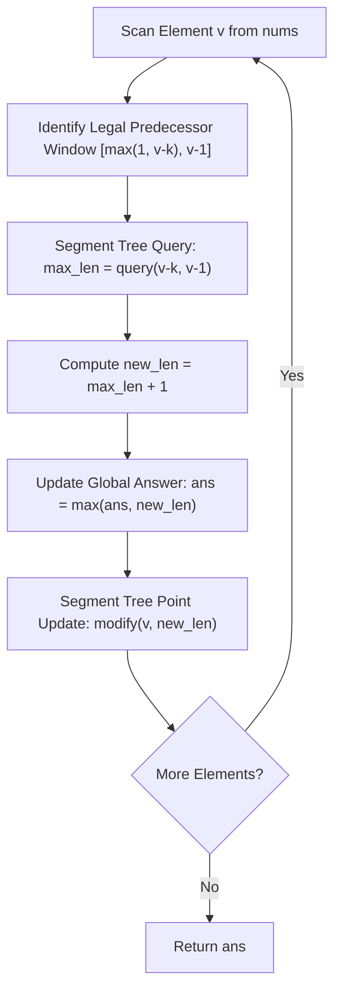

# Guided Example: Longest Increasing Subsequence II

## 1. Problem Overview & Representative Instance

We are given an integer array $nums$ and an integer $k$.
We want to find the length of the longest subsequence of $nums$ that satisfies two conditions:
1. The subsequence is strictly increasing: $a_1 < a_2 < \dots < a_m$.
2. The difference between adjacent elements is at most $k$: $a_{i+1} - a_i \le k$ for all $1 \le i < m$.

### Representative Instance
Consider the input:
$$nums = [4, 2, 1, 4, 3, 4, 5, 8, 15], \quad k = 3$$

Evaluating the elements sequentially:
- A valid subsequence is $[1, 3, 4, 5, 8]$:
  - Strict increase: $1 < 3 < 4 < 5 < 8$.
  - Adjacent differences: $3 - 1 = 2 \le 3$, $4 - 3 = 1 \le 3$, $5 - 4 = 1 \le 3$, $8 - 5 = 3 \le 3$.
  - Element $15$ cannot extend $8$ because $15 - 8 = 7 > 3$.
- Length of this subsequence: $5$.

Expected maximum length: `5`.

---

## 2. Mathematical & Algorithmic Principles

### Value-Indexed Dynamic Programming
Let $dp[v]$ denote the length of the longest valid subsequence ending with the numerical value $v$ among elements processed so far.
When we observe an element $v$ at the current array position:
- A valid predecessor value $p$ must satisfy $p < v$ (strict increase) and $v - p \le k$ (bounded step size).
- Combining these gives the exact predecessor range:
$$p \in [\max(1, v - k), v - 1]$$
- The recurrence relation is:
$$dp[v] = 1 + \max \Big(\{0\} \cup \{ dp[p] \mid \max(1, v - k) \le p \le v - 1 \}\Big)$$

### Segment Tree Acceleration
A naive search across earlier elements requires $\mathcal{O}(N)$ time per element, yielding $\mathcal{O}(N^2)$ overall.
Because queries are interval maximums $[v - k, v - 1]$ over the value domain $[1, M]$ where $M = \max(nums)$, a Segment Tree maintains the array $dp[1 \dots M]$:
- Point update: $\mathcal{O}(\log M)$ to set $dp[v] \leftarrow \text{new\_len}$.
- Range maximum query: $\mathcal{O}(\log M)$ to query $\max_{p \in [v-k, v-1]} dp[p]$.
This reduces the total runtime to $\mathcal{O}(N \log M)$.

---

## 3. Step-by-Step Walkthrough with Intermediate State

Let $nums = [4, 2, 1, 4, 3, 4, 5, 8, 15]$ and $k = 3$.
Value domain upper bound: $M = 15$. Initial state: $dp[x] = 0$ for all $x \in [1, 15]$. $\text{ans} = 1$.

### Step 1: $v = 4$ (Index 0)
- Predecessor interval: $[\max(1, 4 - 3), 4 - 1] = [1, 3]$.
- Range query $\max_{p \in [1, 3]} dp[p] = 0$.
- Candidate length: $t = 0 + 1 = 1$.
- Tree update: $dp[4] = 1$.
- $\text{ans} = \max(1, 1) = 1$.

### Step 2: $v = 2$ (Index 1)
- Predecessor interval: $[\max(1, 2 - 3), 2 - 1] = [1, 1]$.
- Range query $\max_{p \in [1, 1]} dp[p] = 0$.
- Candidate length: $t = 0 + 1 = 1$.
- Tree update: $dp[2] = 1$.
- $\text{ans} = \max(1, 1) = 1$.

### Step 3: $v = 1$ (Index 2)
- Predecessor interval: $[\max(1, 1 - 3), 1 - 1] = [1, 0]$ (Empty interval).
- Range query: $0$.
- Candidate length: $t = 0 + 1 = 1$.
- Tree update: $dp[1] = 1$.
- $\text{ans} = \max(1, 1) = 1$.

### Step 4: $v = 4$ (Index 3)
- Predecessor interval: $[1, 3]$.
- Active values in tree: $dp[1] = 1, dp[2] = 1, dp[3] = 0$.
- Range query $\max_{p \in [1, 3]} dp[p] = 1$.
- Candidate length: $t = 1 + 1 = 2$.
- Tree update: $dp[4] = 2$ (chains from $1$ or $2$).
- $\text{ans} = \max(1, 2) = 2$.

### Step 5: $v = 3$ (Index 4)
- Predecessor interval: $[\max(1, 3 - 3), 3 - 1] = [1, 2]$.
- Active values in tree: $dp[1] = 1, dp[2] = 1$.
- Range query $\max_{p \in [1, 2]} dp[p] = 1$.
- Candidate length: $t = 1 + 1 = 2$.
- Tree update: $dp[3] = 2$ (chains from $1$ or $2$).
- $\text{ans} = \max(2, 2) = 2$.

### Step 6: $v = 4$ (Index 5)
- Predecessor interval: $[1, 3]$.
- Active values in tree: $dp[1] = 1, dp[2] = 1, dp[3] = 2$.
- Range query $\max_{p \in [1, 3]} dp[p] = 2$ (from predecessor $3$!).
- Candidate length: $t = 2 + 1 = 3$.
- Tree update: $dp[4] = 3$ (subsequence $[1, 3, 4]$ or $[2, 3, 4]$).
- $\text{ans} = \max(2, 3) = 3$.

### Step 7: $v = 5$ (Index 6)
- Predecessor interval: $[\max(1, 5 - 3), 5 - 1] = [2, 4]$.
- Active values in tree: $dp[2] = 1, dp[3] = 2, dp[4] = 3$.
- Range query $\max_{p \in [2, 4]} dp[p] = 3$ (from predecessor $4$!).
- Candidate length: $t = 3 + 1 = 4$.
- Tree update: $dp[5] = 4$ (subsequence $[1, 3, 4, 5]$).
- $\text{ans} = \max(3, 4) = 4$.

### Step 8: $v = 8$ (Index 7)
- Predecessor interval: $[\max(1, 8 - 3), 8 - 1] = [5, 7]$.
- Active values in tree: $dp[5] = 4, dp[6] = 0, dp[7] = 0$.
- Range query $\max_{p \in [5, 7]} dp[p] = 4$ (from predecessor $5$!).
- Candidate length: $t = 4 + 1 = 5$.
- Tree update: $dp[8] = 5$ (subsequence $[1, 3, 4, 5, 8]$).
- $\text{ans} = \max(4, 5) = 5$.

### Step 9: $v = 15$ (Index 8)
- Predecessor interval: $[\max(1, 15 - 3), 15 - 1] = [12, 14]$.
- Range query: All $dp[12 \dots 14] = 0$ (element $8$ cannot chain because $15 - 8 = 7 > 3$).
- Candidate length: $t = 0 + 1 = 1$.
- Tree update: $dp[15] = 1$.
- $\text{ans} = \max(5, 1) = 5$.

Final answer: `5`.

---

## 4. Comprehensive State Trace

| Step $i$ | Value $v$ | Query Interval $[v-k, v-1]$ | Best Predecessor Found | New Length $t$ | $dp[v]$ Before Update | $dp[v]$ After Update | Global $\text{ans}$ |
|---|---|---|---|---|---|---|---|
| 0 | 4 | $[1, 3]$ | $0$ (none) | 1 | 0 | 1 | 1 |
| 1 | 2 | $[1, 1]$ | $0$ (none) | 1 | 0 | 1 | 1 |
| 2 | 1 | $[1, 0]$ (empty) | $0$ (none) | 1 | 0 | 1 | 1 |
| 3 | 4 | $[1, 3]$ | $1$ (from 1 or 2) | 2 | 1 | 2 | 2 |
| 4 | 3 | $[1, 2]$ | $1$ (from 1 or 2) | 2 | 0 | 2 | 2 |
| 5 | 4 | $[1, 3]$ | $2$ (from 3) | 3 | 2 | 3 | 3 |
| 6 | 5 | $[2, 4]$ | $3$ (from 4) | 4 | 0 | 4 | 4 |
| 7 | 8 | $[5, 7]$ | $4$ (from 5) | 5 | 0 | 5 | 5 |
| 8 | 15 | $[12, 14]$ | $0$ (gap too wide) | 1 | 0 | 1 | 5 |

---

## 5. Algorithmic Correctness & Soundness

### Strict Left-to-Right Ordering Guarantee
Because the segment tree is queried before the current element $nums[i]$ is inserted:
- Any predecessor length retrieved from the tree corresponds strictly to an element appearing at an earlier index in $nums$.
- No element at an index $j \ge i$ can inadvertently serve as a predecessor, preserving the strict index ordering required of a subsequence.

### Completeness Over State Space
For any valid increasing subsequence $s_1, s_2, \dots, s_m$, when $s_m$ is evaluated, $s_{m-1}$ has already been inserted into the segment tree. Because $s_m - s_{m-1} \le k$ and $s_{m-1} < s_m$, $s_{m-1}$ lies squarely within the query range $[s_m - k, s_m - 1]$. By induction, the maximum length ending at $s_m$ is preserved and propagated.

---

## 6. Edge Cases & Anti-Patterns

| Category | Input Scenario | Potential Pitfall | Resolution |
|---|---|---|---|
| Equal Duplicates | $nums = [5, 5, 5, 5], k = 2$ | Using $p \le v$ allows non-strict increase | Query upper bound is $v - 1$, excluding $v$ from preceding itself (result: 1). |
| Empty Query Interval | $v = 1, k = 3$ | Querying $[1, 0]$ crashes or wraps negative | Clamp lower bound $\max(1, v - k)$; detect $l > r$ and return 0. |
| Large Gaps | $nums = [1, 10, 11], k = 2$ | Value 1 erroneously chains to 10 | Query for 10 is $[8, 9]$; 1 is outside the window (result: 2). |
| Standard LIS Limit | $k \ge \max(nums)$ | Redundant branching | When $k \ge M$, interval is $[1, v - 1]$, smoothly recovering standard LIS behavior. |

---

## 7. Complexity Analysis

- **Time Complexity:** $\mathcal{O}(M + N \log M)$, where $N$ is the number of elements in $nums$ and $M = \max(nums) \le 10^5$.
  - Building the segment tree over coordinate range $[1, M]$ takes $\mathcal{O}(M)$ time.
  - For each of the $N$ elements, we perform one range maximum query and one point update, each taking $\mathcal{O}(\log M)$ time.
- **Auxiliary Space Complexity:** $\mathcal{O}(M)$.
  - A 4-ary or standard binary segment tree for range $[1, M]$ stores at most $4M$ nodes.
