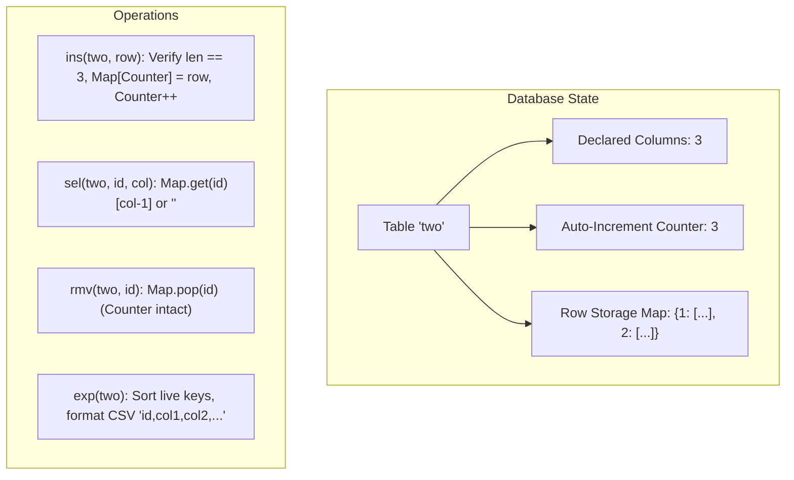

# Guided Example: Design SQL

## 1. Problem Overview & Representative Instance

We are designing an in-memory relational database management system supporting multiple tables with the following operations:
1. **`SQL(names, columns)`**: Initializes tables with specified names and expected column counts.
2. **`ins(name, row)`**: Validates that table `name` exists and that $len(row)$ matches the table's declared column count. If valid, assigns a monotonically increasing 1-based row ID, stores the row, advances the counter, and returns `true`. Otherwise returns `false`.
3. **`rmv(name, rowId)`**: Deletes the row with ID `rowId` from table `name`. If either the table or row does not exist, does nothing.
4. **`sel(name, rowId, columnId)`**: Returns the string value at 1-based `columnId` of row `rowId` in table `name`. If the table, row, or column index is invalid, returns `"<null>"`.
5. **`exp(name)`**: Exports all surviving rows of table `name` sorted by ascending `rowId`, formatted as CSV strings prefixing each row with its `rowId`. Returns an empty list if table `name` is unknown.

### Representative Instance
Consider the sequence of operations:
```text
SQL([["one", "two", "three"], [2, 3, 1]])
ins("two", ["first", "second", "third"])
sel("two", 1, 3)
ins("two", ["fourth", "fifth", "sixth"])
exp("two")
rmv("two", 1)
sel("two", 2, 2)
exp("two")
```

Expected outputs:
`[null, true, "third", true, ["1,first,second,third", "2,fourth,fifth,sixth"], null, "fifth", ["2,fourth,fifth,sixth"]]`

---

## 2. Mathematical & Algorithmic Principles

### Relational State Representation
For each registered table $T$, the database engine maintains:
1. **Schema Constraint**: An expected column width $C_T \in \mathbb{N}$.
2. **Auto-Increment Generator**: A strictly monotonic counter $id_T \in \mathbb{N}$, initialized to $1$. Crucially, deleting a row never recycles or decrements $id_T$.
3. **Primary-Key Storage**: A sparse associative mapping $Storage_T: \text{RowID} \to \text{Tuple}[str]$. A hash map allows $\mathcal{O}(1)$ point lookup and deletion.



### Invariant Properties
- **Non-Recycling Monotonicity**: If a table has generated $k$ rows, every future row will receive an ID strictly greater than $k$, even if all previous $k$ rows were deleted.
- **Fail-Fast Schema Guard**: A row is rejected immediately before consuming a row ID if the column count mismatches.

---

## 3. Step-by-Step Walkthrough with Intermediate State

### Step 1: `SQL(["one", "two", "three"], [2, 3, 1])`
- Initialize table registries:
  - Table `"one"`: columns = 2, counter = 1, rows = `{}`
  - Table `"two"`: columns = 3, counter = 1, rows = `{}`
  - Table `"three"`: columns = 1, counter = 1, rows = `{}`
- Result: `null`

### Step 2: `ins("two", ["first", "second", "third"])`
- Table `"two"` exists and requires 3 columns. Input row has length 3 (valid).
- Allocate row ID = 1. Advance counter for `"two"` to 2.
- Store row: `two.rows[1] = ["first", "second", "third"]`.
- Result: `true`

### Step 3: `sel("two", 1, 3)`
- Query row 1 of table `"two"`. Row exists: `["first", "second", "third"]`.
- Column ID is 3 (1-based), corresponding to 0-based index 2: `"third"`.
- Result: `"third"`

### Step 4: `ins("two", ["fourth", "fifth", "sixth"])`
- Table `"two"` requires 3 columns. Input row has length 3 (valid).
- Allocate row ID = 2. Advance counter for `"two"` to 3.
- Store row: `two.rows[2] = ["fourth", "fifth", "sixth"]`.
- Result: `true`

### Step 5: `exp("two")`
- Surviving row IDs in `"two"`: $[1, 2]$.
- Formatted CSV records:
  - ID 1: `"1,first,second,third"`
  - ID 2: `"2,fourth,fifth,sixth"`
- Result: `["1,first,second,third", "2,fourth,fifth,sixth"]`

### Step 6: `rmv("two", 1)`
- Remove row ID 1 from `two.rows`.
- Remaining live rows: `{2: ["fourth", "fifth", "sixth"]}`.
- Counter for `"two"` remains 3 (never decremented).
- Result: `null`

### Step 7: `sel("two", 2, 2)`
- Query row 2 of table `"two"`. Row exists: `["fourth", "fifth", "sixth"]`.
- Column ID is 2 (1-based), corresponding to index 1: `"fifth"`.
- Result: `"fifth"`

### Step 8: `exp("two")`
- Surviving row IDs in `"two"`: $[2]$.
- Formatted CSV records:
  - ID 2: `"2,fourth,fifth,sixth"`
- Result: `["2,fourth,fifth,sixth"]`

---

## 4. Comprehensive State Trace

| Step | Operation | Arguments | Pre-Condition / Validation | Mutated State (`two`) | Return Value |
|---|---|---|---|---|---|
| 1 | `SQL` | `[["one", "two", "three"], [2, 3, 1]]` | Register schemas | `cols=3, next_id=1, rows={}` | `null` |
| 2 | `ins` | `"two", ["first", "second", "third"]` | $len=3 == cols=3$ (Valid) | `next_id=2, rows={1: ["first", "second", "third"]}` | `true` |
| 3 | `sel` | `"two", 1, 3` | Row 1 exists, col 3 valid | Unchanged | `"third"` |
| 4 | `ins` | `"two", ["fourth", "fifth", "sixth"]` | $len=3 == cols=3$ (Valid) | `next_id=3, rows={1: [...], 2: ["fourth", "fifth", "sixth"]}` | `true` |
| 5 | `exp` | `"two"` | Collect active rows $[1, 2]$ | Unchanged | `["1,first,...", "2,fourth,..."]` |
| 6 | `rmv` | `"two", 1` | Key 1 exists in `two.rows` | `next_id=3, rows={2: ["fourth", "fifth", "sixth"]}` | `null` |
| 7 | `sel` | `"two", 2, 2` | Row 2 exists, col 2 valid | Unchanged | `"fifth"` |
| 8 | `exp` | `"two"` | Collect active rows $[2]$ | Unchanged | `["2,fourth,fifth,sixth"]` |

---

## 5. Algorithmic Correctness & Soundness

### ID Monotonicity Invariant
Because the auto-increment counter is only incremented when an insert succeeds and is never decremented during `rmv` operations:
$$\forall i < j, \quad id(row_i) < id(row_j)$$
This guarantees that primary keys remain globally unique across time for each table, preventing phantom updates or primary key collisions.

### Robust Boundary Handling
- If `sel` queries a deleted row (such as row 1 after step 6), the lookup in the hash map misses, cleanly returning `"<null>"`.
- If `ins` receives a row whose length does not match `cols[name]`, the method aborts before touching `next_id`, preserving transaction atomicity and counter consistency.

---

## 6. Edge Cases & Anti-Patterns

| Category | Concrete Scenario | Anti-Pattern | Correct Handling |
|---|---|---|---|
| ID Recycling | Insert row 1, delete row 1, insert new row | Reassigning ID 1 to new row | New row receives ID 2; deleted IDs are never recycled. |
| Mismatched Width | `ins("two", ["a", "b"])` on 3-col table | Appending incomplete row or consuming ID | Returns `false`; counter does not advance. |
| Non-Existent Table | `sel("unknown", 1, 1)` or `exp("unknown")` | Crash via unhandled exception | `sel` returns `"<null>"`; `exp` returns `[]`. |
| Deleted Row Selection | `sel("two", 1, 1)` after `rmv("two", 1)` | Stale index read from dense list | Sparse hash map lookup detects missing key and returns `"<null>"`. |
| Zero or Negative Col | `sel("two", 1, 0)` | Python negative list indexing wraps to end | Explicit boundary check $1 \le col \le len(row)$ returns `"<null>"`. |

---

## 7. Complexity Analysis

- **Time Complexity:**
  - `SQL(names, columns)`: $\mathcal{O}(T)$ where $T$ is the number of initialized tables.
  - `ins(name, row)`: $\mathcal{O}(C)$ where $C$ is the column count, to copy the row into storage.
  - `rmv(name, rowId)`: $\mathcal{O}(1)$ average time for hash map key deletion.
  - `sel(name, rowId, columnId)`: $\mathcal{O}(1)$ point lookup in table map and array index.
  - `exp(name)`: $\mathcal{O}(R \log R + R \cdot C)$ where $R$ is the number of surviving rows, to sort the surviving keys and format strings.
- **Auxiliary Space Complexity:** $\mathcal{O}(N_{\text{rows}} \cdot C)$ where $N_{\text{rows}}$ is the total number of currently stored rows across all tables.
