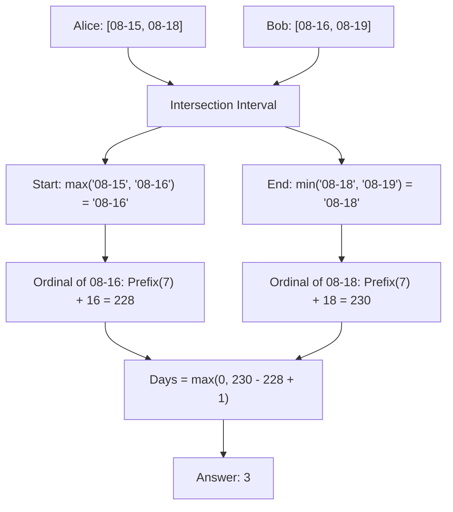

# Guided Example: Count Days Spent Together

## 1. Problem Overview & Representative Instance

Alice and Bob are traveling to Rome during the same non-leap calendar year (where February has 28 days, totaling 365 days).
- Alice arrives on `arriveAlice` and departs on `leaveAlice`.
- Bob arrives on `arriveBob` and departs on `leaveBob`.
- All dates are given as strings formatted as `"MM-DD"` representing 1-based months and days.
- Both arrival and departure dates are inclusive.

We want to find the total number of days that Alice and Bob are both in Rome together. If their visits do not overlap, we return 0.

### Representative Instance
- **Alice's Visit:** `arriveAlice = "08-15"`, `leaveAlice = "08-18"`
- **Bob's Visit:** `arriveBob = "08-16"`, `leaveBob = "08-19"`

Both stays take place in August. We trace how the overlapping interval is isolated and converted to an inclusive day count of $3$.

---

## 2. Mathematical & Algorithmic Principles

### 1D Closed Interval Intersection
Let the stay of Alice be represented by the closed real/discrete interval $[A_{\text{arr}}, A_{\text{lea}}]$ and Bob's stay by $[B_{\text{arr}}, B_{\text{lea}}]$.
The intersection of two intervals on a totally ordered timeline $[t_1, t_2] \cap [t_3, t_4]$ is:
$$[\max(t_1, t_3), \min(t_2, t_4)]$$

If $S = \max(A_{\text{arr}}, B_{\text{arr}})$ and $E = \min(A_{\text{lea}}, B_{\text{lea}})$, then:
- If $S \le E$, the intersection is non-empty, containing $E - S + 1$ inclusive days.
- If $S > E$, the intersection is empty ($\emptyset$), containing $\max(0, E - S + 1) = 0$ days.

### Date to Day-of-Year Projection
Because month-day strings are fixed-width zero-padded `"MM-DD"`, lexicographical ordering precisely preserves chronological ordering within the same calendar year:
$$\text{"08-15"} < \text{"08-16"} < \text{"08-18"} < \text{"08-19"}$$
Therefore, $\max$ and $\min$ can be evaluated directly on strings before converting to day-of-year ordinals.

Given a date `"MM-DD"`:
$$\text{Ordinal}(MM, DD) = \sum_{m=1}^{MM-1} \text{DaysInMonth}[m] + DD$$
where $\text{DaysInMonth} = [31, 28, 31, 30, 31, 30, 31, 31, 30, 31, 30, 31]$.

---

## 3. Step-by-Step Walkthrough with Intermediate State

### Step 1: Compute Overlap Boundaries in String Space
- Start of overlap:
  $$S = \max(\text{"08-15"}, \text{"08-16"}) = \text{"08-16"}$$
- End of overlap:
  $$E = \min(\text{"08-18"}, \text{"08-19"}) = \text{"08-18"}$$
- Since $S \le E$ ("08-16" $\le$ "08-18"), a non-empty overlap exists.

### Step 2: Convert $S = \text{"08-16"}$ to Day of Year
- Month $MM = 8$ (August), Day $DD = 16$.
- Cumulative days across months 1 through 7 (Jan to Jul):
  $$31 + 28 + 31 + 30 + 31 + 30 + 31 = 212$$
- Total start ordinal $x$:
  $$x = 212 + 16 = 228$$

### Step 3: Convert $E = \text{"08-18"}$ to Day of Year
- Month $MM = 8$ (August), Day $DD = 18$.
- Cumulative days before August: $212$.
- Total end ordinal $y$:
  $$y = 212 + 18 = 230$$

### Step 4: Calculate Inclusive Days
- Difference formula:
  $$\Delta = y - x + 1 = 230 - 228 + 1 = 3$$
- Clamping with zero:
  $$\max(0, 3) = 3$$
- The 3 common days are August 16, August 17, and August 18.

---

## 4. Comprehensive State Trace

| Stage | Expression / Evaluation | Intermediate Result | Interpretation |
|---|---|---|---|
| String Max Arrival | $\max(\text{"08-15"}, \text{"08-16"})$ | `"08-16"` | Earliest possible joint presence |
| String Min Departure | $\min(\text{"08-18"}, \text{"08-19"})$ | `"08-18"` | Latest possible joint presence |
| Prefix Sum Jan-Jul | $31+28+31+30+31+30+31$ | $212$ days | Days elapsed prior to August 1 |
| Start Ordinal ($x$) | $212 + 16$ | $228$ | 228th day of the year |
| End Ordinal ($y$) | $212 + 18$ | $230$ | 230th day of the year |
| Day Span Calculation | $y - x + 1 = 230 - 228 + 1$ | $3$ | Inclusive count of shared dates |
| Disjoint Guard | $\max(3, 0)$ | $3$ | Final result |

---

## 5. Algorithmic Correctness & Soundness

### Direct String Comparison Validity
Because standard ISO-style format `"MM-DD"` uses:
1. Two-digit month with leading zero ($01 \le MM \le 12$)
2. A fixed delimiter `"-"`
3. Two-digit day with leading zero ($01 \le DD \le 31$)

The lexicographical comparison on ASCII bytes corresponds strictly to integer tuple comparison $(MM_1, DD_1) \le (MM_2, DD_2)$. Because all dates fall strictly within the same non-leap year, this ordering is isomorphic to the true chronological sequence.

### Zero-Floor Non-Negative Invariant
When intervals are disjoint (e.g. Alice leaves on "10-31" and Bob arrives on "11-01"):
$$S = \text{"11-01"} \implies x = 305$$
$$E = \text{"10-31"} \implies y = 304$$
$$y - x + 1 = 304 - 305 + 1 = 0$$
When separated by multiple days, $y - x + 1 < 0$. The outer $\max(\dots, 0)$ guarantees an exact, non-negative return value.

---

## 6. Edge Cases & Anti-Patterns

| Category | Concrete Scenario | Anti-Pattern | Correct Handling |
|---|---|---|---|
| Cross-Month Span | "02-27" to "03-02" | Manually subtracting days without calendar offsets | Projecting to year ordinals $1 \dots 365$ handles month boundaries uniformly. |
| Leap Year Confusion | February stays | Assuming 29 days in February | February has strictly 28 days per non-leap specification. |
| Single Shared Day | Alice: [06-01, 06-15], Bob: [06-15, 06-30] | Returning 0 due to strictly greater check ($y - x$) | Using inclusive $+1$ gives $166 - 166 + 1 = 1$. |
| Adjacent Days | Alice: [02-28, 02-28], Bob: [03-01, 03-01] | Returning negative or false positive | $x = 60, y = 59 \implies 59 - 60 + 1 = 0 \implies 0$. |
| Complete Enclosure | Alice: [04-01, 04-30], Bob: [04-10, 04-20] | Miscalculating inner bounds | $\max$ and $\min$ naturally select $[04-10, 04-20]$ with 11 days. |

---

## 7. Complexity Analysis

- **Time Complexity:** $\mathcal{O}(1)$.
  - Comparing strings of length 5 takes 5 operations.
  - Slicing and parsing month and day integers takes $\mathcal{O}(1)$ time.
  - Summing at most 11 constant integers from the month table takes at most 11 additions.
  - Overall execution time is bounded by a small constant.
- **Auxiliary Space Complexity:** $\mathcal{O}(1)$.
  - Only a fixed tuple of 12 month sizes and a few scalar integer ordinals are stored.
