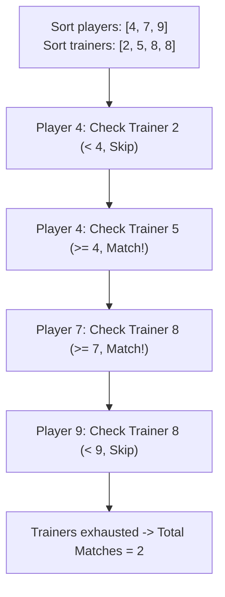

# Guided Example: Maximum Matching of Players With Trainers

## 1. Problem Overview & Representative Instance

We are given two integer arrays:
- `players`, where `players[i]` represents the ability of the $i$-th player.
- `trainers`, where `trainers[j]` represents the training capacity of the $j$-th trainer.

A player $i$ can be matched with trainer $j$ if and only if:
$$\text{players}[i] \le \text{trainers}[j]$$
Each player can be assigned to at most one trainer, and each trainer can train at most one player. We want to maximize the total number of matched pairs.

### Representative Instance
- **Players:** `players = [4, 7, 9]`
- **Trainers:** `trainers = [8, 2, 5, 8]`

We will trace how sorting both collections allows a greedy two-pointer strategy to pair player 4 with trainer 5, player 7 with trainer 8, and detect that player 9 cannot be matched, yielding an optimal count of $2$.

---

## 2. Mathematical & Algorithmic Principles

### Monotone Greedy Exchange Principle
Suppose we sort both `players` and `trainers` in ascending order:
$$P = [p_0, p_1, \dots, p_{m-1}], \quad p_0 \le p_1 \le \dots \le p_{m-1}$$
$$T = [t_0, t_1, \dots, t_{n-1}], \quad t_0 \le t_1 \le \dots \le t_{n-1}$$

For the smallest unmet player $p_i$, we greedily select the smallest available trainer $t_j$ such that $t_j \ge p_i$:
1. **Irreversibility of Skipped Trainers:** Any trainer $t_k < p_i$ cannot satisfy $p_i$. Because future players have ability $p_{i'} \ge p_i > t_k$, this trainer $t_k$ cannot satisfy any subsequent player either. Discarding $t_k$ permanently loses zero potential matches.
2. **Exchange Optimality:** If an optimal solution matches $p_i$ to a stronger trainer $t_{j'} > t_j$, while $t_j$ is either unused or matched to an even stronger player $p_{i'} > p_i$, we can swap or redirect $t_j$ to $p_i$ without violating feasibility ($t_j \ge p_i$ is true). Preserving larger trainers for harder-to-satisfy players never restricts future pairings.

---

## 3. Step-by-Step Walkthrough with Intermediate State

### Step 1: Sort Both Arrays
- Sorted Players: $P = [4, 7, 9]$ with length $m = 3$.
- Sorted Trainers: $T = [2, 5, 8, 8]$ with length $n = 4$.
- Pointers: $i = 0$ (player index), $j = 0$ (trainer index).

### Step 2: Match Player $i = 0$ ($p_0 = 4$)
- Trainer $j = 0$: $T[0] = 2$.
  - $2 < 4$: capacity too low. Increment $j \to 1$.
- Trainer $j = 1$: $T[1] = 5$.
  - $5 \ge 4$: valid match.
  - Pair $(4, 5)$ formed.
  - Advance trainer index $j \to 2$.
  - Matches so far: 1.

### Step 3: Match Player $i = 1$ ($p_1 = 7$)
- Trainer $j = 2$: $T[2] = 8$.
  - $8 \ge 7$: valid match immediately.
  - Pair $(7, 8)$ formed.
  - Advance trainer index $j \to 3$.
  - Matches so far: 2.

### Step 4: Attempt Player $i = 2$ ($p_2 = 9$)
- Trainer $j = 3$: $T[3] = 8$.
  - $8 < 9$: capacity too low. Increment $j \to 4$.
- Check boundary: $j = 4 = n$.
  - All trainers are exhausted. No trainer can satisfy player 9.
- Terminate search and return the number of successfully matched players, which is $i = 2$.

---

## 4. Comprehensive State Trace

| Player Index $i$ | Player Ability $p_i$ | Trainer Index $j$ | Trainer Capacity $T[j]$ | Comparison & Decision | Next Indices $(i, j)$ | Matches |
|---|---|---|---|---|---|---|
| - | - | - | - | Initial state after sorting | $(0, 0)$ | 0 |
| $0$ | $4$ | $0$ | $2$ | $2 < 4 \implies$ Discard trainer | $(0, 1)$ | 0 |
| $0$ | $4$ | $1$ | $5$ | $5 \ge 4 \implies$ Match player 4 with trainer 5 | $(1, 2)$ | 1 |
| $1$ | $7$ | $2$ | $8$ | $8 \ge 7 \implies$ Match player 7 with trainer 8 | $(2, 3)$ | 2 |
| $2$ | $9$ | $3$ | $8$ | $8 < 9 \implies$ Discard trainer | $(2, 4)$ | 2 |
| $2$ | $9$ | $4$ | - | $j = n \implies$ Trainers exhausted; terminate | Done | 2 |

---

## 5. Algorithmic Correctness & Soundness

### Formal Invariant
At the start of processing player $i$:
1. Exactly $i$ players ($p_0, \dots, p_{i-1}$) have been matched with a disjoint subset of $i$ trainers chosen from $T[0 \dots j-1]$.
2. All unused trainers in $T[0 \dots j-1]$ were strictly less than $p_{i-1}$, meaning they are strictly less than any remaining player $p_k$ ($k \ge i$). They can never be part of any valid match.
3. Trainer $T[j]$ is the smallest remaining trainer in the entire pool that could potentially satisfy $p_i$.

### Termination Guarantees
- If all $m$ players are matched ($i = m$), the loop completes and returns $m$.
- If $j = n$ while $i < m$, no remaining trainer has capacity $\ge p_i$. Because players are sorted, no remaining trainer can satisfy any future player $p_k \ge p_i$ either. Thus, exactly $i$ matches can ever be made, and returning $i$ immediately is sound and complete.

---

## 6. Edge Cases & Anti-Patterns

| Category | Concrete Scenario | Anti-Pattern | Correct Handling |
|---|---|---|---|
| Complete Insufficiency | `players = [2, 2, 3]`, `trainers = [1, 1, 1]` | Attempting non-greedy backtracking | Trainer pointer scans to end, matching 0 pairs in $\mathcal{O}(m + n)$ time. |
| Surplus High-Capacity | `players = [1, 1, 1]`, `trainers = [10]` | Using high capacities on large players first | Weakest player claims trainer 10; terminates with 1 match. |
| Duplicate Values | `players = [5, 5, 5]`, `trainers = [4, 5, 5]` | Conflating duplicate values into set | Multi-element array iteration treats duplicate capacities as distinct slots, matching 2 pairs. |
| In-place Sorting | Modifying caller data structures | Assuming input is immutable if restricted | Sorting arrays in place runs in $\mathcal{O}(1)$ additional heap space. |
| Extreme Values | $p_i = 10^9, t_j = 10^9$ | Integer overflow during subtraction | Use direct comparison operator $\le$ without difference computation. |

---

## 7. Complexity Analysis

- **Time Complexity:** $\mathcal{O}(m \log m + n \log n)$ where $m$ is the length of `players` and $n$ is the length of `trainers`.
  - Sorting `players` takes $\mathcal{O}(m \log m)$ comparisons.
  - Sorting `trainers` takes $\mathcal{O}(n \log n)$ comparisons.
  - The two-pointer traversal increments $i$ at most $m$ times and $j$ at most $n$ times, taking $\mathcal{O}(m + n)$ linear time.
  - Dominated by the sorting phase: $\mathcal{O}(m \log m + n \log n)$.
- **Auxiliary Space Complexity:** $\mathcal{O}(1)$ beyond the standard sorting call stack ($\mathcal{O}(\log m + \log n)$ auxiliary space for Timsort/quicksort).
  - Only scalar indices $i$ and $j$ are allocated for tracking.
