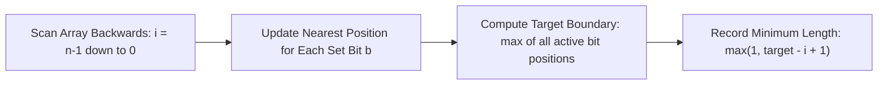

# Guided Example: Smallest Subarrays With Maximum Bitwise OR

## 1. Problem Overview & Representative Instance

Given a 0-indexed integer array $nums$ containing $n$ non-negative integers, we seek for every index $i$ ($0 \le i < n$) the length of the shortest non-empty contiguous subarray starting at index $i$, denoted $nums[i \dots j]$ with $j \ge i$, whose bitwise OR evaluation equals the maximum possible bitwise OR achievable across all subarrays starting at $i$.

Consider the representative array instance:
$$nums = [1, 0, 2, 1, 3]$$

Here $n = 5$. Each integer $nums[k]$ has a binary representation over non-negative integers ($\le 10^9 < 2^{30}$):
- $nums[0] = 1 = 001_2$
- $nums[1] = 0 = 000_2$
- $nums[2] = 2 = 010_2$
- $nums[3] = 1 = 001_2$
- $nums[4] = 3 = 011_2$

For any starting index $i$, extending the subarray further to the right can only set additional bits in the cumulative OR sum, never clear existing bits. The maximum achievable bitwise OR from index $i$ onward is identically equal to the bitwise OR of the entire suffix $nums[i \dots n-1]$. Our objective is to identify the smallest endpoint $j \ge i$ such that $nums[i \dots j]$ already covers every binary bit position present in $nums[i \dots n-1]$.

## 2. Mathematical & Algorithmic Principles

Bitwise OR is monotonic under set expansion: for any binary bit position $b$, the $b$-th bit of $\bigvee_{k=i}^j nums[k]$ is $1$ if and only if there exists at least one index $k \in [i, j]$ such that the $b$-th bit of $nums[k]$ is $1$.

Consequently, to match the full suffix bitwise OR $\bigvee_{k=i}^{n-1} nums[k]$, the right endpoint $j$ must satisfy:
$$j \ge \text{last\_pos}[b] \quad \text{for every bit } b \text{ that appears in } nums[i \dots n-1]$$
where $\text{last\_pos}[b]$ denotes the smallest index $k \ge i$ at which bit $b$ is set.

Because every bit position is independent, the minimal endpoint $j^*(i)$ required to satisfy all bits simultaneously is the maximum over all active bits:
$$j^*(i) = \max \left( i, \max_{b \in [0, 29], \text{last\_pos}[b] \ge i} \text{last\_pos}[b] \right)$$

The required shortest subarray length at index $i$ is:
$$\text{length}[i] = j^*(i) - i + 1$$

By iterating backwards from $i = n - 1$ down to $0$, we maintain a lookup table $pos[b]$ storing the most recently observed index for bit $b$. When processing index $i$:
1. For every bit position $b \in [0, 29]$ where $(nums[i] \gg b) \ \& \ 1 = 1$, we record $pos[b] = i$.
2. The optimal right endpoint is computed as $\max(i, \max_{b} pos[b])$, querying only bits that have appeared at or to the right of $i$.
3. The answer for index $i$ is immediately recorded as $j^*(i) - i + 1$.

This backwards sweep ensures each bit lookup executes in constant time $\mathcal{O}(30)$ per element, avoiding repetitive forwards subarray evaluations.

## 3. Step-by-Step Walkthrough with Intermediate State

Let us trace $nums = [1, 0, 2, 1, 3]$ from right to left ($i = 4$ down to $0$).

Initial state of active bit positions:
- $pos[0] = -1$, $pos[1] = -1$, $pos[2] = -1$ (all bit positions initialized to unobserved).

### Step 1: Processing Index $i = 4$ ($nums[4] = 3 = 011_2$)
- Bits set in $nums[4]$: Bit 0 and Bit 1.
- Update positions: $pos[0] = 4$, $pos[1] = 4$.
- Active bits present: $pos[0] = 4$, $pos[1] = 4$.
- Maximum index required: $\max(4, 4, 4) = 4$.
- Minimum length: $4 - 4 + 1 = 1$. Result at index 4 is $1$.

### Step 2: Processing Index $i = 3$ ($nums[3] = 1 = 001_2$)
- Bits set in $nums[3]$: Bit 0.
- Update positions: $pos[0] = 3$. Position of Bit 1 remains $pos[1] = 4$.
- Active bits present: $pos[0] = 3$, $pos[1] = 4$.
- Maximum index required: $\max(3, 3, 4) = 4$.
- Minimum length: $4 - 3 + 1 = 2$. Result at index 3 is $2$.
- Verification: $nums[3 \dots 4] = [1, 3]$, bitwise OR is $1 \mid 3 = 3$. A subarray of length 1 ($[1]$) only gives OR of 1. Length 2 is optimal.

### Step 3: Processing Index $i = 2$ ($nums[2] = 2 = 010_2$)
- Bits set in $nums[2]$: Bit 1.
- Update positions: $pos[1] = 2$. Position of Bit 0 remains $pos[0] = 3$.
- Active bits present: $pos[0] = 3$, $pos[1] = 2$.
- Maximum index required: $\max(2, 3, 2) = 3$.
- Minimum length: $3 - 2 + 1 = 2$. Result at index 2 is $2$.
- Verification: $nums[2 \dots 3] = [2, 1]$, bitwise OR is $2 \mid 1 = 3$. Suffix maximum OR is 3, achieved at endpoint 3. Length 2 is optimal.

### Step 4: Processing Index $i = 1$ ($nums[1] = 0 = 000_2$)
- Bits set in $nums[1]$: None.
- Active positions remain: $pos[0] = 3$, $pos[1] = 2$.
- Maximum index required: $\max(1, 3, 2) = 3$.
- Minimum length: $3 - 1 + 1 = 3$. Result at index 1 is $3$.
- Verification: Subarray $nums[1 \dots 3] = [0, 2, 1]$ yields $0 \mid 2 \mid 1 = 3$. Shorter subarrays $[0]$ or $[0, 2]$ yield 0 and 2, which are strictly less than 3. Length 3 is optimal.

### Step 5: Processing Index $i = 0$ ($nums[0] = 1 = 001_2$)
- Bits set in $nums[0]$: Bit 0.
- Update positions: $pos[0] = 0$. Position of Bit 1 remains $pos[1] = 2$.
- Active bits present: $pos[0] = 0$, $pos[1] = 2$.
- Maximum index required: $\max(0, 0, 2) = 2$.
- Minimum length: $2 - 0 + 1 = 3$. Result at index 0 is $3$.
- Verification: Subarray $nums[0 \dots 2] = [1, 0, 2]$ yields $1 \mid 0 \mid 2 = 3$. Shorter subarrays $[1]$ and $[1, 0]$ only yield 1. Length 3 is optimal.

Final compiled lengths: $[3, 3, 2, 2, 1]$.

## 4. Comprehensive State Trace

The table below summarizes the reverse progression across all indices, showing active bit registrations, the maximal necessary right endpoint, and the deduced subarray length.

| Step | Index $i$ | Value $nums[i]$ | Binary Form | Updated $pos$ Vector $(b_0, b_1)$ | Maximal Target Index $j^*$ | Subarray Span | Resulting Length |
|---|---|---|---|---|---|---|---|
| Initial | - | - | - | $(-1, -1)$ | - | - | - |
| 1 | 4 | 3 | $011_2$ | $(4, 4)$ | 4 | $nums[4 \dots 4]$ | 1 |
| 2 | 3 | 1 | $001_2$ | $(3, 4)$ | 4 | $nums[3 \dots 4]$ | 2 |
| 3 | 2 | 2 | $010_2$ | $(3, 2)$ | 3 | $nums[2 \dots 3]$ | 2 |
| 4 | 1 | 0 | $000_2$ | $(3, 2)$ | 3 | $nums[1 \dots 3]$ | 3 |
| 5 | 0 | 1 | $001_2$ | $(0, 2)$ | 2 | $nums[0 \dots 2]$ | 3 |

To further illustrate the distinct bit coverage requirements from each start point:

| Start Index $i$ | Target Suffix Bits Required | Earliest Endpoint Satisfying All Bits | Smallest Subarray | Bitwise OR Evaluation |
|---|---|---|---|---|
| 0 | $\{0, 1\}$ | Index 2 ($nums[2]$ contributes Bit 1) | $[1, 0, 2]$ | $3$ |
| 1 | $\{0, 1\}$ | Index 3 ($nums[3]$ contributes Bit 0) | $[0, 2, 1]$ | $3$ |
| 2 | $\{0, 1\}$ | Index 3 ($nums[3]$ contributes Bit 0) | $[2, 1]$ | $3$ |
| 3 | $\{0, 1\}$ | Index 4 ($nums[4]$ contributes Bit 1) | $[1, 3]$ | $3$ |
| 4 | $\{0, 1\}$ | Index 4 ($nums[4]$ contributes both) | $[3]$ | $3$ |

## 5. Algorithmic Correctness & Soundness

1. **Suffix Bitwise Supremum**: Because bitwise OR is bitwise additive and idempotent ($x \mid y \ge x$), the OR sum over any prefix of suffix $[i \dots n-1]$ is a bitwise submask of the full suffix OR $\bigvee_{k=i}^{n-1} nums[k]$. Thus, no subarray starting at $i$ can ever produce a bitwise OR strictly greater than this suffix OR.
2. **Sufficiency of Bit Covering**: An OR sum equals the suffix OR if and only if every bit present in the suffix OR is also present in the subarray OR. A bit is present in the subarray if and only if the subarray encompasses at least one element where that bit is 1.
3. **Minimality of Right Endpoint**: For each bit $b$ active in the suffix, the earliest element providing bit $b$ at or to the right of index $i$ is precisely $pos[b]$. To include all active bits, the endpoint $j$ must satisfy $j \ge pos[b]$ for all active $b$, giving the minimum necessary endpoint $j^* = \max_b pos[b]$. Any endpoint $j < j^*$ would omit at least one bit that is present in the suffix, yielding an OR strictly smaller than the suffix maximum.
4. **Single-Pass Invariant**: By moving backwards from $n-1$ to $0$, $pos[b]$ always reflects the nearest occurrence of bit $b$ at or to the right of the current index $i$.

## 6. Edge Cases & Anti-Patterns

- **All Elements Zero**: If $nums = [0, 0, 0]$, no bits are ever set. All $pos[b]$ remain $-1$. The algorithm falls back to $j^* = i$, yielding lengths of $[1, 1, 1]$. Every single-element subarray $[0]$ achieves the maximum OR ($0$), which is optimal and conforms to the non-empty requirement.
- **Single Element Array**: When $n = 1$, the loop executes once and yields length 1 immediately.
- **Large Bit Values**: Elements can reach $10^9 < 2^{30}$. Fixed arrays of length 30 or 32 suffice to track all bit positions without integer overflow.
- **Anti-Pattern (Brute Force OR Scan)**: Checking all subarrays starting at $i$ by scanning rightward until the OR stops increasing takes $\mathcal{O}(n^2)$ time in the worst case (e.g. an array where the critical bit only appears at the very end). This exceeds time limits when $n = 10^5$.
- **Anti-Pattern (Segment Tree / Binary Lifting Overkill)**: While binary searching the endpoint using a range OR segment tree yields an $\mathcal{O}(n \log n)$ solution, tracking the nearest bit occurrences directly takes $\mathcal{O}(30 \cdot n)$ with minimal overhead and zero tree allocations.

## 7. Complexity Analysis

- **Time Complexity**: There are $n$ indices processed in reverse order. At each index $i$, we inspect $30$ bit positions to update $pos[b]$ and compute the maximum over active positions. Each check involves basic bitwise shift and mask operations. The total operational count is bounded by $30 \cdot n$, yielding a deterministic time complexity of $\mathcal{O}(n \log (\max nums))$ or strictly $\mathcal{O}(n)$ considering the fixed 30-bit word size.
- **Space Complexity**: The algorithm maintains an auxiliary array $pos$ of size $30$ or $32$ to record the nearest index of each bit, plus an output array of length $n$. Excluding the output array, the auxiliary working space is $\mathcal{O}(1)$.
