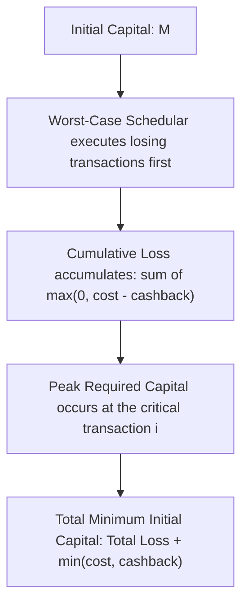

# Guided Example: Minimum Money Required Before Transactions

## 1. Problem Overview & Representative Instance

In financial planning under adversarial ordering, an agent must execute a collection of transactions in an arbitrary, unknown sequence. Each transaction is represented by an ordered pair $[cost, cashback]$, where executing the transaction requires having at least $cost$ units of currency available immediately beforehand. Upon spending $cost$, the agent instantaneously receives $cashback$.

Because the agent cannot choose or predict the order in which transactions are scheduled, the initial capital must be sufficient to guarantee that no matter which permutation of transactions is presented, the agent never runs out of funds. We seek the minimum starting money that guarantees successful completion of all transactions under the worst possible ordering.

Consider the representative transaction portfolio:
$$\text{transactions} = [[2, 1], [5, 0], [4, 2]]$$

Our objective is to determine the absolute minimum initial capital that guarantees that all three transactions can be executed in any sequence.

## 2. Mathematical & Algorithmic Principles

Every transaction $[c_i, b_i]$ alters net balance by:
$$\Delta_i = b_i - c_i$$

Transactions naturally partition into two mutually exclusive regimes:
1. **Losing Transactions ($\mathcal{L}$):** Where $c_i > b_i$. Here $\Delta_i < 0$, meaning each execution permanently drains $c_i - b_i$ units of capital.
2. **Non-Losing Transactions ($\mathcal{G}$):** Where $c_i \le b_i$. Here $\Delta_i \ge 0$, meaning execution does not diminish the net capital reserve.

To force the highest possible starting balance, an adversary will greedily deplete our funds. Thus, the adversary schedules transactions such that the critical bottleneck transaction $k$ is executed only after our reserves have been dragged down by other losing transactions.

Let the total loss across all losing transactions be:
$$L_{\text{total}} = \sum_{i \in \mathcal{L}} (c_i - b_i) = \sum_{i=1}^n \max(0, c_i - b_i)$$

Now consider the condition for transaction $k$ to be successfully executed when placed at its worst possible position:
- **Case 1: $k$ is a losing transaction ($k \in \mathcal{L}$):**
  The adversary schedules all other losing transactions $j \in \mathcal{L} \setminus \{k\}$ before $k$.
  The accumulated loss prior to executing $k$ is:
  $$L_{\text{prior}} = L_{\text{total}} - (c_k - b_k)$$
  To satisfy the pre-condition for $k$, the remaining balance before $k$ must be at least $c_k$:
  $$M - L_{\text{prior}} \ge c_k \implies M \ge L_{\text{prior}} + c_k = L_{\text{total}} - (c_k - b_k) + c_k = L_{\text{total}} + b_k$$
  Notice that since $c_k > b_k$, $b_k = \min(c_k, b_k)$.

- **Case 2: $k$ is a non-losing transaction ($k \in \mathcal{G}$):**
  The adversary schedules all losing transactions $\mathcal{L}$ before $k$, incurring the full loss $L_{\text{total}}$.
  To satisfy the pre-condition for $k$:
  $$M - L_{\text{total}} \ge c_k \implies M \ge L_{\text{total}} + c_k$$
  Notice that since $c_k \le b_k$, $c_k = \min(c_k, b_k)$.

Unifying both cases, the minimum initial capital required to withstand transaction $k$ placed in its worst-case schedule is precisely:
$$M_k = L_{\text{total}} + \min(c_k, b_k)$$

Because the adversary could pick any transaction $k \in \{1, \dots, n\}$ to serve as the critical bottleneck, the overall minimum initial money is:
$$M = L_{\text{total}} + \max_{1 \le k \le n} \min(c_k, b_k)$$

This reduces the problem to an $\mathcal{O}(n)$ single-pass aggregation.

## 3. Step-by-Step Walkthrough with Intermediate State

Let us apply this closed-form reduction to $\text{transactions} = [[2, 1], [5, 0], [4, 2]]$.

### Phase 1: Categorization and Total Loss Computation

We evaluate the net loss $\max(0, c_i - b_i)$ for each transaction:
- Transaction $0 = [2, 1]$: $c_0 = 2, b_0 = 1$. Since $2 > 1$, net loss is $2 - 1 = 1$.
- Transaction $1 = [5, 0]$: $c_1 = 5, b_1 = 0$. Since $5 > 0$, net loss is $5 - 0 = 5$.
- Transaction $2 = [4, 2]$: $c_2 = 4, b_2 = 2$. Since $4 > 2$, net loss is $4 - 2 = 2$.

All three transactions are losing transactions. The total net loss across the portfolio is:
$$L_{\text{total}} = 1 + 5 + 2 = 8$$

### Phase 2: Evaluating Worst-Case Bottleneck For Each Transaction

Next, we calculate the required capital if transaction $k$ is executed at the worst possible moment:
- For $k = 0\ ([2, 1])$:
  $$\text{Required} = L_{\text{total}} + \min(2, 1) = 8 + 1 = 9$$
- For $k = 1\ ([5, 0])$:
  $$\text{Required} = L_{\text{total}} + \min(5, 0) = 8 + 0 = 8$$
- For $k = 2\ ([4, 2])$:
  $$\text{Required} = L_{\text{total}} + \min(4, 2) = 8 + 2 = 10$$

### Phase 3: Global Maximum Extraction

Taking the maximum across all evaluated candidates:
$$M = \max(9, 8, 10) = 10$$

Starting with 10 guarantees survival under all orderings.

## 4. Comprehensive State Trace

The evaluation across all transactions is summarized below:

| Index $k$ | Transaction $[c_k, b_k]$ | Type | Net Loss $\max(0, c_k - b_k)$ | Bottleneck Term $\min(c_k, b_k)$ | Capital Bound $L_{\text{total}} + \min(c_k, b_k)$ | Running Max $M$ |
|---|---|---|---|---|---|---|
| $0$ | $[2, 1]$ | Losing | $1$ | $1$ | $8 + 1 = 9$ | $9$ |
| $1$ | $[5, 0]$ | Losing | $5$ | $0$ | $8 + 0 = 8$ | $9$ |
| $2$ | $[4, 2]$ | Losing | $2$ | $2$ | $8 + 2 = 10$ | $10$ |

To verify why $M = 10$ is necessary, consider the adversarial ordering $\sigma = (0, 1, 2)$:
1. Begin with balance $10$.
2. Transaction $0\ [2, 1]$: Pre-balance $10 \ge 2$. Spend $2$, receive $1$. New balance: $9$.
3. Transaction $1\ [5, 0]$: Pre-balance $9 \ge 5$. Spend $5$, receive $0$. New balance: $4$.
4. Transaction $2\ [4, 2]$: Pre-balance $4 \ge 4$. Spend $4$, receive $2$. New balance: $2$.

Notice that prior to transaction $2$, the balance was exactly $4$, perfectly matching the required cost. Had initial capital been $9$, the balance prior to transaction $2$ would have been $3 < 4$, causing bankruptcy.

| Step | Transaction Executed | Balance Before | Cost Deducted | Cashback Added | Balance After | Deficit if Started at $9$ |
|---|---|---|---|---|---|---|
| $1$ | $[2, 1]$ | $10$ | $2$ | $1$ | $9$ | Balance $8 \ge 2$ |
| $2$ | $[5, 0]$ | $9$ | $5$ | $0$ | $4$ | Balance $3 < 5$ (Fails here!) |
| $3$ | $[4, 2]$ | $4$ | $4$ | $2$ | $2$ | N/A |

## 5. Algorithmic Correctness & Soundness

The correctness of the mathematical derivation rests on two complementary claims:
1. **Sufficiency:** For any arbitrary permutation $\pi$ of the $n$ transactions, starting with $M = L_{\text{total}} + \max_k \min(c_k, b_k)$ guarantees that the balance before every transaction $j$ is at least $c_j$.
   - Proof: Before transaction $j$ is processed, only some subset of losing transactions $S \subseteq \mathcal{L} \setminus \{j\}$ has been executed. The accumulated loss prior to $j$ cannot exceed the sum of losses of all losing transactions except possibly $j$ itself:
     $$\text{Loss before } j \le L_{\text{total}} - \max(0, c_j - b_j)$$
     The balance before $j$ is therefore at least:
     $$M - (L_{\text{total}} - \max(0, c_j - b_j)) \ge \min(c_j, b_j) + \max(0, c_j - b_j) = c_j$$
     Hence, the balance never drops below $c_j$.
2. **Necessity:** There always exists an adversarial permutation that drives the required pre-balance to exactly $L_{\text{total}} + \min(c_k, b_k)$ for the maximizing transaction $k$.
   - By scheduling all losing transactions other than $k$ first, the adversary forces the balance immediately before $k$ to be $M - (L_{\text{total}} - \max(0, c_k - b_k))$. Equating this to $c_k$ yields the exact threshold.

## 6. Edge Cases & Anti-Patterns

- **All Non-Losing Transactions:**
  If every transaction satisfies $c_i \le b_i$, then $L_{\text{total}} = 0$. Each transaction requires $c_i$ initially, but upon execution it never decreases available capital. The answer is simply $\max_i c_i$. The formula yields $0 + \max_i \min(c_i, b_i) = \max_i c_i$, which is completely accurate.
- **Zero Cost and Cashback:**
  When $c_i = 0$ and $b_i = 0$, both net loss and bottleneck terms are zero, adding zero to the requirement.
- **Large Integer Range:**
  $cost_i$ and $cashback_i$ can be as large as $10^9$, and $n$ up to $10^5$. Total accumulated loss can reach $10^{14}$, requiring 64-bit integer arithmetic to avoid integer overflow.
- **Anti-Pattern (Sorting Simulation):**
  Attempting to simulate all $n!$ permutations or sorting greedily by custom comparator functions is unnecessary and computationally intractable. The exact mathematical reduction provides the global worst-case bound directly.

## 7. Complexity Analysis

- **Time Complexity:** $\mathcal{O}(n)$. In the first pass, we sum $\max(0, c_i - b_i)$ across all $n$ transactions to compute $L_{\text{total}}$. In the second pass (or integrated into the same pass), we evaluate $L_{\text{total}} + \min(c_i, b_i)$ and find the maximum over all $n$ elements.
- **Space Complexity:** $\mathcal{O}(1)$ auxiliary space beyond input storage, requiring only scalar accumulators for the total loss and running maximum.
