# Guided Example: Length of the Longest Alphabetical Continuous Substring

The representative instance is `s = "abacaba"`, whose required answer is `2`. It is chosen because it contains four separate runs of consecutive letters, so the lesson must show not only how a run grows but also how it is *terminated* and restarted — the part a single lucky example like `"abcde"` would hide.

## 1. The Instance and What "Continuous" Means Here

An alphabetical continuous string is a string whose letters follow one another in the alphabet with no gap: `"abc"` qualifies, while `"acb"` and `"za"` do not. Equivalently, a string $t = t_1 t_2 \dots t_k$ is continuous when every adjacent pair satisfies

$$
\operatorname{ord}(t_{j+1}) - \operatorname{ord}(t_j) = 1 \qquad \text{for } j = 1, \dots, k-1,
$$

where $\operatorname{ord}$ maps a lowercase letter to its alphabet position, so $\operatorname{ord}(\texttt{'a'}) = 0$ and $\operatorname{ord}(\texttt{'z'}) = 25$. The task is to return the length of the longest continuous substring of `s`.

The contract also states that any substring of `"abcdefghijklmnopqrstuvwxyz"` counts, which is exactly the same local rule: each step advances by precisely one position. Two consequences are worth isolating before any trace:

- A single letter is always continuous, because the condition is vacuously true for $k = 1$. The answer is therefore at least `1` for every legal input.
- The relation is **directional**. A pair with difference $+1$ is continuous, but a pair with difference $-1$ is not; `"ba"` is not continuous, even though its letters are adjacent in the alphabet.

## 2. Adjacent Pairs Decide Everything

Because continuity is defined by consecutive *adjacent* pairs, a substring is continuous exactly when every one of its internal adjacencies is a `+1` step. This makes the difference sequence the natural state. For `s = "abacaba"` there are six adjacencies to test:

| Position $j$ | `s[j]` | `s[j+1]` | $\operatorname{ord}$ difference | Step is exactly `+1`? | Effect on a run ending at $j$ |
|:---:|:---:|:---:|:---:|:---:|:---|
| 0 | `a` | `b` | $1 - 0 = 1$ | yes | run can extend from `a` to `ab` |
| 1 | `b` | `a` | $0 - 1 = -1$ | no | run breaks; a new run starts at `a` |
| 2 | `a` | `c` | $2 - 0 = 2$ | no | run breaks; a new run starts at `c` |
| 3 | `c` | `a` | $0 - 2 = -2$ | no | run breaks; a new run starts at `a` |
| 4 | `a` | `b` | $1 - 0 = 1$ | yes | run can extend from `a` to `ab` |
| 5 | `b` | `a` | $0 - 1 = -1$ | no | run breaks; a new run starts at `a` |

Exactly two of the six adjacencies are `+1` steps, and the table already hints at the answer: the longest streak of consecutive `yes` entries is one, so the longest continuous substring has length $1 + 1 = 2$. The trace in Section 4 makes that counting explicit rather than relying on visual inspection.

## 3. The Run Decomposition of the Instance

Reading the difference sequence left to right partitions the string into maximal blocks that are internally continuous. A difference of exactly `+1` keeps the current block open; any other difference closes it and opens a new block that begins at the second letter of that pair.

| Run | Letter positions | Substring | Length | Closed by |
|:---:|:---|:---|:---:|:---|
| 1 | 0–1 | `"ab"` | 2 | adjacency at position 1, difference $-1$ |
| 2 | 2 | `"a"` | 1 | adjacency at position 2, difference $+2$ |
| 3 | 3 | `"c"` | 1 | adjacency at position 3, difference $-2$ |
| 4 | 4–5 | `"ab"` | 2 | adjacency at position 5, difference $-1$ |
| 5 | 6 | `"a"` | 1 | end of the string |

The maximal run lengths are $\{2, 1, 1, 2, 1\}$, and their maximum is $2$, which is the answer. Note that runs 1 and 4 are tied; the method must therefore track a *maximum over all runs seen* rather than remembering only the last run. A method that returned the final run's length would answer `1` here, which is why the instance is worth tracing.

## 4. Step-by-Step Trace for `s = "abacaba"`

The state consists of two integers: `cnt`, the length of the continuous run currently ending at the position just read, and `ans`, the largest run length seen so far. The initial letter opens a run of length `1`, so both start at `1`. At each subsequent position the method asks whether the new letter is the successor of the previous one.

| Step | Position read | Letter | Previous letter | Successor step? | `cnt` before | `cnt` after | `ans` after |
|:---:|:---:|:---:|:---:|:---:|:---:|:---:|:---:|
| 0 | 0 | `a` | — (no previous) | — (run opened) | — | 1 | 1 |
| 1 | 1 | `b` | `a` | yes | 1 | 2 | 2 |
| 2 | 2 | `a` | `b` | no | 2 | 1 | 2 |
| 3 | 3 | `c` | `a` | no | 1 | 1 | 2 |
| 4 | 4 | `a` | `c` | no | 1 | 1 | 2 |
| 5 | 5 | `b` | `a` | yes | 1 | 2 | 2 |
| 6 | 6 | `a` | `b` | no | 2 | 1 | 2 |

Two observations follow directly from the table.

- The `cnt` column never exceeds `2`, because no two `yes` steps are adjacent in the difference sequence.
- The `ans` column is monotone non-decreasing: it changes only at step 1, updating from `1` to `2`. Step 5 ends with `cnt = 2` but does not raise `ans` above its existing value, because the two runs are tied.

At the end of the scan, `ans = 2`, which matches the required output and the run decomposition of Section 3.

```mermaid
flowchart LR
    accTitle: Run state transitions while scanning abacaba
    accDescr: Each letter either extends the current continuous run by one or restarts it at length one; a running maximum records the best run length seen.

    S0["start: cnt = 1, ans = 1<br/>read 'a'"] -->|"b follows a (+1)"| S1["cnt = 2, ans = 2"]
    S1 -->|"a does not follow b"| S2["cnt = 1, ans = 2"]
    S2 -->|"c does not follow a"| S3["cnt = 1, ans = 2"]
    S3 -->|"a does not follow c"| S4["cnt = 1, ans = 2"]
    S4 -->|"b follows a (+1)"| S5["cnt = 2, ans = 2"]
    S5 -->|"a does not follow b"| S6["cnt = 1, ans = 2<br/>answer = 2"]
```

## 5. Invariant and Correctness

Three claims together establish that the scan returns the longest continuous substring length.

**Invariant.** Immediately after the letter at position $i$ has been read, `cnt` equals the length of the longest continuous substring that *ends* at position $i$, and `ans` equals the maximum of `cnt` over all positions read so far.

*Base.* At position `0` the only substring ending there is the single letter, of length `1`, and no other length has been observed, so `cnt = ans = 1` satisfies the invariant.

*Step.* Suppose the invariant holds after position $i-1$. If the letter at $i$ is the successor of `s[i-1]`, appending it to any continuous substring ending at $i-1$ keeps every internal adjacency valid, so the longest such substring grows by exactly one and `cnt = cnt + 1` is exact; otherwise the adjacency is invalid and no continuous substring of length two or more ends at $i$, so `cnt = 1` is exact. In both cases `ans = max(ans, cnt)` preserves the running maximum across the whole scan.

**Completeness.** Every continuous substring has a rightmost character at some position $i$, where `cnt` is at least that substring's length; since `ans` is the maximum of `cnt` over all positions, it is at least the optimum. **Soundness.** Every value in `ans` is a realized `cnt`, hence the length of a genuine continuous substring, so `ans` never exceeds a true answer. The bounds meet, so `ans` equals the longest alphabetical continuous substring.

## 6. Boundaries and Traps

The alphabet boundary is where direction and non-wrapping matter most, so the rule is checked against the extremes of the constraint $1 \le \lvert s \rvert \le 10^{5}$.

| Instance | Rule applied | Result | What it exposes |
|:---|:---|:---:|:---|
| `s = "z"` | single letter; run opened at length `1` | `1` | the minimum-length input is legal and its answer is `1`, never `0` |
| `s = "za"` | difference $\operatorname{ord}(\texttt{'a'}) - \operatorname{ord}(\texttt{'z'}) = -25 \ne 1$ | `1` | the alphabet does **not** wrap from `z` back to `a` |
| `s = "aaaaa"` | every difference is `0`, so each pair restarts the run | `1` | equal letters are not successors; duplicates reset `cnt` at every step |
| `s = "abcde"` | four consecutive `+1` steps | `5` | a fully continuous prefix, where `ans` is updated at every step |
| `s = "abxyzabc"` | runs `"ab"`, `"xyz"`, `"abc"` | `3` | tied candidates are resolved by the running maximum, not by the last run |
| `s = "qbcdefm"` | runs `"q"`, `"bcdef"`, `"m"` | `5` | the best run may sit in the middle, so a non-successor is not a signal to stop |
| `s` = full alphabet | twenty-five consecutive `+1` steps | `26` | the longest run any input can contain is bounded by the alphabet size |

Two traps are specific to this problem. First, **direction matters**: comparing $y - x$ and accepting an absolute difference of `1` would also accept `"ba"` and `"za"`, inflating the answer. Second, **the letter that breaks a run must not be skipped**: it simultaneously closes the current run and opens the next one, so the scan continues at that same position. In `"abacaba"`, position 2 closes run 1 and is the first letter of run 2.

## 7. Alternative Formulations

The one-pass run scan is not the only correct method; the alternatives are eliminated on asymptotic cost, on memory, or on clarity.

| Alternative | Work performed | Cost | Trade-off against the run scan |
|:---|:---|:---|:---|
| Enumerate every substring and re-test continuity | $\Theta(n^2)$ substring candidates | $O(n^3)$ naively, $O(n^2)$ with incremental tests | exposes the definition but is far too slow for $n = 10^{5}$ |
| Find all break positions, then measure the gaps | one pass to mark breaks, one pass to measure | time $O(n)$, plus $O(n)$ storage for break indices | same asymptotics as the scan with extra bookkeeping; the running maximum already yields the answer in one pass |
| Test each adjacency while tracking `cnt` and `ans` | one difference test, one increment, one maximum per position | time $O(n)$, auxiliary space $O(1)$ | chosen: single pass, no stored run list, answer available immediately |
| Search by increasing candidate length | for each length $\ell$, scan all windows of that length | time $O(n^2)$ worst case | correct but ignores that the maximum is discoverable locally at every position |
| Generalize to a fixed step size $d$ | count runs whose letter differences equal `d` | time $O(n)$ | a genuine generalization: setting $d = 1$ recovers exactly this problem |

One tempting "optimization" is to stop scanning once `cnt` reaches the alphabet size `26`, since no continuous substring can be longer. That shortcut is valid but unnecessary: the scan is already linear and touches each position once.

## 8. Complexity Derivation

Let $n = \lvert s \rvert$ be the length of the input string, as fixed by the constraint $1 \le n \le 10^{5}$.

**Time.** The scan examines each of the $n - 1$ adjacencies once, and each costs a constant number of operations: one code-point subtraction, one comparison against `1`, at most one increment or reset of `cnt`, and at most one comparison for the running maximum. The initial letter adds one constant amount of setup, so the total is $(n-1) \cdot O(1) + O(1) = O(n)$.

**Auxiliary space.** Only two integers, `cnt` and `ans`, plus the current and previous letters, none of which depend on $n$; the string is read in place rather than copied, so the auxiliary space is $O(1)$. The alternative that materializes every maximal run would use $O(n)$ auxiliary space — the clearest cost difference between the two linear-time methods.

**Summary.** The longest alphabetical continuous substring is found in $\Theta(n)$ time and $O(1)$ auxiliary space, which is optimal: any correct method must inspect every character at least once, because changing one unread character can change the answer.
