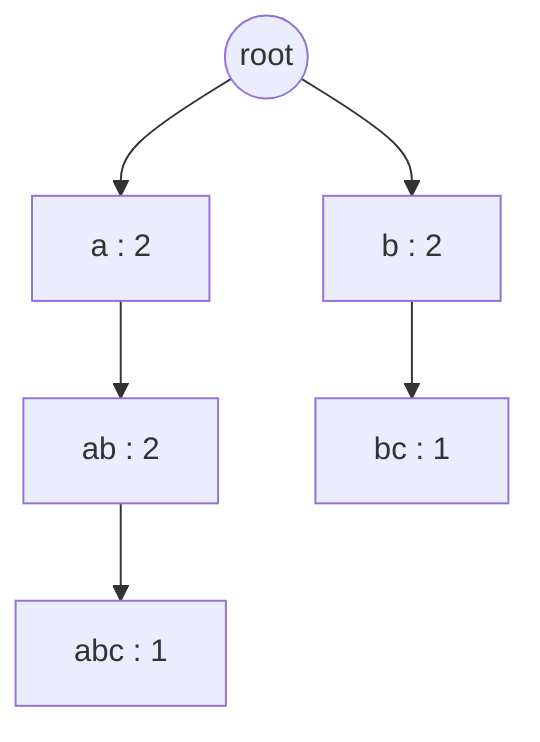

# Guided Example: Sum of Prefix Scores of Strings

The representative instance is `words = ["abc", "ab", "bc", "b"]`, whose required answer is `[5, 4, 3, 2]`. It is chosen because two different words share the prefix `"a"`, two different words share the prefix `"b"`, and one word is itself a prefix of another — so the instance exercises sharing, branching, and the "a word counts as a prefix of itself" rule all at once.

## 1. The Instance and the Quantity Being Summed

The score of a string `term` is the number of entries $\text{words}[i]$ for which `term` is a prefix. The required output for each word is the sum of the scores of all of its **non-empty** prefixes:

$$
\text{answer}[i] = \sum_{\substack{p \text{ prefix of } \text{words}[i] \\ p \neq \varepsilon}} \bigl\lvert \{\, j : p \text{ is a prefix of } \text{words}[j] \,\} \bigr\rvert .
$$

Because a string is considered a prefix of itself, the full word always contributes one occurrence per copy of itself in the input. Duplicates are therefore *separate entries*, not a single merged key — a detail the instance `["abc", "abc"]` makes decisive.

For the traced input, the four words contribute eight non-empty prefixes in total, and only five of them are distinct, because `"a"`, `"ab"`, and `"b"` are each shared:

| Prefix `p` | Words having `p` as a prefix | Score of `p` |
|:---|:---|:---:|
| `"a"` | `"abc"`, `"ab"` | 2 |
| `"ab"` | `"abc"`, `"ab"` | 2 |
| `"abc"` | `"abc"` | 1 |
| `"b"` | `"bc"`, `"b"` | 2 |
| `"bc"` | `"bc"` | 1 |

The table is the whole problem in miniature: `"b"` scores `2` because it is shared by `"bc"` and the one-letter word `"b"`, and `"ab"` and `"abc"` are counted independently even though one contains the other.

## 2. Sharing Structure: Why a Prefix Tree Is the Right Model

Processing each word in isolation would force a fresh scan of the whole input for every prefix. The essential observation is that prefixes form a *nested* family: if a string is a prefix of a word, so is every shorter prefix of that string. The prefixes of `"abc"` are the chain

$$
\varepsilon \;\subset\; \texttt{"a"} \;\subset\; \texttt{"ab"} \;\subset\; \texttt{"abc"},
$$

and the prefixes of `"ab"` are an initial segment of the same chain. A tree whose root is the empty prefix and whose every other node is one character extension records that nesting exactly: each node stands for one distinct non-empty prefix, and a word is the path from the root down its characters. Storing, at each node, the number of input words that pass *through* it is then enough, because a word passes through a node precisely when the node's string is one of its prefixes — so the score of a word becomes the sum of the counters along its root-to-node path.

## 3. Insertion Trace: Building the Counters

The tree is built by inserting the words one after another. Descending along a character creates the child node if it does not exist yet, and then increments that child's counter — the counter is incremented on *arrival* at the node, never at the root, because the empty prefix is excluded from every score.

| Insertion | Word | Characters descended | Nodes created | Counter updates |
|:---:|:---|:---|:---|:---|
| 1 | `"abc"` | `a`, `b`, `c` | the path `a` → `ab` → `abc` | `a` = 1, `ab` = 1, `abc` = 1 |
| 2 | `"ab"` | `a`, `b` | none — both nodes already exist | `a` = 2, `ab` = 2 |
| 3 | `"bc"` | `b`, `c` | a **new** `b` node under the root, then `bc` under it | `b`(root child) = 1, `bc` = 1 |
| 4 | `"b"` | `b` | none — the root child already exists | `b`(root child) = 2 |

The third row is the most instructive: the character `b` already appears in the tree, yet a *new* node is created, because the existing `b` node hangs under `a` and therefore represents the prefix `"ab"`, not the prefix `"b"`. A prefix tree shares prefixes, not single characters. The fourth row then shows the same node being reused by a different word, which is precisely how the score of `"b"` becomes `2`.

Every word contributes exactly one increment on each of its characters, so the build performs $\sum_i \lvert \text{words}[i] \rvert = 3 + 2 + 2 + 1 = 8$ counter increments for this instance.

## 4. The Tree After All Four Insertions

The five distinct non-empty prefixes correspond to five non-root nodes. Their counters are the scores computed in Section 1, which is not a coincidence:

| Node (prefix) | Parent node | Counter | Words that pass through | Interpretation |
|:---|:---|:---:|:---|:---|
| `"a"` | root | 2 | `"abc"`, `"ab"` | shared first letter of two words |
| `"ab"` | `"a"` | 2 | `"abc"`, `"ab"` | both survivors continue past `a` |
| `"abc"` | `"ab"` | 1 | `"abc"` | only one word reaches here |
| `"b"` | root | 2 | `"bc"`, `"b"` | second branch of the root |
| `"bc"` | `"b"` | 1 | `"bc"` | only one word reaches here |

The shape confirms the structure of the instance: the root has two children because two distinct first letters occur, and the depth of the left branch (three edges, reaching `"abc"`) exceeds the depth of the right branch (two edges).

## 5. Reading the Scores Out of the Tree

A query walks the word's characters from the root and accumulates the counters of the nodes it visits. The table follows the query for `"abc"` step by step.

| Query step | Character | Node reached | Counter at node | Running score |
|:---:|:---:|:---|:---:|:---:|
| 1 | `a` | `"a"` | 2 | 2 |
| 2 | `b` | `"ab"` | 2 | $2 + 2 = 4$ |
| 3 | `c` | `"abc"` | 1 | $4 + 1 = 5$ |

The walk ends at the node for the full word and returns `5`, the required value for `answer[0]`. Applying the same walk to the remaining three words gives the complete output:

| Word | Prefixes visited in order | Counters collected | Sum | Required `answer[i]` |
|:---|:---|:---|:---:|:---:|
| `"abc"` | `"a"`, `"ab"`, `"abc"` | 2, 2, 1 | 5 | 5 |
| `"ab"` | `"a"`, `"ab"` | 2, 2 | 4 | 4 |
| `"bc"` | `"b"`, `"bc"` | 2, 1 | 3 | 3 |
| `"b"` | `"b"` | 2 | 2 | 2 |

The score of a word depends only on the counters on *its own* path, so shorter words are cheaper to query: `"ab"` needs two steps and `"b"` one. The total query work is again eight character steps, matching the build.

## 6. Invariant and Correctness

Let $c(v)$ denote the counter stored at node $v$, and let $\pi(v)$ be the string that $v$ represents.

**Node invariant.** After all insertions, for every node $v$, $c(v)$ equals the number of indices $j$ such that $\pi(v)$ is a prefix of $\text{words}[j]$.

*Proof.* Inserting a single word $w$ descends through the nodes for the prefixes $w_1$, $w_1w_2$, …, $w$ and increments each exactly once, touching no other node, because every node it reaches represents a prefix of $w$. After this insertion every node on $w$'s path is incremented by one and every other node is unchanged. Summing over all insertions, $c(v)$ counts exactly the words whose path includes $v$ — that is, the words having $\pi(v)$ as a prefix. This makes the tree a faithful *count* structure rather than a membership structure: duplicate words are counted twice because the same path is walked twice. $\square$

**Query correctness.** A query for word $w$ visits exactly the nodes for the non-empty prefixes of $w$, in increasing length order, so its running total is $\sum c(v)$ over that set. Substituting the invariant, the total equals the sum of the occurrence counts of all non-empty prefixes of $w$, which is the definition of `answer` for the entry holding $w$; no prefix is omitted or double counted, because each corresponds to a distinct node on the path.

**Why sharing loses nothing.** Merging equal prefixes into one node is safe because a prefix's score depends only on the prefix string, not on which word reached it. When two words share a prefix they share the node, and its counter becomes the *sum* of their contributions rather than one overwriting the other — exactly the quantity both queries need.

## 7. Boundaries and Traps

The instance exposes several boundary behaviours that a naive implementation gets wrong. Each row below is checked against the contract's limits $1 \le \lvert \text{words} \rvert \le 1000$ and $1 \le \lvert \text{words}[i] \rvert \le 1000$.

| Boundary instance | Expected | Mechanism | Trap it exposes |
|:---|:---:|:---|:---|
| `["abcd"]` | `[4]` | one path of four nodes, every counter `1` | a single word scores its own length, not `1` |
| `["abc", "abc"]` | `[6, 6]` | the same path walked twice; counters reach `2` | duplicates are separate entries, so every shared prefix doubles |
| `["a", "a", "b"]` | `[2, 2, 1]` | `a` counter `2`; `b` counter `1` | a one-letter word has exactly one prefix |
| `["z", "x", "y"]` | `[1, 1, 1]` | three root children, each counter `1` | disjoint words share no node, so no score is inflated |
| `["a", "aa", "aaa"]` | `[3, 5, 6]` | counters `a` = 3, `aa` = 2, `aaa` = 1 | nested words: the longer the word, the more equal-score prefixes it accumulates |
| `["aaaa", "aaab"]` | `[7, 7]` | counters `a = aa = aaa = 2`, then `1` each | a shared prefix need not be followed by sharing |
| `["apple", "ape", "april"]` | `[9, 7, 9]` | `a = ap = 3`, then branch counters `1` | branching after a shared prefix splits the counts |
| one word of length `1000`, repeated `1000` times | `[10^{6}]` per entry | one chain of `1000` nodes, every counter `1000` | the maximum output value reaches $10^{6}$, so counts must not be truncated |

The deepest trap is the **node identity** trap of Section 3: a character appearing earlier in the tree does not license reuse of its node. Keys must be full prefixes, not single characters — a map keyed by character would merge `"ab"`'s second letter with the root-level `"b"`, giving `"b"` = 3 and wrong answers for both `"bc"` and `"b"`.

## 8. Alternative Formulations

| Alternative | Work performed | Cost | Trade-off against the prefix tree |
|:---|:---|:---|:---|
| For every prefix of every word, scan all words and count matches | each of the $S$ prefixes compared against all $n$ words | time $O(S \cdot n)$, and a prefix comparison can cost up to its length | directly mirrors the definition but multiplies the corpus by itself |
| Sort the words, then count completions of each prefix by binary search over the sorted range | each prefix mapped to an interval of the sorted array | time $O(S \log n)$ after an $O(S \log n)$ sort of the corpus | competitive, but requires materializing sorted copies and handling prefix-comparison bounds carefully |
| Count prefix multiplicities with a hash map from prefix string to count, then sum per word | every prefix materialized as a separate string key | time $O(S)$ hashing with $O(S)$ string storage | asymptotically fine, yet it stores every prefix as a full string instead of sharing characters, so its memory constant is much worse |
| Prefix tree with a counter per node, one insertion and one query per word | one node arrival or visit per character | time $O(S)$, auxiliary space $O(S)$ nodes | chosen: sharing is structural rather than simulated, and the query is a single root-to-node walk |

The hash-map alternative is the same algorithm with the sharing removed; the tree wins because the path taken by a query is exactly the path taken by an insertion, so no prefix is ever reconstructed or re-hashed.

## 9. Complexity Derivation

Define the total input size $S = \sum_{i=1}^{n} \lvert \text{words}[i] \rvert$, so $S = 8$ for the traced instance and $S \le 1000 \cdot 1000 = 10^{6}$ under the contract's limits.

**Build time.** Inserting a word of length $\ell$ descends $\ell$ edges and performs exactly $\ell$ counter increments. Each descent is $O(1)$: one lookup in the node's fixed 26-slot child table, a possible allocation of a fresh child, and one increment. Summed over all words this is $O(S)$.

**Query time.** A query for a word of length $\ell$ descends $\ell$ edges and accumulates one counter per edge, so $O(\ell)$; running it for every word is again $O(S)$.

**Total time.** $O(S)$, linear in the total number of input characters, which is optimal because any correct method must read every character at least once. The fixed alphabet hides only a constant factor.

**Auxiliary space.** Distinct prefixes number at most $S$ (one per character position), so the tree has $O(S)$ nodes, each with a fixed-size child table and one counter: $O(S)$ auxiliary memory. Construction needs no recursion stack, and the answer array is the required output rather than auxiliary state.
