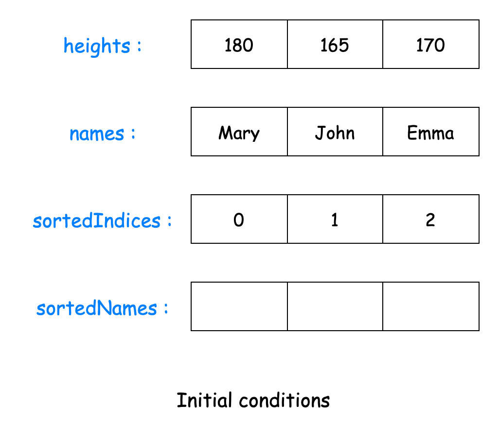
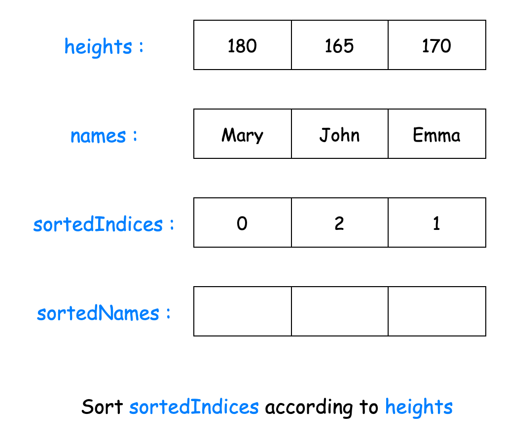
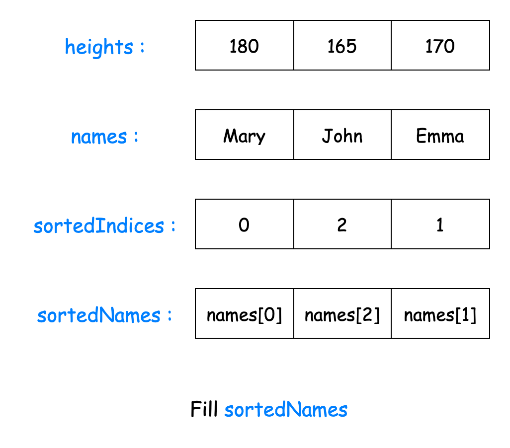
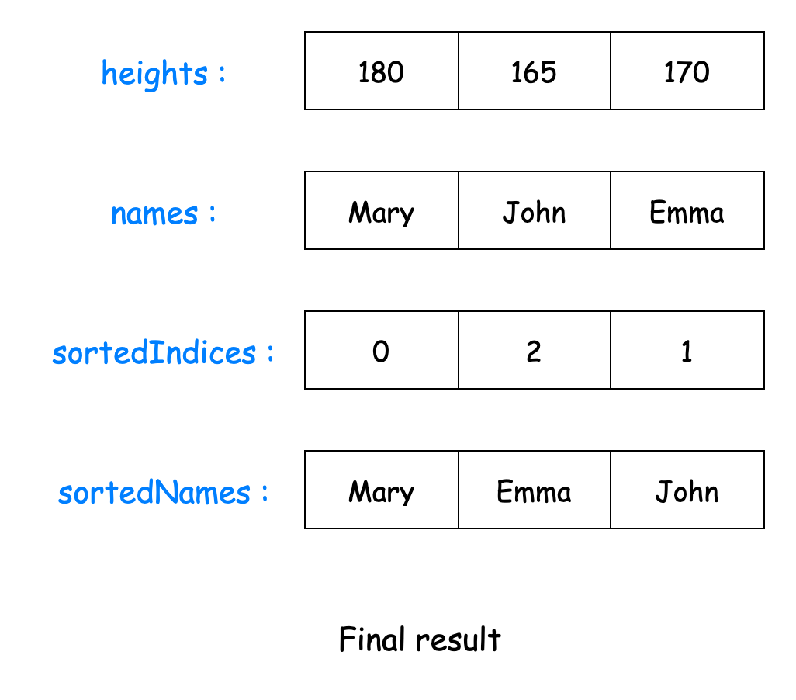

[TOC]

## Solution

---

### Approach 1: Map

#### Intuition

The main challenge in solving this problem arises from the fact that the names in the `names` array are not directly linked to the heights in the `heights` array, except through their common indices. Consequently, if we were to sort the `heights` array independently, we would lose the association between each height and its corresponding name.

A more effective approach is to create a direct binding between each height and its corresponding name. For this purpose, we can utilize a data structure that allows us to store key-value pairs, where the key is the height and the value is the corresponding name. Hash tables are particularly well-suited for this task, offering efficient storage of key-value pairs and also allowing for constant-time insertion and querying of elements. If you're interested in learning more about hash tables and their applications, you might find the LeetCode [Explore Card](https://leetcode.com/explore/learn/card/hash-table/) on this topic informative.

Let's create a hash table called `heightToNameMap` to associate each height with its corresponding name. Notice that, according to the problem constraints, all heights are distinct, so we don't need to worry about duplicate keys in our hash table.

With this mapping in place, we can now sort the heights array in decreasing order without losing any information. After sorting, we can construct our result by adding each name via `heightToNameMap` to a new array in the order dictated by the sorted heights array. This final array of names, now sorted by descending height, is our solution.

#### Algorithm

- Initialize `numberOfPeople` to the length of the `names` array, which is also the length of the `heights` array.
- Initialize a map `heightToNameMap` to map each height with a name.
- Add each height and their corresponding name to `heightToNameMap`.
- Sort the `heights` array.
- Initialize an array `sortedNames` to store the resultant sorted names.
- Loop over each index `i` in `sortedNames` from the end. For index $numberOfPeople - i - 1$, add the name associated with $\text{heights}[i]$ from `heightToNameMap`.

#### Implementation

```python
class Solution:
    def sortPeople(self, names: List[str], heights: List[int]) -> List[str]:
        number_of_people = len(names)

        # Create a dictionary to store height-name pairs
        height_to_name_map = dict(zip(heights, names))

        sorted_heights = sorted(heights, reverse=True)

        # Create a list of sorted names based on descending heights
        sorted_names = [height_to_name_map[height] for height in sorted_heights]

        return sorted_names
```

#### Complexity Analysis

Let $n$ be the length of the `names` array.

- Time complexity: $O(n \cdot \log n)$.

    The algorithm loops over all the names twice, once to populate the map and once to create the final list, both of which take linear time.

    Sorting the `heights` array requires $O(n \cdot \log n)$ time.

    Thus, the total time complexity of the algorithm is $2 \cdot$\mathcal{O}(n)$+ O(n \cdot \log n)$, which is equivalent to $O(n \cdot \log n)$.

- Space complexity: $O(n)$

    The map `heightToNameMap` takes an additional $O(n)$ space to store the height-name pairs.

    The space taken by the sorting algorithms vary depending on the language of implementation:

- Java's `Arrays.sort()` function implements a variation of the Quick Sort algorithm, which takes an additional $O(\log n)$ space.
- Python3's `sorted()` function uses the Timsort algorithm, which is a hybrid sorting algorithm derived from merge sort and insertion sort. This takes $O(n)$ space.
- In C++, the `sort()` function implements a combination of Quick Sort, Heap Sort, and Insertion Sort. Its worst-case space complexity is $O(\log n)$.

    Upon aggregation, the algorithm has a space complexity of $O(n)$.

---

### Approach 2: Sorted Map

#### Intuition

We established that the two steps to solving this problem are:
1. Establishing a mapping between the heights and the names.
2. Sorting the heights.

Is there a way to achieve this simultaneously? Enter sorted maps—a data structure similar to hash maps but with the added benefit of maintaining its entries in sorted order (ascending by default).

We use the `heights` as keys and the `names` as the values in the map. The map inherently arranges the keys in order based on `heights`. Finally, we can traverse the entries in the map and fill our resultant array from the back, obtaining the required `names` in descending order of `heights`.

#### Algorithm

- Initialize a variable `numberOfPeople` to the length of the `names` array.
- Create a sorted map `heightToNameMap` to store height-name pairs.
- Fill `heightToNameMap` with the height as the key and the name as the value for each entry.
- Initialize an array `sortedNames`.
- Initialize `currentIndex` to $numberOfPeople - 1$, since we intend to fill `sortedNames` from the back to ensure the names are in descending order of height.
- Iterate over the keys of `heightToNameMap`. For each key `height`:
  - Add the name corresponding to `height` to $\text{sortedNames}[currentIndex]$.
  - Decrement `currentIndex` to move to the next position from the end towards the start.
- Return `sortedNames` as our result.

#### Implementation

```python
class Solution:
    def sortPeople(self, names: List[str], heights: List[int]) -> List[str]:
        number_of_people = len(names)

        height_to_name_map = OrderedDict()

        # Populate the OrderedDict with height as key and name as value
        for height, name in zip(heights, names):
            height_to_name_map[height] = name

        # Sort the OrderedDict by height in descending order
        height_to_name_map = OrderedDict(
            sorted(height_to_name_map.items(), reverse=True)
        )

        # Create a list of sorted names based on descending heights
        sorted_names = list(height_to_name_map.values())

        return sorted_names

```

#### Complexity Analysis

Let $n$ be the length of the `names` array.

* Time complexity: $O(n \cdot \log n)$

    The algorithm iterates over the length of $n$ to insert each height-name pair in the sorted map. Each insertion in the sorted map requires $O(\log n)$ time. Thus, the total complexity of this step is $O(n \cdot \log n)$.

    To fill the `sortedNames` array, we iterate over all $n$ entries in the map. Each `get()` operation takes another $O(\log n)$ time, making the time complexity of this step $O(n \cdot \log n)$.

    Thus, the total time complexity of the algorithm is $2 \cdot O(n \cdot \log n)$ or $O(n \cdot \log n)$.

* Space complexity: $O(n)$

    The only additional space used by the algorithm is a sorted map to store the height-name pairs, which takes $O(n)$ space.

---

### Approach 3: Sort Permutation

#### Intuition

In an effort to maintain the relationship between the `heights` array and the `names` array, we have duplicated its contents in data structures that suit our needs. However, hash tables and custom objects consume significant space, making our approaches memory inefficient.

Upon closer inspection, the key link between each height and its corresponding name is their index in the arrays. If we can determine the sequence of these indices after sorting the `heights` array, we can rearrange the `names` array accordingly to achieve our goal.

To achieve this, we create a list `sortedIndices` initialized with values from `0` to the length of the array, representing the initial order. The clever part involves sorting `sortedIndices` based on the values of `heights` using a custom comparator. For example, comparing indices `4` and `6` in `sortedIndices` sorts them according to the values in $\text{heights}[4]$ and $\text{heights}[6]$.

Finally, we rearrange the `names` array according to the order of indices in `sortedIndices` to obtain the names in descending order of heights.

Check out this slideshow to visualize the entire algorithm:









#### Algorithm

- Initialize:
  - a variable `numberOfPeople` to the length of the `names` array.
  - A list `sortedIndices` to store the indices of the `heights` array.
- Fill `sortedIndices` with values from `0` to $numberOfPeople - 1$. Each index corresponds to a person in the `names` and `heights` arrays.
- Using a custom comparator, sort `sortedIndices` based on the values in the `heights` array in descending order.
- Initialize an array `sortedNames` to store the names in their sorted order.
- Iterate from `0` to $numberOfPeople - 1$. For each index `i`:
  - Set $\text{sortedNames}[i]$ to $names[\text{sortedIndices}[i]]$ to assign the corresponding name from the `names` array to the appropriate position in `sortedNames`.
- Return `sortedNames`.

#### Implementation

```python
class Solution:
    def sortPeople(self, names: List[str], heights: List[int]) -> List[str]:
        number_of_people = len(names)

        # Create a list of indices and sort them based on heights in descending order
        sorted_indices = sorted(
            range(number_of_people), key=lambda i: heights[i], reverse=True
        )

        # Apply the sorted indices to rearrange names
        sorted_names = [names[i] for i in sorted_indices]

        return sorted_names
```

#### Complexity Analysis

Let $n$ be the length of the `names` array.

* Time complexity: $O(n \cdot \log n)$

    The algorithm traverses over $n$ elements twice, once to populate the `sortedIndices` and then to fill the `sortedNames` array, both of which take linear time.

    Sorting the `sortedIndices` array takes $O(n \cdot \log n)$ time.

    Thus, the total time complexity is $2.$\mathcal{O}(n)$+ O(n \cdot \log n)$, which simplifies to $O(n \cdot \log n)$.

* Space complexity: $O(n)$

    The `sortedIndices` array takes $O(n)$ additional space.

    As mentioned in the previous approaches, sorting the array requires some additional space dependent on the language of implementation. For Python3, this is $O(n)$, while for C++ and Java, it is $O(\log n)$.

    The overall space complexity is the summation of these two elements: $O(n)$.

---

### Approach 4: Quick Sort

#### Intuition

So far, we've leveraged the built-in sorting capabilities of programming languages to sort elements. However, this approach required us to allocate extra space to maintain the relationship between the `heights` and `names` arrays.

To further optimize our approach, we need to implement the sorting algorithm ourselves and sort the two arrays simultaneously. Let's start with the [Quick Sort](https://en.wikipedia.org/wiki/Quicksort) algorithm.

Quick Sort is a divide-and-conquer algorithm that works by selecting a 'pivot' element from the array and partitioning the other elements into two sub-arrays based on whether they are less than or greater than the pivot. The sub-arrays are then sorted recursively. The major steps in the algorithm are:

1. **Pivot Selection**: Choose an element as the pivot. In our implementation, we'll use the last element of the sub-array as the pivot, though other strategies (like choosing a random element or the median) can also be used. The pivot serves as the reference point for partitioning the array, dividing it into two sub-arrays: one with elements smaller than the pivot and another with elements larger than the pivot.
2. **Partitioning**: Rearrange the sub-array so that all elements greater than or equal to the pivot are on its left, and all smaller elements are on its right (since we are sorting the array in descending order). Ensure that all changes made to the `heights` array are also applied to the `names` array simultaneously.
3. **Recursion**: Recursively apply steps 1 and 2 to the sub-array of elements with smaller values and separately to the sub-array of elements with greater values.
- **Base Case**: The base case for the recursion is when a sub-array has one or zero elements, as these are already sorted.

By sorting the `heights` array and simultaneously applying the same changes to the `names` array, both arrays are sorted together. Once `heights` is sorted, we can return `names` as our answer.

#### Algorithm

Main method `sortPeople`:

- Call `quickSort` passing `names`, `heights` and their full range.
- Return the sorted `names` array.

Helper method `quickSort`:

- Define `quickSort` with parameters: `heights`, `names`, `start` and `end`.
- Check if the sub-array has has more than one element (`start` < `end`). If so:
  - Find `partitionIndex` by calling the `partition` method.
  - Recursively call `quickSort` on the left sub-array (elements before the partition index).
  - Recursively call `quickSort` on the right sub-array (elements after the partition index).

Helper method `partition`:

- Define `partition` with parameters: `heights`, `names`, `start` and `end`.
- Set `pivot` as the last element.
- Initialize `i` as one less than the `start` index.
- Iterate `j` from `start` to `end-1`:
  - If the current element $\text{heights}[j]$ is greater than or equal to the pivot:
- Increment `i`.
- Swap elements at `i` and `j` in both arrays using the `swap` method.
- Place the pivot in its correct position by swapping it with the element at `i+1`.
- Return the partition index (`i+1`).

Helper method `swap`:

- Define `swap` with parameters: `heights`, `names`, `index1` and `index2`.
- Assign `tempHeight` the value of $\text{heights}[index1]$.
- Set $\text{heights}[index1]$ to $\text{heights}[index2]$.
- Set $\text{heights}[index2]$ to `tempHeight`.
- Repeat the above steps for the `names` array.

#### Implementation

```python
class Solution:
    def sortPeople(self, names: List[str], heights: List[int]) -> List[str]:
        self._quick_sort(heights, names, 0, len(heights) - 1)
        return names

    def _swap(
        self, heights: List[int], names: List[str], index1: int, index2: int
    ):
        # Swap heights
        heights[index1], heights[index2] = heights[index2], heights[index1]

        # Swap corresponding names
        names[index1], names[index2] = names[index2], names[index1]

    def _partition(
        self, heights: List[int], names: List[str], start: int, end: int
    ) -> int:
        pivot = heights[end]
        i = start - 1

        for j in range(start, end):
            # If current element is greater than or equal to pivot
            if heights[j] >= pivot:
                i += 1
                self._swap(heights, names, i, j)

        # Place the pivot in its correct position
        self._swap(heights, names, i + 1, end)
        return i + 1

    def _quick_sort(
        self, heights: List[int], names: List[str], start: int, end: int
    ):
        if start < end:
            # Find the partition index
            partition_index = self._partition(heights, names, start, end)

            # Recursively sort the left and right sub-arrays
            self._quick_sort(heights, names, start, partition_index - 1)
            self._quick_sort(heights, names, partition_index + 1, end)
```

#### Complexity Analysis

Let $n$ be the length of the `names` array.

* Time complexity: $O(n^2)$

    Quick Sort has an average or best-case time complexity of $O(n \cdot \log n)$. However, in the worst case (when the pivot is always the smallest or largest element), Quick Sort can degrade to $O(n^2)$.

* Space complexity: $O(n)$

    The space complexity is determined by the recursion stack of algorithm. In the average and best cases, the recursion depth is $\log n$, resulting in $O(\log n)$ space complexity. However, in the worst case (unbalanced partitions), it could go up to $n$, resulting in $O(n)$ space complexity.

---

### Approach 5: Merge Sort

#### Intuition

Another efficient and popular sorting algorithm is [Merge Sort](https://en.wikipedia.org/wiki/Merge_sort), which has a better worst-case time complexity of $O(n \cdot \log n)$ compared to Quick Sort's $O(n^2)$. Let's implement Merge Sort to sort `heights` and `names` simultaneously.

Merge Sort is a divide-and-conquer algorithm that recursively divides the input array into smaller sub-arrays, sorts them, and then merges these sorted sub-arrays to produce the final sorted array

1. **Divide**: Recursively divide the input array into two halves until sub-arrays of size one or zero are reached. These base cases are naturally sorted.
2. **Merge**: Start merging the smallest sub-arrays, progressing upwards. First, merge adjacent single-element arrays into sorted pairs, then merge pairs into four-element arrays, and so on. Use a temporary array to hold the merged result, comparing and placing elements from each sub-array until one is exhausted. Append remaining elements from the other sub-array to the temporary array. Copy the sorted elements back to the original array. Continue this process recursively until the entire array is sorted.

Throughout the merge process, all changes to the `heights` array must also be applied to the `names` array. Once sorting is complete, the `names` array will be in the required order.

#### Algorithm

Main method `sortPeople`:

- Call `mergeSort` passing `names`, `heights` and their full range.
- Return the sorted `names` array.

Helper method `mergeSort`:

- Define `mergeSort` with parameters: `names`, `heights`, `start` and `end`.
- Set `mid` to the mid point between `start` and `end`.
- Recursively call `mergeSort` on the left and right half of the sub-array.
- Call `merge` to combine the sorted halves.

Helper method `merge`:

- Define `merge` with parameters: `names`, `heights`, `start`, `mid` and `end`.
- Initialize:
  - `leftSize` as the length of the left sub-array.
  - `rightSize` as the length of the right sub-array.
  - `leftHeights`, `rightHeights`, `leftNames` and `rightNames` as temporary arrays for heights and names of both sub-arrays.
- Copy data from the original arrays to the temporary arrays.
- Initialize variables `leftIndex` and `rightIndex` to `0` to point to the start of the temporary arrays.
- Set `mergeIndex` to `start` to point to the start of the sub-array in the original array.
- While the `leftIndex` and `rightIndex` is lesser than their respective temporary arrays:
  - Compare elements from left and right sub-arrays:
- Place the larger height (and corresponding name) into the merged array.
- Increment the pointer of the sub-array from which the element was taken.
  - Increment `mergeIndex`.
- Copy remaining elements from the left sub-array, if any.
- Copy remaining elements from the right sub-array, if any.

#### Implementation

```python
class Solution:
    def sortPeople(self, names: List[str], heights: List[int]) -> List[str]:
        self._merge_sort(names, heights, 0, len(heights) - 1)
        return names

    def _merge_sort(
        self, names: List[str], heights: List[int], start: int, end: int
    ):
        if start < end:
            mid = start + (end - start) // 2
            self._merge_sort(names, heights, start, mid)
            self._merge_sort(names, heights, mid + 1, end)
            self._merge(names, heights, start, mid, end)

    def _merge(
        self,
        names: List[str],
        heights: List[int],
        start: int,
        mid: int,
        end: int,
    ):
        left_size = mid - start + 1
        right_size = end - mid

        # Create temporary lists
        left_heights = heights[start : start + left_size]
        right_heights = heights[mid + 1 : mid + 1 + right_size]
        left_names = names[start : start + left_size]
        right_names = names[mid + 1 : mid + 1 + right_size]

        # Merge the temporary lists
        left_index, right_index = 0, 0
        merge_index = start
        while left_index < left_size and right_index < right_size:
            if (
                left_heights[left_index] >= right_heights[right_index]
            ):  # Descending order
                heights[merge_index] = left_heights[left_index]
                names[merge_index] = left_names[left_index]
                left_index += 1
            else:
                heights[merge_index] = right_heights[right_index]
                names[merge_index] = right_names[right_index]
                right_index += 1
            merge_index += 1

        # Copy remaining elements of left_heights, if any
        while left_index < left_size:
            heights[merge_index] = left_heights[left_index]
            names[merge_index] = left_names[left_index]
            left_index += 1
            merge_index += 1

        # Copy remaining elements of right_heights, if any
        while right_index < right_size:
            heights[merge_index] = right_heights[right_index]
            names[merge_index] = right_names[right_index]
            right_index += 1
            merge_index += 1
```

#### Complexity Analysis

Let $n$ be the length of the `names` array.

* Time complexity: $O(n \cdot \log n)$

    The algorithm divides the array into two halves recursively and then merges them.

    The dividing process takes $O(\log n)$ time. At each level of recursion, the merge operation takes $O(n)$ time as it processes all elements once. This process happens at each level of the recursion tree, which has a depth of $\log n$.

    Thus, the time complexity of the algorithm is $O(n \cdot \log n)$.

* Space complexity: $O(n)$

    The recursion stack can extend up to $\log n$ levels. Additionally, the temporary arrays created at each merge step occupy an extra $O(n)$ space. Thus, the total space complexity of the algorithm sums up to $O(\log n) +$\mathcal{O}(n)$= O(n)$.

---