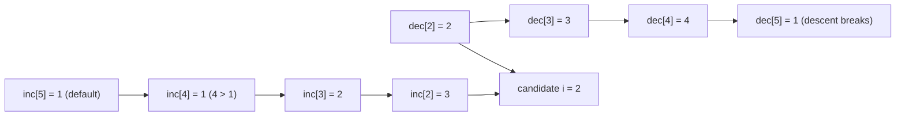

# Guided Example: Find All Good Indices

## 1. The instance and the decision it forces

Take

- `nums = [2, 1, 1, 1, 3, 4, 1]`, so $n = 7$;
- $k = 2$.

An index $i$ is *good* when the $k$ values immediately to its left are
non-increasing, the $k$ values immediately to its right are non-decreasing, and
there are genuinely $k$ values on each side. The legal candidate set is the
half-open interval $k \le i < n-k$, which here is $2 \le i \le 4$.

The required output for this instance is `[2, 3]`, and the interesting work is
explaining why index 4 fails while 2 and 3 pass. Index 4 has perfectly good
material on its left; the failure comes entirely from its right-hand block.

| Position | 0 | 1 | 2 | 3 | 4 | 5 | 6 |
|---|---|---|---|---|---|---|---|
| `nums[position]` | 2 | 1 | 1 | 1 | 3 | 4 | 1 |
| Legal center? | no | no | yes | yes | yes | no | no |

The center element itself is never inspected. For $k = 2$ and $i = 2$, the
decision reads `nums[0], nums[1]` on the left and `nums[3], nums[4]` on the
right; `nums[2]` is simply skipped. That skip is the single most-misread part of
the definition.

## 2. Reading the definition as two one-sided run conditions

A block being non-increasing means every adjacent pair inside it satisfies
`nums[j] >= nums[j + 1]`. Requiring the $k$ values before $i$ to be non-increasing
is therefore the same statement as: the value sequence
`nums[i-k], ..., nums[i-1]` is the tail of a non-increasing run, and that run has
length at least $k$.

That reformulation is what makes the problem cheap. Let

- $\mathrm{dec}[i]$ be the length of the longest non-increasing run whose final
  element is `nums[i - 1]`;
- $\mathrm{inc}[i]$ be the length of the longest non-decreasing run whose first
  element is `nums[i + 1]`.

Both are shifted by one position relative to $i$, precisely because the center is
excluded. A long run certifies every shorter window sitting at its end or its
start, so one number replaces $k - 1$ pairwise comparisons. The whole candidate
test collapses to two inequalities:

$$
\mathrm{dec}[i] \ge k \quad \text{and} \quad \mathrm{inc}[i] \ge k .
$$

Equality between neighbours counts as satisfying both directions. "Non-
increasing" forbids only an increase, and "non-decreasing" forbids only a
decrease, so a pair of equal values may extend a run of either kind.

## 3. Building the left run-length table

Scan positions left to right. For $i \ge 2$, extending is legal exactly when
`nums[i - 1] <= nums[i - 2]`, in which case the run ending just before $i$ is one
element longer than the run ending just before $i - 1$; otherwise a fresh run of
length 1 begins at `nums[i - 1]`.

| $i$ | Pair examined | Relation holds? | $\mathrm{dec}[i]$ | Run ending at `nums[i-1]` |
|---|---|---|---|---|
| 1 | none (start) | base case | 1 | `[2]` |
| 2 | `nums[1], nums[0]` = `1, 2` | yes, $1 \le 2$ | 2 | `[2, 1]` |
| 3 | `nums[2], nums[1]` = `1, 1` | yes, $1 \le 1$ | 3 | `[2, 1, 1]` |
| 4 | `nums[3], nums[2]` = `1, 1` | yes, $1 \le 1$ | 4 | `[2, 1, 1, 1]` |
| 5 | `nums[4], nums[3]` = `3, 1` | no, $3 > 1$ | 1 | `[3]` |
| 6 | not reached by the scan | default | 1 | `[4]` |

Position 6 keeps its initial value 1, and that default is not a fudge: the run
ending at `nums[5]` really is the single element `[4]`, because `4 > 1` breaks the
descent. The recurrence stops at $i = n - 2$ because a center needs at least one
element after it, so no legal candidate ever consults $\mathrm{dec}[i]$ for
$i > n - 2$.

## 4. Building the right run-length table

This direction must be built backwards. The run starting at `nums[i + 1]` depends
on the run starting at `nums[i + 2]`, so a right-to-left sweep supplies every
dependency before it is read. Extending is legal exactly when
`nums[i + 1] <= nums[i + 2]`.

| $i$ | Pair examined | Relation holds? | $\mathrm{inc}[i]$ | Run starting at `nums[i+1]` |
|---|---|---|---|---|
| 6 | none (past the end) | default | 1 | — |
| 5 | `nums[6], nums[7]` out of range | default | 1 | `[1]` |
| 4 | `nums[5], nums[6]` = `4, 1` | no, $4 > 1$ | 1 | `[4]` |
| 3 | `nums[4], nums[5]` = `3, 4` | yes, $3 \le 4$ | 2 | `[3, 4]` |
| 2 | `nums[3], nums[4]` = `1, 3` | yes, $1 \le 3$ | 3 | `[1, 3, 4]` |
| 1 | `nums[2], nums[3]` = `1, 1` | yes, $1 \le 1$ | 4 | `[1, 1, 3, 4]` |
| 0 | `nums[1], nums[2]` = `1, 1` | yes, $1 \le 1$ | 5 | `[1, 1, 1, 3, 4]` |

$\mathrm{inc}[4] = 1$ is the decisive entry for this instance. It says the
non-decreasing run beginning at `nums[5]` stops immediately, because the
comparison `4 <= 1` fails. Every longer window starting at `nums[5]` — including
the two-element window `nums[5], nums[6]` that index 4 needs — inherits that
failure.

## 5. The trace: judging each legal center

Now combine the two tables over the candidate range $2 \le i \le 4$.

| $i$ | Left block required | $\mathrm{dec}[i] \ge 2$ | Right block required | $\mathrm{inc}[i] \ge 2$ | Verdict |
|---|---|---|---|---|---|
| 2 | `nums[0..1]` = `[2, 1]` | $2 \ge 2$, non-increasing | `nums[3..4]` = `[1, 3]` | $3 \ge 2$, non-decreasing | good |
| 3 | `nums[1..2]` = `[1, 1]` | $3 \ge 2$, non-increasing | `nums[4..5]` = `[3, 4]` | $2 \ge 2$, non-decreasing | good |
| 4 | `nums[2..3]` = `[1, 1]` | $4 \ge 2$, non-increasing | `nums[5..6]` = `[4, 1]` | $1 < 2$, breaks the sweep | rejected |

Scanning $i$ in increasing order emits `[2, 3]`, already in the required
increasing order, so no sorting step is needed. Note how index 4 is rejected on a
single comparison that is nowhere near the center: the shape of the array three
positions away decides the outcome.

The dependency structure of the two sweeps is worth seeing once, because it
explains why one pass in each direction is enough.

## 6. Why the reasoning is correct

The correctness argument is a two-way equivalence for each side, not a heuristic.

*Sufficiency.* If $\mathrm{dec}[i] \ge k$, then the run ending at `nums[i - 1]`
contains at least $k$ elements whose consecutive pairs all satisfy
`nums[j] >= nums[j + 1]`. The last $k$ of those elements are exactly
`nums[i-k], ..., nums[i-1]`, so the required left block is non-increasing.
Symmetrically, $\mathrm{inc}[i] \ge k$ makes `nums[i+1], ..., nums[i+k]`
non-decreasing.

*Necessity.* If `nums[i-k], ..., nums[i-1]` is non-increasing, then that block is
itself a non-increasing run ending at `nums[i - 1]`, so the longest such run ends
no earlier and $\mathrm{dec}[i] \ge k$. The same holds on the right.

*Invariant of the recurrences.* After the forward sweep has processed index $i$,
the entry $\mathrm{dec}[i]$ equals the length of the maximal non-increasing run
ending at `nums[i - 1]` for every $i$ processed so far; the backward sweep
maintains the mirrored claim for $\mathrm{inc}$. Both invariants hold at the base
(default value 1 describes a single-element run) and are preserved by the
extension test, so no candidate can be misjudged once both tables are complete.

Combining the two equivalences, the joint test
$\mathrm{dec}[i] \ge k$ together with $\mathrm{inc}[i] \ge k$ holds if and only
if both halves of the definition hold, and the candidate range supplies the
remaining requirement that $k$ elements exist on each side. Any index outside
$[k, n-k)$ has fewer than $k$ values on one side and is correctly never examined.

## 7. Boundary conditions this problem family exposes

| Situation | Example | Behaviour |
|---|---|---|
| $n = 2k$ exactly | `nums = [2, 1, 1, 2]`, $k = 2$ | The legal range $k \le i < n-k$ is empty, so the answer is `[]` even though interior positions exist. |
| $k = 1$ | `nums = [1, 2, 3, 4, 5]`, $k = 1$ | Every single-element block is trivially both non-increasing and non-decreasing, so all of $1 \dots n-2$ are good. |
| Equal neighbours | `nums = [7, 7, 7, 7, 7, 7, 7]` | Equality extends both kinds of run, so centres 2, 3 and 4 pass. Using a strict comparison would wrongly reject them. |
| Center is extreme | `nums = [3, 2, 100, 1, 2]`, $k = 2$ | The value 100 is never read for $i = 2$; the left block `[3, 2]` and right block `[1, 2]` decide, and 2 is good. |
| Descending everywhere | `nums = [5, 4, 3, 2, 1]`, $k = 2$ | The left side always passes, but no right block is non-decreasing, so the result is `[]`. |
| Extreme magnitudes | `nums = [1000000, 1, 500000, 1, 1000000]`, $k = 2$ | Only relational comparisons are used, so no arithmetic overflow or magnitude assumption exists. |

## 8. Alternatives and their trade-offs

| Method | Time | Auxiliary space | Why it is not the chosen shape here |
|---|---|---|---|
| Recheck both windows for every candidate | $O(nk)$ | $O(1)$ | Straightforward, but neighbouring centres re-compare nearly identical pairs; $k$ can approach $n/2$. |
| Prefix counts of "violating" adjacent pairs | $O(n)$ | $O(n)$ | Correct, but the prefix-sum framing answers "how many breaks in this window" instead of naming the run length, which obscures the non-increasing/non-decreasing distinction. |
| One table plus a streaming counter | $O(n)$ | $O(n)$ | Saves one array but forces careful synchronization of a right-hand window around a skipped centre, which is easy to get off by one. |
| Both directional run tables | $O(n)$ | $O(n)$ | Chosen. Each adjacent relation is examined once per direction, and the candidate test is two integer comparisons. |

## 9. Cost of the method: complexity derivation

Let $n = \lvert\texttt{nums}\rvert$ and $k$ be the block size.

*Time.* The forward sweep performs at most one comparison and one assignment per
index, and the backward sweep does the same, for $O(n)$ work. The final selection
range inspects at most $n$ candidates and performs two comparisons each, again
$O(n)$. Every step is constant time, so

$$
T(n) = O(n) + O(n) + O(n) = O(n).
$$

The running time does not depend on $k$: the factor $k$ that appears in the naive
$O(nk)$ version has been absorbed into the run lengths. With $n \le 10^5$ this is
comfortably within limits.

*Auxiliary space.* Two integer tables of $n + 1$ entries are stored —
$\mathrm{dec}$ and $\mathrm{inc}$ — so auxiliary memory is $O(n)$. The two
pointers and the accumulator inside each sweep are constant. The returned list
holds at most $n - 2k$ indices and is excluded from the auxiliary bound in the
usual way, but even counted it stays $O(n)$. No table entry is ever revisited
after the sweep that wrote it, so the storage is genuinely required rather than
bookkeeping for a second pass.
