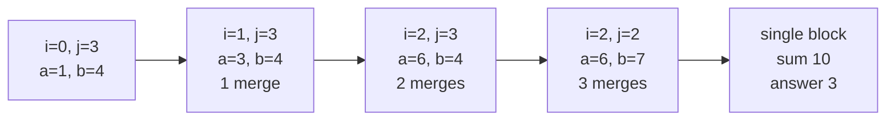

# Guided Example: Merge Operations to Turn Array Into a Palindrome

## 1. The instance and the freedom the operation leaves

We trace

`nums = [4, 3, 2, 1, 2, 3, 1]`

whose minimum number of merges is `2`, and we compare it with the second
official instance `nums = [1, 2, 3, 4]`, whose answer is `3`.

The single allowed move replaces two **adjacent** elements by their sum. So the
array shrinks by one element per operation, and the operation is always local:
it can only erase a boundary between neighbours that still exist. Nothing else
about the array changes, and no element can be reordered.

The instance is chosen because the useful work happens on **both** ends. The
right end absorbs two different values at two different moments, and the left end
absorbs nothing at all — which is exactly the asymmetry that a naive
"always merge the smallest neighbour" or "always merge on the left" rule gets
wrong.

## 2. Merges are contiguous blocks, and merges count blocks lost

After any sequence of operations, each surviving element is the sum of one
contiguous range of the original array, and those ranges partition
`nums` in index order. Merging two neighbours concatenates their ranges, so a
final element covering $m$ original values has absorbed exactly $m - 1$
boundaries.

Let the final array have $B$ elements, covering ranges of sizes
$m_1, \dots, m_B$ with $\sum m_b = n$. Every merge removes exactly one element and
one boundary, so

$$
\text{operations} = \sum_{b=1}^{B} (m_b - 1) = n - B .
$$

This identity is the heart of the problem: **minimising merges is exactly
maximising the number of surviving blocks.** Turning the array into a palindrome
means choosing a partition of `nums` into contiguous blocks whose sums read the
same forwards and backwards; if the block sums are
$s_1, s_2, \dots, s_B$, we need

$$
s_b = s_{B+1-b} \quad \text{for every } b .
$$

The elements inside a block are never inspected individually again. Only block
sums matter.

## 3. The two boundary sums and the greedy rule

Maintain two pointers and two running block sums:

- $i$ is the first index not yet committed to the left block;
- $j$ is the last index not yet committed to the right block;
- $a$ is the current sum of the left block, which always covers the prefix
  `nums[0..i]`;
- $b$ is the current sum of the right block, covering the suffix `nums[j..n-1]`;
- `ans` counts merges performed.

Initially $i = 0$, $j = n - 1$, and the outer blocks are the single extremes
`nums[0]` and `nums[n-1]`. At each iteration exactly one of three things happens.

| Comparison | Meaning | Action | Cost |
|---|---|---|---|
| $a < b$ | The left outer block is too light to mirror the right one | Absorb `nums[i + 1]` into the left block, so $i \leftarrow i + 1$ and $a \leftarrow a + \texttt{nums}[i]$ | 1 merge |
| $a > b$ | The right outer block is too light | Absorb `nums[j - 1]` into the right block, so $j \leftarrow j - 1$ and $b \leftarrow b + \texttt{nums}[j]$ | 1 merge |
| $a = b$ | The two outer blocks already mirror each other | Commit this pair, then start fresh blocks: $i \leftarrow i + 1$, $j \leftarrow j - 1$ | 0 merges |

The loop ends when $i \ge j$: at that moment every original position has been
assigned to some committed block, and the single remaining block in the middle
(if any) needs no partner.

## 4. Worked trace of the seven-element instance

The table follows the algorithm exactly: the "after" columns are the state at the
start of the next iteration.

| Step | $i$ | $j$ | $a$ | $b$ | Comparison | Action | `ans` |
|---|---|---|---|---|---|---|---|
| 0 | 0 | 6 | 4 | 1 | $4 > 1$ | Right absorbs `nums[5] = 3`; $j = 5$, $b = 1 + 3 = 4$ | 1 |
| 1 | 0 | 5 | 4 | 4 | $4 = 4$ | Pair `[4]` and `[3, 1]` committed; $i = 1$, $j = 4$, $a = 3$, $b = 2$ | 1 |
| 2 | 1 | 4 | 3 | 2 | $3 > 2$ | Right absorbs `nums[3] = 1`; $j = 3$, $b = 2 + 1 = 3$ | 2 |
| 3 | 1 | 3 | 3 | 3 | $3 = 3$ | Pair `[3]` and `[2, 1]` committed; $i = 2$, $j = 2$, $a = b = 2$ | 2 |
| 4 | 2 | 2 | 2 | 2 | $i \ge j$ | Loop stops; the middle block `[2]` stands alone | 2 |

Reading the committed blocks in order recovers the final array:

| Final block | Original indices | Block sum | Merges inside the block |
|---|---|---|---|
| 1 | 0 | 4 | 0 |
| 2 | 1 | 3 | 0 |
| 3 | 2 | 2 | 0 |
| 4 | 3, 4 | $2 + 1 = 3$ | 1 |
| 5 | 5, 6 | $3 + 1 = 4$ | 1 |

The block sums are `4, 3, 2, 3, 4`, a palindrome, and
$n - B = 7 - 5 = 2$ confirms the operation count via the identity of section 2.
Note that the left pointer never absorbed anything: steps 0 and 2 both resolved
on the right, and both committed pairs happened to close immediately afterwards.

## 5. A trace where no pair is ever matched

`nums = [1, 2, 3, 4]` forces the other extreme: the two ends never agree until the
array has collapsed completely.

| Step | $i$ | $j$ | $a$ | $b$ | Comparison | Action | `ans` |
|---|---|---|---|---|---|---|---|
| 0 | 0 | 3 | 1 | 4 | $1 < 4$ | Left absorbs `nums[1] = 2`; $i = 1$, $a = 3$ | 1 |
| 1 | 1 | 3 | 3 | 4 | $3 < 4$ | Left absorbs `nums[2] = 3`; $i = 2$, $a = 6$ | 2 |
| 2 | 2 | 3 | 6 | 4 | $6 > 4$ | Right absorbs `nums[2] = 3`; $j = 2$, $b = 7$ | 3 |
| 3 | 2 | 2 | 6 | 7 | $i \ge j$ | Loop stops | 3 |

Step 2 deserves attention because both pointers now name index 2. That index was
already inside the left block and is simultaneously the value the right block
absorbs; the two blocks overlap at the moment they meet, which is exactly the
signal that what remains is one undivided group. The final array is the single
value `10`, and $n - B = 4 - 1 = 3$ merges are unavoidable, because a one-element
array is always a palindrome.

## 6. Why the reasoning is correct

Both halves of the greedy need their own justification, and they are genuinely
different arguments.

**Invariant of the pointers.** At the start of every iteration, any valid
palindrome partition of `nums` has its first block ending at some index
$p \ge i$ and its last block starting at some index $q \le j$. Initially
$p \ge 0$ and $q \le n-1$ hold trivially. Forced merges and committed pairs
preserve this claim, as shown below.

**A merge on the lighter side is forced.** Suppose $a < b$ at the boundary, so
the left block covers `nums[0..i]` and the right block covers `nums[j..n-1]`.
Assume some valid partition stops its first block exactly at $i$, giving that
block the sum $a$. Then the last block of that partition must also sum to $a$.
But the last block is a suffix `nums[q..n-1]` with $q \le j$, and because every
input value is strictly positive, its sum is at least the sum of the shorter
suffix `nums[j..n-1]`, which is $b > a$. A suffix sum cannot equal $a$ and be at
least $b$ simultaneously. So no valid partition stops the left block at $i$; every
one of them must erase the boundary between `nums[i]` and `nums[i + 1]`.
That boundary corresponds to exactly one merge, and the algorithm performs
exactly that one merge — no more and no fewer. Strict positivity is what makes
the suffix-sum comparison monotone; with zeros or negative values the argument
collapses.

**A matched pair is closed immediately.** Suppose $a = b$, and let $B^{\ast}$ be the
maximum number of blocks in any valid palindrome partition. Take a partition
attaining $B^{\ast}$ with the shortest possible first block, ending at $p$. If
$p > i$ then, writing $P(x) = \texttt{nums}[0] + \dots + \texttt{nums}[x]$,
the first block sums to $P(p) > P(i) = a$, so the last block starts at some
$q < j$ and also sums to $P(p)$. Now split the first block at $i$ and the last
block at $j$. The two new outer blocks both sum to $a$ and mirror each other; the
two new inner fragments both sum to $P(p) - a$ and mirror each other; and the
untouched middle blocks keep their original mirror pairing, shifted by one
position on each side. The result is a valid palindrome partition with
$B^{\ast} + 2$ blocks, contradicting maximality. Hence $p = i$ and $q = j$: an
optimal partition *does* close the pair here, spending nothing, and the remaining
task is exactly the interior range.

**Conclusion.** By the identity $\text{operations} = n - B$, optimality means
maximum block count. Every merge the algorithm performs is one that every valid
partition must also perform, and every pair it commits is one that some
maximum-block partition also commits. Inducting on the shrinking interior shows
the computed `ans` equals $n - B^{\ast}$, the true minimum.

## 7. Boundary conditions this instance family exposes

| Situation | Instance | Result | Reason |
|---|---|---|---|
| Single element | `[7]` | 0 | The loop condition $i < j$ is already false; a one-element array is a palindrome. |
| Already palindromic, odd length | `[1, 2, 3, 2, 1]` | 0 | Each outer pair matches on the first comparison, and the untouched middle element ends the loop. |
| Already palindromic, even length | `[4, 1, 1, 4]` | 0 | The outer `4` pair commits, then the two remaining values are compared directly and also match. |
| Two equal elements | `[4, 4]` | 0 | $a = b$ immediately; the pair commits and both pointers cross. |
| One side absorbs repeatedly | `[1, 1, 1, 3]` | 2 | The left block must accumulate `1 + 1 + 1 = 3` to reach the right block's `3`. |
| No match at all | `[1, 2, 3, 4]` | $n - 1 = 3$ | Everything collapses into one block, which is trivially symmetric. |
| Unequal group sizes | `[5, 1, 2, 2, 1]` | 2 | The right block grows to `1 + 2 + 2 = 5`; block sums, not block lengths, must match. |
| Maximum magnitudes | 100000 values near $10^{6}$ | valid | An accumulated sum can reach about $10^{11}$, so a fixed-width language needs 64-bit arithmetic even though every input value fits in 32 bits. |

## 8. Alternative methods and their trade-offs

| Method | Time | Auxiliary space | Why it is not used here |
|---|---|---|---|
| Literally mutate the array | $O(n^2)$ | $O(n)$ | Each replacement forces a shift; the running block sums represent the same merges without moving data. |
| Interval dynamic programming | $O(n^2)$ or worse | $O(n^2)$ | Tabulates a minimum for every subarray and ignores the monotonicity that makes the choice at each boundary forced. |
| Prefix-sum + binary search for matching block boundaries | $O(n \log n)$ | $O(n)$ | Correct because prefix sums are strictly increasing, but it searches for boundaries the two-pointer walk finds in one linear pass. |
| Two pointers with accumulated sums | $O(n)$ | $O(1)$ | Chosen. Each iteration commits one boundary or fixes one solved outer pair, and no array proportional to the input is allocated. |

## 9. Cost of the method: complexity derivation

Let $n = \lvert\texttt{nums}\rvert$.

*Time.* Every iteration performs one comparison of $a$ and $b$ and then advances
$i$ by one, advances $j$ by one, or advances both. Neither pointer ever moves
backwards, and between them the two pointers traverse the array once: the total
number of pointer advances is at most $n - 1$. Each iteration therefore does
constant work, giving

$$
T(n) = O(n).
$$

There is no dependence on the magnitudes of the values beyond the cost of the
additions themselves, and no sorting or searching step.

*Auxiliary space.* The algorithm keeps two indices, two accumulated sums, and one
counter — a constant number of integers — and never allocates a structure whose
size grows with $n$. It also leaves the caller's array unmodified. Auxiliary
memory is therefore

$$
S(n) = O(1).
$$

The only non-constant quantity in play is the magnitude of the sums: $a$ and $b$
can each reach $\sum \lvert\texttt{nums}[x]\rvert$, about $10^{11}$ under the
constraints, which is why the arithmetic must be done in a wide enough integer
type. That affects the constant factor, not the asymptotic bounds.