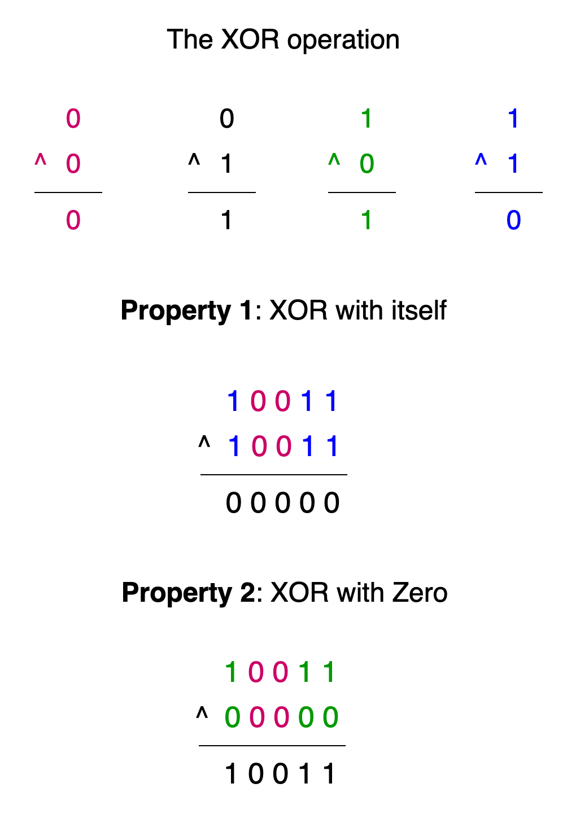

[TOC]

## Solution

---

### Overview

We are given two arrays, `nums1` and `nums2`, consisting of non-negative integers. From these arrays, we can imagine forming another array, `nums3`, where each element is the result of XORing an element from `nums1` with an element from `nums2`.

For example, if $nums1 = [a1, a2]$ and $nums2 = [b1, b2]$, then:

```
nums3 = [a1 ^ b1, a1 ^ b2, a2 ^ b1, a2 ^ b2]
```

Our task is to calculate the XOR of all elements in `nums3`. This can be expressed as:

```
result = (a1 ^ b1) ^ (a1 ^ b2) ^ (a2 ^ b1) ^ (a2 ^ b2)
```

---

### Approach 1: Hash Map

#### Intuition

Suppose we are working with two arrays, `nums1` and `nums2`. When we compute the XOR between every element of `nums1` and every element of `nums2`, the result can be written as:
```
(a1 ^ b1) ^ (a1 ^ b2) ^ (a2 ^ b1) ^ (a2 ^ b2)
```

Because XOR is commutative (the order of operations doesn’t matter), we can rearrange this to group elements together:

```
result = (a1 ^ a1 ^ ... repeated n2 times) ^ (a2 ^ a2 ^ ... repeated n2 times) ^
         (b1 ^ b1 ^ ... repeated n1 times) ^ (b2 ^ b2 ^ ... repeated n1 times)
```

Here:
- Each element of `nums1` appears `n2` times in the calculation (where `n2` is the size of `nums2`).
- Each element of `nums2` appears `n1` times in the calculation (where `n1` is the size of `nums1`).

To simplify the computation, let’s recall two critical properties of XOR:

1. XOR with itself results in 0: a ^ a = 0
2. XOR with 0 results in the same number: a ^ 0 = a



Using these properties, we can see that if an element is XOR'd with itself an even number of times, the result is 0. For example:
$a ^ a ^ a ^ a = (a ^ a) ^ (a ^ a) = 0 ^ 0 = 0$

However, if an element is XOR'd an odd number of times, the result is the element itself, since all pairs cancel out, leaving only one instance of the element. For example:
$a ^ a ^ a = (a ^ a) ^ a = 0 ^ a = a$

Based on these observations, the task now reduces to counting how many times each element appears in the XOR computation.

- Elements appearing an even number of times contribute 0 to the final result.
- Elements appearing an odd number of times retain their value in the final result.

One of the best data structures to count the frequency of an element is a hash map. We iterate through the elements of `nums1` and `nums2` and add their total occurrences to the map. Once the frequencies are determined, we initialize a variable `ans` to store the XOR result. For each key in the map, we XOR it with `ans` if its total occurrence is odd. The final value of `ans` is returned as our required answer.

> For a more comprehensive understanding of hash maps, check out the [Hash Table Explore Card 🔗](https://leetcode.com/explore/learn/card/hash-table/). This resource provides an in-depth look at hash maps, explaining their key concepts and applications with a variety of problems to solidify understanding of the pattern.

#### Algorithm

- Initialize two variables `len1` and `len2` to store the lengths of the input arrays `nums1` and `nums2` respectively.
- Initialize a hashmap `freq` to store the frequency of each number's appearances in the final XOR computations.
- Iterate through each number in the first array `nums1`:
  - For each number, add it to the frequency map with a count equal to `len2`.
- Iterate through each number in the second array `nums2`:
  - For each number, add it to the frequency map with a count equal to `len1`.
- Initialize a variable `ans` to store the final result, starting with 0.
- Iterate through the frequency map's keys:
  - For each number, check if its frequency is odd.
- If odd, XOR the number with the current value of `ans`.
- Return the final computed XOR value stored in `ans`.

#### Implementation

```python
class Solution:
    def xorAllNums(self, nums1: List[int], nums2: List[int]) -> int:
        # Get lengths of arrays
        len1, len2 = len(nums1), len(nums2)

        # Dictionary to store frequency of each number
        freq = {}

        # Add frequencies for nums1 elements
        # Each element appears n2 times in final result
        for num in nums1:
            freq[num] = freq.get(num, 0) + len2

        # Add frequencies for nums2 elements
        # Each element appears n1 times in final result
        for num in nums2:
            freq[num] = freq.get(num, 0) + len1

        # XOR numbers that appear odd number of times
        ans = 0
        for num in freq:
            if freq[num] % 2:
                ans ^= num

        return ans
```

#### Complexity Analysis

Let $n$ and $m$ be the lengths of the arrays `nums1` and `nums2` respectively.

- Time complexity: $O(n + m)$

    The algorithm first iterates through `nums1` which takes $O(n)$ time. Then it iterates through `nums2` which takes $O(m)$ time. Finally, it iterates through the frequency map which can contain at most $(n + m)$ unique numbers. Therefore, the total time complexity is $O(n + m)$.

- Space complexity: $O(n + m)$

    The algorithm uses a hash map to store frequencies of numbers. In the worst case, if all numbers in both arrays are unique, the hash map will store $(n + m)$ key-value pairs. No other additional space is used that grows with input size. Therefore, the space complexity is $O(n + m)$.

---

### Approach 2: Space Optimized Bit Manipulation

#### Intuition

A key observation from the previous approach is that the contribution of any element from `nums1` or `nums2` to the final result depends on the length of the other array:

- For an element `a1` in `nums1`, it is XOR'd with every element in `nums2`. So, its total contribution depends on the length of `nums2` (`n2`).
- Similarly, for an element `b1` in `nums2`, its total contribution depends on the length of `nums1` (`n1`).

Let’s simplify this further:

1. If `n2` (length of `nums2`) is even, each element in `nums1` is XOR'd an even number of times. Using the property of XOR (a ^ a = 0), all such elements cancel out and contribute 0 to the result.
2. If `n2` is odd, each element in `nums1` is XOR'd an odd number of times. Using the property that an odd number of XORs leaves the element unchanged, all elements in `nums1` retain their value in the result.

The same logic applies to `nums2` when considering the length of `nums1`.

Depending on whether `n1` and `n2` are even or odd, there are four possible scenarios:

1. Both `n1` and `n2` are even:
- All elements in `nums1` and `nums2` contribute 0 to the result since their total occurrences are even.

2. `n2` is odd, `n1` is even:
- Elements in `nums1` occur an odd number of times and contribute to the result.
- Elements in `nums2` occur an even number of times and contribute 0.
Thus the answer will be XOR of all elements in `nums1`.

3. `n1` is odd, `n2` is even:
- Elements in `nums2` occur an odd number of times and contribute to the result.
- Elements in `nums1` occur an even number of times and contribute 0.
Thus the answer will be XOR of all elements in `nums2`.

4. Both `n1` and `n2` are odd:
- Elements in both `nums1` and `nums2` occur an odd number of times and retain their value in the result.
Thus the answer will be XOR of all elements in `nums1` XOR'd with XOR of all elements in `nums2`.

> For a more comprehensive understanding of bit manipulation, check out the [Bit Manipulation Explore Card 🔗](https://leetcode.com/explore/learn/card/bit-manipulation/). This resource provides an in-depth look at bit-level operations, explaining their key concepts and applications with a variety of problems to solidify understanding of the pattern.

#### Algorithm

- Initialize two variables `xor1` and `xor2` to store the XOR results for the first and second arrays respectively, both starting at 0.
- Initialize two variables `len1` and `len2` to store the lengths of the input arrays `nums1` and `nums2` respectively.
- If the length of the second array `nums2` is odd:
  - Iterate through each number in the first array `nums1`. For each number:
- Compute its XOR with the current value of `xor1`.
- If the length of the first array `nums1` is odd:
   - Iterate through each number in the second array `nums2`. For each number:
     - Compute its XOR with the current value of `xor2`.
- Compute and return the XOR of `xor1` and `xor2` as the final result.

#### Implementation

```python
class Solution:
    def xorAllNums(self, nums1: List[int], nums2: List[int]) -> int:
        # Initialize XOR results for both arrays
        xor1, xor2 = 0, 0

        # Get lengths of both arrays
        len1, len2 = len(nums1), len(nums2)

        # If nums2 length is odd, each element in nums1 appears odd times in final result
        if len2 % 2:
            for num in nums1:
                xor1 ^= num

        # If nums1 length is odd, each element in nums2 appears odd times in final result
        if len1 % 2:
            for num in nums2:
                xor2 ^= num

        # Return XOR of both results
        return xor1 ^ xor2
```

#### Complexity Analysis

Let $n$ and $m$ be the lengths of the arrays `nums1` and `nums2` respectively.

- Time complexity: $O(n + m)$

    The algorithm performs two conditional iterations. If `len2` is odd, it iterates through `nums1` taking $O(n)$ time. If `len1` is odd, it iterates through `nums2` taking $O(m)$ time. In the worst case, both conditions are true, leading to a total time complexity of $O(n + m)$.

- Space complexity: $O(1)$

    The algorithm only uses four variables (`xor1`, `xor2`, `len1`, `len2`) regardless of the input size. These variables consume constant space and do not grow with the input size. Therefore, the space complexity is $O(1)$.

---