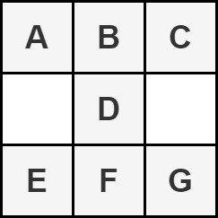
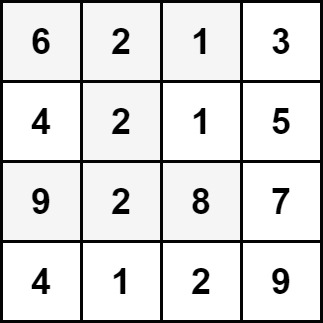
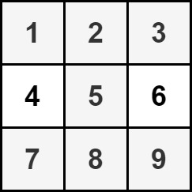

## Description

You are given an `m x n` integer matrix `grid`.

We define an **hourglass** as a part of the matrix with the following form:

Return *the **maximum** sum of the elements of an hourglass*.

**Note** that an hourglass cannot be rotated and must be entirely contained within the matrix.
### Function Contract

- `n`: Input parameter.
- Returns expected result.

### Examples

#### Example 1

- **Input:** `grid = [[6,2,1,3],[4,2,1,5],[9,2,8,7],[4,1,2,9]]`
- **Output:** `30`
- **Explanation:** The cells shown above represent the hourglass with the maximum sum: 6 + 2 + 1 + 2 + 9 + 2 + 8 = 30.
#### Example 2

- **Input:** `grid = [[1,2,3],[4,5,6],[7,8,9]]`
- **Output:** `35`
- **Explanation:** There is only one hourglass in the matrix, with the sum: 1 + 2 + 3 + 5 + 7 + 8 + 9 = 35.
### Constraints

- $m = \text{grid.length}$

- $n = \text{grid}[i].length$

- $3 \le m, n \le 150$

- $0 \le \text{grid}[i][j] \le 10^{6}$