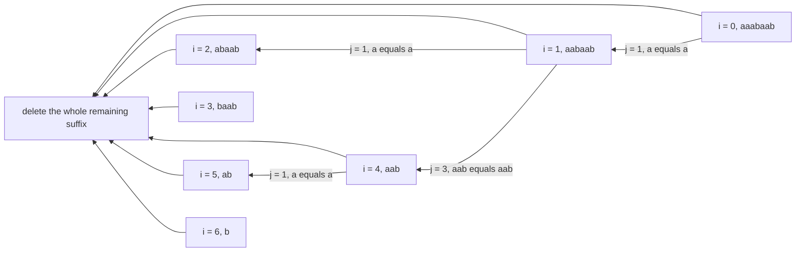

# Guided Example: Maximum Deletions on a String

## 1. The Instance and the Shape of a Legal Operation

Take the instance `s = "aaabaab"`, a string of length $n = 7$ over the lowercase
alphabet. A single operation on a current string $u$ may do exactly one of two things:

- **Whole deletion:** remove all of $u$. This is always legal and always costs one
  operation.
- **Duplicated-prefix deletion:** for some integer $i$ with
  $1 \le i \le \lfloor \lvert u \rvert / 2 \rfloor$, remove the first $i$ characters of
  $u$ provided those $i$ characters equal the $i$ characters that immediately follow
  them.

The objective is the *maximum* number of operations needed to erase `s` completely. For
`aaabaab` the authored answer is `4`, reached by mixing a length-$1$, a length-$3$, a second
length-$1$, and a final whole deletion. The instance also contains a genuine fork at index
$1$ where a shorter match beats a longer one, so it exposes why every legal length must be
examined. Because $\lvert u \rvert = 7$ here, a duplicated-prefix deletion can only use
$i \in \{1, 2, 3\}$.

## 2. Every Reachable String Is a Suffix of the Original

Both operations remove characters from the front, and neither one edits or reorders the
characters that remain. Therefore, after any sequence of operations, the current string is
always a contiguous suffix $s[i:]$ of the original `s` for some index $i$, and the only
thing that changes is $i$. The empty string is the suffix $s[7:]$.

This is the central modelling step: track one integer instead of a string. Two entirely
different deletion histories that arrive at the same index $i$ face the same remaining
problem, because the future depends only on the characters still present. That collapse of
histories makes the problem tractable.

| Reachable state | Current string | Length | Legal duplicated-prefix lengths $i$ |
|---|---|---|---|
| $s[0:]$ | `aaabaab` | 7 | 1, 2, 3 |
| $s[1:]$ | `aabaab` | 6 | 1, 2, 3 |
| $s[2:]$ | `abaab` | 5 | 1, 2 |
| $s[3:]$ | `baab` | 4 | 1, 2 |
| $s[4:]$ | `aab` | 3 | 1 |
| $s[5:]$ | `ab` | 2 | 1 |
| $s[6:]$ | `b` | 1 | none |
| $s[7:]$ | empty | 0 | none |

## 3. The Suffix Recurrence

Let $F(i)$ denote the maximum number of operations needed to delete the suffix $s[i:]$.
The value we must report is $F(0)$. Two facts define the recurrence.

**Base case.** $F(n) = 0$ because an empty suffix needs no operations.

**Transition.** For $i < n$, the first operation is either the whole deletion of $s[i:]$
or a duplicated-prefix deletion of some legal length $j$. Deleting exactly $j$ characters
leaves the suffix $s[i+j:]$, which then costs $F(i+j)$ further operations. Consequently

$$
F(i) = \max\Bigl(\; 1,\;\; \max_{\substack{1 \le j \le \lfloor (n-i)/2 \rfloor \\ s[i:i+j] \;=\; s[i+j:i+2j]}} \bigl(1 + F(i+j)\bigr) \Bigr).
$$

The leading $1$ is the whole-deletion option, and it guarantees $F(i) \ge 1$ for every
non-empty suffix, even when no duplicated prefix exists. The inner maximum ranges over
legal lengths only; an illegal length is not a worse option, it is not an option at all.

The dependency structure of this instance is small enough to draw in full. Each arrow into
the terminal node represents the whole-deletion baseline.

## 4. Enumerating the Candidate Deletions

The recurrence is only useful if every legal candidate is actually tested. The tables below
compare the two adjacent blocks for each state and each permitted length, and record the
resulting candidate value $1 + F(i+j)$. Values of $F$ on the right-hand side are read from
the state table in the next section, which is filled from the end of the string backward.

| State $i$ | Suffix $s[i:]$ | Length $j$ | First block | Second block | Equal? | Candidate $1 + F(i+j)$ |
|---|---|---|---|---|---|---|
| 0 | `aaabaab` | 1 | `a` | `a` | yes | $1 + F(1) = 1 + 3 = 4$ |
| 0 | `aaabaab` | 2 | `aa` | `ab` | no | not legal |
| 0 | `aaabaab` | 3 | `aaa` | `baa` | no | not legal |
| 1 | `aabaab` | 1 | `a` | `a` | yes | $1 + F(2) = 1 + 1 = 2$ |
| 1 | `aabaab` | 2 | `aa` | `ba` | no | not legal |
| 1 | `aabaab` | 3 | `aab` | `aab` | yes | $1 + F(4) = 1 + 2 = 3$ |
| 2 | `abaab` | 1 | `a` | `b` | no | not legal |
| 2 | `abaab` | 2 | `ab` | `aa` | no | not legal |
| 3 | `baab` | 1 | `b` | `a` | no | not legal |
| 3 | `baab` | 2 | `ba` | `ab` | no | not legal |
| 4 | `aab` | 1 | `a` | `a` | yes | $1 + F(5) = 1 + 1 = 2$ |
| 5 | `ab` | 1 | `a` | `b` | no | not legal |

State $1$ is the instructive row pair: the length-$1$ deletion yields $2$ while the
length-$3$ deletion yields $3$. Both are legal, and neither dominates the other a priori.
The three states $2$, $3$, and $5$ have no legal duplicated prefix at all and must fall
back to the baseline. States $6$ and $7$ are terminal or empty.

## 5. The State Table

Evaluating the recurrence from the shortest suffix upward gives the following values. The
"best first move" column names the operation that attains $F(i)$.

| State $i$ | Suffix | $F(i)$ | Best first move from $s[i:]$ | Full deletion sequence from $s[i:]$ |
|---|---|---|---|---|
| 7 | empty | 0 | nothing to delete | — |
| 6 | `b` | 1 | delete all of `b` | `b` |
| 5 | `ab` | 1 | delete all of `ab` | `ab` |
| 4 | `aab` | 2 | delete the leading `a` (matches the next `a`) | `a`, then `ab` |
| 3 | `baab` | 1 | delete all of `baab` | `baab` |
| 2 | `abaab` | 1 | delete all of `abaab` | `abaab` |
| 1 | `aabaab` | 3 | delete the leading `aab` (matches the next `aab`) | `aab`, then `a`, then `ab` |
| 0 | `aaabaab` | 4 | delete the leading `a` (matches the next `a`) | `a`, `aab`, `a`, `ab` |

The final value is $F(0) = 4$, matching the authored answer. Note how $F(4) = 2$ is produced
once and reused: state $1$ needs it through the length-$3$ candidate, and any state whose
deletion lands on index $4$ needs it too. Recomputing it per history would be pure waste.

## 6. The Optimal Deletion Sequence

Linearising the optimal first moves from state $0$ reproduces the statement's own sequence
and confirms that exactly four operations are used.

| Operation | Current suffix before | Chosen length $j$ | Characters deleted | Current suffix after | Operations used |
|---|---|---|---|---|---|
| 1 | `aaabaab` | 1 | `a` | `aabaab` | 1 |
| 2 | `aabaab` | 3 | `aab` | `aab` | 2 |
| 3 | `aab` | 1 | `a` | `ab` | 3 |
| 4 | `ab` | whole string | `ab` | empty | 4 |

The third operation is worth pausing on. From `aab` the first two characters equal the
following two characters, so a length-$1$ deletion is legal; the whole deletion is also
legal. The optimum uses the smaller operation and then pays one more operation for the
remainder — two operations instead of one, but that is the *maximum*, and the problem asks
for the longest possible process.

## 7. Why Neither the Shortest Nor the Longest Match Wins

A tempting shortcut is to always delete the longest legal block, or always the shortest.
This instance refutes the shortest-match rule at state $1$, and a second instance refutes
the longest-match rule at its very first state.

| Instance | State | Strategy | Chosen $j$ | Value obtained | Optimal? |
|---|---|---|---|---|---|
| `aaabaab` | $i = 1$ | shortest legal match | 1 | $1 + F(2) = 2$ | no, optimum is 3 |
| `aaabaab` | $i = 1$ | longest legal match | 3 | $1 + F(4) = 3$ | yes |
| `abcabcabcabc` | $i = 0$ | longest legal match | 6 | $1 + F(6) = 1 + 2 = 3$ | no, optimum is 4 |
| `abcabcabcabc` | $i = 0$ | shorter legal match | 3 | $1 + F(3) = 1 + 3 = 4$ | yes |

For `abcabcabcabc`, deleting the long block `abcabc` leaves only `abcabc`, erasable in two
more operations, for three in total. Deleting the short block `abc` leaves `abcabcabc`,
whose longer window allows three more prefix deletions, for four in total. A rule keyed on
block length cannot see that difference, because the gain comes from the *structure of the
surviving suffix*, not from the size of the removed block. Only the full maximum over legal
lengths is safe.

## 8. Invariant and Correctness

**Definition invariant.** For every index $i$ with $0 \le i \le n$, the stored value
$F(i)$ is exactly the maximum number of operations required to delete the suffix $s[i:]$.

**Well-foundedness.** Every candidate transition moves from $i$ to $i + j$ with $j \ge 1$,
so the recursion strictly decreases the remaining length $n - i$. The base case $i = n$ is
reached after finitely many steps, so no cycle exists in the dependency graph and the
values can be computed from the shortest suffix upward.

**Soundness.** The first operation of any legal process on $s[i:]$ is one of the two
admissible kinds. The whole deletion is the baseline $1$. A duplicated-prefix deletion is
legal only for a length $j$ whose adjacent blocks are equal, and it consumes one operation
and leaves exactly the suffix $s[i+j:]$. Every branch explored is therefore a real legal
process, so $F(i)$ cannot overstate the optimum.

**Completeness.** Take any legal process of length $L$ from $s[i:]$. Its first operation is
either the whole deletion, so $L = 1 \le F(i)$, or a duplicated-prefix deletion of some
legal $j$, after which the remaining $L-1$ operations form a legal process on $s[i+j:]$.
Then $L - 1 \le F(i+j)$, hence $L \le 1 + F(i+j) \le F(i)$. No legal process beats the
recurrence, so the maximum is exact at $i = 0$.

**Why one value per index suffices.** Two histories reaching the same $i$ differ only in the
characters already removed, which can never be revisited, so the remaining problem is
determined entirely by the surviving suffix.

## 9. Boundary and Degenerate Instances

| Instance | $n$ | Structural feature | $F(0)$ | Reason |
|---|---|---|---|---|
| `a` | 1 | $\lfloor 1/2 \rfloor = 0$, so no prefix deletion exists | 1 | only the whole deletion is available |
| `aa` | 2 | the single legal length is $j = 1$ | 2 | delete one `a`, then delete `a` |
| `aaaaa` | 5 | every prefix matches its neighbour, all lengths legal | 5 | deleting one character at a time maximises the count |
| `abcde` | 5 | no two adjacent characters are equal | 1 | no duplicated prefix at any state, so the whole deletion is forced |
| `abababa` | 7 | period-2 structure with overlapping matches | 3 | the length-$2$ deletion applies repeatedly |
| `abcabcabcabc` | 12 | two legal lengths at the first state, $j = 3$ and $j = 6$ | 4 | the shorter block wins, as analysed in section 7 |

The all-equal instance is the worst case for the recurrence's depth: the chain of optimal
transitions visits every index, so the recorded values form one long dependency chain. The
no-repeat instance is the opposite extreme, where the loop body finds no legal length and
the baseline $1$ is returned at every state.

## 10. Alternatives and Their Costs

| Alternative | Idea | Trade-off |
|---|---|---|
| Unmemoised exhaustive recursion | Explore every legal deletion sequence | Exponential in $n$; the same suffix index is re-entered along exponentially many histories |
| Greedy longest legal block | Always delete the largest matching prefix | Wrong: `abcabcabcabc` yields 3 instead of 4 |
| Greedy shortest legal block | Always delete a single matching character when possible | Wrong: `aaabaab` yields 3 instead of 4 at state $1$ |
| Bottom-up suffix DP | Fill $F$ from $i = n$ down to $0$ iteratively | Same recurrence without recursion-depth risk; needs a fast block comparison |
| Longest-common-prefix table | Precompute $\mathrm{lcp}(i, j)$ for all suffix pairs | Makes each block test $O(1)$, giving $O(n^2)$ time, but $O(n^2)$ memory |
| Rolling LCP rows | Keep only the two most recent LCP rows while scanning from the right | $O(n^2)$ time and $O(n)$ space; the most robust formulation |

## 11. Complexity Derivation

Let $n = \lvert s \rvert$ be the string length.

**States.** The suffix index ranges over $0$ through $n$, so the memo holds at most
$n + 1 = O(n)$ distinct states.

**Transitions.** State $i$ tests every length $j$ with $1 \le j \le \lfloor (n-i)/2
\rfloor$, which is $O(n-i)$ candidates. Summing over all states gives

$$
\sum_{i=0}^{n-1} \Bigl\lfloor \frac{n-i}{2} \Bigr\rfloor \;=\; O(n^{2})
$$

transition tests in total.

**Cost of one test.** Comparing the two adjacent blocks of length $j$ character by
character costs $O(j)$ time in the worst case, and copying them for comparison costs the
same. Summed over one state this is $O\bigl((n-i)^2\bigr)$, and summed over all states it
reaches $O(n^3)$ in the worst case — the all-equal string, where long comparisons succeed
and are also the most expensive. If the comparisons are made constant-time instead, by an
LCP table or rolling hashes computed in $O(n^2)$ or $O(n)$ time, the total falls to

$$
O(n^{2}) \ \text{time}.
$$

**Auxiliary space.** The memo table stores one integer per suffix index, so it uses $O(n)$
space. Recursion unwinds a call stack that can reach depth $O(n)$, as in the all-equal case,
and each comparison materialises two temporary blocks bounded by $O(n)$ characters. The
simultaneous maxima give $O(n)$ auxiliary space, or $O(n^2)$ if a full LCP table is
materialised instead.
