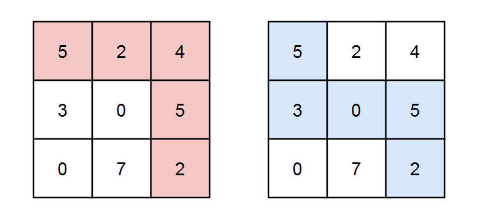
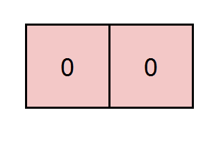
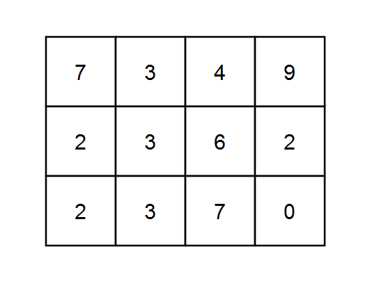

### 1. Description

You are given a **0-indexed** `m x n` integer matrix `grid` and an integer `k`. You are currently at position `(0, 0)` and you want to reach position $(m - 1, n - 1)$ moving only **down** or **right**.

Return* the number of paths where the sum of the elements on the path is divisible by *`k`. Since the answer may be very large, return it **modulo** $10^{9} + 7$.

### 2. Function Contract

- `n`: Input parameter.
- Returns expected result.

### 3. Examples

#### Example 1

- **Input:** `grid = [[5,2,4],[3,0,5],[0,7,2]], k = 3`
- **Output:** `2`
- **Explanation:** There are two paths where the sum of the elements on the path is divisible by k.
The first path highlighted in red has a sum of 5 + 2 + 4 + 5 + 2 = 18 which is divisible by 3.
The second path highlighted in blue has a sum of 5 + 3 + 0 + 5 + 2 = 15 which is divisible by 3.
#### Example 2

- **Input:** `grid = [[0,0]], k = 5`
- **Output:** `1`
- **Explanation:** The path highlighted in red has a sum of 0 + 0 = 0 which is divisible by 5.
#### Example 3

- **Input:** `grid = [[7,3,4,9],[2,3,6,2],[2,3,7,0]], k = 1`
- **Output:** `10`
- **Explanation:** Every integer is divisible by 1 so the sum of the elements on every possible path is divisible by k.

### 4. Constraints

- $m = \text{grid.length}$

- $n = \text{grid}[i].length$

- $1 \le m, n \le 5 * 10^{4}$

- $1 \le m * n \le 5 * 10^{4}$

- $0 \le \text{grid}[i][j] \le 100$

- $1 \le k \le 50$