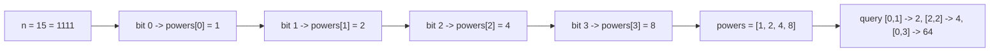

# Guided Example: Range Product Queries of Powers

## 1. The instance chosen for this lesson

The problem fixes one positive integer `n`, expands it into `powers`, the shortest
array of powers of two whose entries sum to `n` (sorted non-decreasing, and unique),
and then asks for the product of a contiguous slice `powers[left..right]` for each
query, reduced modulo $10^{9} + 7$. Everything the solver must reason about is
already visible in the first official instance, so we trace it completely.

| Field | Value for this instance | What it pins down |
|:---|:---|:---|
| `n` | `15` | the integer that must be decomposed into powers of two |
| `queries` | `[[0, 1], [2, 2], [0, 3]]` | three inclusive index ranges into `powers` |
| required output | `[2, 4, 64]` | one product per query, each reduced modulo $10^{9} + 7$ |
| index base | `0` | both query endpoints index `powers` from zero |

Because the first query is a proper range `[0, 1]`, the second is a single index
`[2, 2]`, and the third covers the whole array `[0, 3]`, one instance exercises all
three range shapes the contract allows.

## 2. Why `powers` is exactly the binary expansion of `n`

The statement demands the **minimum** number of powers of two summing to `n`, and it
promises that this array is unique once sorted. Two short observations turn that
promise into a construction.

The first observation is that a minimal representation never repeats a value. If two
copies of the same power $2^{k}$ both appeared, then

$$
2^{k} + 2^{k} = 2^{k+1},
$$

so replacing the pair by a single $2^{k+1}$ produces a representation with one fewer
term. That contradicts minimality, therefore every element of `powers` is a distinct
power of two.

The second observation is that representing an integer as a sum of *distinct* powers
of two is the binary numeral system, which has exactly one representation per integer.
Summing distinct powers is addition without carries, so the representation exists and
is unique for every non-negative integer. Consequently:

$$
\texttt{powers}[j] = 2^{k_j}, \qquad
n = \sum_{j} 2^{k_j}, \qquad
k_0 < k_1 < \dots < k_{m-1},
$$

and $m$, the length of `powers`, equals the number of set bits of `n`. No search,
greedy choice, or comparison is needed: the array *is* the set-bit map of `n` written
in ascending bit order. Sorting non-decreasing and sorting ascending coincide here
because the values are distinct.

## 3. Extracting the array for `n = 15`, lowest set bit first

A decomposition loop that repeatedly removes the lowest set bit appends values in
exactly the required order. For a current value $c$, the lowest set bit is
$c \;\&\; (-c)$, i.e. $2^{t}$ where $t$ is the number of trailing zeros of $c$.
Subtracting it clears that bit and leaves every higher bit untouched, so the appended
values are increasing and the loop terminates precisely when the remaining value
reaches zero.

The trace below shows each iteration for `n = 15`. The "remaining value" column is the
binary pattern still awaiting decomposition, which makes the bit bookkeeping explicit.

| Step | Current value | Binary of current value | Lowest set bit $2^{t}$ | Appended to `powers` | Remaining value |
|:---:|:---:|:---:|:---:|:---:|:---:|
| 1 | `15` | `1111` | $2^{0} = 1$ | `1` | `14` = `1110` |
| 2 | `14` | `1110` | $2^{1} = 2$ | `2` | `12` = `1100` |
| 3 | `12` | `1100` | $2^{2} = 4$ | `4` | `8` = `1000` |
| 4 | `8` | `1000` | $2^{3} = 8$ | `8` | `0` = `0000` |

After four iterations the loop stops and

$$
\texttt{powers} = [1, 2, 4, 8], \qquad 1 + 2 + 4 + 8 = 15.
$$

The important structural fact for the rest of the lesson is the correspondence
between a bit position $k$ and an index $j$ of `powers`. Position 0 of `powers` is the
*lowest set bit of `n`*, not automatically $2^{0}$: for `n = 15` the lowest set bit is
$2^{0}$, but for an even `n` such as `10` the array begins at `2`, as Section 7 shows.

## 4. Working the three queries over the range `[left, right]`

Each query is answered independently. Both endpoints are inclusive and both are valid
indices, so a query touches exactly $\text{right} - \text{left} + 1$ factors. The
product is reduced modulo $p = 10^{9} + 7$.

| Query $i$ | `left_i` | `right_i` | Indices touched | Factors multiplied | Exact product | Product mod $p$ |
|:---:|:---:|:---:|:---|:---|:---:|:---:|
| 0 | `0` | `1` | `0, 1` | $1 \cdot 2$ | `2` | `2` |
| 1 | `2` | `2` | `2` | $4$ | `4` | `4` |
| 2 | `0` | `3` | `0, 1, 2, 3` | $1 \cdot 2 \cdot 4 \cdot 8$ | `64` | `64` |

The second query is the degenerate range where $\text{left} = \text{right}$; its
answer is the single factor `powers[2] = 4`, and no multiplication by a neutral value
is needed. Below, the third query is opened up step by step so the accumulated state
is visible after every factor.

| Step | Index $j$ | `powers[j]` | Accumulator before | Accumulator after (mod $p$) |
|:---:|:---:|:---:|:---:|:---:|
| 1 | `0` | `1` | `1` (empty product) | `1` |
| 2 | `1` | `2` | `1` | `2` |
| 3 | `2` | `4` | `2` | `8` |
| 4 | `3` | `8` | `8` | `64` |

The answers concatenated in query order are `[2, 4, 64]`, which matches the required
output. Every intermediate value here is far below $p$, so the reduction is invisible
in this instance; Section 6 supplies an instance where it is decisive.

## 5. Invariant and correctness of the two phases

**Phase one, decomposition.** The loop maintains the invariant that `powers` holds the
set bits already removed from the original `n`, and that the remaining value equals the
original `n` minus the sum of `powers`. Each iteration removes exactly one set bit —
the lowest one — and appends its value, so the array stays distinct, ascending, and
free of gaps. The loop halts when the remaining value is zero, at which point the sum
of `powers` equals `n` by the invariant. Minimality and uniqueness were established in
Section 2: a repeat would be collapsible, and distinct-power representations are the
unique binary expansion. Hence the produced array is the only array the statement
allows, and its length is the bit count of `n`.

**Phase two, range products.** For a fixed query, the answer is defined as
$\prod_{j=\text{left}}^{\text{right}} \texttt{powers}[j] \bmod p$. The scan maintains
the invariant that immediately before the accumulator absorbs index $j$, it equals

$$
\prod_{i=\text{left}}^{j-1} \texttt{powers}[i] \bmod p .
$$

The invariant holds initially, because the empty product over an interval with no
indices is `1`. Multiplying by `powers[j]` and reducing modulo $p$ extends it to
$j+1$; after the final step it reads exactly the requested range product. Reducing at
every step is sound because reduction modulo $p$ is a ring homomorphism from the
integers onto $\mathbb{Z}/p\mathbb{Z}$:

$$
\big((a \bmod p)\,(b \bmod p)\big) \bmod p = (a\,b) \bmod p .
$$

So the residue of the running product is always the residue of the true product, and
intermediate magnitudes are capped below $p^{2}$ instead of growing to hundreds of
digits. Because $p$ is prime and every factor is a power of two with exponent below
$30$, no factor is divisible by $p$, so no factor is ever congruent to zero.

Validity of the endpoints follows from the limits: $n \le 10^{9} < 2^{30}$, so
`powers` has at most $30$ entries, and every query satisfies
$0 \le \text{left} \le \text{right} < \lvert \texttt{powers} \rvert$. Reading
`powers[j]` therefore never leaves the array.

## 6. A dense instance: all twenty-nine low bits set

Take `n = 536870911`, which is $2^{29} - 1$. Every bit from position $0$ through $28$
is set, so

$$
\texttt{powers} = [1, 2, 4, \dots, 2^{28}], \qquad \lvert \texttt{powers} \rvert = 29 .
$$

The product over a range is now a single power of two, and the exponent is the sum of
the bit positions in that range. This makes the modulo step observable:

| Query | Range | Exponent sum | True product | Value mod $p$ |
|:---:|:---:|:---:|:---|:---:|
| 0 | `[0, 28]` | $\sum_{k=0}^{28} k = 406$ | $2^{406}$ (123 decimal digits) | `733922348` |
| 1 | `[10, 28]` | $\sum_{k=10}^{28} k = 361$ | $2^{361}$ | `57836472` |
| 2 | `[28, 28]` | $28$ | $2^{28}$ | `268435456` |

Two lessons follow. First, deferring the reduction until the end forces arithmetic on
integers with over a hundred digits and growing; reducing in each step keeps every
factor pair below $p^{2}$ and keeps the digit width bounded. Second, the exponent sum
is a property of the index set, not of the values, which is why the same array answers
overlapping queries consistently: query 0 contains query 1, and their exponents satisfy
$361 + \sum_{k=0}^{9} k = 361 + 45 = 406$.

## 7. Boundaries and traps this instance exposes

| Scenario | Concrete instance | Wrong reasoning it invites | Correct handling |
|:---|:---|:---|:---|
| Singleton range | `n = 15`, query `[2, 2]` | Treating the range as empty and answering the neutral value `1` | The endpoints are inclusive, so the answer is `powers[2] = 4` |
| First entry is not $2^{0}$ | `n = 10` | Assuming `powers[0] = 1` because $2^{0} = 1$ | `10 = 1010` gives `powers = [2, 8]`, so query `[0, 0]` answers `2`, not `1` |
| Whole-array range | `n = 15`, query `[0, 3]` | Taking `right` as exclusive and dropping the last factor | `right` is inclusive: `1 * 2 * 4 * 8 = 64`, not `8` |
| Smallest input | `n = 1` | Sorting or deduplicating an array with a single element | `powers = [1]`, and query `[0, 0]` answers `1` |
| Array length is not fixed | `n = 2` versus `n = 15` | Assuming `powers` always has $30$ entries and indexing up to `29` | Length is the bit count of `n`: `1` for `n = 2`, `4` for `n = 15` |
| Unreduced intermediates | `n = 536870911` | Multiplying everything first and reducing once | Reduce at each factor; the exact product exceeds a hundred digits |
| Repeated queries | `n = 536870912`, query `[0, 0]` twice | Assuming queries are distinct or ordered | Each query is independent, so both copies answer `536870912` |

The third row deserves emphasis because it separates a passing answer from a failing
one on an otherwise correct method: an off-by-one at `right` silently shrinks every
product by its last factor. The even-`n` row is the semantic trap of the problem — the
index of an element is not the same thing as its exponent.

## 8. Alternative: prefix products with modular inverses

Because $p$ is prime and every factor $2^{m}$ with $m < 30$ is coprime to $p$, a prefix
product array supports constant-time range queries. Define

$$
P[t] = \prod_{j=0}^{t-1} \texttt{powers}[j] \bmod p, \qquad P[0] = 1 ,
$$

so that the product over the range from `left` to `right` is congruent to
$P[\text{right}+1] \cdot \big(P[\text{left}]\big)^{-1} \pmod p$, with the inverse
obtained as $P[\text{left}]^{\,p-2} \bmod p$. Both the prefix array and the direct scan
are legitimate; the choice is a genuine trade-off, not a stylistic preference.

| Approach | Preprocessing | Work per query | Failure mode or tradeoff |
|:---|:---|:---|:---|
| Direct scan of the range | none | $\text{right} - \text{left} + 1$ modular multiplications | Worst case $30$ multiplications, but never more, because $\lvert \texttt{powers} \rvert \le 30$ |
| Prefix products with modular inverses | $O(\lvert \texttt{powers} \rvert)$ | one multiplication plus one modular exponentiation ($\approx 30$ multiplications) | Needs the modulus to be prime and every factor invertible; the constant factor is larger than the scan it replaces here |
| Exact products reduced once | none | $\text{right} - \text{left} + 1$ multiplications on huge integers | Values reach $2^{406}$; digit width grows with the range and slows multiplication |
| Recomputing `powers` for each query | repeated decomposition | $O(\log n)$ extra per query | Redundant work; the array depends only on `n` and is built once |

On this constraint set the direct scan wins: with $\lvert \texttt{powers} \rvert \le 30$
the per-query scan is cheaper than one Fermat exponentiation, so the inverse machinery
buys nothing here.

## 9. Complexity: time derivation and auxiliary space

**Decomposition.** Each iteration of the extraction loop removes exactly one set bit,
so the number of iterations is the bit count of `n`, not $\log_2 n$ rounded up. Since
$n \le 10^{9} < 2^{30}$, this is at most $30$ iterations of constant-cost word
operations, bounded by $O(\log n)$.

**Query answering.** A query with endpoints `left` and `right` costs
$\text{right} - \text{left} + 1$ modular multiplications, so the total is

$$
\sum_{i} \big(\text{right}_i - \text{left}_i + 1\big) \;\le\; \lvert \texttt{queries} \rvert \cdot \lvert \texttt{powers} \rvert ,
$$

which is $O(q \log n)$ in the worst case, with $q = \lvert \texttt{queries} \rvert$. No
step depends on the sizes of the intermediate integers, because the reduction keeps
every value below $p^{2}$.

| Quantity | Bound in the problem's symbols | Numeric ceiling for the stated limits |
|:---|:---|:---|
| Decomposition iterations | bit count of `n` $\le \lceil \log_2 (n+1) \rceil$ | `30` |
| Multiplications across all queries | $\sum_i (\text{right}_i - \text{left}_i + 1)$ | $10^{5} \times 30 = 3 \times 10^{6}$ |
| Auxiliary state for one query | $O(1)$ | one accumulator below $p^{2}$ |

**Auxiliary space.** The only extra storage is the `powers` array, which holds one
entry per set bit of `n` and therefore occupies $O(\log n)$ words — at most `30`. The
per-query accumulator is a single word, the reduction is done in place, and no
recursion or memo table is used. The returned `answers` array has length $q$, but it is
required output rather than auxiliary space, so the auxiliary bound is $O(\log n)$,
independent of the query count. Total time is
$O\big(\lvert \texttt{powers} \rvert + \sum_i (\text{right}_i - \text{left}_i + 1)\big)$.
