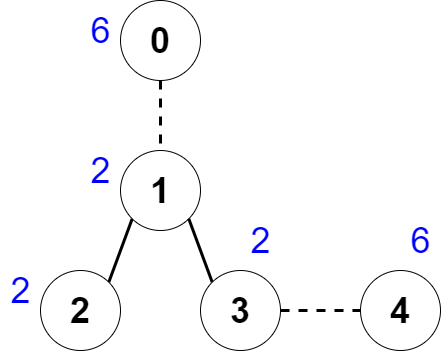

### 1. Description

There is an undirected tree with `n` nodes labeled from `0` to $n - 1$.

You are given a **0-indexed** integer array `nums` of length `n` where $\text{nums}[i]$ represents the value of the $i^{\text{th}}$ node. You are also given a 2D integer array `edges` of length $n - 1$ where $\text{edges}[i] = [a_{i}, b_{i}]$ indicates that there is an edge between nodes $a_{i}$ and $b_{i}$ in the tree.

You are allowed to **delete** some edges, splitting the tree into multiple connected components. Let the **value** of a component be the sum of **all** $\text{nums}[i]$ for which node `i` is in the component.

Return* the **maximum** number of edges you can delete, such that every connected component in the tree has the same value.*

### 2. Function Contract

**Inputs**

- `nums`: Input parameter (`List[int]`).
- `edges`: Input parameter (`List[List[int]]`).

**Return value**

- Returns `int`.

### 3. Examples

#### Example 1

- **Input:** `nums = [6,2,2,2,6], edges = [[0,1],[1,2],[1,3],[3,4]]`
- **Output:** `2`
- **Explanation:** The above figure shows how we can delete the edges [0,1] and [3,4]. The created components are nodes [0], [1,2,3] and [4]. The sum of the values in each component equals 6. It can be proven that no better deletion exists, so the answer is 2.

#### Example 2

- **Input:** `nums = [2], edges = []`
- **Output:** `0`
- **Explanation:** There are no edges to be deleted.

### 4. Constraints

- $1 \le n \le 2 * 10^{4}$

- $\text{nums.length} = n$

- $1 \le \text{nums}[i] \le 50$

- $\text{edges.length} = n - 1$

- $\text{edges}[i].length = 2$

- $0 \le \text{edges}[i][0], \text{edges}[i][1] \le n - 1$

- `edges` represents a valid tree.
