[TOC]

## Solution

---

### Overview

In this problem, we are given an array of integers, a **fixed-bound subarray** is defined as a subarray that has `minK` as its minimum value, and `maxK` as its maximum value. For convenience, we will also call it **valid** subarray.

As shown in the picture below, the first two subarrays are valid, but the third subarray has `7` as its maximum value, and the fourth subarray has `2` as its minimum value, so neither of them is valid.

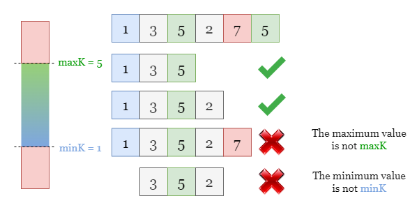

Our task is to find the number of valid subarrays.

---

### Approach: Two Pointers

#### Intuition

Let's start with the brute force solution: we can iterate over each subarray and check if its minimum value and maximum value are `minK` and `maxK`. However, according to the constraints given to us in the question, we can't afford to iterate over all subarrays as this approach is likely to exceed the time limit, so we shall look for a better way.

<br>

We could focus on each index `i` and count **how many valid subarrays end at i**. Recall the conditions for a valid subarray, it must contain both `minK` and `maxK`, and must not contain any element out of the range `[minK, maxK]`.

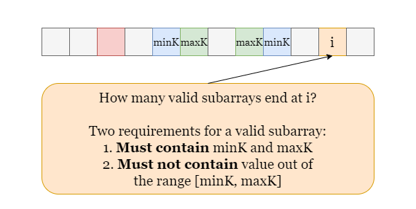

Therefore, we also need to record three indexes:

1. `leftBound`: the most recent value out of the range `[minK, maxK]`,

2. `maxPosition`: the most recent index with value equal to `maxK`.

3. `minPosition`: the most recent index with value equal to `minK`.

*Why do we record the most recent value out of the range?*

> Because we are fixing the right end of the subarray (by considering how many valid subarrays end at the current index), we need to know the farthest left we can start considering a subarray from.

*Why do we record the most recent minK and maxK?*

> Because a valid subarray needs to contain at least one `minK` and `maxK`, once we find the indexes of the most recent `minK` and `maxK`, we can take the smaller one (let's call it `smaller`), then the range `[smaller, i]` contains at least one `minK` and `maxK`.

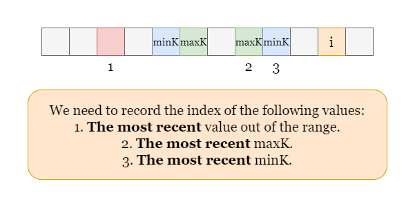

Let $smaller = min(minPosition, maxPosition)$, so the range `[smaller, i]` contains at least one `minK` and one `maxK`. Now we try to extend the subarray `[smaller, i]` from the left side ([smaller - 1, i], [smaller - 2, i] etc.), which we can do as long as we haven't met a value out of the range.

<br>

As shown in the picture below, the red cell `2` stands for the most recent value out of the range, the green cell `7` and the blue cell `8` stand for the most recent `maxK` and `minK` separately.

However, we don't need to really extend the subarray but just record the index of the most recent value that is out of the range (`leftBound`), then the number of valid subarrays ending at `i` equals $smaller - leftBound = 7 - 2 = 5$.

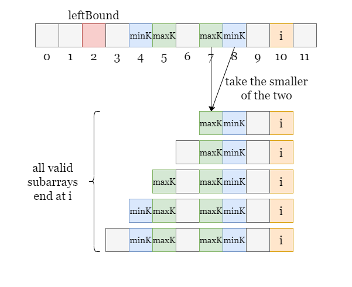

<br>

If `leftBound` is to the right of `smaller`, $smaller - leftBound$ brings a negative result, which means that there is no valid subarray, so we can just treat the result as `0` to avoid negative values. Therefore, the number of valid subarrays ending at `i` can be written generically as $max(0, min(minPosition, maxPosition) - leftBound)$.

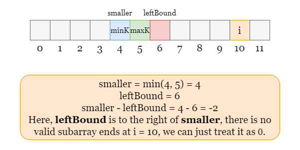

<br>

Please refer to the following slides as an example, where $minK = 1$ and $maxK = 5$:

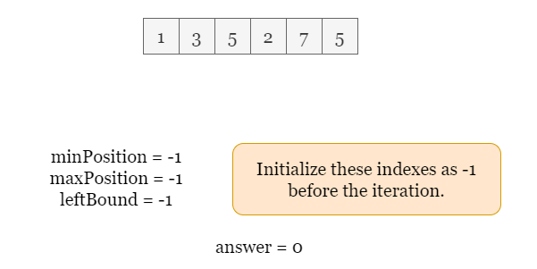

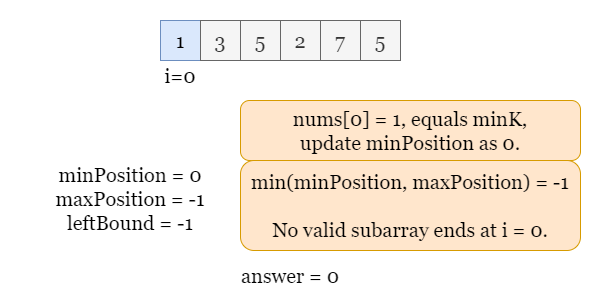

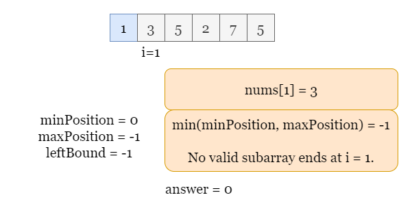

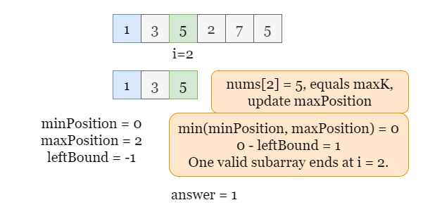

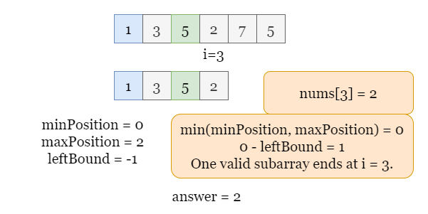

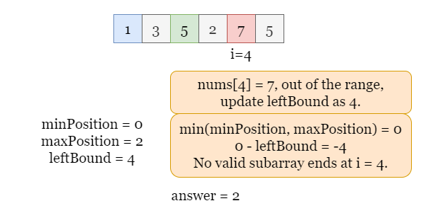

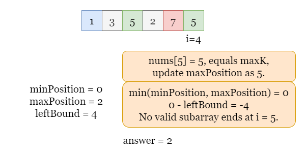

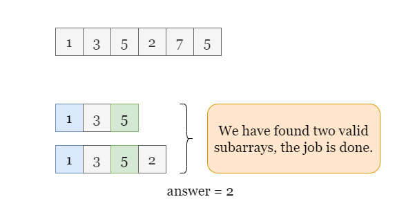

<br>

#### Algorithm

1) Initialize three indices `minPosition`, `maxPosition` and `leftBound` as `-1` and set `answer` as `0`.

2) Iterate over `nums`, for each index `i`:

- If $\text{nums}[i]$ is out of the range `[minK, maxK]`, update $leftBound = i$.

- If $\text{nums}[i]$ equals `minK`, update $minPosition = i$.

- If $\text{nums}[i]$ equals `maxK`, update $maxPosition = i$.

    The number of valid subarrays ending at index `i` equals $min(minPosition, maxPosition) - leftBound$. If the result is negative, it means there is no valid subarray ending at `i`. Increment `answer` by the number of valid subarrays.

4) Return `answer` once the iteration stops.

#### Implementation

```python
class Solution:
    def countSubarrays(self, nums: List[int], minK: int, maxK: int) -> int:
        # min_position, max_position: the MOST RECENT positions of minK and maxK.
        # left_bound: the MOST RECENT value outside the range [minK, maxK].
        answer = 0
        min_position = max_position = left_bound = -1

        # Iterate over nums, for each number at index i:
        for i, number in enumerate(nums):
            # If the number is outside the range [minK, maxK], update the most recent left_bound.
            if number < minK or number > maxK:
                left_bound = i

            # If the number is minK or maxK, update the most recent position.
            if number == minK:
                min_position = i
            if number == maxK:
                max_position = i

            # The number of valid subarrays equals the number of elements between left_bound and
            # the smaller of the two most recent positions.
            answer += max(0, min(min_position, max_position) - left_bound)

        return answer
```

#### Complexity Analysis

Let $n$ be the length of the input array `nums`.

* Time complexity: $O(n)$

- We need one iteration over `nums`, for each step during the iteration, we need to update some variables which take constant time.

- The overall time complexity is $O(n)$.

* Space complexity: $O(1)$

- We only need to maintain four integer variables, `minPosition`, `maxPosition`, `leftBound` and `answer`.

<br/>