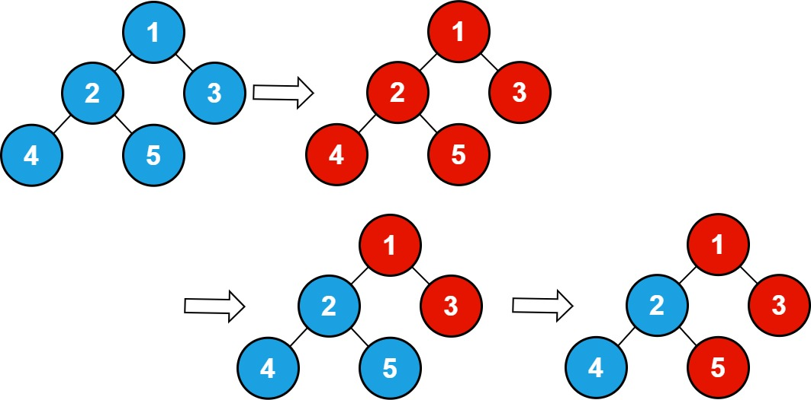
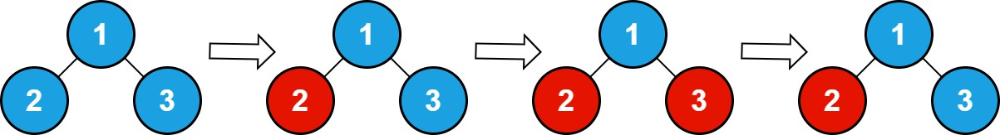

## Description

There is an **undirected** connected tree with `n` nodes labeled from `1` to `n` and $n - 1$ edges. You are given the integer `n`. The parent node of a node with a label `v` is the node with the label $floor (v / 2)$. The root of the tree is the node with the label `1`.

- For example, if $n = 7$, then the node with the label `3` has the node with the label $floor(3 / 2) = 1$ as its parent, and the node with the label `7` has the node with the label $floor(7 / 2) = 3$ as its parent.

You are also given an integer array `queries`. Initially, every node has a value `0` on it. For each query $\text{queries}[i]$, you should flip all values in the subtree of the node with the label $\text{queries}[i]$.

Return *the total number of nodes with the value *`1`* **after processing all the queries***.

**Note** that:

- Flipping the value of a node means that the node with the value `0` becomes `1` and vice versa.

- `floor(x)` is equivalent to rounding `x` down to the nearest integer.
### Function Contract

- Refer to method signature.

### Examples
#### Example 1

- **Input:** $n = 5 , queries = [1,2,5]$
- **Output:** `3`
- **Explanation:** The diagram above shows the tree structure and its status after performing the queries. The blue node represents the value 0, and the red node represents the value 1.
After processing the queries, there are three red nodes (nodes with value 1): 1, 3, and 5.
#### Example 2

- **Input:** $n = 3, queries = [2,3,3]$
- **Output:** `1`
- **Explanation:** The diagram above shows the tree structure and its status after performing the queries. The blue node represents the value 0, and the red node represents the value 1.
After processing the queries, there are one red node (node with value 1): 2.
### Constraints

- $1 \le n \le 10^{5}$

- $1 \le \text{queries.length} \le 10^{5}$

- $1 \le \text{queries}[i] \le n$