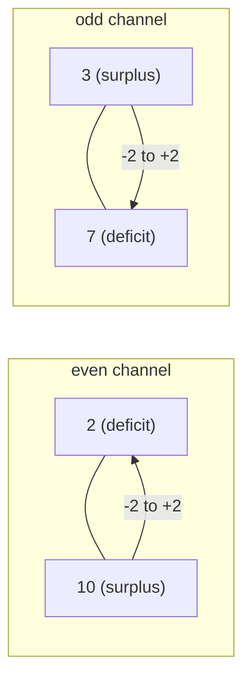

# Guided Example: Minimum Number of Operations to Make Arrays Similar

Two equal-length arrays `nums` and `target` are **similar** when their multisets
coincide, so only *which values appear* matters, never their order. A single
operation picks two **distinct** indices $i \neq j$, raises the value at one of
them by $2$ and lowers the value at the other by $2$. The task is the minimum
number of such transfers that turns the multiset of `nums` into the multiset of
`target`.

We work one representative instance from start to finish:

- **Input:** `nums = [10, 2, 7, 3]`, `target = [4, 8, 9, 1]`
- **Required outcome:** `2`

This instance is deliberately *mixed-parity*: both parity classes carry a real
surplus and a real deficit, and a single operation can never settle one class
from the other.

---

## 1. The invariant that splits the problem in two

The value $2$ is even, so adding or subtracting it never changes whether a
number is even or odd. Writing $v \equiv v \bmod 2$ for the parity class, every
operation replaces the pair $(nums[i], nums[j])$ by values with the *same two*
parities:

$$
nums[i] \equiv nums[i] + 2 \pmod 2, \qquad nums[j] \equiv nums[j] - 2 \pmod 2 .
$$

So each element is permanently imprisoned in its parity class. Two consequences
follow immediately. First, the operation set decomposes: even positions interact
only with even positions and odd positions only with odd positions, so the two
classes are *independent subproblems*. Second, a feasible instance must have
matching class sizes — if `nums` held three odd and one even value while `target`
held two of each, no sequence of operations could reconcile them. The
feasibility guarantee therefore implies
$\lvert E_{nums}\rvert = \lvert E_{target}\rvert$ and
$\lvert O_{nums}\rvert = \lvert O_{target}\rvert$ for the even and odd
sub-multisets $E$ and $O$.

The second invariant is conservation of the total sum. Every operation adds $2$
somewhere and subtracts $2$ elsewhere, so

$$
\sum_{i} nums[i] \ \text{ is invariant}, \qquad
\text{hence } \sum_{i}\bigl(nums[i] - target[i]\bigr) = 0 .
$$

The positive discrepancies therefore balance the negative ones in magnitude. That
balance is what will later license a division, so it is worth confirming on the
instance before any matching happens.

| Array | Even values (ascending) | Odd values (ascending) | Even count | Odd count | Total sum |
|---|---|---|---|---|---|
| `nums` | `[2, 10]` | `[3, 7]` | 2 | 2 | $2+10+3+7 = 22$ |
| `target` | `[4, 8]` | `[1, 9]` | 2 | 2 | $4+8+1+9 = 22$ |

Both classes have the same size and the two totals agree at $22$, so the instance
is feasible; the only question is how *few* transfers are needed.

---

## 2. Measuring each element's obligation as a signed surplus

Because the parity classes are sealed off from one another, it is useful to
forget about positions entirely and describe what each value must do. Within a
class, compare the source multiset with the target multiset and define each
entry's signed displacement, positive meaning "must grow" and negative meaning
"must shrink".

| Parity class | Value in `nums` | Value in `target` | Displacement $\text{target} - \text{nums}$ | Role |
|---|---|---|---|---|
| even | `2` | `4` | $+2$ | deficit: must receive one $+2$ |
| even | `10` | `8` | $-2$ | surplus: must donate one $-2$ |
| odd | `3` | `1` | $-2$ | surplus: must donate one $-2$ |
| odd | `7` | `9` | $+2$ | deficit: must receive one $+2$ |

Each class balances on its own. Because nothing crosses the parity wall, every
displacement must be settled by one operation that pairs a surplus index with a
deficit index *of the same parity*.

Here is the trap. Pairing the globally smallest value with the globally smallest
target would send `2` up toward `9` and let `7` slide down toward `4`. That
pairing is illegal: `2` is even and `9` is odd, so no chain of `±2` steps
connects them. The parity partition must be honoured *before* any cost is
computed.

---

## 3. Why sorted pairing inside each class is forced

Inside one parity class, let the source values be $a \le b$ and the target values
be $y \le x$, and consider the two possible ways to match them. The ordered
matching $\{a \to y,\ b \to x\}$ and the crossed matching
$\{a \to x,\ b \to y\}$ are the only options for two sources and two targets, and
the uncrossing identity

$$
\lvert a - y \rvert + \lvert b - x \rvert
\;\le\;
\lvert a - x \rvert + \lvert b - y \rvert
$$

holds for all reals $a \le b$ and $y \le x$. Repeating this exchange removes
every inversion, so the minimum total displacement is attained by sorting each
class of `nums` and each class of `target` ascending and matching rank against
rank — the classical uncrossing argument on a number line.

Applying the rule to the instance:

| Parity class | Sorted `nums` | Sorted `target` | Matched pairs (rank by rank) | Per-pair distance $\lvert \cdot \rvert$ | Class total |
|---|---|---|---|---|---|
| even | `[2, 10]` | `[4, 8]` | `2 → 4`, `10 → 8` | $2$, $2$ | $4$ |
| odd | `[3, 7]` | `[1, 9]` | `3 → 1`, `7 → 9` | $2$, $2$ | $4$ |

The crossed even pairing would have cost $\lvert 2-8 \rvert + \lvert 10-4 \rvert
= 12$ and the crossed odd pairing $\lvert 3-9 \rvert + \lvert 7-1 \rvert = 12$,
each three times the sorted cost. The uncrossing inequality is why the algorithm
may sort at all.

---

## 4. Worked trace: executing the two transfers

Now the displacements can be paid off. A surplus element of displacement $-2$
needs one operation as donor; a deficit element of displacement $+2$ needs one
operation as receiver. Because both roles are filled *simultaneously*, one
operation discharges two units of discrepancy at two distinct indices.

Starting from `nums = [10, 2, 7, 3]`:

| Step | Chosen donor index $j$ | Chosen receiver index $i$ | Move | `nums` after the operation | Displacements remaining (even, odd) |
|---|---|---|---|---|---|
| 0 | — | — | start | `[10, 2, 7, 3]` | even: $2\!\to\!4$, $10\!\to\!8$; odd: $3\!\to\!1$, $7\!\to\!9$ |
| 1 | index 0 (value `10`, even surplus) | index 1 (value `2`, even deficit) | `nums[0] = 10 - 2 = 8`, `nums[1] = 2 + 2 = 4` | `[8, 4, 7, 3]` | even class settled; odd class untouched |
| 2 | index 3 (value `3`, odd surplus) | index 2 (value `7`, odd deficit) | `nums[3] = 3 - 2 = 1`, `nums[2] = 7 + 2 = 9` | `[8, 4, 9, 1]` | odd class settled; both classes settled |

After step 2 the multiset is $\{8, 4, 9, 1\} = \{1, 4, 8, 9\}$, exactly the
target multiset. Two operations, none wasted, so the answer is at most $2$. The
"distinct indices" condition is exercised too: step 1 uses $(0,1)$ and step 2
uses $(2,3)$, and no element is ever paired with itself because a zero
displacement never takes either role.

A short mermaid sketch of the two sealed channels makes the structure explicit:

---

## 5. Lower bound: no schedule can use fewer than two operations

Showing a two-operation schedule proves the answer is $\le 2$; proving it is
$\ge 2$ needs an independent argument.

The even class must move `10` down to `8`, a net change of $-2$, and parity is
frozen, so `10` can only lose value through $-2$ steps; each operation applies a
single $\pm 2$ to a single index, so `10` must be the donor of at least one
operation. Symmetrically, the even deficit `2` must be the receiver of at least
one operation, and those two roles cannot be merged into one index, because a
single element cannot simultaneously need to grow and shrink. Every displacement
therefore demands attention from at least one operation.

Quantify the work. Call one *unit adjustment* a change of $2$ at a single index.
A displacement of magnitude $\lvert d \rvert$ demands exactly
$\lvert d \rvert / 2$ unit adjustments at that element, so the whole instance
demands

$$
\frac{1}{2}\sum \lvert \text{displacement} \rvert
= \frac{1}{2}\bigl(2 + 2 + 2 + 2\bigr) = 4
$$

unit adjustments in total. One operation supplies exactly $2$ of them — one at
the donor and one at the receiver, necessarily at two distinct indices — so any
legal schedule needs at least $4/2 = 2$ operations. The constructive trace of
section 4 meets this bound, which pins the optimum at exactly $2$. This is the
general shape of the argument:
a *matching* gives the upper bound, a *counting* of required unit-adjustments
gives the matching lower bound, and the two coincide.

---

## 6. From total discrepancy to a closed-form operation count

The trace was small enough to schedule by hand, but the lesson should end with
the general recipe, because that is what scales to $n \le 10^{5}$.

Let the parity-sorted arrays be $P$ and $Q$ (each array sorted by the key "even
before odd, ascending inside a class"), so that $P_t$ and $Q_t$ are legal
partners for one another. Feasibility guarantees $P_t \equiv Q_t \pmod 2$ for
every rank $t$, hence every difference $P_t - Q_t$ is even, and define

$$
D = \sum_{t} \bigl\lvert P_t - Q_t \bigr\rvert .
$$

Two facts about $D$. It is the minimum total absolute discrepancy, by the
uncrossing result of section 3. And it is exactly the total magnitude of
adjustment that must be performed: the sum balance $\sum_t (P_t - Q_t) = 0$
guarantees that surpluses and deficits are equally large in magnitude, so no
operation is ever wasted pairing two indices that both need the same sign.

A *unit adjustment* is a change of $2$ at one element, so the instance needs $D/2$
unit adjustments, and each operation supplies exactly two of them. Hence

$$
\text{operations} = \frac{D/2}{2} = \frac{D}{4}.
$$

For the instance, $D = \lvert 2-4 \rvert + \lvert 10-8 \rvert + \lvert 3-1 \rvert +
\lvert 7-9 \rvert = 8$, and $8/4 = 2$, as required. The official single-parity
sample `nums = [8,12,6]`, `target = [2,14,10]` behaves the same way:
parity-sorted as `[6,8,12]` against `[2,10,14]`, it gives $D = 4+2+2 = 8$ and
again an answer of `2`.

| Quantity | Symbol | Value for this instance | Meaning |
|---|---|---|---|
| Minimum total absolute discrepancy | $D$ | $8$ | sum of rank-wise distances after parity sorting |
| Unit adjustments performed per operation | — | $2$ | one $+2$ and one $-2$ |
| Operations | $D/4$ | $2$ | the required answer |

---

## 7. Boundary and trap analysis

| Scenario | Input shape | Correct result | Why the method handles it | What a careless method gets wrong |
|---|---|---|---|---|
| Already similar | `nums = [1,1,1,1,1]`, `target` identical | $0$ | every displacement is $0$, so $D = 0$ and $0/4 = 0$; no index ever takes a role | reporting $1$ by "always needing at least one op" |
| Pure permutation | `nums = [5,2,7,4]`, `target = [4,7,2,5]` | $0$ | similarity ignores order, and sorting erases it before any distance is taken | comparing element-wise in place and returning a positive count |
| Duplicated values | `nums = [2,2,10,10]`, `target = [4,4,8,8]` | $2$ | equal values occupy equal sorted ranks; ranks, not identities, are matched | greedy "nearest value" matching that leaves an unmatched surplus |
| Mixed parity | `nums = [10,2,7,3]`, `target = [4,8,9,1]` | $2$ | classes are solved separately, then their costs add | matching globally sorted arrays, which would cross the parity wall |
| One element per array | `nums = [x]`, `target = [y]` | $0$, and feasibility forces $x = y$ | a single operation needs two distinct indices, and the sum plus parity invariants force equality | pulling a second index out of nowhere or returning a spurious op |
| Extreme magnitudes | `nums = [1000000, 1]`, `target = [2, 999999]` | $499999$ | the discrepancy formula is closed-form; no step-by-step simulation is used | simulating one operation at a time, which times out at $5 \cdot 10^{5}$ steps |
| Different parity counts | e.g. `nums` with 3 odds and `target` with 2 | infeasible | rejected by the class-size invariant before matching begins | producing a meaningless number after mismatched zipping |

The decisive trap is the divisor. Each operation moves two units *at two
different indices*, so it reduces $D$ by $4$, not by $2$; computing `D / 2`
overcounts by a factor of two. The answer is also exact rather than modular: $D$
can reach roughly $n \cdot 10^{6}$, which fits in a standard integer, so no
modulus belongs here.

---

## 8. Correctness summary and complexity derivation

**Invariant.** Throughout any legal sequence, the parity class of every element
is fixed and $\sum_i nums[i]$ is fixed. These two invariants are why the
parity-sorted pairing is not a heuristic: the class partition is inviolable, and
the sum balance guarantees a surplus partner for every deficit, so the
construction never stalls.

**Soundness.** Every scheduled operation uses two distinct indices, and the
disjoint parity classes guarantee that the surplus and deficit partners are
distinct elements. After all $D/4$ operations every matched rank agrees, so the
produced multiset equals the target multiset.

**Completeness and optimality.** The uncrossing exchange shows the sorted pairing
minimises $D$ over all valid matchings, and the unit-adjustment count shows any
strategy needs at least $D/4$ operations. The construction attains that bound, so
$D/4$ is exactly the minimum, not merely a feasible count.

**Cost.** Let $n$ be the common array length. Sorting both arrays under the key
"$(x \bmod 2, x)$" costs $O(n \log n)$ time and the subsequent rank-wise pass
costs $O(n)$ time, so the total running time is

$$
O(n \log n) + O(n) = O(n \log n),
$$

dominated by the comparison sort; the algorithm never needs to know the value
range $10^{6}$, so no counting-sort dependency is introduced. Auxiliary space is
$O(n)$: the sorts may allocate a buffer proportional to an array, while the
running discrepancy accumulator and the final division use $O(1)$ additional
scalars. Nothing depends on the magnitude of the values, only on their relative
order — which is why the extreme-magnitude case is settled by arithmetic rather
than by simulation.