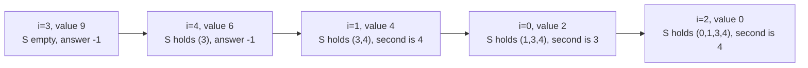

# Guided Example: Next Greater Element IV

## 1. The Instance We Will Trace

- **Input:** `nums = [2, 4, 0, 9, 6]`
- **Required output:** `[9, 6, 6, -1, -1]`

For every index $i$ we must report the **second greater** integer: the value $\text{nums}[j]$ such that $j > i$, $\text{nums}[j] > \text{nums}[i]$, and there is **exactly one** index $k$ with $\text{nums}[k] > \text{nums}[i]$ and $i < k < j$. If no such $j$ exists, the entry is $-1$. This instance is chosen because index $0$ and index $1$ disagree about which greater neighbour is "second": at index $0$ the two qualifying values rise ($4$, then $9$), while at index $1$ they fall ($9$, then $6$). It therefore refutes the tempting reading that the second greater must itself be larger than the first greater.

## 2. Reading the Definition as an Index Ordering

The definition is entirely about the **order of indices**, not about values. Fix $i$ and list the positions to its right whose values exceed $\text{nums}[i]$:

$$
J(i) = \{\, j : j > i \ \text{and}\ \text{nums}[j] > \text{nums}[i] \,\}, \qquad j_{(1)} < j_{(2)} < \dots
$$

Then $\text{nums}[j_{(1)}]$ is the first greater integer, and $\text{nums}[j_{(2)}]$ — if it exists — is the second greater integer. The phrase "exactly one $k$ between" is precisely the statement that $j$ is the second smallest member of $J(i)$: such a $k$ is exactly an index of $J(i)$ lying strictly between $i$ and $j$, and the condition demands that there be exactly one of them. Consequently the answer is $\text{nums}[j_{(2)}]$ when $\lvert J(i) \rvert \ge 2$, and $-1$ otherwise.

Two readings follow, and both matter later. The comparison in $J(i)$ is **strict**, so an equal value does not qualify; and the elements of $J(i)$ are counted by index, so two equal values at different indices count as two separate greater elements.

Applying this to the sample:

| index $i$ | $\text{nums}[i]$ | indices to the right, with values | $J(i)$ in increasing order | first greater | second greater | $\text{answer}[i]$ |
|---|---|---|---|---|---|---|
| 0 | $2$ | $1{:}4,\ 2{:}0,\ 3{:}9,\ 4{:}6$ | $1, 3, 4$ | $4$ at index $1$ | $9$ at index $3$ | $9$ |
| 1 | $4$ | $2{:}0,\ 3{:}9,\ 4{:}6$ | $3, 4$ | $9$ at index $3$ | $6$ at index $4$ | $6$ |
| 2 | $0$ | $3{:}9,\ 4{:}6$ | $3, 4$ | $9$ at index $3$ | $6$ at index $4$ | $6$ |
| 3 | $9$ | $4{:}6$ | $\varnothing$ | — | — | $-1$ |
| 4 | $6$ | — | $\varnothing$ | — | — | $-1$ |

At index $2$ the value is $0$, so both $9$ and $6$ belong to $J(2)$; the zero is a genuine element and not a sentinel. At index $3$ there is no greater value at all, so the entry is $-1$ even though a smaller neighbour follows.

## 3. The Sweep That Replaces "Search Rightward"

Scanning rightward from every index is quadratic. The structural observation that removes the scan is this: the second greater element of $i$ depends only on **which indices to the right of $i$ hold larger values**, and that set is independent of where we start looking. If we visit indices in order of *decreasing value*, then at the moment index $i$ is visited, every index holding a strictly larger value has already been visited, and no index holding a smaller value has been. Keeping the visited indices in an ordered container therefore makes the whole of $J(i)$ available as a contiguous suffix of that container.

The state is:

- an ordered container $S$ of the visited indices, kept in increasing index order;
- a requirement that equal-valued indices are visited in increasing index order, so that an equal value to the right of $i$ has not yet entered $S$.

Processing $i$ then has three moves: locate the number of stored indices that are at most $i$; if at least two stored indices exceed $i$, report the value at the second of them; then insert $i$ into $S$.

| step | $i$ | $\text{nums}[i]$ | $S$ before the step | stored indices greater than $i$ | second of them | $\text{answer}[i]$ | $S$ after |
|---|---|---|---|---|---|---|---|
| 1 | 3 | $9$ | $\{\}$ | none | — | $-1$ | $\{3\}$ |
| 2 | 4 | $6$ | $\{3\}$ | none | — | $-1$ | $\{3,4\}$ |
| 3 | 1 | $4$ | $\{3,4\}$ | $3, 4$ | $4$ | $6$ | $\{1,3,4\}$ |
| 4 | 0 | $2$ | $\{1,3,4\}$ | $1, 3, 4$ | $3$ | $9$ | $\{0,1,3,4\}$ |
| 5 | 2 | $0$ | $\{0,1,3,4\}$ | $3, 4$ | $4$ | $6$ | $\{0,1,2,3,4\}$ |

Assembling the entries by original index gives `[9, 6, 6, -1, -1]`, which agrees with the authored expected output for this input.

## 4. Two Lemmas That Make the Sweep Exact

**Lemma 1 (the container is exactly $J(i)$).** When index $i$ is processed, the stored indices larger than $i$ are precisely the elements of $J(i)$.

*Both directions.* If a stored index $p$ satisfies $p > i$, then $p$ was visited before $i$. Visited-before means either $\text{nums}[p] > \text{nums}[i]$, or $\text{nums}[p] = \text{nums}[i]$ with equal values visited in increasing index order — which is impossible because $p > i$ would then be visited after $i$. Hence $\text{nums}[p] > \text{nums}[i]$, so $p \in J(i)$. Conversely, if $j \in J(i)$ then $j > i$ and $\text{nums}[j] > \text{nums}[i]$, so $j$ was visited before $i$ and is stored, and $j > i$. The two sets coincide.

**Lemma 2 (index order is rank order).** The $k$-th smallest stored index greater than $i$ is $j_{(k)}$, the $k$-th element of $J(i)$ in increasing order. A rightward scan from $i+1$ meets indices in increasing order, and Lemma 1 says the qualifying indices are exactly the stored ones greater than $i$; sorting them increasingly reproduces that meeting order. So their second smallest element is the second greater index, and its value is the required answer.

Together the lemmas show that the move "take the second stored index exceeding $i$" computes the definition literally: when fewer than two such indices exist, $\lvert J(i) \rvert < 2$ and the correct entry is $-1$; otherwise the value read is $\text{nums}[j_{(2)}]$. No candidate is skipped and no non-qualifying index is admitted, because the container holds only strictly larger values to the right of $i$.

**Why the tie order is load bearing.** If equal values were visited in *decreasing* index order, a stored index greater than $i$ could carry a value equal to $\text{nums}[i]$ and would be miscounted as a greater element. On `nums = [2, 2, 3, 3, 4]`, whose correct answer is `[3, 3, -1, -1, -1]`, that mistake is visible at index $2$:

| tie order used | visit order of equal values | state when index $2$ (value $3$) is processed | indices greater than $2$ | produced entry | correct entry |
|---|---|---|---|---|---|
| increasing index (sound) | $2$ then $3$ | $S = \{4\}$ | $4$ | $-1$ | $-1$ |
| decreasing index (unsound) | $3$ then $2$ | $S = \{3, 4\}$ | $3, 4$ | $4$ | $-1$ |

The unsound row treats the equal-valued index $3$ as a *strictly greater* element, so it counts a first greater that does not exist and reports a second greater where there is none. Ordering ties by increasing index removes the problem exactly.

## 5. Boundaries and Traps This Problem Sets

| situation | concrete instance | outcome and the trap it exposes |
|---|---|---|
| Equal values are not greater | `nums = [3, 3]` | Answer `[-1, -1]`. The comparison is strict; using a non-strict test would invent a first greater for each element. |
| Second greater smaller than the first | `nums = [2, 4, 0, 9, 6]`, index $1$ | First greater $9$, second greater $6$. The definition constrains position, never magnitude, so an implementation that searches for a larger-than-the-first value is wrong. |
| Only one greater element to the right | `nums = [3, 3]`, or index $3$ of the sample | $J(i)$ has size below two, so the entry is $-1$. "Second" is not an optional embellishment; a method that falls back to the first greater fails here. |
| Duplicate greater values at distinct indices | `nums = [2, 2, 3, 3, 4]` | Answer `[3, 3, -1, -1, -1]`. The two copies of $3$ occupy indices $2$ and $3$ and count separately, so they supply a second greater for the two copies of $2$. Comparing against sorted distinct values instead of index-ordered positions collapses them and breaks the count. |
| Zeros are ordinary values | `nums = [0, 1, 0, 2, 3]` | Answer `[2, 3, 3, -1, -1]`. A zero has greater neighbours and can itself be a first or second greater; treating $0$ as an empty slot loses candidates. |
| Strictly decreasing input | `nums = [9, 7, 5, 3, 1]` | Every entry is $-1$; the container never holds an index to the right of the current one, so no answer is ever emitted. |
| Singleton | `nums = [0]` | Answer `[-1]`. There are no indices to the right at all. |
| Maximum magnitudes | `nums = [999999999, 1000000000, 1000000000, 999999998, 1000000000]` | Answer `[1000000000, -1, -1, -1, -1]`. The first index reaches the two copies of $10^9$ at indices $1$ and $2$, while the equal maxima cannot be greater than one another. Values and indices must not be conflated. |
| Ties in value across far-apart indices | any input | Visiting equal values in index order is required for correctness, not a cosmetic detail: it prevents a right-hand equal value from being counted as a greater element. |
| The intermediate index $k$ may be huge | any input | $k$ is any index between $i$ and the answer, not necessarily adjacent. The definition counts qualifying indices, so distances are irrelevant; only their order and count matter. |

## 6. Alternative Methods and Their Trade-offs

| method | time | auxiliary space | trade-off |
|---|---|---|---|
| Descending-value sweep with an ordered container of positions (derived above) | $O(n \log n)$ | $O(n)$ | Two lemmas give a short correctness proof and the tie handling is explicit. Needs a balanced ordered structure supporting successor queries and insertion. |
| Two strictly decreasing stacks (a first-greater stack feeding a second-greater stack) | $O(n)$ | $O(n)$ | One left-to-right pass: an element moves from the first stack to the second when its first greater appears, and leaves the second when its second greater appears. Asymptotically better, but the proof must also show that the second stack always exposes the smallest pending value, which is subtler than Lemma 1. |
| Min-heap "waiting room" of elements that have found a first greater | $O(n \log n)$ | $O(n)$ | Elements enter the waiting room when their first greater is seen and leave when a later value exceeds them; the ordering argument is easy to state. Same bound as the sweep, with heap operations instead of successor queries. |
| Exhaustive rightward scan per index | $O(n^2)$ | $O(1)$ | Directly follows the definition and is the fastest route to a correct brute force; unusable at $n = 10^5$. |
| Sparse table or segment tree for range maxima, queried repeatedly | $O(n \log n)$ preprocessing, $O(\log n)$ per query | $O(n \log n)$ | Answers "next index with a larger value" queries, but placing the second greater still requires iterating the maxima, so the second step is not a single range query. |
| Sort indices by value and use a Fenwick tree over indices | $O(n \log n)$ | $O(n)$ | Counts how many larger elements lie to the right, which is enough to decide existence of a second greater but not to identify which index holds it; a second structure is still needed for the value. |

## 7. Complexity Derivation

Let $n = \texttt{nums.length}$.

- **Ordering the indices by value.** Forming the value/index pairs costs $O(n)$ and sorting them costs $O(n \log n)$. The comparison is by value, and the sort must be stable so that equal values keep increasing index order.
- **The sweep.** Each of the $n$ indices is inserted once, costing $O(\log n)$ in an ordered container that never exceeds $n$ entries. Each index also performs one successor query — how many stored positions are at most $i$, and which two follow — which is $O(\log n)$ as well. The whole sweep is therefore $O(n \log n)$.
- **Assembly.** Writing each answer into its original position is $O(n)$.

The total time is $\Theta(n \log n)$ in the worst case, dominated by the ordering step and the logarithmic container operations; the linear parts cannot absorb them because every index performs a query and an insertion. There is no dependence on the magnitude of the values, only on their relative order, so values near $10^9$ cost nothing extra.

For auxiliary space, the ordered container holds at most $n$ indices and the sorted pairs occupy $n$ entries, so the working storage is $O(n)$; the output array is itself $\Theta(n)$ because every index receives an entry. Nothing is stored more than a constant number of times per element: each index lives in the sorted pairs, may live in the container, and appears once in the answer, which keeps the bound at $O(n)$ rather than $O(n \log n)$.