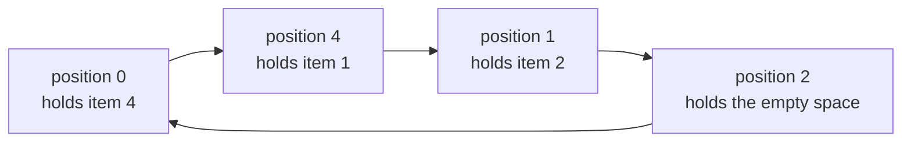

# Guided Example: Sort Array by Moving Items to Empty Space

## 1. The representative instance and the two legal sorted layouts

Take $n = 5$ and the permutation

$$\texttt{nums} = [4,\,2,\,0,\,3,\,1].$$

The values $1$ through $4$ are items; the single value `0` is the empty space. One
operation moves one item into the empty space, which is exactly an exchange of the
empty space with that item's position. The array counts as sorted only when the items
read in ascending order **and** the empty space occupies one of the two ends:

| Sorted layout | Positions $0,\dots,4$ | Empty-space home | Item order |
|:---|:---|:---:|:---|
| Target A — empty space first | `[0,1,2,3,4]` | position `0` | `1,2,3,4` ascending |
| Target B — empty space last | `[1,2,3,4,0]` | position `4` | `1,2,3,4` ascending |

Because the two layouts disagree about where the empty space belongs, the notion of a
value's *home position* is target-dependent. That single dependency is the whole
difficulty of the problem.

| Value | `0` | `1` | `2` | `3` | `4` |
|:---|:---:|:---:|:---:|:---:|:---:|
| Position in `nums` | `2` | `4` | `1` | `3` | `0` |
| Home under Target A | `0` | `1` | `2` | `3` | `4` |
| Home under Target B | `4` | `0` | `1` | `2` | `3` |
| Correct for Target A? | no | no | no | yes | no |
| Correct for Target B? | no | no | no | yes | no |

Only item `3` starts where both targets want it. The required answer for this instance
is `3`, and the sections below show why `3` is optimal instead of `4` or `5`, and how
the same reasoning decides every other input.

## 2. Reading the array as a permutation with one distinguished value

Fix one target so that every value has a definite home. Let $\pi$ be the permutation
that reports which value is stored at each position: $\pi(i)$ is the value at position
$i$, and the target is met exactly when $\pi(i) = i$ for every position $i$.

Within that fixed target, let $\kappa$ be the **marker**: the value that the empty space
must eventually become, already positioned in the relabelled problem so that its home is
position $\kappa$. Suppose the marker currently sits at position $p$, meaning
$\pi(p) = \kappa$. Then $p$ is precisely the position of the empty space.

A move picks a position $j \ne p$, lifts the item stored there, and drops it into
position $p$; the empty space effectively travels to $j$. In permutation language the
state is composed on the right with the transposition of the two positions:

$$\pi \;\leftarrow\; \pi \circ (p\; j).$$

Two consequences drive everything that follows.

1. The marker's position $p$ always satisfies $\pi(p) = \kappa$, and the chain
   $p \to \pi(p) = \kappa \to \pi(\kappa) \to \cdots$ shows that position $p$ and position
   $\kappa$ always lie in the **same cycle** of $\pi$. The marker's own cycle is therefore
   structurally privileged.
2. A move is a single transposition, so it can only merge two cycles into one or split
   one cycle into two. No move can quietly repair several positions at once.

## 3. Cycle decomposition of the instance under Target A

Under Target A the marker is the value `0`, whose home is position `0`, and it currently
occupies position `2`.

Walking the permutation from position `0` records the same structure:

| Step | Position | $\pi(\text{position})$ | Item belongs at | Cycle closes? |
|:---:|:---:|:---:|:---:|:---|
| 1 | `0` | `4` | `4` | no |
| 2 | `4` | `1` | `1` | no |
| 3 | `1` | `2` | `2` | no |
| 4 | `2` | `0` | `0` | yes, returns to position `0` |
| — | `3` | `3` | `3` | fixed point, cycle of length $1$ |

So there is one cycle of length $L = 4$ that contains the marker's home, plus one fixed
point. Two counts summarise any state:

- $M$ — the number of positions with $\pi(i) \ne i$ (here $M = 4$),
- $N$ — the number of cycles of length at least $2$ (here $N = 1$).

## 4. What one cycle costs to repair

**A misplaced cycle of length $L \ge 2$ that avoids $\kappa$ costs $L + 1$.** Write it as
$c_1 \to c_2 \to \dots \to c_L \to c_1$, where the item stored at position $c_i$ is
$c_{i+1}$ with subscripts taken modulo $L$. Move the item at $c_L$ — which is $c_1$ —
into the marker's home $\kappa$; this parks $c_1$ out of the way and puts the marker at
$c_L$. Then repeat for $i = L, L-1, \dots, 2$: the marker stands at $c_i$ while item
$c_i$ waits at $c_{i-1}$, so one move places $c_i$ at its home and shifts the marker to
$c_{i-1}$. When $i$ reaches $2$ the marker stands at $c_1$ and the parked item $c_1$ can
finally move home, returning the marker to $\kappa$. The count is
$1 + (L-1) + 1 = L + 1$, and the marker finishes exactly where the next cycle needs it,
so cycles can be repaired one after another.

**A misplaced cycle of length $L \ge 2$ that contains $\kappa$ costs only $L - 1$.** No
entry or exit move is needed because the marker is already inside the cycle. Repeatedly
take the item whose home equals the marker's current position and drop it there: that
move finalises one position for good and keeps the marker inside the same cycle. After
$L - 1$ such moves the only unfinished position is $\kappa$ itself, which already holds
the marker. The last move of this routine can be the one that carries the marker home.

Since the routines start and end with the marker at $\kappa$, the total is

$$\Phi(\pi) \;=\; \sum_{\substack{C \text{ a cycle of } \pi \\ \lvert C \rvert \ge 2}} \bigl(\lvert C \rvert + 1\bigr) \;-\; 2 \cdot \bigl[\pi(\kappa) \ne \kappa\bigr] \;=\; M + N - 2 \cdot \bigl[\pi(\kappa) \ne \kappa\bigr].$$

The correction term subtracts $2$ only when the marker is displaced, turning that one
cycle's $L + 1$ into $L - 1$.

| Cycle kind | Length | Marker inside it? | Operations needed |
|:---|:---:|:---:|:---:|
| Fixed point away from $\kappa$ | $1$ | no | `0` |
| Fixed point at $\kappa$ (marker already home) | $1$ | marker is home | `0` |
| Misplaced cycle avoiding $\kappa$ | $L \ge 2$ | no | $L + 1$ |
| Misplaced cycle containing $\kappa$ | $L \ge 2$ | yes | $L - 1$ |

## 5. Worked trace toward the empty-first target

Target A wants `[0,1,2,3,4]`. The marker is the value `0` with home position `0`, it
sits at position `2`, and the only misplaced cycle is
$0 \to 4 \to 1 \to 2 \to 0$, which contains $\kappa$. Section 4 therefore predicts
$L - 1 = 3$ moves. Each row below performs the prescribed move: drop the item whose home
equals the empty space's current position.

| Move | Item moved | Item sat at | Empty space sat at | Array afterwards | Positions now correct |
|:---:|:---:|:---:|:---:|:---|:---|
| — | — | — | `2` | `[4,2,0,3,1]` | `3` |
| 1 | `2` | `1` | `2` | `[4,0,2,3,1]` | `2`, `3` |
| 2 | `1` | `4` | `1` | `[4,1,2,3,0]` | `1`, `2`, `3` |
| 3 | `4` | `0` | `4` | `[0,1,2,3,4]` | `0`, `1`, `2`, `3` |

The final move is the interesting one: item `4` moves from position `0` into position
`4`, which simultaneously restores position `0` to the empty space and brings the marker
home. No earlier move ever disturbs a position already made correct, which is what makes
the routine reproducible rather than lucky.

The trace also shows why two moves cannot suffice: after two moves the array is
`[4,1,2,3,0]`, so item `4` is still away from home, and position `4` — not position `0` —
is the one holding the empty space. Target A is not yet met.

## 6. Target B: relabel the values so the empty space becomes a marker

Target B wants `[1,2,3,4,0]`: items ascending with the empty space last. Relabel every
value by subtracting one modulo $n$:

$$\mu(i) = \bigl(\pi(i) - 1\bigr) \bmod n .$$

Under this relabelling Target B becomes the identity permutation, and the value `0`
becomes the value $n - 1 = 4$, whose home under the identity target is position `4`.
So the machinery of Sections 2–4 applies verbatim with marker $\kappa = 4$. This is a
relabelling of *values*, not a move: it changes neither the set of positions nor the way
an operation transfers an item.

| Position | `0` | `1` | `2` | `3` | `4` |
|:---|:---:|:---:|:---:|:---:|:---:|
| `nums` under Target B | `4` | `2` | `0` | `3` | `1` |
| Relabelled $\mu$ | `3` | `1` | `4` | `2` | `0` |
| Home under the identity target | `0` | `1` | `2` | `3` | `4` |
| Misplaced? | yes | no | yes | yes | yes |

Following $\mu$ from position `4` gives the single cycle $4 \to 0 \to 3 \to 2 \to 4$ of
length $L = 4$, and it contains the marker home $4$; position `1` is a fixed point. Hence
$M = 4$, $N = 1$, the marker is displaced, and

$$\Phi = M + N - 2 = 4 + 1 - 2 = 3 .$$

Both targets therefore cost three moves, and the answer is $\min(3, 3) = 3$. The
arithmetic for the two targets can be laid side by side:

| Target | Marker $\kappa$ | Length of the marker's cycle | $M$ | $N$ | Marker displaced? | $\Phi = M + N - 2[\cdot]$ |
|:---|:---:|:---:|:---:|:---:|:---:|:---:|
| A — empty space first | `0` | `4` | `4` | `1` | yes | `3` |
| B — empty space last | `4` | `4` | `4` | `1` | yes | `3` |

Rewriting the Target B trace in the original values gives the three moves
`[4,2,0,3,1]` then `[4,2,3,0,1]` then `[0,2,3,4,1]` and finally `[1,2,3,4,0]`, which is a
different sequence from the Target A trace and yet has the same length. The final choice
is $\min(\Phi_A, \Phi_B)$.

## 7. Invariant and why no shorter sequence exists

Sections 4–6 exhibited a sequence of length $\Phi$, so the optimum is at most $\Phi$. A
matching lower bound needs an invariant that no single move can improve by more than one
unit. The quantity $\Phi$ defined above is that invariant.

**It vanishes only at a solved state.** If all positions are fixed then $N = 0$ and
$M = 0$, so $\Phi = 0$. Conversely, every cycle of length at least $2$ contributes at
least $2$ to $M$, so $M \ge 2N$; if $N \ge 1$ then $M + N \ge 3$ and the correction term
can remove at most $2$, leaving $\Phi \ge 1$. Hence $\Phi = 0$ forces $N = 0$, that is,
$\pi(i) = i$ everywhere plus the marker at home — a sorted array.

**Every move changes $\Phi$ by at least $-1$.** Classify a move by where the destination
$j$ lies and by what happens to the marker's cycle $C_\kappa$, whose length is always at
least $1$ and which always contains both $p$ and $\kappa$:

| Move | Effect on cycles of $\pi$ | $\Delta \Phi$ |
|:---|:---|:---:|
| $j$ lies in another misplaced cycle, marker displaced | $C_\kappa$ merges with that cycle | $-1$ |
| Marker already home, $j$ lies in a misplaced cycle | $\{\kappa\}$ merges with that cycle | $-1$ |
| Split of $C_\kappa$ that finalises exactly one position | $C_\kappa$ becomes a fixed point plus one smaller cycle | $-1$ |
| Marker in a $2$-cycle moves onto its home position | the $2$-cycle becomes two fixed points | $-1$ |
| $j$ is a fixed point while $C_\kappa$ is misplaced | $C_\kappa$ merges with a fixed point | $+1$ |
| $j$ is a fixed point and the marker is already home | two fixed points merge into a $2$-cycle | $+1$ |
| Split of $C_\kappa$ with $\ge 2$ positions left on both sides | $C_\kappa$ becomes two misplaced cycles | $+1$ |
| Marker reaches its home early while $C_\kappa$ still has $\ge 2$ leftovers | one fixed point plus one misplaced cycle | $+1$ |

Every entry is at least $-1$, so setting $\Delta\Phi_k \ge -1$ for the $k$-th move of any
sorting sequence of length $t$ gives

$$0 \;=\; \Phi_{\text{final}} \;=\; \Phi_{\text{initial}} + \sum_{k=1}^{t} \Delta \Phi_k \;\ge\; \Phi_{\text{initial}} - t, \qquad \text{hence} \qquad t \;\ge\; \Phi_{\text{initial}}.$$

Combined with the constructive sequence of length $\Phi_{\text{initial}}$, the minimum
number of operations for a fixed target equals $\Phi$ exactly, and the answer is the
smaller of the two targets' values. The entries with $\Delta \Phi = +1$ are precisely the
wasteful moves a solver must avoid: repairs that merge the marker with an already-correct
position, or that let the marker slip home before its cycle has been drained.

## 8. Boundary behaviour and traps exposed by this instance

The same formula explains the small instances that are easy to get wrong. Recall that
$M$ counts misplaced positions, $N$ counts cycles of length at least $2$, and the
correction $-2$ applies only when the marker is displaced.

| Instance | Target A cost | Target B cost | Answer | What the instance exposes |
|:---|:---:|:---:|:---:|:---|
| `[1,2,3,4,0]` | `4` | `0` | `0` | one target is already sorted; the other is not, so both must be measured |
| `[1,0,2,4,3]` | `4` | `2` | `2` | the displacement discount on the marker's own cycle decides the winner |
| `[0,3,2,1]` | `3` | `4` | `3` | a $2$-cycle avoiding the marker costs $L + 1 = 3$ even though the marker is home |
| `[2,3,1,0]` | `3` | `4` | `3` | a $4$-cycle containing the marker costs $L - 1 = 3$ |
| `[0,1]` | `0` | `1` | `0` | smallest legal length $n = 2$; the answer can be zero |
| `[0,2,1]` | `3` | `1` | `1` | the cheaper target needs the relabelling of Section 6 |

Three traps deserve naming.

- **Treating the two targets as symmetric.** They are not. Target B shifts every home by
  one and moves the empty space's home from position `0` to position `n - 1`; a cycle
  decomposition computed for one target says nothing about the other.
- **Confusing the marker's home with the marker's current position.** The discount in
  $\Phi$ depends on whether $\pi(\kappa) = \kappa$, not on where the empty space happens
  to be. In `[0,3,2,1]` the empty space is already at position `0`, yet the remaining
  $2$-cycle still costs $3$ moves.
- **Assuming the cost is the number of misplaced positions.** In the representative
  instance $M = 4$ but the answer is `3`, and in `[0,2,1]` the cheaper target has
  $M = 2$ and cost `1`. Cycle structure, not just the count of wrong positions, sets the
  price.

## 9. Time and auxiliary-space complexity

**Time: $\mathcal{O}(n)$.** Each target is evaluated by one sweep of the permutation. The
sweep starts a walk at every position that is not already fixed and not yet visited, and
each walk marks positions until it returns to a visited one; positions are marked once
within a sweep, so the two sweeps together inspect at most $2n$ positions. Producing the
relabelled copy for Target B costs another $n$ arithmetic operations. The total is
therefore $\Theta(n)$ work with a single pass over the array per target, and no sorting,
searching, or pairwise comparison is performed. This matches the input bound
$n \le 10^5$: the answer is found in linear time rather than by searching over move
sequences.

**Auxiliary space: $\mathcal{O}(n)$.** Beyond the input array, a sweep needs $n$ visited
flags so that each cycle is charged exactly once, and Target B needs a relabelled array
of $n$ values. Both are linear in $n$, so the additional memory is $\Theta(n)$ even
though the algorithm stores no move sequence. The visited flags cannot be replaced by
constant space in this formulation because a cycle walk must be able to recognise when it
has closed; the arithmetic itself — counting cycles, counting misplaced positions and
applying the $\pm 2$ correction — is constant work per position.