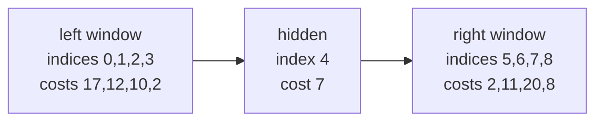

# Guided Example: Total Cost to Hire K Workers

## 1. The mandated hiring rule and the representative instance

We are given non-negative hiring costs indexed $0, \dots, n-1$, an integer $k$ of sessions,
and a window size $c$ (`candidates`). Every session hires exactly one worker under a rule
that is *prescribed*, not chosen: among the workers still unhired, take the one with the
lowest cost appearing in either the first $c$ remaining workers or the last $c$ remaining
workers, and break ties by the smallest original index.

Take

$$\texttt{costs} = [17,\,12,\,10,\,2,\,7,\,2,\,11,\,20,\,8], \qquad k = 3, \qquad c = 4 .$$

Here $n = 9$, and $2c = 8 < 9$, so the two windows are disjoint and exactly one worker —
the one at index `4` — is hidden between them at the start.

| Index | `0` | `1` | `2` | `3` | `4` | `5` | `6` | `7` | `8` |
|:---|:---:|:---:|:---:|:---:|:---:|:---:|:---:|:---:|:---:|
| `costs` | `17` | `12` | `10` | `2` | `7` | `2` | `11` | `20` | `8` |
| Initial window | first | first | first | first | hidden | last | last | last | last |
| Eligible in session 1? | yes | yes | yes | yes | no | yes | yes | yes | yes |

The required total for this instance is `11`. The instance is worth tracing in full
because it contains a genuine tie between two equal-cost eligible workers on opposite
sides of the array, and because the hidden worker at index `4` becomes eligible midway
through.

## 2. The state: two index windows and a shrinking hidden middle

Because a session may only look at the first $c$ and the last $c$ remaining workers, the
whole simulation needs just three pieces of positional state:

- $L$, the number of positions already absorbed into the **left window**;
- $R$, the smallest index already absorbed into the **right window**;
- the hidden middle $L \le i \le R-1$, which no session can see.

Initially $L = c$ and $R = n - c$, so the left window is positions $0 \dots c-1$ and the
right window is positions $n-c \dots n-1$. Hiring a worker never reshuffles the array:
indices are stable identities, and only the *membership* of the two windows changes.

The refill rule is forced by the definition of eligibility:

| Hire came from | Why the window must grow | Which position is revealed |
|:---|:---|:---|
| Left window ($i < L$) | removing a small index shifts the first $c$ remaining workers right by one | reveal position $L$, then increment $L$ |
| Right window ($i \ge L$) | removing a large index shifts the last $c$ remaining workers left by one | reveal position $R-1$, then decrement $R$ |

Each revealed position enters the window on the side that triggered the reveal and never
appears twice: the left reveals march rightwards from $L$ and the right reveals march
leftwards from $R-1$, so they only meet when the hidden middle is exhausted.

## 3. Session-by-session trace

| Session | Lowest eligible cost | Tied indices | Tie-break choice | Cost added | Running total |
|:---:|:---:|:---|:---:|:---:|:---:|
| 1 | `2` | `3` (left) and `5` (right) | smallest index, so `3` | `2` | `2` |
| 2 | `2` | `5` only | `5` | `2` | `4` |
| 3 | `7` | `4` only, present in both windows' union | `4` | `7` | `11` |

Reading the trace as a sequence of eligibility sets makes the behaviour explicit:

- **Session 1.** Eligible costs are `17, 12, 10, 2` from the left and `2, 11, 20, 8` from
  the right. The minimum `2` occurs twice, at index `3` and index `5`; the tie-break rule
  forces index `3`. That hire is on the left side, so position `4` — the entire hidden
  middle — is revealed with cost `7`.
- **Session 2.** The remaining workers are indices `0,1,2,4,5,6,7,8`. The first four are
  `0,1,2,4` and the last four are `5,6,7,8`, so the minimum is again `2`, now only at
  index `5`. The hidden middle is already empty, so no new position is revealed.
- **Session 3.** Seven workers remain, so the two windows overlap: their union is every
  remaining worker. Costs are `17, 12, 10, 7` on the left and `7, 11, 20, 8` on the right,
  and the smallest is `7` at index `4` — the worker who was invisible in session 1 and
  the first to be revealed in session 2's bookkeeping.

The hidden worker therefore contributes nothing before it is revealed and everything
after: the greedy simulation cannot "look ahead" into the middle, which is exactly why the
window state has to be maintained rather than recomputed from the whole array each time.

## 4. Heap bookkeeping: one entry per eligible worker

Implement the simulation with a min-heap keyed by the pair $(\text{cost}, \text{index})$.
The cost is the primary sort key so the pop returns a cheapest eligible worker, and the
index is the secondary key so the mandated tie-break is automatic. Every eligible worker
occupies exactly one heap entry, which means a pop is always a legal hire.

| Moment | Left heap `cost@index` | Right heap `cost@index` | $L$ | $R$ | Popped |
|:---|:---|:---|:---:|:---:|:---:|
| before session 1 | `17@0, 12@1, 10@2, 2@3` | `2@5, 11@6, 20@7, 8@8` | `4` | `4` | — |
| after session 1 | `17@0, 12@1, 10@2, 7@4` | `2@5, 11@6, 20@7, 8@8` | `5` | `4` | `2@3` |
| after session 2 | `17@0, 12@1, 10@2, 7@4` | `11@6, 20@7, 8@8` | `5` | `4` | `2@5` |
| after session 3 | `17@0, 12@1, 10@2` | `11@6, 20@7, 8@8` | `5` | `4` | `7@4` |

Two details in this table carry the method.

- After session 1 the left window grew by one entry (`7@4`), because the hire came from
  the left; the right heap is untouched.
- By session 2, $L = 5$ and $R = 4$, so $L > R$: the hidden middle is empty. The refill
  step is skipped from then on, and the two heaps together contain every remaining worker.
  Session 3's worker `4` was already sitting in the left heap, so no new push was needed.

## 5. Why the simulation is faithful: the window invariant

The state maintained by the two pointers satisfies a single invariant that makes
correctness immediate: **before every session, the left heap holds exactly the first $c$
remaining workers, the right heap holds exactly the last $c$ remaining workers, and
together they hold every worker the session may legally consider.**

Three claims establish that invariant and, with it, the faithfulness of the heap process.

**Every eligible worker is in a heap before its session.** Initially the windows hold
exactly positions $0 \dots c-1$ and $n-c \dots n-1$. While the middle is non-empty, each
hire triggers exactly one reveal from the side that lost a worker, which restores that
window to $c$ workers; the other window already has $c$ unchanged workers. So before every
session each window holds $c$ workers, or all remaining workers if fewer than $c$ exist.

**No ineligible worker is ever in a heap.** Positions are pushed only when they enter a
window: at initialisation, or as the reveal of position $L$ or $R-1$. Revealed positions
lie strictly inside the shrinking middle, and $L$ only increases while $R$ only decreases,
so no position is pushed twice and no position outside a window is ever pushed.

**The popped entry is the mandated hire.** The heap's minimum key is the least cost among
all eligible workers, and among workers sharing that cost it is the smallest index,
because the pair key is compared lexicographically. That is precisely "lowest cost from
the first $c$ or last $c$ remaining workers, ties broken by the smallest index".

Because each of the $k$ pops adds the mandated worker's cost, the running sum after $k$
sessions is the required total: for the instance, `2 + 2 + 7 = 11`.

## 6. The collapse when the two windows cover every worker

There is one regime in which the whole simulation collapses to a single sort. If
$2c \ge n$ then the first $c$ and last $c$ workers of the *original* array already cover
all $n$ positions, and after $t$ hires only $n - t \le n \le 2c$ workers remain, so the
first $c$ and last $c$ remaining workers still cover all of them. The eligible set is
therefore always the entire set of remaining workers.

In that regime every session must hire the globally cheapest remaining worker, so the
total is simply the sum of the $k$ smallest costs — the session order and the tie-break
cannot change the sum.

| Instance | $n$ | $c$ | $2c \ge n$? | Eligible set | Total |
|:---|:---:|:---:|:---:|:---|:---|
| `[1,2,4,1]`, $k = 3$ | `4` | `3` | yes | always every remaining worker | sum of three smallest `1+1+2 = 4` |
| `[17,12,10,2,7,2,11,20,8]`, $k = 3$ | `9` | `4` | no | two disjoint windows plus one hidden worker | simulation gives `11` |
| `[3,3,3,3,3,3]`, $k = 4$ | `6` | `2` | no | windows grow as workers are hired | simulation gives `12` |
| `[4,4,1,4,4]`, $k = 3$ | `5` | `2` | no | the cheap middle worker at index `2` must be revealed | simulation gives `9` |

The second and fourth rows show why the shortcut cannot be applied blindly: with
$2c < n$ a cheap worker can sit in the hidden middle, and the greedy rule is forbidden
from hiring it until a window reveal exposes it.

## 7. Boundary cases and the traps they expose

Every row below was checked against the required output for its instance.

| Instance | Answer | What it exposes |
|:---|:---:|:---|
| `costs = [1,2,4,1], k = 3, c = 1` | `4` | one candidate per side; each hire reveals the next middle worker from its own side |
| `costs = [9,8,7,1,2], k = 3, c = 1` | `10` | successive inexpensive workers enter from the right, so the right window drives the total |
| `costs = [3,3,3,3,3,3], k = 4, c = 2` | `12` | all costs equal, so the tie-break by smallest index decides every session |
| `costs = [4,4,1,4,4], k = 3, c = 2` | `9` | the cheapest worker is hidden until a left-side hire reveals it |
| `costs = [7,1,6,2,5], k = 5, c = 2` | `21` | with $k = n$ every worker is hired, so the total is the sum of all costs |
| `costs = [2], k = 1, c = 1` | `2` | the smallest legal input has a single eligible worker |
| `costs = [17,17], k = 3, c = 4` | `34` | authors' robustness instance where $k$ exceeds the array length; the cover-everything branch sums the available workers |

Four traps are worth naming.

- **Recomputing the windows from the original array.** After a hire, "the first $c$
  remaining workers" are not the original positions $0 \dots c-1$; the window slides past
  the hired worker and must reveal position $L$.
- **Revealing from the wrong side.** A left-window hire reveals position $L$; a
  right-window hire reveals position $R-1$. Revealing the same side twice would either
  duplicate a worker or omit one, and an omitted worker is invisible for the rest of the
  simulation.
- **Ignoring the tie-break.** The heap key must be the pair $(\text{cost}, \text{index})$.
  Keying only on cost makes the popped index arbitrary, and in the representative instance
  session 1 has two eligible workers of cost `2` at indices `3` and `5`.
- **Refilling after the middle is empty.** Once $L > R$ every remaining worker is already
  in a heap; pushing another entry would double-count a worker and could hire them twice.
  The guard on the refill step exists for exactly this case.

## 8. Time and auxiliary-space complexity

**Time.** Initialisation pushes $2c$ entries and one heap build costs $\mathcal{O}(c)$.
Each of the $k$ sessions performs one pop and at most one push on a heap holding at most
$2c$ entries, so the loop costs $\mathcal{O}(k \log c)$. The cover-everything branch, when
$2c \ge n$, spends $\mathcal{O}(n \log n)$ on sorting. The worst case over both branches is
therefore

$$\mathcal{O}\bigl(n \log n\bigr),$$

attained only by the sort; the simulation branch is
$\mathcal{O}\bigl(c + k \log c\bigr)$ and is the cheaper route whenever the windows are
genuinely disjoint, which is the case the problem is built around.

**Auxiliary space.** The two heaps hold at most one entry per eligible worker, and the
number of eligible workers is at most $2c$ while the middle is non-empty and at most the
number of remaining workers afterwards, so the heap storage is $\mathcal{O}(c)$ — linear in
the window size, not in $n$. The simulation itself keeps only the two pointers $L$, $R$,
the running total and the heap, so no per-session copy of the array and no recursion are
needed. In the shortcut branch the sort needs up to $\mathcal{O}(n)$ extra space for its
sorted copy, which is the worst case for auxiliary memory.
