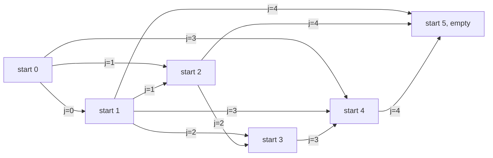

# Guided Example: Minimum Subarrays in a Valid Split

## 1. The instance, the rules, and the answer we must reach

The official instance is the five-element array `nums = [2, 6, 3, 4, 3]`, and the required
output is $2$. To earn that answer we must cover every index with contiguous, non-empty
subarrays (each element belongs to exactly one of them), and every subarray must satisfy
one constraint: the greatest common divisor of its **first** element and its **last**
element is greater than $1$. Among all such coverings we want the fewest subarrays. The
whole problem is therefore a *partition* problem — the parts are cut out of the array in
order, they never interleave, and only the two ends of each part are ever inspected.

A useful first move is to ask what a part of length one means. For a single element the
first and last element are the same index, so the condition collapses to
$\gcd(x, x) = x > 1$, that is, $x \ge 2$. Singletons are the cheapest possible parts, so
every element with a value of at least $2$ can always stand alone. The value $1$ is the
sole exception: $\gcd(1, x) = 1$ for every integer $x$, so an element equal to $1$ can
never serve as the first or the last element of any part.

| Index `i` | `nums[i]` | Factorisation | Singleton `[nums[i]]` legal? | Reason |
|:---:|:---:|:---:|:---:|:---|
| 0 | `2` | $2$ | yes | $\gcd(2, 2) = 2 > 1$ |
| 1 | `6` | $2 \cdot 3$ | yes | $\gcd(6, 6) = 6 > 1$ |
| 2 | `3` | $3$ | yes | $\gcd(3, 3) = 3 > 1$ |
| 3 | `4` | $2^{2}$ | yes | $\gcd(4, 4) = 4 > 1$ |
| 4 | `3` | $3$ | yes | $\gcd(3, 3) = 3 > 1$ |

Because every value in this instance exceeds $1$, the trivial split into five singletons is
already valid, so the answer is certainly at most $5$. The interesting work is proving
that it can be pushed down to $2$ and cannot be pushed down to $1$.

## 2. The second reduction: two numbers connect when they share a prime

The endpoint test never needs the full gcd value — only whether it exceeds $1$. Since
$\gcd(a, b) > 1$ holds exactly when $a$ and $b$ share at least one prime factor, we can
think of each element as a small *set of primes* rather than a number. Two positions may
be the two ends of the same part precisely when their prime sets intersect. This turns the
arithmetic condition into a connectivity condition between positions.

| Index `i` | `nums[i]` | Prime set | Positions it can pair with as an endpoint | Legal partner indices `j` |
|:---:|:---:|:---:|:---|:---|
| 0 | `2` | $\{2\}$ | even values at indices $0, 1, 3$ | `0`, `1`, `3` |
| 1 | `6` | $\{2, 3\}$ | even values and multiples of $3$ | `1`, `2`, `3`, `4` |
| 2 | `3` | $\{3\}$ | multiples of $3$ at indices $1, 2, 4$ | `2`, `4` |
| 3 | `4` | $\{2\}$ | even values at indices $0, 1, 3$ | `3` |
| 4 | `3` | $\{3\}$ | multiples of $3$ at indices $1, 2, 4$ | `4` |

The partner indices in the last column are restricted to $j \ge i$ because the first
element of a part precedes or coincides with its last element. Reading that column already
suggests the winning structure: index $0$ can only end a part at $0$, $1$, or $3$, and
index $1$ can reach index $4$, which is the final index of the array.

## 3. The state: the cheapest cover of a suffix

Covering a prefix forces every earlier decision to be final, so the natural state is a
suffix. Let $dp[i]$ be the minimum number of valid parts needed to cover
`nums[i..n-1]` completely, using only cuts inside that suffix, with $dp[n] = 0$ for the
empty suffix. The first part of that cover starts at index $i$ and ends at some index
$j \ge i$; it is legal exactly when the two prime sets meet, and the rest of the suffix
begins at $j + 1$:

$$
dp[i] = \min \{\, 1 + dp[j + 1] \;:\; i \le j < n \ \text{and}\ \gcd(\text{nums}[i], \text{nums}[j]) > 1 \,\}.
$$

When no index $j$ qualifies, the minimum over an empty set is $+\infty$, which records
that this suffix cannot be covered at all. The required answer is $dp[0]$, reported as
$-1$ when it stays infinite. The recurrence is well founded because every candidate
depends only on strictly larger suffix starts, so the states can be filled from
$i = n - 1$ downward.

## 4. Worked trace on the official instance

Every candidate cut is evaluated below in the order the suffix states are completed,
that is from the right end of the array back to index $0$. The column
`1 + dp[j+1]` shows the part count that this particular cut would produce; the last
column keeps the best value seen so far for that suffix start, and that value becomes
$dp[i]$.

| Suffix start `i` | `nums[i]` | Cut end `j` | `nums[j]` | Shared prime? | Legal cut | Candidate `1 + dp[j+1]` | Best for `i` |
|:---:|:---:|:---:|:---:|:---:|:---:|:---:|:---:|
| 4 | `3` | 4 | `3` | $3$ | yes | $1 + dp[5] = 1$ | 1 |
| 3 | `4` | 3 | `4` | $2$ | yes | $1 + dp[4] = 2$ | 2 |
| 3 | `4` | 4 | `3` | none | no | rejected | 2 |
| 2 | `3` | 2 | `3` | $3$ | yes | $1 + dp[3] = 3$ | 3 |
| 2 | `3` | 3 | `4` | none | no | rejected | 3 |
| 2 | `3` | 4 | `3` | $3$ | yes | $1 + dp[5] = 1$ | 1 |
| 1 | `6` | 1 | `6` | $2, 3$ | yes | $1 + dp[2] = 2$ | 2 |
| 1 | `6` | 2 | `3` | $3$ | yes | $1 + dp[3] = 3$ | 2 |
| 1 | `6` | 3 | `4` | $2$ | yes | $1 + dp[4] = 2$ | 2 |
| 1 | `6` | 4 | `3` | $3$ | yes | $1 + dp[5] = 1$ | 1 |
| 0 | `2` | 0 | `2` | $2$ | yes | $1 + dp[1] = 2$ | 2 |
| 0 | `2` | 1 | `6` | $2$ | yes | $1 + dp[2] = 2$ | 2 |
| 0 | `2` | 2 | `3` | none | no | rejected | 2 |
| 0 | `2` | 3 | `4` | $2$ | yes | $1 + dp[4] = 2$ | 2 |
| 0 | `2` | 4 | `3` | none | no | rejected | 2 |

Two rows carry the whole lesson. At suffix start $2$ the cheap cut $j = 2$ costs $3$,
but the far cut $j = 4$ costs only $1$: grabbing the whole tail `[3, 4, 3]` as one part
is legal because its endpoints are both `3`. At suffix start $1$ the same pattern repeats —
the cut $j = 4$ turns `[6, 3, 4, 3]` into a single part because $\gcd(6, 3) = 3 > 1$.

| Suffix start `i` | Suffix | `dp[i]` | Cheapest first part | Witness cut `j` |
|:---:|:---|:---:|:---|:---:|
| 5 | empty | 0 | — | — |
| 4 | `[3]` | 1 | `[3]` | 4 |
| 3 | `[4, 3]` | 2 | `[4]` | 3 |
| 2 | `[3, 4, 3]` | 1 | `[3, 4, 3]` | 4 |
| 1 | `[6, 3, 4, 3]` | 1 | `[6, 3, 4, 3]` | 4 |
| 0 | `[2, 6, 3, 4, 3]` | 2 | `[2]`, `[2, 6]` or `[2, 6, 3, 4]` | 0, 1 or 3 |

## 5. Reconstructing the answer and the exact minimum

$dp[0] = 2$, and each of the three cuts that achieved it can be expanded into a complete
covering, because $dp[1] = 1$, $dp[2] = 1$ and $dp[4] = 1$ respectively. The minimum part
count is therefore $2$, but the *split itself is not unique* — a detail that matters if a
later task asks for one optimal partition rather than its size.

| Optimal two-part split | First part | Endpoints of first part | Second part | Endpoints of second part |
|:---|:---|:---|:---|:---|
| cut after index 0 | `[2]` | $2$ and $2$, $\gcd = 2$ | `[6, 3, 4, 3]` | $6$ and $3$, $\gcd = 3$ |
| cut after index 1 | `[2, 6]` | $2$ and $6$, $\gcd = 2$ | `[3, 4, 3]` | $3$ and $3$, $\gcd = 3$ |
| cut after index 3 | `[2, 6, 3, 4]` | $2$ and $4$, $\gcd = 2$ | `[3]` | $3$ and $3$, $\gcd = 3$ |

One part is impossible, and the trace shows why without any case analysis: the only
one-part split has first element `2` and last element `3`, whose prime sets $\{2\}$ and
$\{3\}$ are disjoint, so $dp[0]$ can never be $1$ — the recurrence rejects exactly that
single candidate when it tests $j = 4$ from suffix start $0$.

The legal-cut structure is easier to see as a graph. Positions $0 \dots 5$ are suffix
starts, and an edge from $i$ to $j + 1$ labelled $j$ records that a part may end at $j$
and hand the rest of the array to suffix $j + 1$. The answer is the fewest edges on a path
from $0$ to $5$.

Every edge advances the suffix start by at least one, so the graph is acyclic and the
shortest path from `start 0` to `start 5` — two edges — is exactly the minimum number of
parts.

## 6. Why the reasoning is correct

The invariant maintained while filling the table from right to left is:

> For every index $i$ already processed, $dp[i]$ equals the true minimum number of valid
> parts that cover `nums[i..n-1]`, or $+\infty$ when no such covering exists.

Two directions establish it. For **soundness**, whenever the recurrence writes a finite
value it does so from a legal cut $j$ and a finite $dp[j+1]$, and by the invariant that
latter value is realised by an actual covering of `nums[j+1..n-1]`. Prefixing the legal
part `nums[i..j]` yields a covering of `nums[i..n-1]` with exactly $1 + dp[j+1]$ parts, so
no stored value is smaller than a real covering. For **completeness**, take any valid
covering of `nums[i..n-1]`; its first part is a legal part ending at some index $j$, and
the remaining parts form a valid covering of `nums[j+1..n-1]` with one fewer part. That
$j$ is one of the candidates the recurrence examines, so the recurrence sees a candidate
no larger than the covering being considered, and the stored minimum is no larger than
the true optimum. The two bounds meet, so the table is exact.

The argument also explains why the minimum is sought at $dp[0]$ rather than at some
interior state: a covering of the whole array is precisely a covering of the suffix
starting at index $0$, and the parts are contiguous, so no covering can skip the first
index. Contiguity is what makes the suffix decomposition exhaustive — a partition of an
array into the fewest valid parts must decide only *where the first part ends*.

## 7. Boundary and trap analysis

| Scenario | Instance | Superficially tempting reasoning | What actually happens | Outcome |
|:---|:---|:---|:---|:---|
| `1` at the first index | `[1, 2, 1]` | pair the leading `1` with a later even value somehow | index $0$ must be the first element of the first part, and $\gcd(1, x) = 1$ always | `-1` |
| `1` at the last index | `[2, 6, 1]` | cover the tail `[6, 1]` as one part | the trailing `1` must end the final part, and $\gcd(6, 1) = 1$ | `-1` |
| interior `1`s | `[6, 1, 1, 10]` | the `1`s need their own parts, so at least three parts | a `1` may sit strictly inside a part; `[6, 1, 1, 10]` has endpoints $6$ and $10$ sharing prime $2$ | `1` |
| repeated prime across a gap | `[997, 1, 997]` | the interior `1` forces extra parts | the outer `997`s share the prime $997$, so one part covers everything | `1` |
| pairwise coprime values | `[2, 3, 5, 7]` | some two-element part must exist | no two values share a prime, so every part must be a singleton | `4` |
| lone interior `1` with no prime bridge | the 35-element sentinel instance | an interior `1` is harmless once endpoints are chosen | every value after index $23$ is a prime occurring nowhere else in the array, so no part can start before the `1` and end after it | `-1` |
| every value at least `2` | any such array | a split might still be impossible | the all-singleton covering is always valid, so the answer is at most $n$ and never $-1$ | at most `n` |

The most instructive trap is the last-but-one row. A `1` is not automatically repairable:
it must be swallowed by a part whose two endpoints share a prime, and that requires a
*prime bridge* spanning the position of the `1`. The value `1` merely forces the part
boundaries away from its index; whether such a straddling part exists is a global
question about the whole array, which is exactly what the suffix recurrence decides.

## 8. Alternatives and why the recurrence is preferred

| Approach | Idea | Cost | Failure mode or tradeoff |
|:---|:---|:---|:---|
| Enumerate every cut set | try all $2^{n-1}$ ways to place cuts and keep the valid ones with fewest parts | exponential in $n$ | hopeless already at moderate $n$; cannot survive the $n \le 1000$ limit |
| Earliest legal cut (greedy) | always end the current part at the smallest index sharing a prime with its start | one linear scan per part | on `[2, 6, 3, 4, 3]` it takes `[2]`, then `[6]`, then `[3]`, then `[4]`, then `[3]` — five singleton parts where two suffice |
| Farthest legal cut (greedy) | always end the current part at the largest index sharing a prime with its start | one linear scan per part | looks right on this instance (it finds $2$), but on `[2, 2, 6, 5, 3]` it takes `[2, 2, 6]`, then `[5]`, then `[3]` — three parts, while `[2, 2]` followed by `[6, 5, 3]` is valid with two |
| Shortest path over suffix starts | build the cut graph and run breadth-first search from `start 0`, since every cut costs one part | $O(n^2)$ edges, $O(n^2)$ time | gives the same optimum as the recurrence but materialises every edge explicitly, spending more memory for no benefit |
| Suffix dynamic programming | the recurrence of section 3, filled from right to left | $O(n^2 \log V)$ time, $O(n)$ space | the method used here; it keeps only one number per suffix and never stores the graph |

The two greedy failures are worth separating. Earliest-cut greedy fails because a locally
cheap short part wastes the long reach of a highly divisible value. Farthest-cut greedy
fails for the opposite reason: reaching as far as possible is only valuable if the
remainder is still cheap, and in `[2, 2, 6, 5, 3]` the jump from index $0$ to index $2$
strands the coprime tail `[5, 3]`, whereas the shorter part `[2, 2]` leaves the coprime
tail `[6, 5, 3]` whose first element shares the prime $3$ with its last. Neither locally
greedy rule can see that trade, which is why a full suffix minimum is needed.

## 9. Complexity: time and auxiliary space

Let $n$ be the length of `nums` and let $V = \max(\text{nums})$, at most $10^{5}$. Both
bounds below follow from the structure of the recurrence rather than from measurement.

**Time.** There are $n + 1$ suffix states. State $i$ inspects at most $n - i$ candidate
cut positions, so the total number of inspected pairs is

$$
\sum_{i=0}^{n-1} (n - i) = \frac{n(n+1)}{2} = O(n^{2}).
$$

Each inspection performs one gcd computation, and the Euclidean algorithm costs
$O(\log \min(a, b)) = O(\log V)$ arithmetic steps, so the running time is
$O(n^{2} \log V)$. With $n = 1000$ that is roughly half a million candidate pairs, each
with a gcd over values below $10^{5}$ — comfortably within limits. The prime-set view of
section 2 does not change the bound; it only explains why the gcd test is the right
predicate.

**Auxiliary space.** The table holds one value per suffix start, so $O(n)$ numbers. If the
states are computed by memoised recursion instead of a bottom-up loop, the call stack can
reach depth $n$ and therefore also contributes $O(n)$; an iterative fill needs only the
array itself. The candidate scan of a single state uses $O(1)$ extra working values, and
neither a graph nor a set of prime factors has to be stored. Total auxiliary space is
$O(n)$.