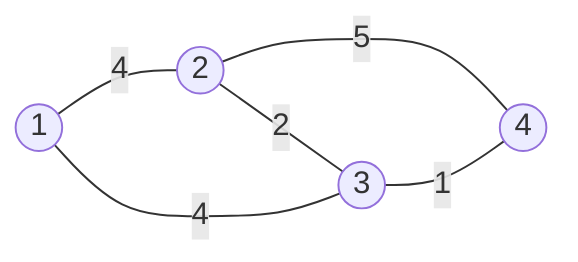

# Guided Example: Minimum Cost to Buy Apples

## 1. The round trip collapses into one scaled shortest path

Suppose you start at city $s$, travel to city $u$, buy the apple there, and
return to $s$. Let $d(s,u)$ be the cheapest travel cost of a single trip between
the two cities. The journey has exactly three cost components, and only two of
them are under your control.

| Component | Expression | Depends on | Why it is not independently choosable |
|---|---|---|---|
| Outbound travel | $\text{out} \ge d(s,u)$ | the route you take to $u$ | any route cheaper than the shortest one is impossible by definition of $d$ |
| Apple purchase | $\texttt{appleCost}[u]$ | the city $u$ you choose | a fixed price once $u$ is fixed |
| Return travel | $\text{back} = k \cdot \text{out}'$ | the route you take home, scaled by $k$ | every road is traversed again, now costing $k$ times as much |

The decisive observation concerns the return leg. The roads are
**bidirectional** and every travel cost is positive, so the reverse of any path
from $s$ to $u$ is a path from $u$ to $s$ of exactly the same cost. Therefore
$\text{out}' \ge d(u,s) = d(s,u)$, and the cheapest return is to retrace the
cheapest outbound path. Because $k \ge 1$ is a positive constant, multiplying
all return costs by $k$ does not change which return path is cheapest. The round
trip through $u$ therefore costs exactly

$$
C(s, u) \;=\; \underbrace{d(s,u)}_{\text{outbound}} \;+\;
\underbrace{\texttt{appleCost}[u]}_{\text{purchase}} \;+\;
\underbrace{k \cdot d(s,u)}_{\text{return}}
\;=\; (k+1)\, d(s,u) + \texttt{appleCost}[u].
$$

The problem "walk out, buy, come back with inflated prices" has become the
problem "pick a city, pay $k+1$ times its distance, and add its apple price".

The official instance is the four-city network below, with travel costs on the
edges and apple prices `[56, 42, 102, 301]` for cities 1 to 4 at $k = 2$, so
$k + 1 = 3$.

## 2. One distance array per starting city

For a fixed start $s$ the answer is the minimum of the closed-form cost over
every possible purchase city:

$$
\texttt{answer}[s] \;=\; \min_{u} \Bigl( (k+1)\, d(s,u) + \texttt{appleCost}[u] \Bigr),
\qquad u = s \text{ included with } d(s,s) = 0.
$$

Including $u = s$ is what encodes the "buy locally" option: it contributes
exactly `appleCost[s]` and acts as an upper bound that travelling must beat. A
Dijkstra run from $s$ produces every $d(s,u)$ simultaneously, so one shortest
path computation answers one starting city completely. The evaluation can even
be folded into the Dijkstra loop: whenever a city $u$ is settled at distance
$d$, the expression $(k+1)d + \texttt{appleCost}[u]$ is one candidate for
$\texttt{answer}[s]$.

Two contract details are easy to lose here. `roads` and `appleCost` are
**1-based**, while indices inside a shortest-path routine are usually 0-based, so
every road endpoint needs a shift by one; and the returned array is 1-based in
the same order as `appleCost`.

## 3. Worked trace of the first official instance

The shortest-path distances between all pairs of cities of the sample network
are the raw material for every answer. They are symmetric because the graph is
undirected, and the diagonal is zero.

| From $s$ \ To $u$ | City 1 | City 2 | City 3 | City 4 |
|---|---|---|---|---|
| City 1 | 0 | 4 | 4 | 5 |
| City 2 | 4 | 0 | 2 | 3 |
| City 3 | 4 | 2 | 0 | 1 |
| City 4 | 5 | 3 | 1 | 0 |

The entry `dist[4][2] = 3` is worth pausing on: the direct road `4 -- 2` costs
$5$, but the detour `4 -> 3 -> 2` costs $1 + 2 = 3$, so the indirect path wins.
This is exactly the case the official explanation uses for starting city 4.

Multiplying each row by $k + 1 = 3$ and adding the apple price of the
destination city gives the full candidate table; the row minimum is the answer.

| Start $s$ | Buy at 1: $3 \cdot d + 56$ | Buy at 2: $3 \cdot d + 42$ | Buy at 3: $3 \cdot d + 102$ | Buy at 4: $3 \cdot d + 301$ | Row minimum |
|---|---|---|---|---|---|
| City 1 | $0 + 56 = 56$ | $12 + 42 = 54$ | $12 + 102 = 114$ | $15 + 301 = 316$ | **54** |
| City 2 | $12 + 56 = 68$ | $0 + 42 = 42$ | $6 + 102 = 108$ | $9 + 301 = 310$ | **42** |
| City 3 | $12 + 56 = 68$ | $6 + 42 = 48$ | $0 + 102 = 102$ | $3 + 301 = 304$ | **48** |
| City 4 | $15 + 56 = 71$ | $9 + 42 = 51$ | $3 + 102 = 105$ | $0 + 301 = 301$ | **51** |

The row minima are $[54, 42, 48, 51]$, the official output. Note that cities 1
and 3 both buy at city 2 even though city 2 is not the nearest city to either of
them in the "cheapest apple" sense — city 1's own apple at 56 is only 2 more
than the 54 achieved by paying 12 in travel to reach a 42 apple, and city 3
reaches city 2 at distance 2 for the same total of 48.

## 4. Per-step Dijkstra state from city 4

Starting city 4 has the most interesting frontier because its best purchase is
two hops away. Distances are settled in increasing order of travel cost, and
each settled city contributes one candidate value.

| Step | Popped entry (key, city) | Key vs settled $d$ | Candidate $(k{+}1)\cdot\text{key} + \texttt{appleCost}$ | Running best | Relaxations performed |
|---|---|---|---|---|---|
| 1 | $(0, 4)$ | $0 = d(4,4)$ | $0 + 301 = 301$ | 301 | relax `4->2` to $5$; relax `4->3` to $1$ |
| 2 | $(1, 3)$ | $1 = d(4,3)$ | $3 + 102 = 105$ | 105 | shorten $d(4,2)$ from $5$ to $1+2=3$; set $d(4,1) = 1+4 = 5$ |
| 3 | $(3, 2)$ | $3 = d(4,2)$ | $9 + 42 = 51$ | **51** | `2->1` would give $7 > 5$: no change |
| 4 | $(5, 1)$ | $5 = d(4,1)$ | $15 + 56 = 71$ | 51 | `1->2` would give $9 > 3$; `1->3` would give $9 > 1$: no change |
| 5 | $(5, 2)$ | $5 > d(4,2) = 3$ (stale) | $15 + 42 = 57$ | 51 | none; the frontier is empty |

Step 3 is the answer for start city 4: travel $4 \to 3 \to 2$ costing $3$,
buy the apple for $42$, and return the same way for $3 \cdot 3 = 9$, totalling
$51$. Step 5 shows a **stale** queue entry — city 2 was pushed with key $5$
before it was improved to $3$. A stale entry has a key larger than the settled
distance, so its candidate value can only overshoot; because every city is also
popped once with its final distance, the minimum is unaffected. A partly updated
priority queue is therefore safe here, but only because the minimum is taken
over all pops.

## 5. Boundary analysis

| Situation | Input | Answer | Mechanism that decides it |
|---|---|---|---|
| Minimum city count | `n = 2`, roads `[[1,2,10]]`, `appleCost = [100,1]`, `k = 1` | `[21, 1]` | travel $1 \to 2$ costs $10 + 1 \cdot 10 = 20$, so $21$ beats the local $100$ |
| Local purchases win | `n = 3`, triangle with costs $5,1,2$, `appleCost = [2,3,1]`, `k = 3` | `[2, 3, 1]` | the multiplier $k+1 = 4$ makes every trip cost more than the price gap |
| Very large return factor | chain `1-2-3` with costs $1,1$, `appleCost = [10,20,1]`, `k = 100` | `[10, 20, 1]` | reaching city 3 costs $2 + 100 \cdot 2 = 202$, far beyond the local $10$ |
| Indirect path beats a direct road | roads `1-2` cost $2$, `2-3` cost $2$, `1-3` cost $10$, `appleCost = [100,100,1]`, `k = 2` | `[13, 7, 1]` | $d(1,3) = 4$ through city 2, not $10$ |
| Disconnected components | edges `1-2` and `3-4` only, `appleCost = [100,1,100,2]`, `k = 2` | `[4, 1, 5, 2]` | city 1 can never reach city 3 or 4; each component keeps its own best source |
| Chain with competing sources | path of four edges of cost $3$, `appleCost = [1,100,40,100,2]`, `k = 1` | `[1, 7, 13, 8, 2]` | city 3 is served by the cheap apple at city 1 (distance 6, total 13), not by its own $40$ |
| Shortcut edge in a cycle | cycle `1-2-3-4-1` with costs $8,8,8,1$, `appleCost = [100,100,100,5]`, `k = 2` | `[8, 32, 29, 5]` | the cheap edge `4-1` gives $d(1,4) = 1$, so city 1 buys for $5 + 3 = 8$ |

Three traps are exposed by these rows. First, **the cheapest apple is not always
the answer**: in the chain case city 2 has a $100$ apple and travels to city 1
for a total of $7$, beating every local option but still not using the nearest
or the cheapest city alone. Second, **the nearest city is not always the
answer**: in the first sample, city 1's nearest neighbour is city 2 at distance
$4$, but the value comes from the sum of distance and price, and a closer city
with an expensive apple loses. Third, **disconnected cities must stay
reachable-free**: cities that Dijkstra never settles simply never contribute a
candidate, which is why the pair `1-2` and `3-4` produces no cross-component
purchase.

## 6. Why the reasoning is correct

**Round-trip lemma.** For any purchase city $u$, the cheapest possible round
trip costs $(k+1)\,d(s,u) + \texttt{appleCost}[u]$. *Lower bound:* any outbound
walk costs at least $d(s,u)$, and any return walk costs $k$ times a walk from
$u$ to $s$, whose length is at least $d(u,s) = d(s,u)$ because the graph is
undirected. *Achievability:* walk a shortest $s$-to-$u$ path and retrace it.

**Dijkstra invariant.** Distances are finalized in non-decreasing order, so the
first time a city is popped its key equals its true shortest distance from the
start; non-negative edge weights are what make that order valid. Every reachable
city is popped at least once, so no purchase city is missed.

**Invariant of the running minimum.** After each pop the accumulator equals the
minimum of $(k+1)d + \texttt{appleCost}[u]$ over all cities popped so far. Stale
entries cannot corrupt it: a stale key is at least the settled distance, so its
candidate is at least the value already contributed by that city's first pop,
and the minimum over all pops therefore equals the minimum over all cities. That
is why the loop needs no early exit and no explicit check for staleness, and why
it can stop when the queue empties even for start cities in a small component.

**Completeness.** The answer array is assembled by independently optimizing each
starting city; the choices for different starting cities do not interact, since
each customer walk is a separate journey. Hence the output is exactly
$\bigl[\min_u C(1,u), \min_u C(2,u), \dots, \min_u C(n,u)\bigr]$.

## 7. Alternatives compared

Let $n$ be the number of cities, $m = \texttt{roads.length}$ the number of
undirected roads, and note $m \le 2000$ and $n \le 1000$.

| Method | How it computes the answers | Time | Auxiliary space | Verdict |
|---|---|---|---|---|
| One Dijkstra per starting city with the candidate folded in (traced above) | $n$ separate single-source runs, each accumulating $\min_u (k+1)d + \texttt{appleCost}[u]$ | $O\bigl(n\,(n+m)\log n\bigr)$ | $O(n + m)$ | the canonical method; straightforward and comfortably inside the limits |
| Virtual super-source Dijkstra | add a source $S$ with an edge of weight $\texttt{appleCost}[u]$ to every city $u$, and scale every road weight to $(k+1)w$; then $\texttt{answer}[s] = d(S,s)$ | $O\bigl((n+m)\log n\bigr)$ | $O(n + m)$ | one run instead of $n$; the scaled weights keep the arithmetic exact in integers |
| Floyd–Warshall all-pairs | fill an $n \times n$ distance matrix, then evaluate every $(s,u)$ pair | $O(n^3)$ | $O(n^2)$ | about $10^9$ relaxation steps at $n = 1000$; simpler to write but needlessly slow |
| Repeated BFS | treat every road as one step and count hops | $O(n(n+m))$ | $O(n+m)$ | **incorrect**: travel costs vary, so the fewest-hop route is generally not the cheapest |
| Breadth-first search from a super-source ignoring weights | as above | $O(n+m)$ | $O(n+m)$ | fast but wrong for the same reason; only valid if all roads cost the same |

The super-source row deserves the emphasis. Because a purchase at $u$ costs
$\texttt{appleCost}[u] + (k+1)d(s,u)$, adding a virtual city whose edge to $u$
costs exactly the apple price, and inflating road weights to $(k+1)w$, makes
$d(S,s)$ equal to $\min_u\bigl(\texttt{appleCost}[u] + (k+1)d(u,s)\bigr)$ — the
answer itself. Scaling by the integer $k+1$ avoids fractions, so the virtual
source adds no rounding or precision concern at all.

## 8. Verification against the authored cases

| Case | `n` | `k` | Computed answer | Authored expectation |
|---|---|---|---|---|
| `sample-1` | 4 | 2 | `[54, 42, 48, 51]` | `[54, 42, 48, 51]` |
| `sample-2` | 3 | 3 | `[2, 3, 1]` | `[2, 3, 1]` |
| `trial-two-cities` | 2 | 1 | `[21, 1]` | `[21, 1]` |
| `trial-indirect-route` | 3 | 2 | `[13, 7, 1]` | `[13, 7, 1]` |
| `trial-disconnected-components` | 4 | 2 | `[4, 1, 5, 2]` | `[4, 1, 5, 2]` |
| `trial-large-return-factor` | 3 | 100 | `[10, 20, 1]` | `[10, 20, 1]` |
| `trial-source-improves-source` | 5 | 1 | `[1, 7, 13, 8, 2]` | `[1, 7, 13, 8, 2]` |
| `trial-cycle-shortcut` | 4 | 2 | `[8, 32, 29, 5]` | `[8, 32, 29, 5]` |

## 9. Derived time and auxiliary-space complexity

The canonical method performs one single-source shortest-path computation per
starting city, and each computation is a binary-heap Dijkstra on a graph with
$n$ vertices and $m$ undirected roads (so $2m$ directed arcs).

$$
T(n, m) = O\bigl(n\,(n + m)\log n\bigr), \qquad S_{\text{aux}}(n, m) = O(n + m)
$$

**Time.** One Dijkstra run costs $O\bigl((n + m)\log n\bigr)$: each vertex is
popped at most once per distance improvement, and every relaxation that succeeds
performs a heap insertion, giving $O(m)$ relaxations overall. The candidate
evaluation is $O(1)$ per pop. Repeating the run for each of the $n$ starting
cities multiplies the cost by $n$, so

$$
T(n,m) = n \cdot O\bigl((n+m)\log n\bigr) = O\bigl(n\,(n+m)\log n\bigr),
$$

which is about $1000 \cdot 3000 \cdot 11 \approx 3 \times 10^7$ elementary heap
operations at the extreme $n = 1000$, $m = 2000$ — well within limits. The
virtual super-source alternative in Section 7 removes the factor of $n$ and runs
in $O\bigl((n+m)\log n\bigr)$.

**Auxiliary space.** The adjacency structure stores $2m$ arcs, $O(n + m)$; the
distance array and the priority queue each hold $O(n)$ and $O(m)$ entries
respectively, both dominated by $O(n+m)$. The answer array holds $n$ integers and
is the required output rather than auxiliary working storage. No all-pairs
matrix is needed by the canonical method, so it avoids the $O(n^2)$ memory that
Floyd–Warshall would require.