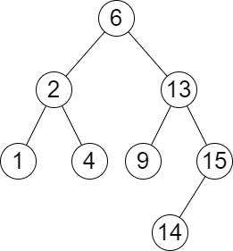
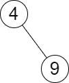

## Description

You are given the `root` of a **binary search tree **and an array `queries` of size `n` consisting of positive integers.

Find a **2D** array `answer` of size `n` where $\text{answer}[i] = [\text{min}_{i}, \text{max}_{i}]$:

- $\text{min}_{i}$ is the **largest** value in the tree that is smaller than or equal to $\text{queries}[i]$. If a such value does not exist, add `-1` instead.

- $\text{max}_{i}$ is the **smallest** value in the tree that is greater than or equal to $\text{queries}[i]$. If a such value does not exist, add `-1` instead.

Return *the array* `answer`.
### Function Contract

- `n`: Input parameter.
- Returns expected result.

### Examples

#### Example 1

- **Input:** `root = [6,2,13,1,4,9,15,null,null,null,null,null,null,14], queries = [2,5,16]`
- **Output:** `[[2,2],[4,6],[15,-1]]`
- **Explanation:** We answer the queries in the following way:
- The largest number that is smaller or equal than 2 in the tree is 2, and the smallest number that is greater or equal than 2 is still 2. So the answer for the first query is [2,2].
- The largest number that is smaller or equal than 5 in the tree is 4, and the smallest number that is greater or equal than 5 is 6. So the answer for the second query is [4,6].
- The largest number that is smaller or equal than 16 in the tree is 15, and the smallest number that is greater or equal than 16 does not exist. So the answer for the third query is [15,-1].
#### Example 2

- **Input:** `root = [4,null,9], queries = [3]`
- **Output:** `[[-1,4]]`
- **Explanation:** The largest number that is smaller or equal to 3 in the tree does not exist, and the smallest number that is greater or equal to 3 is 4. So the answer for the query is [-1,4].
### Constraints

- The number of nodes in the tree is in the range $[2, 10^{5}]$.

- $1 \le \text{Node.val} \le 10^{6}$

- $n = \text{queries.length}$

- $1 \le n \le 10^{5}$

- $1 \le \text{queries}[i] \le 10^{6}$