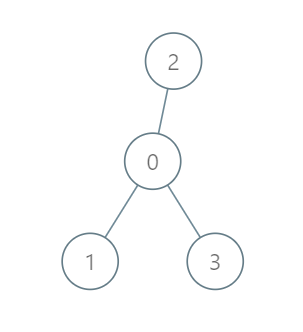
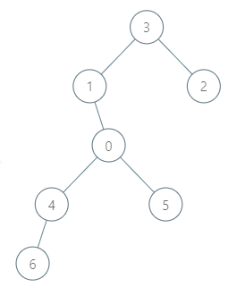

## Description

There is a tree (i.e., a connected, undirected graph with no cycles) structure country network consisting of `n` cities numbered from `0` to $n - 1$ and exactly $n - 1$ roads. The capital city is city `0`. You are given a 2D integer array `roads` where $\text{roads}[i] = [a_{i}, b_{i}]$ denotes that there exists a **bidirectional road** connecting cities $a_{i}$ and $b_{i}$.

There is a meeting for the representatives of each city. The meeting is in the capital city.

There is a car in each city. You are given an integer `seats` that indicates the number of seats in each car.

A representative can use the car in their city to travel or change the car and ride with another representative. The cost of traveling between two cities is one liter of fuel.

Return *the minimum number of liters of fuel to reach the capital city*.
### Function Contract

- `n`: Input parameter.
- Returns expected result.

### Examples

#### Example 1

- **Input:** $roads = [[0,1],[0,2],[0,3]], seats = 5$
- **Output:** `3`
- **Explanation:**
- Representative_1 goes directly to the capital with 1 liter of fuel.
- Representative_2 goes directly to the capital with 1 liter of fuel.
- Representative_3 goes directly to the capital with 1 liter of fuel.
It costs 3 liters of fuel at minimum.
It can be proven that 3 is the minimum number of liters of fuel needed.
#### Example 2

- **Input:** $roads = [[3,1],[3,2],[1,0],[0,4],[0,5],[4,6]], seats = 2$
- **Output:** `7`
- **Explanation:**
- Representative_2 goes directly to city 3 with 1 liter of fuel.
- Representative_2 and representative_3 go together to city 1 with 1 liter of fuel.
- Representative_2 and representative_3 go together to the capital with 1 liter of fuel.
- Representative_1 goes directly to the capital with 1 liter of fuel.
- Representative_5 goes directly to the capital with 1 liter of fuel.
- Representative_6 goes directly to city 4 with 1 liter of fuel.
- Representative_4 and representative_6 go together to the capital with 1 liter of fuel.
It costs 7 liters of fuel at minimum.
It can be proven that 7 is the minimum number of liters of fuel needed.
#### Example 3

- **Input:** $roads = [], seats = 1$
- **Output:** `0`
- **Explanation:** No representatives need to travel to the capital city.
### Constraints

- $1 \le n \le 10^{5}$

- $\text{roads.length} = n - 1$

- $\text{roads}[i].length = 2$

- $0 \le a_{i}, b_{i} < n$

- $a_{i} \neq b_{i}$

- `roads` represents a valid tree.

- $1 \le seats \le 10^{5}$