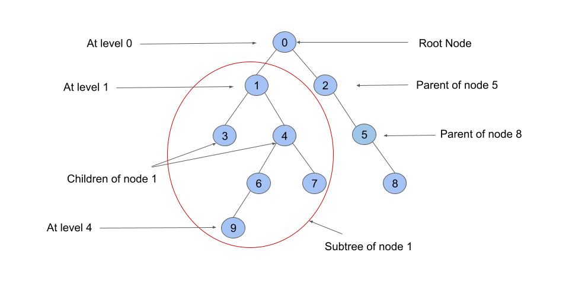

## Solution

---

### Overview

We are given a tree with `n` nodes (or cities) from `0` to $n - 1$ and exactly $n - 1$ edges.

There is one car and one representative at each node. We are given an integer `seats` that represents the maximum number of representatives that can together go in any car. The cost of travelling over an edge using a car takes one liter of fuel.

Our task is to move all the representatives to node `0` by using the minimum fuel and return the minimum fuel required to do so.

Before moving on to the solution, consider some of the graph terminologies that will be used later:



1. **Child**: A node that is one edge further away from a given node in a rooted tree. In the above image, nodes `3, 4` are children of `1`, which is called the parent.
2. **Descendants**: Descendants of a node are children, children of children, and so on. In the above image, nodes `3, 4, 6, 7, 9` are all descendants of `1`.
3. **Subtree**: A subtree of a node `T` is a tree `S` consisting of a node `T` and all of its descendants in `T`. The subtree corresponding to the root node is the entire tree.
4. **Level**: A node's level (or depth) in a tree data structure is its distance from the tree's root node. The root node is said to be at level `0`, and its children are at level `1`, and the children of the nodes at level `1` are at level `2`, and so on. In our case, the root node is node `0`, because this is where we want to take all of the representatives.

Although the edges are given as undirected, we will treat the graph as a tree where `0` is the root and only consider moving in one direction.

---

### Approach 1: Depth First Search

#### Intuition

We can see that taking a car from level `l` to $l + 1$ and back to level `l` to get to the root node is pointless. It takes two units of fuel to go from `l` to $l + 1$ and back again. Instead, the representative at level $l + 1$ can drive to level `l` in one unit of fuel. As a result, the cars would move from higher to lower levels in order to reach the root node.

We will try to put as many representatives as possible in the same car to save fuel. Let's look at an example to see how we should arrange the representatives.

Consider a node `node` that has a parent node `parent`. Assume there are `r` representatives in the subtree of `node`. To reach node `0`, all representatives in this subtree must pass through `parent`. Let's compute how much fuel would be required to just cross the edge that connects nodes `node` and `parent`.

Intitutively, we can think that the worst-case scenario would be the one where all the representatives take their own car and cross the edge. This would require `r` units of fuel.

The best way would be to put `r` representatives one by one into the cars until the cars reach `seat` capacity. This would require $ceil(r / seats)$ cars and an equal amount of fuel (since a car takes one unit of fuel to travel over an edge). For example, if you have `10` representatives in a subtree and the capacity is `3`, then you would need $ceil(10 / 3) = 4$ cars.

Also, regardless of how the representatives arrive at `node`, there will definitely be at least $ceil(r / seats)$ cars. This is because all of the representatives in the subtree of `node` except for the one at `node` would arrive by using at least $ceil((r - 1) / seats)$ cars or more (since we can accommodate a maximum of `seats` people in a car). Hence, we already have cars that can seat $r - 1$ people, and there is one representative and one car at `node` to take all the representatives in the required number of cars ($1 + ceil(r - 1 / seats) \ge ceil(r / seats)$). That brings us to our solution.

We begin by moving all the representatives in a node's subtree to the node. Then, using the minimum fuel calculated by the above formula, move all of the representatives to the parent node. So our task is to compute the number of representatives in each node's subtree and add the fuel required to move all of the representatives in the node's subtree to the parent node.

The depth-first search (DFS) algorithm can be used to compute the number of representatives in each subtree. In DFS, we use a recursive function to explore nodes as far as possible along each branch. Upon reaching the end of a branch, we backtrack to the next branch and continue exploring.

Once we encounter an unvisited node, we will take one of its neighbor nodes (if exists) as the next node on this branch. Recursively call the function to take the next node as the 'starting node' and solve the subproblem.

If you are new to Depth First Search, please see our [Leetcode Explore Card](https://leetcode.com/explore/featured/card/graph/619/depth-first-search-in-graph/3882/) for more information on it!

We implement a `dfs` method that performs a DFS traversal and returns the number of representatives in the subtree of given node. We begin the traversal from root node `0`. Using the above-mentioned formula, we then calculate the number of cars and thus the fuel required to move all of the representatives to the parent node. To get the final answer, we add the fuel required to move representatives from all nodes to their respective parent nodes until we reach the root node.

#### Algorithm

1. Create an adjacency list where $\text{adj}[X]$ contains all the neighbors of node `X`.
2. Create an integer `fuel` that stores the minimum amount of fuel needed to move all representatives to node `0`.
3. Begin the DFS traversal:
- We use the `dfs` function to perform the traversal. For each call, pass `node`, `parent`, `adj` and `seats` as the parameters. It returns the number of representatives in the subtree of the `node`. We start with node `0`. We also keep track of the `parent` node of the current `node` so that we don’t visit the node’s parent as it has already been visited.
- Initalize an integer `representatives` to store the number of representatives in the subtree of `node`. We initialize it to `1` because the node itself has one representative.
- Iterate over all the children of the `node` (nodes that share an edge) and check if any `child` is equal to the `parent`. If the `child` is equal to the `parent`, we will not visit it again.
- If the `child` is not equal to the `parent`, recursively call the `dfs` function with the node as `child` and the parent as `node`. Add the count of representatives (returned by this call) in the subtree of `child` to `representatives`.
- After iterating over all the children, we have the required number of `representatives`. To move all of these representatives to the parent node, we would require $ceil(representatives / seats)$ cars and an equal amount of fuel. We perform $fuel += ceil(representatives / seats)$. We ignore node `0` because it does not have a parent.
4. Return `fuel`.

#### Implementation

```cpp
class Solution {
public:
    long long fuel;

    long long dfs(int node, int parent, vector<vector<int>>& adj, int& seats) {
        // The node itself has one representative.
        int representatives = 1;
        for (auto& child : adj[node]) {
            if (child != parent) {
                // Add count of representatives in each child subtree to the parent subtree.
                representatives += dfs(child, node, adj, seats);
            }
        }

        if (node != 0) {
            // Count the fuel it takes to move to the parent node.
            // Root node does not have any parent so we ignore it.
            fuel += ceil((double)representatives / seats);
        }
        return representatives;
    }

    long long minimumFuelCost(vector<vector<int>>& roads, int seats) {
        int n = roads.size() + 1;
        vector<vector<int>> adj(n);
        for (auto& road : roads) {
            adj[road[0]].push_back(road[1]);
            adj[road[1]].push_back(road[0]);
        }
        dfs(0, -1, adj, seats);
        return fuel;
    }
};
```

#### Complexity Analysis

Here $n$ is the number of nodes.

* Time complexity: $O(n)$.

- The `dfs` function visits each node once, which takes $O(n)$ time in total. Because we have $n - 1$ undirected edges, each edge can only be iterated twice (by nodes at the end), resulting in $O(n)$ operations total while visiting all nodes.
- We also need $O(n)$ time to initialize the adjacency list.

* Space complexity: $O(n)$.
- Building the adjacency list takes $O(n)$ space.
- The recursion call stack used by `dfs` can have no more than $n$ elements in the worst-case scenario. It would take up $O(n)$ space in that case.

---

### Approach 2: Breadth First Search

#### Intuition

The idea as we discussed in the first approach is to compute the number of representatives in each node's subtree and use that to calculate the required fuel.

We can use a modified breadth-first search (BFS) traversal over the graph to compute the count of representatives in each node.

A breadth-first search (BFS) is an algorithm for traversing or searching a graph. It traverses in a level-wise manner, i.e., all the nodes at the present level (say `l`) are explored before moving on to the nodes at the next level ($l + 1$), where a level's number is the distance from a starting node. BFS is implemented with a queue.

> If you are not familiar with BFS traversal, we suggest you read our [Leetcode Explore Card](https://leetcode.com/explore/featured/card/graph/620/breadth-first-search-in-graph/) for more information on it!

Typically with BFS, you start at the node and move downwards level by level. In this approach, we traverse from the leaf nodes to the root node. Rather than visiting all the nodes at the present level (say `l`) and then moving on to the nodes at the next level ($l + 1$), we move from level `l+1` to `l` i.e., bottom to top.

We start a traversal from all the leaf nodes, then move to their parents, then to their parents, and so on till the root. If we are at level `l`, we must have the number of representatives in the subtrees of all the nodes at level $l + 1$.

As we know, BFS is implemented with a queue, so we initialize a queue storing the next nodes to be visited. Using an array `degree`, we also compute the number of edges to which a node is connected. We also create a new array called `representatives` of length `n` to store the number of representatives in each node's subtree. We initialize all values to `1` since every node has one representative at the node itself. Finally, we declare a variable `fuel` to store the required fuel.

We start by inserting all the leaf nodes into the queue. A leaf node can be determined by checking the number of nodes it is connected to. If the node is not a root node and the number of nodes to which it is connected is one (leaf nodes only have a parent and no children), i.e., $\text{degree}[node] = 1$ it is a leaf node.

Next, we perform the BFS traversal until the queue is empty. We pop out the first element, say `node` from the queue. We know the number of representatives in `node`'s subtree (store this value with the node, initially the leaves are set to `1`). Using the same logic as before, we add to $fuel += ceil(\text{representatives}[node] / seat)$.

We do not visit any child `c` of `node` again while performing the BFS by using the `degree` array. We will only push a node if $\text{degree}[node] = 1$. Because node `c` was previously in the queue, $\text{degree}[c]$ must have been `1` before. Now, while iterating over the neighbors of `node`, we will iterate over node `c` again and decrement $\text{degree}[c]$, which will make $\text{degree}[c] = 0$, and thus the condition $\text{degree}[neighbor] = 1$ will prevent `c` from being pushed again.

> This algorithm of moving from leaf nodes to the root by decrementing the count of children is similar to the topological sort algorithm (Kahn's algorithm). If you are not familiar with this algorithm, we suggest you read our [Leetcode Explore Card](https://leetcode.com/explore/learn/card/graph/623/kahns-algorithm-for-topological-sorting/3886/).

#### Algorithm

1. Initialize an integer $n = \text{roads.length} + 1$ to represent the total number of nodes in the tree.
2. Create an adjacency list where $\text{adj}[X]$ contains all the neighbors of node `X`.
3. Create an array `degree` where $\text{degree}[X]$ stores the number of edges with one end at node `X`.
4. Begin a BFS traversal that will return the required answer.
5. We use a `bfs` function to perform the traversal passing `n`, `adj`, `degree` and `seats` as the parameters.
6. Initialize a queue `q` of integers and push all the nodes with `degree` one into it, i.e., $\text{degree}[node] = 1$.
7. Create an array `representatives` of length `n` to store the number of representatives in each node's subtree. We initialize all values to `1` because each node itself has one representative. Also, initialize the `fuel` variable to store the minimum fuel required.
8. While the queue is not empty:
- Dequeue the first `node` from the queue.
- Add the amount of fuel needed to transport all of the representatives from `node` to its parent, $fuel += ceil(\text{representatives}[node] / seats)$.
- Iterate over all the neighbors of `node`. For each `neighbor`, decrement $\text{degree}[neighbor]$ by `1` and $\text{representatives}[node]$ to $\text{representatives}[neighbor]$. If $\text{degree}[neighbor] = 1 \&\& neighbor \neq 0$ (root node has no parent), it means we have added the number of representatives in all subtrees of its children. Node `neighbor` behaves as a leaf node now. In such a case, add the `neighbor` to the queue.

#### Implementation

```cpp
class Solution {
public:
    long long bfs(int n, vector<vector<int>>& adj, vector<int>& degree, int& seats) {
        queue<int> q;
        for (int i = 1; i < n; i++) {
            if (degree[i] == 1) {
                q.push(i);
            }
        }

        vector<int> representatives(n, 1);
        long long fuel = 0;

        while (!q.empty()) {
            int node = q.front();
            q.pop();

            fuel += ceil((double)representatives[node] / seats);
            for (auto& neighbor : adj[node]) {
                degree[neighbor]--;
                representatives[neighbor] += representatives[node];
                if (degree[neighbor] == 1 && neighbor != 0) {
                    q.push(neighbor);
                }
            }
        }
        return fuel;
    }

    long long minimumFuelCost(vector<vector<int>>& roads, int seats) {
        int n = roads.size() + 1;
        vector<vector<int>> adj(n);
        vector<int> degree(n);

        for (auto& road : roads) {
            adj[road[0]].push_back(road[1]);
            adj[road[1]].push_back(road[0]);
            degree[road[0]]++;
            degree[road[1]]++;
        }

        return bfs(n, adj, degree, seats);
    }
};
```

#### Complexity Analysis

Here $n$ is the number of nodes.

* Time complexity: $O(n)$

- Each queue operation in the BFS algorithm takes $O(1)$ time, and a single node will be pushed once, leading to $O(n)$ operations for $n$ nodes. We iterate over all the neighbors of each node that is popped out of the queue, so for an undirected edge, a given edge could be iterated at most twice. Since there are $n - 1$ edges, it would take $O(n)$ time in total.
- It also takes $O(n)$ time to initialize the `representatives` and `degree` arrays each.

* Space complexity: $O(n)$
- Building the adjacency list takes $O(n)$ space.
- The `representatives` and `degree` arrays also requires $O(n)$ space each.
- The BFS queue can have no more than $n$ elements in the worst-case scenario. It would take up $O(n)$ space in that case.