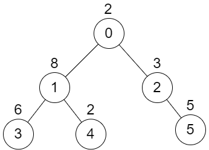
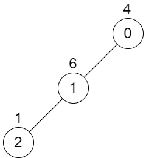

### 1. Description

There is an undirected tree with `n` nodes labeled from `0` to $n - 1$. You are given the integer `n` and a 2D integer array `edges` of length $n - 1$, where $\text{edges}[i] = [a_{i}, b_{i}]$ indicates that there is an edge between nodes $a_{i}$ and $b_{i}$ in the tree. The root of the tree is the node labeled `0`.

Each node has an associated **value**. You are given an array `values` of length `n`, where $\text{values}[i]$ is the **value** of the $$i^{\text{th}}$$ node.

Select any two **non-overlapping** subtrees. Your **score** is the bitwise XOR of the sum of the values within those subtrees.

Return *the* ***maximum*** *possible **score** you can achieve*. *If it is impossible to find two nonoverlapping subtrees*, return `0`.

### 2. Function Contract

- Refer to method signature.

### 3. Note

that:

- The **subtree** of a node is the tree consisting of that node and all of its descendants.

- Two subtrees are **non-overlapping **if they do not share **any common** node.

### 4. Examples

#### Example 1

- **Input:** $n = 6, edges = [[0,1],[0,2],[1,3],[1,4],[2,5]], values = [2,8,3,6,2,5]$
- **Output:** `24`
- **Explanation:** Node 1's subtree has sum of values 16, while node 2's subtree has sum of values 8, so choosing these nodes will yield a score of 16 XOR 8 = 24. It can be proved that is the maximum possible score we can obtain.
#### Example 2

- **Input:** $n = 3, edges = [[0,1],[1,2]], values = [4,6,1]$
- **Output:** `0`
- **Explanation:** There is no possible way to select two non-overlapping subtrees, so we just return 0.

### 5. Constraints

- $2 \le n \le 5 * 10^{4}$

- $\text{edges.length} = n - 1$

- $0 \le a_{i}, b_{i} < n$

- $\text{values.length} = n$

- $1 \le \text{values}[i] \le 10^{9}$

- It is guaranteed that `edges` represents a valid tree.