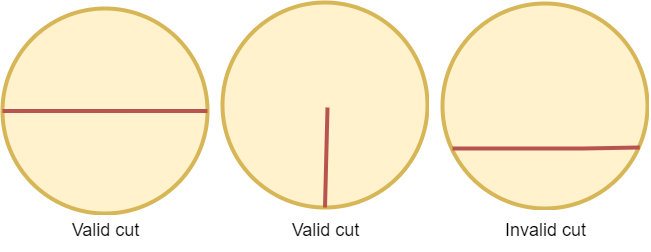
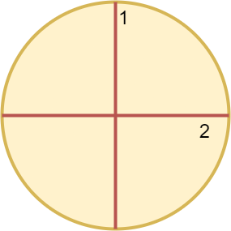
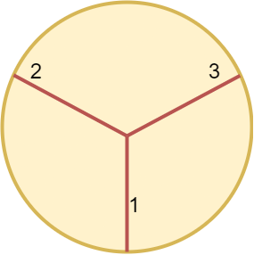

### 1. Description

A **valid cut** in a circle can be:

- A cut that is represented by a straight line that touches two points on the edge of the circle and passes through its center, or

- A cut that is represented by a straight line that touches one point on the edge of the circle and its center.

Some valid and invalid cuts are shown in the figures below.

Given the integer `n`, return *the **minimum** number of cuts needed to divide a circle into *`n`* equal slices*.

### 2. Function Contract

**Inputs**

- `n`: Input parameter (`int`).

**Return value**

- Returns `int`.

### 3. Examples

#### Example 1

- **Input:** $n = 4$
- **Output:** `2`
- **Explanation:** The above figure shows how cutting the circle twice through the middle divides it into 4 equal slices.

#### Example 2

- **Input:** $n = 3$
- **Output:** `3`
- **Explanation:** At least 3 cuts are needed to divide the circle into 3 equal slices.
It can be shown that less than 3 cuts cannot result in 3 slices of equal size and shape.
Also note that the first cut will not divide the circle into distinct parts.

### 4. Constraints

- $1 \le n \le 100$
