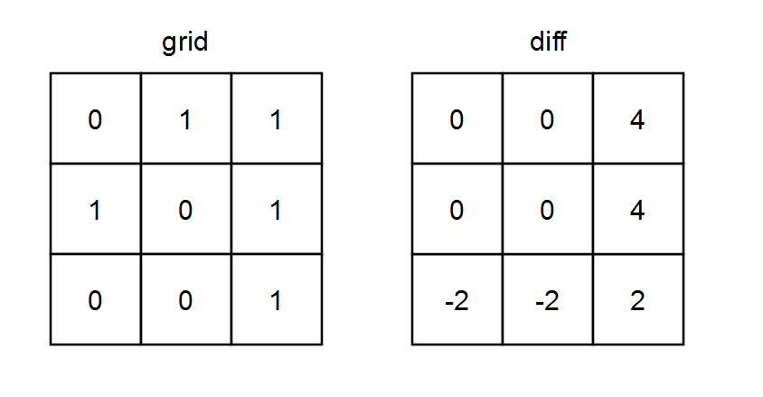
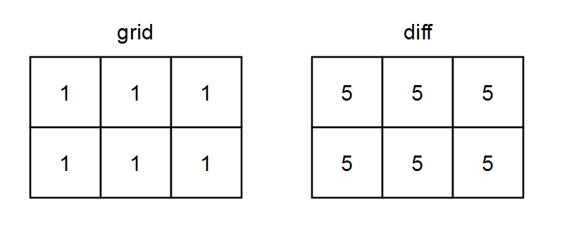

### 1. Description

You are given a **0-indexed** `m x n` binary matrix `grid`.

A **0-indexed** `m x n` difference matrix `diff` is created with the following procedure:

- Let the number of ones in the $$i^{\text{th}}$$ row be $\text{onesRow}_{i}$.

- Let the number of ones in the $$j^{\text{th}}$$ column be $\text{onesCol}_{j}$.

- Let the number of zeros in the $$i^{\text{th}}$$ row be $\text{zerosRow}_{i}$.

- Let the number of zeros in the $$j^{\text{th}}$$ column be $\text{zerosCol}_{j}$.

- $\text{diff}[i][j] = \text{onesRow}_{i} + \text{onesCol}_{j} - \text{zerosRow}_{i} - \text{zerosCol}_{j}$

Return *the difference matrix *`diff`.

### 2. Function Contract

- `n`: Input parameter.
- Returns expected result.

### 3. Examples

#### Example 1

- **Input:** `grid = [[0,1,1],[1,0,1],[0,0,1]]`
- **Output:** `[[0,0,4],[0,0,4],[-2,-2,2]]`
- **Explanation:**
- diff[0][0] = onesRow_0 + onesCol_0 - zerosRow_0 - zerosCol_0 = 2 + 1 - 1 - 2 = 0
- diff[0][1] = onesRow_0 + onesCol_1 - zerosRow_0 - zerosCol_1 = 2 + 1 - 1 - 2 = 0
- diff[0][2] = onesRow_0 + onesCol_2 - zerosRow_0 - zerosCol_2 = 2 + 3 - 1 - 0 = 4
- diff[1][0] = onesRow_1 + onesCol_0 - zerosRow_1 - zerosCol_0 = 2 + 1 - 1 - 2 = 0
- diff[1][1] = onesRow_1 + onesCol_1 - zerosRow_1 - zerosCol_1 = 2 + 1 - 1 - 2 = 0
- diff[1][2] = onesRow_1 + onesCol_2 - zerosRow_1 - zerosCol_2 = 2 + 3 - 1 - 0 = 4
- diff[2][0] = onesRow_2 + onesCol_0 - zerosRow_2 - zerosCol_0 = 1 + 1 - 2 - 2 = -2
- diff[2][1] = onesRow_2 + onesCol_1 - zerosRow_2 - zerosCol_1 = 1 + 1 - 2 - 2 = -2
- diff[2][2] = onesRow_2 + onesCol_2 - zerosRow_2 - zerosCol_2 = 1 + 3 - 2 - 0 = 2
#### Example 2

- **Input:** `grid = [[1,1,1],[1,1,1]]`
- **Output:** `[[5,5,5],[5,5,5]]`
- **Explanation:**
- diff[0][0] = onesRow_0 + onesCol_0 - zerosRow_0 - zerosCol_0 = 3 + 2 - 0 - 0 = 5
- diff[0][1] = onesRow_0 + onesCol_1 - zerosRow_0 - zerosCol_1 = 3 + 2 - 0 - 0 = 5
- diff[0][2] = onesRow_0 + onesCol_2 - zerosRow_0 - zerosCol_2 = 3 + 2 - 0 - 0 = 5
- diff[1][0] = onesRow_1 + onesCol_0 - zerosRow_1 - zerosCol_0 = 3 + 2 - 0 - 0 = 5
- diff[1][1] = onesRow_1 + onesCol_1 - zerosRow_1 - zerosCol_1 = 3 + 2 - 0 - 0 = 5
- diff[1][2] = onesRow_1 + onesCol_2 - zerosRow_1 - zerosCol_2 = 3 + 2 - 0 - 0 = 5

### 4. Constraints

- $m = \text{grid.length}$

- $n = \text{grid}[i].length$

- $1 \le m, n \le 10^{5}$

- $1 \le m * n \le 10^{5}$

- $\text{grid}[i][j]$ is either `0` or `1`.