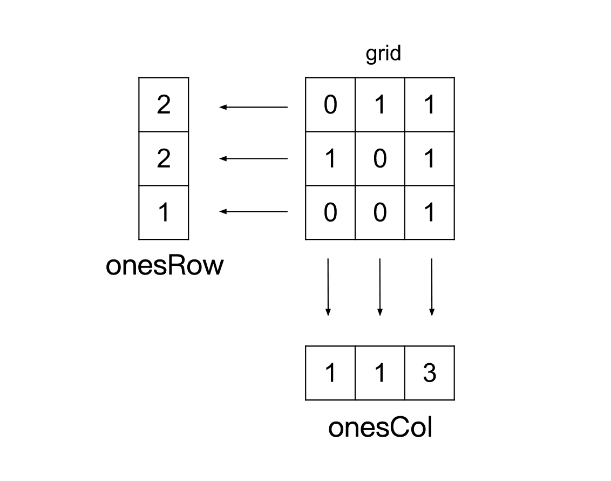

[TOC]

## Solution

---

### Approach: Array Counter

**Intuition**

To build the matrix `diff`, we need to have the count of ones and zeroes in each row and column of the given matrix `grid`. One way is that for each cell `(i, j)` in the matrix `grid`, we can iterate over the `ith` row and `jth` column to find the number of ones and zeroes, and set the value $\text{diff}[i][j]$ as $onesRow_{i}$ + $onesCol_{j}$ - $zerosRow_{i}$ - $zerosCol_{j}$. However, this approach is inefficient, as for each of the $M \cdot N$ cells, we will have to iterate over a row and a column of $M + N$ cells to count the number of zeroes and ones, resulting in a complexity of $O(M  \cdot N  \cdot (M + N))$.

Note that in the above approach, we are iterating over the cells repeatedly. However, when we iterate over the `ith` row to find the number of ones/zeros of that row, we're also simultaneously finding (and recording, if we can) all the columns of the cell located in the row. For example, when we traverse the first row, we are not only recording the count of ones and zeros in the first row but also the count of ones/zeros in all the cells located in the first row. When we traverse the second row, we also record the count of ones/zeros in all the cells located in the second row. So, when we finish traversing all the rows, we simultaneously obtain the count of ones/zeros for each column. Therefore, we could avoid repeated iteration by precomputing the number of ones/zeroes in each row and column.

We will keep two arrays `onesRow` of size `M` to store the count of ones in each row and `onesCol` of size `N` to store the ones in each column. We will then iterate over each cell in the matrix `grid` and for each cell, we add the value $\text{grid}[i][j]$ to $\text{onesRow}[i]$ and $\text{onesCol}[j]$. This is because matrices are binary, and adding $\text{grid}[i][j]$ essentially increases the number of ones. Specifically, if $\text{grid}[i][j] = 1$, adding $\text{grid}[i][j]$ means increasing the number of ones. If $\text{grid}[i][j] = 0$, we can still add $\text{grid}[i][j]$, since it means adding 0 so we are not increasing the number of ones.

Note that we don't need to build another two arrays to store the counts of zeroes, this is because the length of each row and column is fixed, and we can get the number of zeroes by subtracting the number of ones from the length of a row/column.


So the value expression for $\text{diff}[i]$ will be:

```
 diff[i][j] = onesRow[i] + onesCol[j] - (N - onesRow[i]) - (M - onesCol[j])
            = 2 * onesRow[i] + 2 * onesCol[j] - N - M
```

**Algorithm**

1. Initialize two arrays `onesRow` and `onesCol` of size `M` and `N` with zeroes.
2. Iterate over the cells in the matrix `grid` and add the value $\text{grid}[i][j]$ to $\text{onesRow}[i]$ and $\text{onesCol}[j]$.
3. Initialize an empty matrix matrix `diff` with size $M * N$.
4. Iterate over the matrix `grid` and assign $\text{diff}[i][j]$ as $2 * \text{onesRow}[i] + 2 * \text{onesCol}[j] - N - M$.
5. Return `diff`.

**Implementation**

```cpp
class Solution {
public:
    vector<vector<int>> onesMinusZeros(vector<vector<int>>& grid) {
        int m = grid.size();
        int n = grid[0].size();

        vector<int> onesRow(m, 0);
        vector<int> onesCol(n, 0);

        for (int i = 0; i < m; i++) {
            for (int j = 0; j < n; j++) {
                onesRow[i] += grid[i][j];
                onesCol[j] += grid[i][j];
            }
        }

        vector<vector<int>> diff(m, vector<int>(n, 0));
        for (int i = 0; i < m; i++) {
            for (int j = 0; j < n; j++) {
                diff[i][j] = 2 * onesRow[i] + 2 * onesCol[j] - n - m;
            }
        }

        return diff;
    }
};
```

**Complexity Analysis**

Here, $M$ is the number of rows in the `grid`, and $N$ is the number of columns.

* Time complexity: $O(M * N)$

  Each cell in the matrix is traversed twice, once to find the ones count and store them in `onesRow` and `onesCol`. Then again to find the values in the matrix `diff`. Hence the total time complexity is equal to $O(M * N)$.

* Space complexity: $O(M + N)$

  The only space we required apart from the matrix `diff` which is used to store the answer and is not considered as part of space complexity are the two arrays `onesRow` and `onesCol` to store the count of ones in the rows and columns. Therefore, the total space complexity is equal to $O(M + N)$.
  <br/>

---