[TOC]

## Video Solution

---
 <div>
    <div class="video-container">
      <iframe src="https://player.vimeo.com/video/868867693?texttrack=en-x-autogenerated" frameborder="0"
        allow="autoplay; fullscreen"></iframe>
    </div>
</div>

## Solution Article

---

### Overview

We can start by considering the brute force approach, attempting to close the shop at every possible hour.

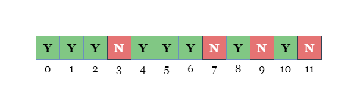

The calculation of the penalty (closed after a certain number of hours) is divided into two parts:

- During open hours, every 'N' character contributes to 1 penalty.
- During closed hours, every 'Y' character also contributes to 1 penalty.

We can calculate the total penalty by traversing `customers`.

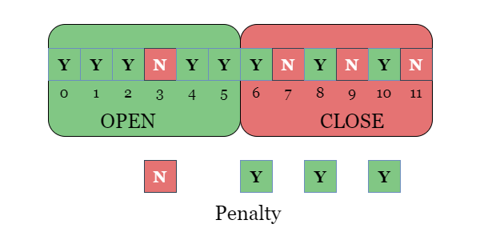

However, considering the size of `customers`, this quadratic time complexity approach may exceed the time limit. Therefore, we need to consider a more efficient traversal method.

---

### Approach 1: Two Passes

#### Intuition

Notice that in two adjacent cases (i.e. closing after the ${i-1}^{th}$ hour and closing after the $i^{th}$ hour, which differ by 1 hour), only the status of one hour has changed, where the status has been changed from a closing hour to an open hour. Hence, we can record the overall penalty change by calculating the difference in penalty between two adjacent cases.

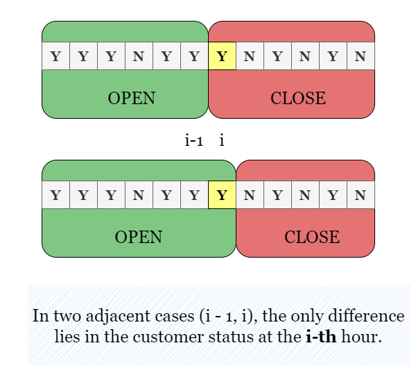

Therefore, let's first calculate the total penalty if we close instantly (after hour 0). Hence, the penalty of closing the shop after $0^{th}$ hour is based on the status of $\text{customers}[0]$:

- If it is 'Y', it means one penalty from the closed hours is removed, resulting in a decrease of the total penalty by 1.
- If it is 'N', it means an additional penalty is added from the open hours, resulting in an increase of the total penalty by 1.

Each time we iterate over a new `i`, we are finding the new penalty if we were to close after `i` instead of after $i - 1$.

Please refer to the slides below for a visual representation. The "OPEN" and "CLOSE" in the slides represent the contribution toward the current penalty. "OPEN" means that there are no customers when the store is open, and "CLOSE" means that there are customers when the store is closed.

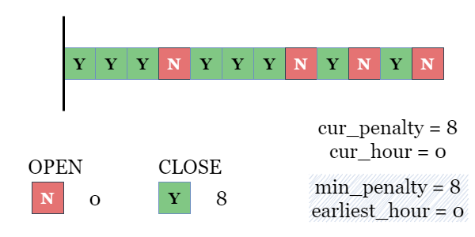


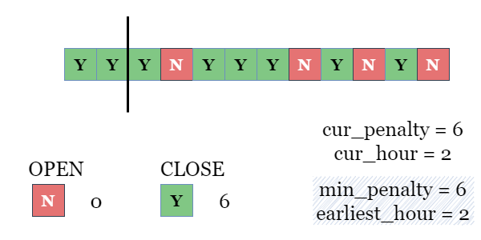

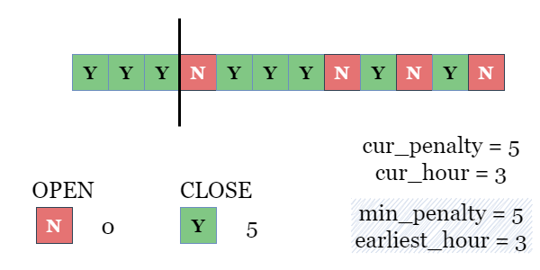


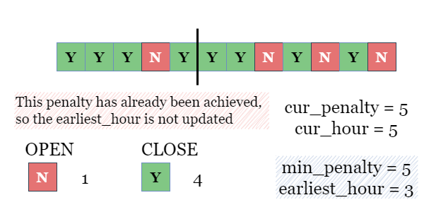

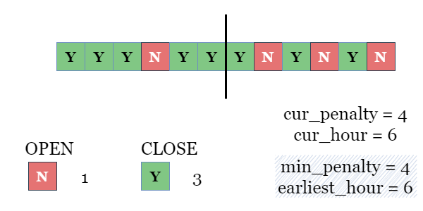

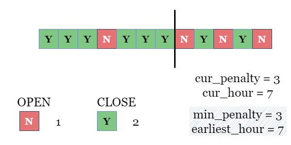

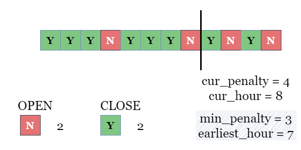


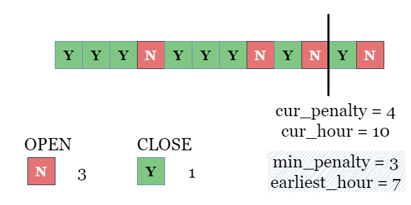

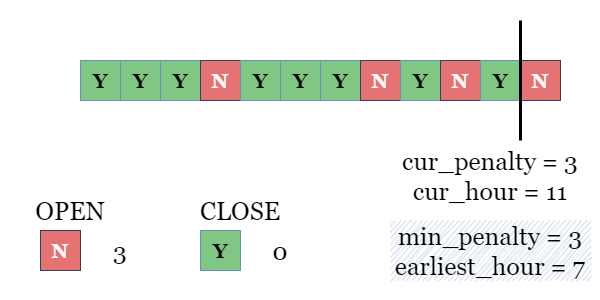

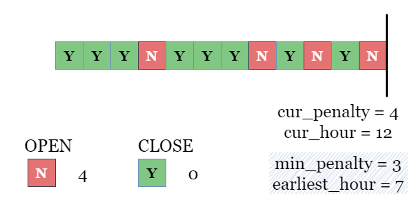

<br>

#### Algorithm

1) Iterate over `customers`, set $\text{cur}_{penalty}$ and $\text{min}_{penalty}$ as the total count of the character `Y`, which is the penalty if the shop closes at hour 0. Set $\text{earliest}_{hour}$ as 0.

2) Iterate over `customers`, for the $i^{th}$ character:
- If $\text{customers}[i] = 'Y'$, decrement $\text{cur}_{penalty}$ by 1. Otherwise, increment $\text{cur}_{penalty}$ by 1.
- If $\text{cur}_{penalty} < \text{min}_{penalty}$, set $\text{earliest}_{hour}$ as $i + 1$, and set $\text{min}_{penalty}$ as $\text{cur}_{penalty}$.

3) Return $\text{earliest}_{hour}$ once the iteration is complete.

#### Implementation

```python
class Solution:
    def bestClosingTime(self, customers: str) -> int:
        curPenalty = sum(c == "Y" for c in customers)

        # Start with closing at hour 0, the penalty equals all 'Y' in closed hours.
        minPenalty = curPenalty
        earliestHour = 0

        for i, ch in enumerate(customers):
            # If status in hour i is 'Y', moving it to open hours decrement
            # penalty by 1. Otherwise, moving 'N' to open hours increment
            # penalty by 1.
            if ch == "Y":
                curPenalty -= 1
            else:
                curPenalty += 1

            # Update earliestHour if a smaller penalty is encountered.
            if curPenalty < minPenalty:
                earliestHour = i + 1
                minPenalty = curPenalty

        return earliestHour
```

#### Complexity Analysis

Let $n$ be the length of `customers`.

* Time complexity: $O(n)$

- The first traversal is used to calculate the total count of 'Y' in `customers`, which takes $O(n)$ time.
- In each step of the second traversal, we update $\text{cur}_{penalty}$, $\text{min}_{penalty}$, and $\text{earliest}_{hour}$ based on the character $\text{customers}[i]$, which can be done in constant time. Therefore, the second traversal also takes $O(n)$ time.

* Space complexity: $O(1)$

- We only need to update several parameters, $\text{cur}_{penalty}$, $\text{min}_{penalty}$ and $\text{earliest}_{hour}$, which takes $O(1)$ space.

<br/>

---

### Approach 2: One Pass

#### Intuition

In the previous solution, we used the first traversal to calculate the count of 'Y', ensuring that each penalty obtained is accurate. However, we don't need the actual penalty values. It is important to note that the problem only requires the **earliest hour** with the lowest penalty. Thus, the only thing that matters is the penalty of the hours relative to each other, and our initial reference point is not significant.

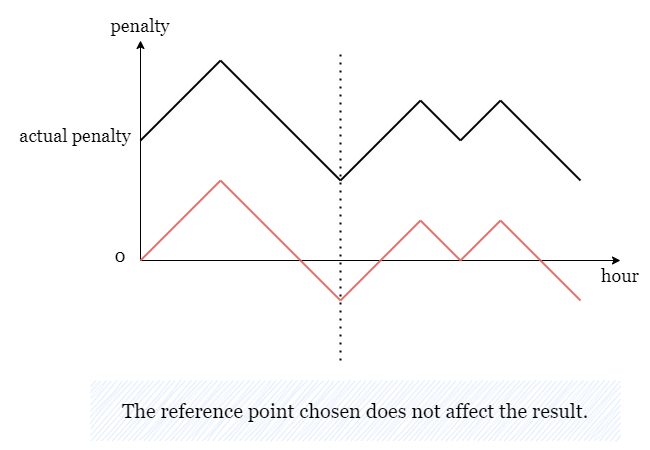

For convenience, we can directly set $\text{cur}_{penalty}$ to 0, which is equivalent to shifting the curve of the actual penalty vertically. This will not affect the calculation result. Note that we could initialize $\text{cur}_{penalty}$ to any value and the algorithm would still work since the initial reference point is insignificant.

<br>

#### Algorithm

1) Set $\text{cur}_{penalty}$, $\text{min}_{penalty}$ and $\text{earliest}_{hour}$ as 0.

2) Iterate over `customers`, for the $i^{th}$ character:
- If $\text{customers}[i] = 'Y'$, decrement $\text{cur}_{penalty}$ by 1. Otherwise, increment $\text{cur}_{penalty}$ by 1.
- If $\text{cur}_{penalty} < \text{min}_{penalty}$, set $\text{earliest}_{hour}$ as $i + 1$, and set $\text{min}_{penalty}$ as $\text{cur}_{penalty}$.

3) Return $\text{earliest}_{hour}$ once the iteration is complete.

#### Implementation

```python
class Solution:
    def bestClosingTime(self, customers: str) -> int:
        # Start with closing at hour 0 and assume the current penalty is 0.
        minPenalty = 0
        curPenalty = 0
        earliestHour = 0

        for i in range(len(customers)):
            ch = customers[i]

            # If status in hour i is 'Y', moving it to open hours decrement
            # penalty by 1. Otherwise, moving 'N' to open hours increment
            # penatly by 1.
            if ch == "Y":
                curPenalty -= 1
            else:
                curPenalty += 1

            # Update earliestHour if a smaller penatly is encountered.
            if curPenalty < minPenalty:
                earliestHour = i + 1
                minPenalty = curPenalty

        return earliestHour
```

#### Complexity Analysis

Let $n$ be the length of `customers`.

* Time complexity: $O(n)$

- In each step of the traversal, we update $\text{cur}_{penalty}$, $\text{min}_{penalty}$, and $\text{earliest}_{hour}$ based on the character $\text{customers}[i]$, which can be done in constant time. Therefore, the traversal takes $O(n)$ time.

* Space complexity: $O(1)$

- We only need to update several parameters, $\text{cur}_{penalty}$, $\text{min}_{penalty}$ and $\text{earliest}_{hour}$, which takes $O(1)$ space.

<br/>