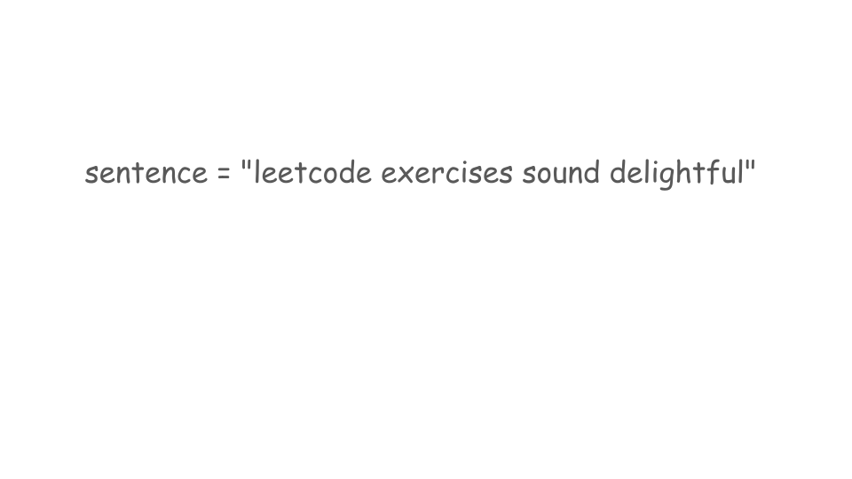
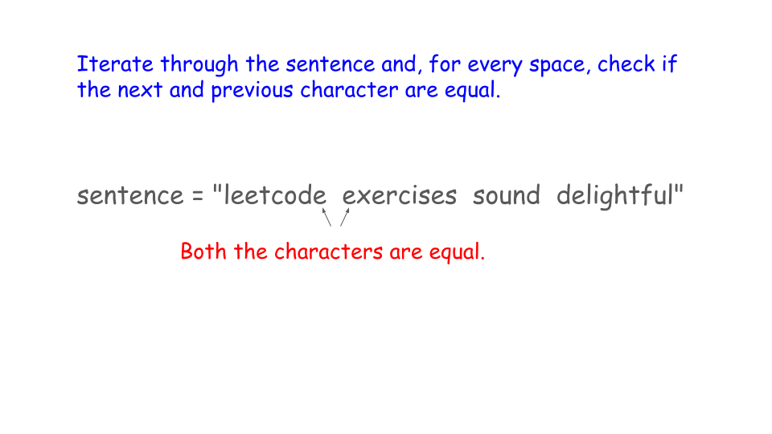
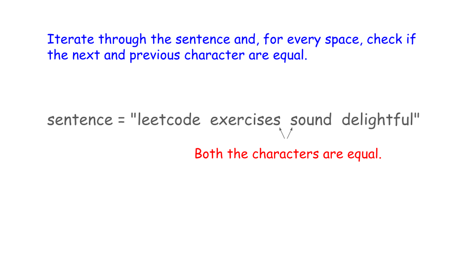
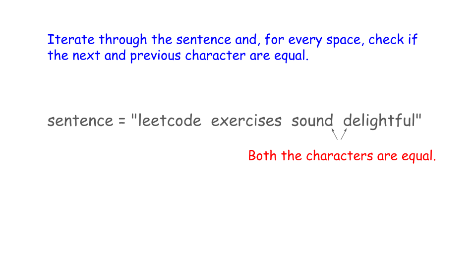
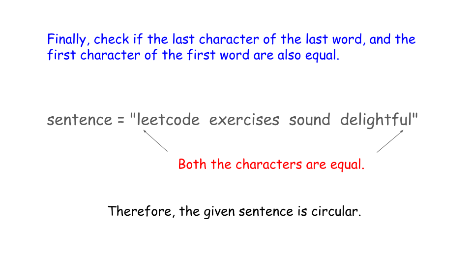

## Solution

---

### Approach 1: Split Sentence

#### Intuition

A sentence is considered circular if the last character of each word matches the first character of the next word. Additionally, the last character of the last word must be the same as the first character of the first word.

To check this, we can split the sentence into individual words. In Java and Python, we can easily do this using the `split()` function. In C++, we can use `istringstream` to break the sentence at the spaces. Once we have the words separated, we can store them in an array or list.

Next, we compare the last character of each word with the first character of the following word. If all these comparisons hold, then we can say the sentence is circular. If we find even one mismatch, then the sentence is not circular.

#### Algorithm

- Split the input `sentence` into an array of words.

- Store the length of the `words` array in variable `n`.

- Initialize `last` to the last character of the last word ($words[n - 1]$).

- Iterate through each word in the `words` array using a loop:
  - Compare the first character of the current word ($\text{words}[i]$) with `last`.
  - If they are not equal, return `false` (the circular condition is violated).
  - Update `last` to the last character of the current word.

- If all words satisfy the circular condition, return `true`.

#### Implementation

```python
class Solution:
    def isCircularSentence(self, sentence: str) -> bool:
        # Use the split function to store the words in a list.
        words = sentence.split(" ")
        n = len(words)

        # Start comparing from the last character of the last word.
        last = words[n - 1][-1]

        for i in range(n):
            # If this character is not equal to the first character of current word, return
            # false.
            if words[i][0] != last:
                return False
            last = words[i][-1]

        return True
```

#### Complexity Analysis

Let `n` be the length of the string `sentence`.

- Time complexity: $O(n)$

    The algorithm iterates through the string once. During each iteration, it performs constant-time operations. Therefore, the overall time complexity is linear.

- Space complexity: $O(n)$

    The space complexity is determined by the `words` array created by the split function, which holds `n` words. This requires $O(n)$ space. Additionally, no other significant space is used apart from a few variables, which contributes only a constant amount of space.

---

### Approach 2: Space-optimized Approach

#### Intuition

Instead of splitting the sentence into an array of words, we can process the `sentence` directly by checking each character. This allows us to find where each word starts and ends without needing to store all the words separately in an array.

As we go through the `sentence`, we'll identify the beginning of a new word using spaces. For each new word found, we check if its first character matches the last character of the previous word. If this holds for all the words, it suggests the sentence is circular.

Finally, we make one last check: we see if the last character of the last word matches the first character of the first word. If all these conditions are met, we return `true`, indicating that the sentence is indeed circular.

#### Algorithm

- Iterate through each character in the `sentence` using an index `i`.
  - For each space character found ($\text{sentence}[i] = ' '$):
- Check if the character before the space ($sentence[i - 1]$) is not equal to the character after the space ($sentence[i + 1]$).
      - If they are not equal, return `false` (indicating the sentence is not circular).

- After checking all spaces, verify if the first character of the sentence ($\text{sentence}[0]$) is equal to the last character ($sentence[\text{sentence.size}() - 1]$).
  - If they are equal, return `true` (indicating the sentence is circular); otherwise, return `false`.











#### Implementation

```python
class Solution:
    def isCircularSentence(self, sentence: str) -> bool:
        for i in range(len(sentence)):
            if sentence[i] == " " and sentence[i - 1] != sentence[i + 1]:
                return False
        return sentence[0] == sentence[len(sentence) - 1]
```

#### Complexity Analysis

Let `n` be the length of the string `sentence`.

- Time complexity: $O(n)$

    The algorithm iterates through the string once. During each iteration, it performs constant-time operations. Therefore, the overall time complexity is linear.

- Space complexity: $O(1)$

    The algorithm uses few variables, which do not depend on the length of the string. No additional data structures are created to store the results, so the overall space complexity is constant.

---