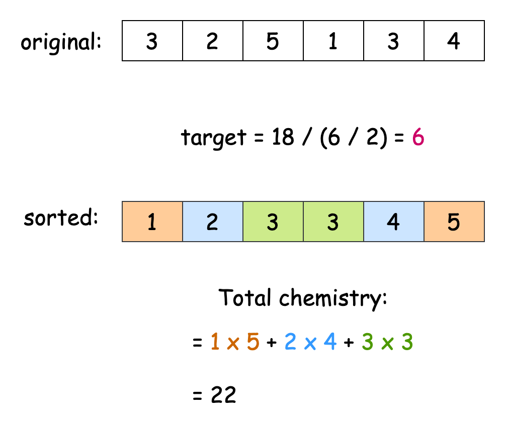

[TOC]

## Solution

---

### Approach 1: Sorting

#### Intuition

We have a `skill` array, and we need to form teams of two players, ensuring each team has the same combined skill level.

First, we calculate the target skill level for each team. Since all teams should have equal skill and there are `n/2` teams (where `n` is the length of the `skill` array), we find the target by dividing the total of all skills by the number of teams.

With the target skill level set, our goal is to identify pairs of players whose skills add up to this target. A brute force method, where we test each player against every other player, would take too long and may not meet our constraints.

To improve efficiency, we should pair players with the lowest skills with those who have the highest skills. This approach helps us reach the target skill level, as the target is essentially the median of all skills. By matching the lowest-skilled player with the highest-skilled player, we increase the chance of achieving the target. The second-lowest skilled player should pair with the second-highest, and this pattern continues.

<details>
  <summary>A formal proof using the method of contradiction</summary>

Claim: To balance each team with the required skill, we should pair the unmatched player of the lowest skill ($L$) with the unmatched player of the highest skill ($H$).

Proof by Contradiction:

Assume the claim is false. This means there exists a valid solution where $L$ is not paired with $H$, but instead:

1. $L$ is paired with some player $X$
2. $H$ is paired with some player $Y$,
where $X \neq H$ and $Y \neq L$

Let S be the required sum of skills for each team. Given that this is a valid solution:

$L + X = S \space\space\space \ldots (1)$

$H + Y = S \space\space\space \ldots (2)$

Since $H$ is the highest unmatched skill and $L$ is the lowest unmatched skill, we know:

$L \leq Y < X \leq H$

From Equation 1: $X = S - L$

From Equation 2: $Y = S - H$

Since $X \leq H$, we can substitute this into Equation 1:

$L + H \geq S  \space\space\space \ldots (3)$

Since $Y \geq L$, we can substitute this into Equation 2:

$H + L \leq S \space\space\space \ldots  (4)$

From Equations 3 and 4, we can conclude:

$L + H = S$

This means that to produce a team with the required skill sum $S$, we need to pair $L$ with $H$.
However, this contradicts our initial assumption that there exists a valid solution where $L$ is not paired with $H$.

Therefore, our initial assumption must be false, and the claim must be true.
</details>
<br>

To match players efficiently, we start by sorting the `skill` array. Next, we iterate through the array, pairing the `i`th player from the start with the `i`th player from the end to form teams. If the cumulative skill of any team does not equal the target skill, we determine that equal division is impossible and return -1. If all teams meet the target, we calculate each team's chemistry by multiplying the skill levels of its players. The final answer is the sum of all team chemistries.

The algorithm is visualized below:



#### Algorithm

- Sort the input array `skill` in ascending order.
- Initialize:
  - a variable `n` to the length of the `skill` array.
  - a variable `totalChemistry` to 0, which will store the sum of all team chemistries.
- Calculate the `targetTeamSkill` by adding the first and last elements of the sorted array.
- Iterate through the first half of the array:
  - Calculate `currentTeamSkill` by adding the `i`-th element from the start and the `i`-th element from the end.
  - If `currentTeamSkill` doesn't match `targetTeamSkill`, return -1.
  - Calculate the chemistry of the current team by multiplying the skills of the two team members.
  - Add the calculated chemistry to `totalChemistry`.
- Return `totalChemistry` as the answer.

#### Implementation

```python
class Solution:
    def dividePlayers(self, skill: List[int]) -> int:
        skill.sort()
        n = len(skill)
        total_chemistry = 0

        # Calculate the target sum
        target_team_skill = skill[0] + skill[-1]

        # Iterate through half of the array, pairing players from both ends
        for i in range(n // 2):
            # If any team's skill doesn't match the target, return -1
            if skill[i] + skill[-i - 1] != target_team_skill:
                return -1

            # Calculate and add the chemistry of the current team
            total_chemistry += skill[i] * skill[-i - 1]

        return total_chemistry
```

#### Complexity Analysis

Let $n$ be the length of the input array `skill`.

- Time complexity: $(n \cdot \log n)$

    Sorting the array takes $O(n \cdot \log n)$ time. The algorithm iterates through half of the array, which takes $O(n/2) = O(n)$ time. All operations within the loop are constant time operations.

    Thus, the overall time complexity of the algorithm is $O(n \cdot \log n) +$\mathcal{O}(n)$= (n \cdot \log n)$.

- Space complexity: $O(S)$

    The only additional space used is for the sorting algorithm. The space taken by the sorting algorithm ($S$) depends on the language of implementation:
- In Java, `Arrays.sort()` is implemented using a variant of the Quick Sort algorithm which has a space complexity of $O( \log n)$.
- In C++, the `sort()` function is implemented as a hybrid of Quick Sort, Heap Sort, and Insertion Sort, with a worst-case space complexity of $O(\log n)$.
- In Python, the `sort()` method sorts a list using the Timsort algorithm which is a combination of Merge Sort and Insertion Sort and has a space complexity of $O(n)$.

---

### Approach 2: Frequency Table

#### Intuition

We know the target team skill before pairing players. Let’s call this target skill `s`. When matching a player with skill `x`, we need to find another player with skill $s - x$.

One way to implement this is by looping through the `skill` array for each player to find their matching skill. However, this approach won't meet the problem's constraints. We need an efficient method to check if a player with a specific skill exists.

A frequency table works well here because it allows constant-time lookups. This table stores key-value pairs, where the key represents the skill value, and the value indicates how many players have that skill. While hash maps are common for frequency tables, we will use an array in this case due to the limited skill range (1000).

In our table, the index serves as the key (the skill value), and the value is the frequency from the `skill` array. We will iterate through the `skill` array and check for each skill's complement in the table. If we don’t find a complement, we conclude that forming a valid team is impossible and return -1. If we do find a complement, we calculate and accumulate the chemistry for each team. The total chemistry gives us the answer.

#### Algorithm

- Initialize:
  - a variable `n` to the length of the input array `skill`.
  - a variable `totalSkill` to 0.
- Create an array `skillFrequency` of size 1001 to store the frequency of each skill level.
- Iterate through the `skill` array:
  - Add each player's skill to `totalSkill`.
  - Increment the count for each skill level in `skillFrequency`.
- Check if `totalSkill` is evenly divisible by `n/2`. If not, return -1.
- Calculate `targetTeamSkill` by dividing `totalSkill` by `n/2`.
- Initialize `totalChemistry` to 0.
- Iterate through the `skill` array again:
  - Set `partnerSkill` as `targetTeamSkill` minus the current skill.
  - If no player with `partnerSkill` exists (frequency is 0), return -1.
  - Add the product of the current skill and `partnerSkill` to `totalChemistry`.
  - Decrement the frequency of `partnerSkill`.
- Return half of `totalChemistry` (as each pair was counted twice).

#### Implementation

```python
class Solution:
    def dividePlayers(self, skill: List[int]) -> int:
        n = len(skill)
        total_skill = sum(skill)
        skill_frequency = [0] * 2001

        # Calculate total skill and skill frequency
        for player_skill in skill:
            skill_frequency[player_skill] += 1

        # Check if total skill can be evenly distributed among teams
        if total_skill % (n // 2) != 0:
            return -1

        target_team_skill = total_skill // (n // 2)
        total_chemistry = 0

        # Calculate total chemistry while verifying valid team formations
        for player_skill in skill:
            partner_skill = target_team_skill - player_skill

            # Check if a valid partner exists
            if skill_frequency[partner_skill] == 0:
                return -1

            # Calculate and add chemistry of the current pair
            total_chemistry += player_skill * partner_skill
            skill_frequency[partner_skill] -= 1

        # Return half of total_chemistry as each pair is counted twice
        return total_chemistry // 2
```

#### Complexity Analysis

Let $n$ be the length of the input array `skill`.

* Time complexity: $O(n)$

    The algorithm performs two passes through the array, each taking $O(n)$ time. All operations within these loops are constant time. Thus, the time complexity of the algorithm is $O(n)$.

* Space complexity: $O(1)$

    The most significant additional space used is the `skillFrequency` array. This array has a fixed size of $1001$, regardless of the input size, as it's based on the constraint that each player's skill is between $1$ and $1000$. The other variables used occupy constant space.

    Since the extra space used doesn't grow with the input size, the space complexity is constant, $O(1)$.

---

### Approach 3: Map

#### Intuition

While iterating through the `skill` array, we often encounter duplicate pairs. For example, if the target value is 8 and we have two 3's and two 5's, the algorithm would consider each 3 separately to pair with each 5. We can improve this method.

The hash map already counts all skill values. Instead of pairing each skill separately, we can match them all at once. We will look at each key (skill value) in the map. For each key, we check if its complementary skill value is in the map and if their counts are equal. If the counts are not equal, the skill with the higher count will remain unmatched. If either condition fails, we cannot form the required pairs, and we return -1.

If both conditions are met, we can calculate the combined chemistry for all pairs at once. We add up these chemistry values as we go through the map and return the total as our answer.

#### Algorithm

- Initialize:
  - a variable `n` to store the length of the `skill` array.
  - a variable `totalSkill` to 0 to accumulate the sum of all skills.
- Create a hash map `skillMap` to store the frequency of each skill value.
- Iterate through each skill value in `skill`:
  - Add the current skill to `totalSkill`.
  - Update the frequency of the current skill in `skillMap`.
- Check if `totalSkill` can be divided by `n/2`. If not, return -1.
- Calculate the `targetSkill` by dividing `totalSkill` by half the number of players.
- Initialize a variable `totalChemistry` to 0 to accumulate the sum of team chemistry.
- Iterate through each unique skill value in `skillMap`:
  - Get the frequency of the current skill as `currFreq`.
  - Calculate `partnerSkill` by subtracting the current skill from `targetSkill`.
  - Check if the frequency of `partnerSkill` matches `currFreq`:
- If not, return -1 as it's impossible to form valid teams.
  - Calculate the chemistry for all pairs with this skill and add to `totalChemistry`.
- Return half of `totalChemistry` as the final result.

#### Implementation

```python
class Solution:
    def dividePlayers(self, skill: List[int]) -> int:
        n = len(skill)
        total_skill = sum(skill)

        # Check if total skill can be evenly distributed
        if total_skill % (n // 2) != 0:
            return -1

        target_skill = total_skill // (n // 2)
        skill_map = Counter(skill)
        total_chemistry = 0

        # Iterate through unique skill values
        for curr_skill, curr_freq in skill_map.items():
            partner_skill = target_skill - curr_skill

            # Check if valid partner skill exists with matching frequency
            if (
                partner_skill not in skill_map
                or curr_freq != skill_map[partner_skill]
            ):
                return -1

            # Calculate chemistry for all pairs with this skill
            total_chemistry += curr_skill * partner_skill * curr_freq

        # Return half of total chemistry (as each pair is counted twice)
        return total_chemistry // 2
```

#### Complexity Analysis

Let $n$ be the length of the input array `skill`.

* Time complexity: $O(n)$

    The algorithm begins by iterating through the `skill` array to populate the frequency map, an operation that takes linear time. It then proceeds to iterate over the keys in the map, which, in the worst-case scenario (where each skill is unique), also takes $O(n)$ time.

    Thus, the overall time complexity of the algorithm is $O(n)$.

* Space complexity: $O(n)$

    The only additional data structure used is the map, which can take $O(n)$ space in the worst case (every skill value is unique).

---