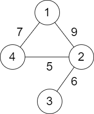
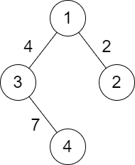

## Description

You are given a positive integer `n` representing `n` cities numbered from `1` to `n`. You are also given a **2D** array `roads` where $\text{roads}[i] = [a_{i}, b_{i}, \text{distance}_{i}]$ indicates that there is a **bidirectional **road between cities $a_{i}$ and $b_{i}$ with a distance equal to $\text{distance}_{i}$. The cities graph is not necessarily connected.

The **score** of a path between two cities is defined as the **minimum **distance of a road in this path.

Return the **minimum **possible score of a path between cities 1 and `n`.

**Note**:

- A path is a sequence of roads between two cities.

- It is allowed for a path to contain the same road **multiple** times, and you can visit cities 1 and `n` multiple times along the path.

- The test cases are generated such that there is **at least** one path between 1 and `n`.
### Function Contract

- `n`: Input parameter.
- Returns expected result.

### Examples
#### Example 1

- **Input:** $n = 4, roads = [[1,2,9],[2,3,6],[2,4,5],[1,4,7]]$
- **Output:** `5`
- **Explanation:** The path from city 1 to 4 with the minimum score is: 1 -> 2 -> 4. The score of this path is min(9,5) = 5.
It can be shown that no other path has less score.
#### Example 2

- **Input:** $n = 4, roads = [[1,2,2],[1,3,4],[3,4,7]]$
- **Output:** `2`
- **Explanation:** The path from city 1 to 4 with the minimum score is: 1 -> 2 -> 1 -> 3 -> 4. The score of this path is min(2,2,4,7) = 2.
### Constraints

- $2 \le n \le 10^{5}$

- $1 \le \text{roads.length} \le 10^{5}$

- $\text{roads}[i].length = 3$

- $1 \le a_{i}, b_{i} \le n$

- $a_{i} \neq b_{i}$

- $1 \le \text{distance}_{i} \le 10^{4}$

- There are no repeated edges.

- There is at least one path between `1` and `n`.