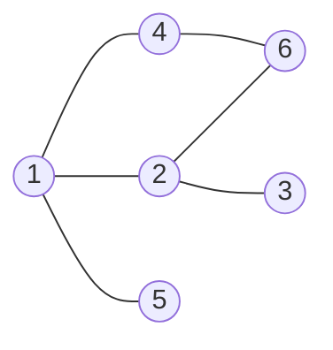

# Guided Example: Divide Nodes Into the Maximum Number of Groups

## 1. The instance we will solve

We are handed an undirected graph on `n` nodes labelled `1` through `n`, given as a
list of edges. The graph may be disconnected. A **grouping** assigns every node to
exactly one group, groups are numbered `1` through `m`, and every group index in
that range must actually be used. The single legality rule is local:

> whenever nodes $a$ and $b$ share an edge, and $a$ sits in group $x$ while $b$
> sits in group $y$, then $\lvert y - x \rvert = 1$.

Two neighbours may therefore sit in adjacent indices, but they may never share a
group and they may never be separated by two or more index steps. We want the
largest `m` for which such a grouping exists; if no grouping exists at all the
answer is `-1`.

The instance we trace is the first official example:

- $n = 6$
- $\text{edges} = [[1,2],[1,4],[1,5],[2,6],[2,3],[4,6]]$
- required output: `4`

This instance is well chosen because it is one connected component that is rich
enough to make the whole method visible: it is bipartite, so an answer exists, and
its diameter is strictly larger than the diameter of a triangle or a 4-cycle, so
the number of groups is genuinely determined by a global span rather than by the
first node we happen to start from.

## 2. Group indices behave like graph layers

The rule $\lvert y - x \rvert = 1$ has three immediate consequences, and together
they are the entire structure of the problem.

1. **Each group is an independent set.** If two nodes in the same group were joined
   by an edge, their index difference would be $0$, not $1$.
2. **The index is a step function along every path.** Walking along a path
   $v_0, v_1, \dots, v_L$, the group index changes by $\pm 1$ at every step, so a
   path of length $L$ can move the index by at most $L$ in either direction.
3. **Indices alternate in parity along a path.** After $L$ steps the index has moved
   by a sum of $L$ terms, each equal to $+1$ or $-1$, so
   $g(v_L) \equiv g(v_0) + L \pmod 2$. The parity of a node's group index is
   therefore forced by the parity of any walk length between the two nodes.

Consequence 3 is why an odd cycle is fatal and an even cycle is not: around an odd
cycle a walk returns to its starting node after an odd number of steps, which would
demand $g(v) \equiv g(v) + 1 \pmod 2$, a contradiction, while around an even cycle
the parity demand is consistent.

Consequence 2 is why the *number* of groups is governed by distances. Fix a
component $C$ and let $\operatorname{diam}(C)$ denote its diameter, the largest
distance between any two of its nodes. Pick the node $r$ of $C$ that lies in the
lowest group index that $C$ uses (its group is $g_{\min}$), and pick a node $u$ of
$C$ in the highest index used ($g_{\max}$). Because $r$ and $u$ lie in the same
component, some path of length $L$ joins them, and that path carries the index from
$g_{\min}$ to $g_{\max}$ in steps of size $1$. Hence

$$
g_{\max} - g_{\min} \le L \qquad\text{and therefore}\qquad g_{\max} - g_{\min} \le \operatorname{diam}(C).
$$

Counting the distinct indices that $C$ occupies gives the upper bound
$g_{\max} - g_{\min} + 1 \le \operatorname{diam}(C) + 1$.

## 3. Reading the example graph

Listing the neighbours of every node makes the structure concrete and supplies the
adjacency we will traverse. The graph is undirected, so each edge appears in two
adjacency lists.

| Node $v$ | Neighbours $N(v)$ |
|:---|:---|
| `1` | `2`, `4`, `5` |
| `2` | `1`, `3`, `6` |
| `3` | `2` |
| `4` | `1`, `6` |
| `5` | `1` |
| `6` | `2`, `4` |

Node `1` is the hub; nodes `3` and `5` are leaves, and `4` together with `6` forms a
second route back to `2`, which is the 4-cycle $1 \to 2 \to 6 \to 4 \to 1$. That
cycle has even length, so the graph is bipartite and a grouping exists. Note the
asymmetry of the two sides: node `1` has three neighbours while node `3` has one.
Any node chosen as the origin of a layering therefore produces a different number of
layers, and the answer is the best choice over all origins.

## 4. The layer-parity invariant and why an odd cycle is fatal

The invariant we maintain while exploring is exactly the parity statement from
section 2, expressed as a labelling. Write $\ell(v)$ for the layer assigned to $v$,
with $\ell(v) = d(r, v) + 1$ where $r$ is the chosen origin and $d$ is the number of
edges on a shortest path. The condition that makes this labelling a legal grouping
is:

$$
\text{for every edge } (a,b), \quad \lvert \ell(b) - \ell(a) \rvert = 1 .
$$

Breadth-first layering already guarantees $\lvert \ell(b) - \ell(a) \rvert \le 1$
for every edge, because neighbours differ in distance from $r$ by at most one.
The invariant can therefore fail in exactly two visible ways, and both are caught
the moment an edge is examined.

| Situation | Index difference | Reading | Verdict |
|:---|:---|:---|:---|
| Edge joins layers $k$ and $k+1$ | $\lvert \ell(b)-\ell(a) \rvert = 1$ | ordinary step of the layering | keep |
| Edge joins two nodes of the *same* layer | $\lvert \ell(b)-\ell(a) \rvert = 0$ | closes an odd cycle | impossible, answer `-1` |
| Edge appears to jump two or more layers | $\lvert \ell(b)-\ell(a) \rvert \ge 2$ | contradiction: neighbours cannot differ by more than one layer | impossible, answer `-1` |

The second row is the triangle of the second official example, $n = 3$ with edges
$[[1,2],[2,3],[3,1]]$. Layering from node `1` puts `1` in layer $1$ and both `2` and
`3` in layer $2$; the edge between `2` and `3` then joins two nodes of the same
layer, so $\lvert 2 - 2 \rvert = 0 \ne 1$ and the instance is rejected with `-1`. A
single non-bipartite component poisons the entire graph, because the parity
contradiction lives inside that component and no assignment of the other components
can repair it.

## 5. Tracing one layering from node 3

Breadth-first search from a chosen origin $r$ labels nodes by increasing distance.
We choose $r = 3$ first, because it is a leaf sitting at the far end of the graph.
The traversal processes the queue front to back; whenever an already-labelled
neighbour is met, we check the index difference instead of relabelling it.

| Step | Dequeued node | Its layer | Newly labelled neighbours | Labelling after the step | Check on already-labelled neighbours |
|:---|:---|:---|:---|:---|:---|
| 1 | `3` | 1 | `2` becomes layer 2 | `3`:1, `2`:2 | none |
| 2 | `2` | 2 | `1` becomes 3, `6` becomes 3 | `3`:1, `2`:2, `1`:3, `6`:3 | `3` at layer 1: $\lvert 1-2 \rvert = 1$ |
| 3 | `1` | 3 | `4` becomes 4, `5` becomes 4 | adds `4`:4, `5`:4 | `2` at layer 2: $\lvert 2-3 \rvert = 1$ |
| 4 | `6` | 3 | none | unchanged | `2` at layer 2: $\lvert 2-3 \rvert = 1$; `4` at layer 4: $\lvert 4-3 \rvert = 1$ |
| 5 | `4` | 4 | none | unchanged | `1` at layer 3: $\lvert 3-4 \rvert = 1$; `6` at layer 3: $\lvert 3-4 \rvert = 1$ |
| 6 | `5` | 4 | none | unchanged | `1` at layer 3: $\lvert 3-4 \rvert = 1$ |

Every check passes, so the graph is bipartite and this layering is a legal grouping.
Collapsing the labelling into groups:

| Group index | Nodes in the group | Independent set? | Why it is consistent with its neighbours |
|:---|:---|:---|:---|
| 1 | `3` | yes | its only neighbour, `2`, sits in group 2 |
| 2 | `2` | yes | neighbours `1` and `6` sit in group 3 |
| 3 | `1`, `6` | yes | `1` touches groups 2 and 4; `6` touches groups 2 and 4 |
| 4 | `4`, `5` | yes | `4` touches group 3; `5` touches group 3 |

This grouping uses $m = 4$ groups, which already matches the required output.
Checking it edge by edge is the cleanest confirmation that the invariant holds for
the whole instance.

| Edge $(a,b)$ | Group of $a$ | Group of $b$ | $\lvert g(b) - g(a) \rvert$ | Legal? |
|:---|:---|:---|:---|:---|
| `1`–`2` | 3 | 2 | 1 | yes |
| `1`–`4` | 3 | 4 | 1 | yes |
| `1`–`5` | 3 | 4 | 1 | yes |
| `2`–`6` | 2 | 3 | 1 | yes |
| `2`–`3` | 2 | 1 | 1 | yes |
| `4`–`6` | 4 | 3 | 1 | yes |

## 6. Which origin maximises the layer count

Starting the layering at node `3` gave four groups, but starting at node `1` would
have given fewer: from `1` the labels are `1`:1, then `2`, `4`, `5` at layer 2, then
`3`, `6` at layer 3 — only three groups. The origin matters, because the layer count
of a layering from $r$ is exactly the *eccentricity* of $r$,

$$
e(r) = \max_{u \in C} d(r, u),
$$

plus one, since the layers are $1, 2, \dots, e(r)+1$. Sweeping all six origins of
the single component gives the following census, where each witness is a node that
actually attains the eccentricity.

| Origin $r$ | Eccentricity $e(r)$ | Layers $= e(r)+1$ | Farthest witness node(s) |
|:---|:---|:---|:---|
| `1` | 2 | 3 | `3` and `6`, as in $1 \to 2 \to 3$ |
| `2` | 2 | 3 | `4` and `5`, as in $2 \to 1 \to 4$ |
| `3` | 3 | 4 | `4` and `5`, as in $3 \to 2 \to 1 \to 4$ |
| `4` | 3 | 4 | `3`, as in $4 \to 1 \to 2 \to 3$ |
| `5` | 3 | 4 | `3`, as in $5 \to 1 \to 2 \to 3$ |
| `6` | 3 | 4 | `5`, as in $6 \to 2 \to 1 \to 5$ |

The maximum layer count over origins is $4$, attained by `3`, `4`, `5`, and `6`.
Because the maximum eccentricity over all origins is by definition the diameter, we
have recovered $\operatorname{diam}(C) + 1 = 3 + 1 = 4$ for this component, and the
official expected output is exactly `4`.

## 7. Correctness: the diameter bound, additivity, and the traps

**Upper bound.** Let a legal grouping of the whole graph use $m$ groups, and let
component $C$ occupy the set of distinct indices $S_C$, with
$g_{\min} = \min S_C$ and $g_{\max} = \max S_C$. Taking $r$ in group $g_{\min}$ and
$u$ in group $g_{\max}$, some path inside $C$ joins them, and each of its steps
changes the index by exactly one, so $g_{\max} - g_{\min} \le d(r,u) \le
\operatorname{diam}(C)$. Hence $\lvert S_C \rvert = g_{\max} - g_{\min} + 1 \le
\operatorname{diam}(C) + 1$. Every group index belongs to the union
$\bigcup_C S_C$, so

$$
m = \Bigl\lvert \bigcup_C S_C \Bigr\rvert \le \sum_{C} \lvert S_C \rvert \le \sum_{C} \bigl(\operatorname{diam}(C) + 1\bigr).
$$

**Attainment.** When every component is bipartite, layer each component from an
origin that attains its diameter and place the resulting layers in disjoint index
blocks, one block per component. Shifting a component's layers by a constant keeps
every difference $\lvert y - x \rvert$ equal to $1$, and no edge joins two different
components, so the shifted blocks are simultaneously legal. The blocks are non-empty
and contiguous, so the grouping has exactly $\sum_C (\operatorname{diam}(C)+1)$
groups. Combined with the upper bound this is optimal, which yields the method: a
parity violation anywhere returns `-1`, and otherwise the answer is
$\sum_C (\operatorname{diam}(C)+1)$.

**The traps this instance exposes.**

- **Taking the first layering you find.** Node `1` is the natural hub, yet it yields
  only three groups; the optimum needs an origin at the far end of the component. A
  method that reports the layer count of one arbitrary origin under-reports the
  answer.
- **Assuming more groups is always better.** The even cycle $1 \to 2 \to 6 \to 4 \to 1$
  looks as though it could host four groups, but its diameter is $2$, so its maximum
  is three. Forcing an extra group makes some index repeat, and a repeated index
  along an odd cycle is exactly the contradiction the invariant forbids.
- **Testing bipartiteness on one component only.** A disconnected graph may contain a
  valid component and a triangle. The answer is `-1` for the whole instance, not for
  the offending component alone, because the output is a single number.
- **Forgetting isolated nodes.** A node with no edges contributes
  $\operatorname{diam} + 1 = 1$ group by itself and cannot be folded into another
  component's layers; omitting it loses exactly one group.
- **Confusing diameter edges with groups.** The diameter counts *steps*; the group
  count is steps plus one, because both endpoints of a longest shortest path need
  their own layers.

The boundary inventory below checks each of those readings against the authored
cases for this package.

| Instance | Bipartite? | Component diameters | Answer | Reason |
|:---|:---|:---|:---|:---|
| $n=6$, the traced example | yes | 3 | `4` | $3 + 1 = 4$ |
| $n=3$ triangle $[[1,2],[2,3],[3,1]]$ | no | undefined | `-1` | an edge joins two nodes of the same layer |
| $n=2$, single edge | yes | 1 | `2` | one step means two groups, one per node |
| $n=5$ path `1`–`2`–`3`–`4`–`5` | yes | 4 | `5` | every path node needs its own group |
| $n=4$ even cycle $[[1,2],[2,3],[3,4],[4,1]]$ | yes | 2 | `3` | its diameter is 2 even though it has 4 nodes |
| $n=7$, two length-2 paths plus isolated `7` | yes | 2, 2, 0 | `7` | $3 + 3 + 1 = 7$ |
| $n=5$, complete bipartite $K_{2,3}$ | yes | 2 | `3` | every cross edge needs one step and the diameter is 2 |
| $n=5$, edge `1`–`2` plus triangle on `3`, `4`, `5` | no | undefined | `-1` | one invalid component rejects the whole graph |

## 8. Complexity: time and auxiliary space

Let $n$ be the number of nodes and let $\lvert E \rvert$ be the number of input
edges. Storing the graph as adjacency lists uses one entry per endpoint, that is
$2\lvert E \rvert$ entries, together with $n$ list headers.

One breadth-first layering from a fixed origin touches only the origin's component
and costs $O(n + \lvert E \rvert)$ in the worst case: each node is labelled once, and
each adjacency entry is inspected once, when its owner is dequeued. To obtain the
maximum eccentricity inside every component we repeat that traversal once per
origin, so the total time is

$$
O\bigl(n \cdot (n + \lvert E \rvert)\bigr),
$$

which is $O(500 \cdot (500 + 10^4))$ at the stated limits and comfortably fast. The
parity checks are folded into the same traversals and add only constant work per
adjacency entry, so they do not change the bound. A sharper alternative computes each
component's diameter directly, for example with two breadth-first sweeps per
component, reaching $O(n + \lvert E \rvert)$ time, but that refinement is not needed
at this input size.

Auxiliary space is dominated by the adjacency lists, $O(n + \lvert E \rvert)$, plus
the per-traversal working arrays: a distance label for each node and the queue of
pending nodes, together $O(n)$. No memoisation across origins is required, because
each traversal is independent and only its maximum label survives, one integer per
component. The overall auxiliary space is therefore

$$
O(n + \lvert E \rvert).
$$