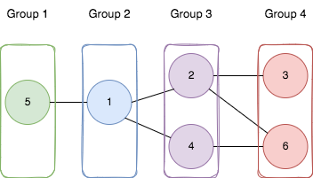

### 1. Description

You are given a positive integer `n` representing the number of nodes in an **undirected** graph. The nodes are labeled from `1` to `n`.

You are also given a 2D integer array `edges`, where $\text{edges}[i] = [a_{i}, b_{i}]$ indicates that there is a **bidirectional** edge between nodes $a_{i}$ and $b_{i}$. **Notice** that the given graph may be disconnected.

Divide the nodes of the graph into `m` groups (**1-indexed**) such that:

- Each node in the graph belongs to exactly one group.

- For every pair of nodes in the graph that are connected by an edge $[a_{i}, b_{i}]$, if $a_{i}$ belongs to the group with index `x`, and $b_{i}$ belongs to the group with index `y`, then $|y - x| = 1$.

Return *the maximum number of groups (i.e., maximum *`m`*) into which you can divide the nodes*. Return `-1` *if it is impossible to group the nodes with the given conditions*.

### 2. Function Contract

- `n`: Input parameter.
- Returns expected result.

### 3. Examples

#### Example 1

- **Input:** $n = 6, edges = [[1,2],[1,4],[1,5],[2,6],[2,3],[4,6]]$
- **Output:** `4`
- **Explanation:** As shown in the image we:
- Add node 5 to the first group.
- Add node 1 to the second group.
- Add nodes 2 and 4 to the third group.
- Add nodes 3 and 6 to the fourth group.
We can see that every edge is satisfied.
It can be shown that that if we create a fifth group and move any node from the third or fourth group to it, at least on of the edges will not be satisfied.
#### Example 2

- **Input:** $n = 3, edges = [[1,2],[2,3],[3,1]]$
- **Output:** `-1`
- **Explanation:** If we add node 1 to the first group, node 2 to the second group, and node 3 to the third group to satisfy the first two edges, we can see that the third edge will not be satisfied.
It can be shown that no grouping is possible.

### 4. Constraints

- $1 \le n \le 500$

- $1 \le \text{edges.length} \le 10^{4}$

- $\text{edges}[i].length = 2$

- $1 \le a_{i}, b_{i} \le n$

- $a_{i} \neq b_{i}$

- There is at most one edge between any pair of vertices.