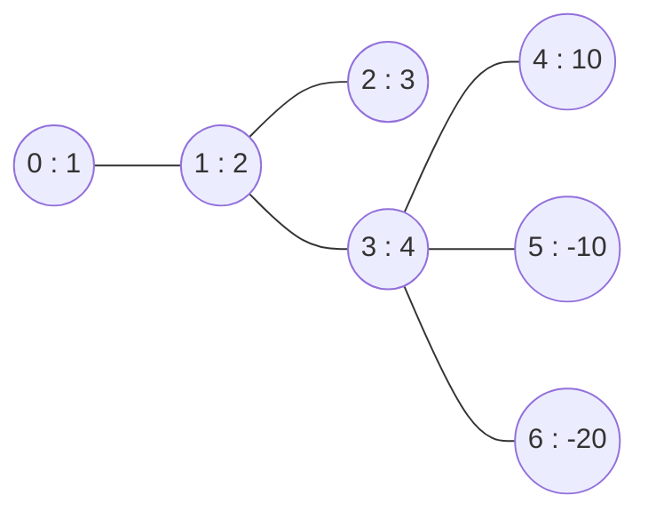

# Guided Example: Maximum Star Sum of a Graph

## 1. The instance we will solve

An undirected graph has `n` nodes numbered `0` to `n - 1`, and each node $i$ carries a
value $\text{vals}[i]$ that may be negative. A **star graph** is any set of edges of
the given graph that share one common node, called the centre; the star may use zero
edges, in which case it is just the centre alone. Its **star sum** is the sum of the
values of every node present in it — the centre plus the endpoints it selected. Given
an integer `k`, we must return the largest star sum achievable with **at most** `k`
edges.

We trace the first official instance:

- $\text{vals} = [1, 2, 3, 4, 10, -10, -20]$
- $\text{edges} = [[0,1], [1,2], [1,3], [3,4], [3,5], [3,6]]$
- $k = 2$
- required output: `16`

The graph is a good representative because it mixes everything the problem turns on.
One node carries a large positive value (`10` at node `4`), two nodes carry negative
values (`-10` and `-20`), two nodes have degree one, and the answer is not the node
with the largest value: the optimum needs a centre whose two best neighbours outweigh
everything else.

## 2. The structure of a star, and what "at most" changes

A star is determined by two choices: the centre $c$, and the set $S$ of neighbours of
$c$ that are included. Because all chosen edges share $c$, the star sum is

$$
\text{sum}(c, S) = \text{vals}[c] + \sum_{u \in S} \text{vals}[u],
\qquad S \subseteq N(c), \quad \lvert S \rvert \le k,
$$

where $N(c)$ is the set of neighbours of $c$ in the given graph. Two words in the
statement carry real weight.

**"at most"** means $\lvert S \rvert \le k$, not $\lvert S \rvert = k$. Adding a
neighbour with a negative value strictly reduces the sum, so a method that is forced
to use exactly `k` edges can be worse than using none. The authored trial
$[-8, 7, 6, -20]$ with edges $0$–$1$, $0$–$2$, $1$–$3$ and $k = 2$ shows this: the
best star is the single node `1` with sum $7$, even though `k` would allow two edges.

**"common node"** means the whole star is described by its centre, so the search space
is a union over the $n$ possible centres. There is no interaction between different
centres: choosing a star at centre `1` says nothing about a star at centre `3`.

The example graph, with each node labelled by its value, is:

## 3. Reducing each centre to its best positive neighbours

Fix a centre $c$. The following exchange argument characterises the best $S$ exactly,
with no search.

**Step 1: never include a non-positive neighbour.** Suppose $u \in S$ with
$\text{vals}[u] \le 0$. Removing $u$ from $S$ changes the sum by
$-\text{vals}[u] \ge 0$, so the sum does not decrease, and the constraint
$\lvert S \rvert \le k$ still holds because removing an element only shrinks $S$.
Repeating this removal leaves an optimal choice in which every selected neighbour has
a strictly positive value. Zero-valued neighbours are therefore irrelevant, which is
why the trial $[4, 0, 0, -2]$ with $k = 3$ answers $4$: the three neighbours add
nothing.

**Step 2: among positive neighbours, take the largest ones.** Let
$P(c) = \{\, \text{vals}[u] : u \in N(c), \text{vals}[u] > 0 \,\}$ be the multiset of
positive neighbour values, with $p = \lvert P(c) \rvert$, and sort it in
non-increasing order as $x_1 \ge x_2 \ge \dots \ge x_p$. If a chosen set $S$ of size at
most $k$ omitted some $y$ while containing some $x$ with $x < y$, swapping $x$ for $y$
changes the sum by $y - x > 0$ and keeps $\lvert S \rvert$ unchanged, so the original
choice was not optimal. Hence the optimum is

$$
\text{best}(c) = \text{vals}[c] + \sum_{i=1}^{\min(k,\,p)} x_i .
$$

This is the algorithm: for every node, collect the positive values of its neighbours,
sort them descending, and add the first `k` of them to the node's own value; the answer
is the largest such total.

Two details of the sum deserve attention. The centre's own value is always included,
even when it is negative, because the centre is part of every star at $c$. And the
number of edges actually used is $\min(k, p)$, which is why the method never needs to
worry about padding a star with harmful neighbours.

## 4. Worked trace at every candidate centre

First, list the neighbourhood of every node together with the neighbours' values. The
rightmost column keeps only the neighbours that the exchange argument permits.

| Node $i$ | `vals[i]` | Neighbours $N(i)$ with values | Positive neighbour values $P(i)$, sorted descending | $\min(k, p)$ for $k = 2$ |
|:---|:---|:---|:---|:---|
| 0 | 1 | 1 (value 2) | `2` | 1 |
| 1 | 2 | 0 (1), 2 (3), 3 (4) | `4, 3` | 2 |
| 2 | 3 | 1 (2) | `2` | 1 |
| 3 | 4 | 1 (2), 4 (10), 5 (-10), 6 (-20) | `10, 2` | 2 |
| 4 | 10 | 3 (4) | `4` | 1 |
| 5 | -10 | 3 (4) | `4` | 1 |
| 6 | -20 | 3 (4) | `4` | 1 |

Now evaluate the candidate star sum at each centre. The neighbour contribution is the
sum of the first $\min(k, p)$ values of $P(i)$.

| Centre $i$ | `vals[i]` | Selected neighbours | Neighbour contribution | `best(i)` |
|:---|:---|:---|:---|:---|
| 0 | 1 | `1` (value 2) | 2 | 3 |
| 1 | 2 | `3` (4) and `2` (3) | 7 | 9 |
| 2 | 3 | `1` (value 2) | 2 | 5 |
| 3 | 4 | `4` (10) and `1` (2) | 12 | 16 |
| 4 | 10 | `3` (value 4) | 4 | 14 |
| 5 | -10 | `3` (value 4) | 4 | -6 |
| 6 | -20 | `3` (value 4) | 4 | -16 |

The maximum over the column is $16$, attained only at centre `3` with neighbours `4`
and `1`, which matches the expected output. Centre `4` is a useful contrast: it owns
the single largest node value in the graph, yet its star reaches only $14$, because its
only neighbour is worth $4$. The centre with the most valuable neighbourhood wins, not
the centre with the most valuable node. Centre `3` also shows why the two negative
neighbours must be discarded: including `-20` with `10` would give a neighbour total of
$-10$ instead of $12$.

## 5. Invariant and correctness

**Local claim.** For a fixed centre $c$, the value $\text{best}(c)$ defined in
section 3 is the maximum star sum over all stars centred at $c$.

*Proof.* Take any feasible star at $c$ with chosen set $S$, $\lvert S \rvert \le k$.
By step 1 of the exchange argument, replacing $S$ by its positive elements never
decreases the sum, so some optimal choice uses only positive values. Let
$S^{+} \subseteq P(c)$ be that choice, with $\lvert S^{+} \rvert \le k$. If
$S^{+}$ does not consist of the $\min(k, p)$ largest elements of $P(c)$, then some
$y \in P(c)$ exceeds some $x \in S^{+}$; swapping them keeps the cardinality within
the limit and strictly increases the sum, contradicting optimality. Therefore
$\text{best}(c)$ is an upper bound that is also attained, so it is the local optimum.

**Global claim.** The answer is $\max_i \text{best}(i)$.

*Proof.* Every star graph in the sense of the statement has a common node for all of
its edges; taking that node as the centre, the star appears among the candidates
enumerated above, and if the star has no edges its single node is its own centre. So
the set of candidates contains every star graph, and the largest `best(i)` is at least
the true optimum. Conversely each `best(i)` is realised by an actual star at node $i$
with $\min(k, p) \le k$ edges, so no candidate exceeds the true optimum. The two
inequalities meet, and the maximum is exact. The invariant maintained by the
computation is simply that `best(i)` is complete for centre $i$ before the running
maximum consumes it, so no candidate is skipped and none is invented.

## 6. Boundaries and traps

| Situation | Instance | Correct reading | Answer |
|:---|:---|:---|:---|
| Using fewer than `k` edges is better | `vals = [-8, 7, 6, -20]`, edges $0$–$1$, $0$–$2$, $1$–$3$, $k = 2$ | centre `1` takes no edges at all | 7 |
| `k` is zero | `vals = [-3, 9, 2]`, edges $0$–$1$, $1$–$2$, $k = 0$ | every star is a single node, so the edges are irrelevant | 9 |
| Every neighbour is negative | `vals = [-1, -2, -3]`, edges $0$–$1$, $1$–$2$, $k = 2$ | the best star is one node | -1 |
| Negative centre with strong neighbours | `vals = [-5, 9, 8]`, edges $0$–$1$, $0$–$2$, $k = 2$ | a negative centre can still be optimal because its neighbours dominate | 12 |
| Disconnected graph with an isolated node | `vals = [1, 2, 100, -5, 4]`, edges $0$–$1$, $2$–$3$, $k = 1$ | an isolated node is a valid star of one node | 100 |
| Zero-valued neighbours | `vals = [4, 0, 0, -2]`, edges $0$–$1$, $0$–$2$, $0$–$3$, $k = 3$ | zeros do not change the sum, negatives must be dropped | 4 |
| Many neighbours, small `k` | `vals = [5, 1, 10, 3, 8]`, star centred at `0`, $k = 2$ | keep only the two largest positive neighbours | 23 |
| Single node, no edges | `vals = [-5]`, edges empty, $k = 0$ | the only star is node `0` itself | -5 |

| Plausible mistake | What it does on the traced instance | Why it is wrong |
|:---|:---|:---|
| Sort neighbours by absolute value | at centre `3` it would take `-20` and `10` | the sum is linear in the values, not in their magnitudes; `-20` is harmful, not valuable |
| Force exactly `k` edges | at centre `2` it would have to add a second edge that does not exist, or at centre `1` it would reach the same total only by luck | the statement says at most `k`, and negative extras strictly hurt |
| Skip negative centres | in the trial $[-5, 9, 8]$ it would never evaluate the winning centre `0`, whose star is $9 + 8 - 5 = 12$ | a centre contributes its own value to every star it heads, and a negative centre can still win when its neighbourhood is strong |
| Answer with the largest node value | it would report $10$ from node `4` | the star sum adds neighbours, so node `4` reaches only $14$ while centre `3` reaches $16$ |
| Ignore isolated nodes | in the disconnected trial it would report $4$ or $2$ | a single node with no edges is a legal star and may be optimal, here $100$ |

## 7. Alternatives

| Method | Idea | Cost | Assessment |
|:---|:---|:---|:---|
| Sort every positive-neighbour list | the method traced above | $O(n + E \log E)$ | exact and simple; the sort of a degree-$d$ list costs $d \log d$ |
| Keep a min-heap of size `k` per centre | stream the positive neighbours and retain only the largest `k` | $O(n + E \log k)$ | better when `k` is small and some degrees are huge; same result |
| Selection of the `k`-th largest with a linear-time partition | find the threshold instead of sorting | $O(n + E)$ expected | asymptotically fastest, but more delicate to implement correctly |
| Include every neighbour and then trim | sort all neighbours including negatives and take the first `k` | $O(n + E \log E)$ | correct only if the trim stops at the last positive value; adding negatives after the positives is what breaks it |
| Enumerate all subsets of neighbours | test every $\lvert S \rvert \le k$ at every centre | exponential | infeasible even for moderate degrees |

## 8. Complexity: time and auxiliary space

Let $n$ be the number of nodes, $E$ the number of edges, and $\Delta$ the maximum
degree. Building the adjacency structure costs $O(n + E)$ because each edge is stored
once for each of its endpoints, and only positive neighbour values are retained, which
can only shrink the stored total.

The dominant cost is sorting. A centre of degree $d$ sorts at most $d$ positive
neighbour values, so the total sorting work is
$\sum_{v} d_v \log d_v \le \sum_{v} d_v \log \Delta = 2E \log \Delta$, which is
$O(E \log E)$ in the worst case and $O(E \log k)$ if only a size-`k` heap or
selection is used. Forming the prefix of length $\min(k, d_v)$ takes $O(d_v)$ per
centre, and the final scan for the maximum takes $O(n)$. The total time is therefore

$$
O\bigl(n + E \log E\bigr).
$$

Auxiliary space is

$$
O(n + E),
$$

for the adjacency storage: each of the $E$ edges contributes at most two neighbour
entries, and each of the $n$ nodes contributes one accumulator for its best star sum.
The per-centre sorted list is charged to the adjacency entries it was built from, so
it needs no additional asymptotic space beyond that bound.
