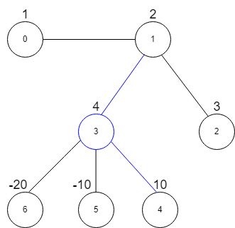

### 1. Description

There is an undirected graph consisting of `n` nodes numbered from `0` to $n - 1$. You are given a **0-indexed** integer array `vals` of length `n` where $\text{vals}[i]$ denotes the value of the $i^{\text{th}}$ node.

You are also given a 2D integer array `edges` where $\text{edges}[i] = [a_{i}, b_{i}]$ denotes that there exists an **undirected** edge connecting nodes $a_{i}$ and $b_{i}.$

A **star graph** is a subgraph of the given graph having a center node containing `0` or more neighbors. In other words, it is a subset of edges of the given graph such that there exists a common node for all edges.

The image below shows star graphs with `3` and `4` neighbors respectively, centered at the blue node.

The **star sum** is the sum of the values of all the nodes present in the star graph.

Given an integer `k`, return *the **maximum star sum** of a star graph containing **at most** *`k`* edges.*

### 2. Function Contract

**Inputs**

- `vals`: Input parameter (`List[int]`).
- `edges`: Input parameter (`List[List[int]]`).
- `k`: Input parameter (`int`).

**Return value**

- Returns `int`.

### 3. Examples

#### Example 1

- **Input:** $vals = [1,2,3,4,10,-10,-20], edges = [[0,1],[1,2],[1,3],[3,4],[3,5],[3,6]], k = 2$
- **Output:** `16`
- **Explanation:** The above diagram represents the input graph.
The star graph with the maximum star sum is denoted by blue. It is centered at 3 and includes its neighbors 1 and 4.
It can be shown it is not possible to get a star graph with a sum greater than 16.

#### Example 2

- **Input:** $vals = [-5], edges = [], k = 0$
- **Output:** `-5`
- **Explanation:** There is only one possible star graph, which is node 0 itself.
Hence, we return -5.

### 4. Constraints

- $n = \text{vals.length}$

- $1 \le n \le 10^{5}$

- $-10^{4} \le \text{vals}[i] \le 10^{4}$

- $0 \le \text{edges.length} \le min(n * (n - 1) / 2$, $10^{5}$)`

- $\text{edges}[i].length = 2$

- $0 \le a_{i}, b_{i} \le n - 1$

- $a_{i} \neq b_{i}$

- $0 \le k \le n - 1$
