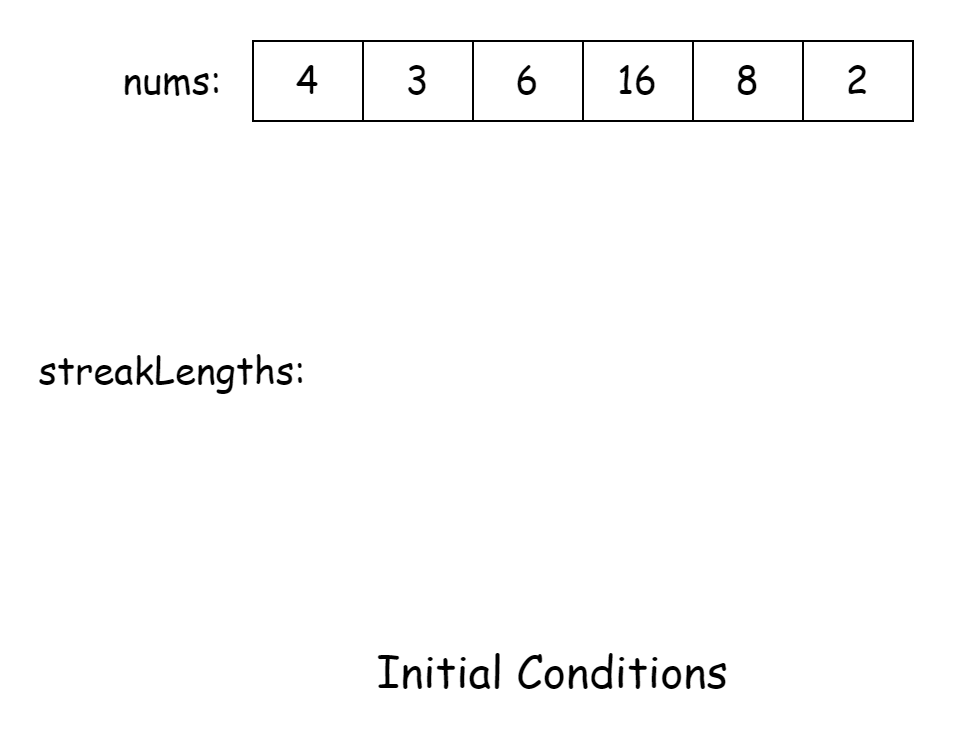
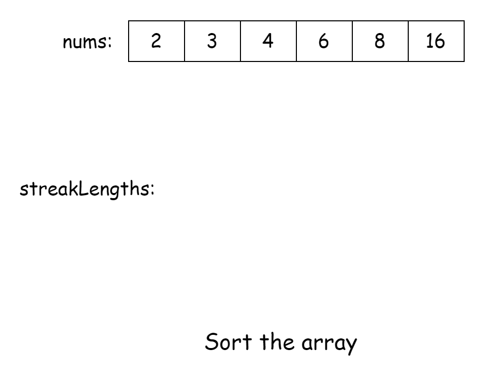
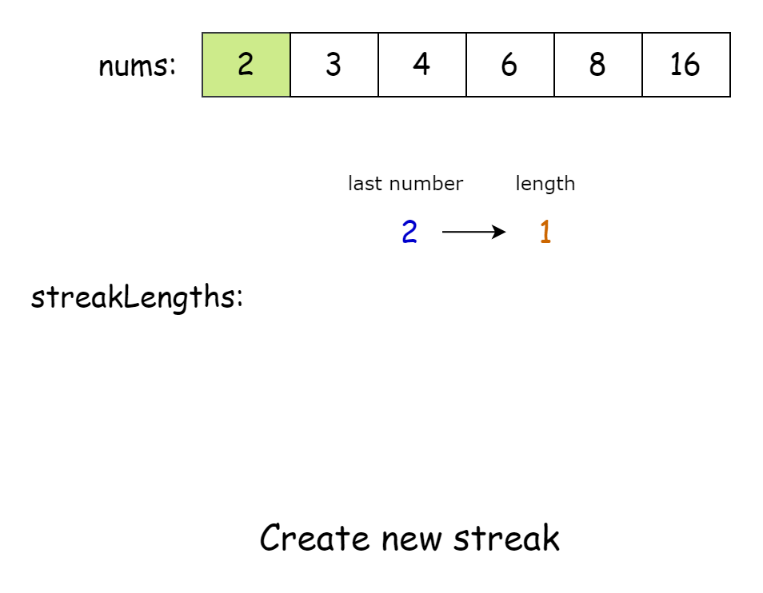
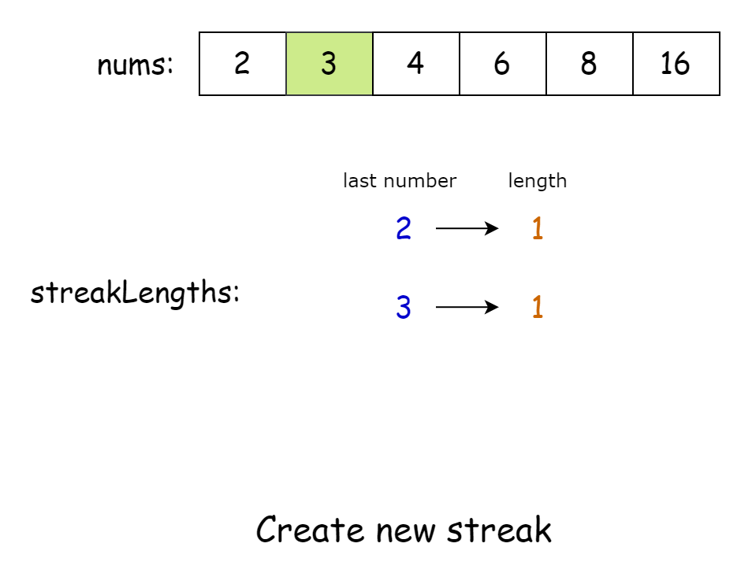
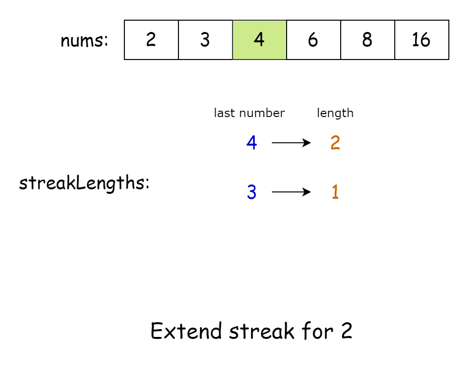
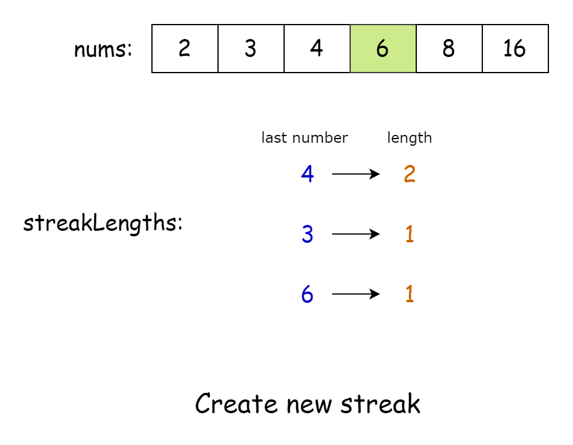
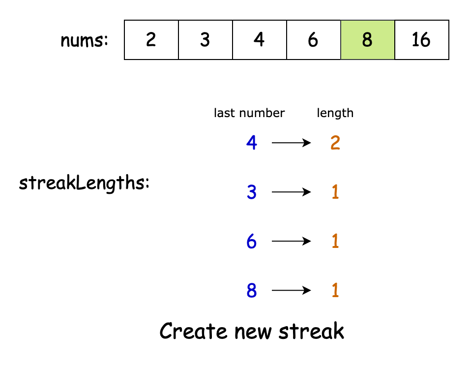
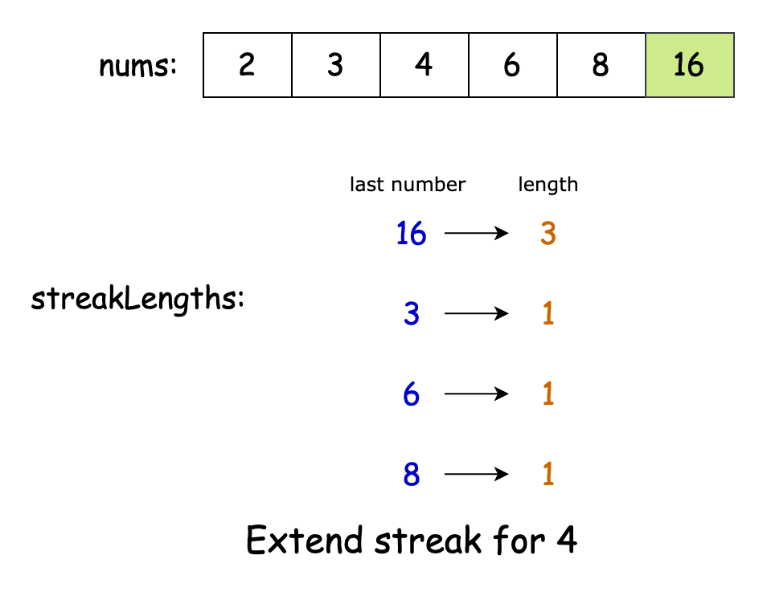
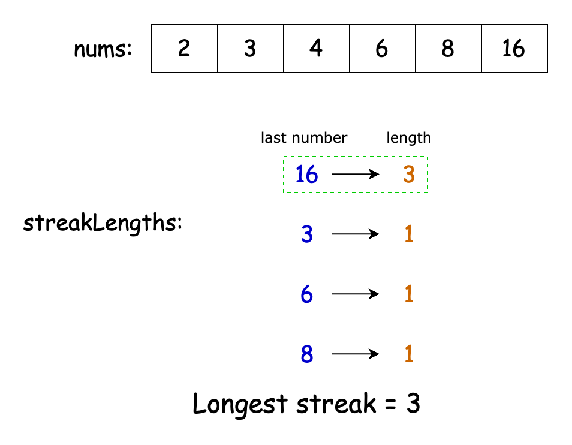

[TOC]

## Solution

---

### Approach 1: Binary Search

#### Intuition

Our task is to form a progression where each number is the square of the previous one. A basic but inefficient method would be to loop through the array and, for each number, search for its square in the rest of the array. The longest chain of such squares would represent our desired square streak.

However, a linear search across the entire array is too slow. To optimize, we can use binary search to find the square of a given number.

To apply binary search, we first sort the array. Then, we attempt to form a streak for each number by repeatedly finding its square using binary search. The number of successful squares found determines the length of the streak, and we keep track of the longest streak.

Further optimization is possible. Once a number has been part of a streak, it doesn’t need to be considered again as a starting point for another streak, as any new streak starting from that number would be shorter. To handle this, we can use a set to track numbers already processed as part of a streak, excluding them from being reconsidered.

#### Algorithm

- Sort `nums` in ascending order.
- Initialize a variable `longestStreak` to 0 to store the length of the longest square streak.
- Create a set `processedNumbers` to keep track of numbers already processed.
- Iterate through each number `current` in the sorted array:
  - If `current` is in `processedNumbers`, skip to the next iteration.
  - Initialize `streak` to `current` and `streakLength` to 1.
  - Enter a loop:
- If the square of `streak` is greater than $10^5$, break the loop.
- If the square of `streak` exists in the array (using binary search):
      - Update `streak` to its square.
      - Add `streak` to `processedNumbers`.
      - Increment `streakLength`.
- Else, break the loop.
  - Update `longestStreak` to the maximum of `longestStreak` and `streakLength`.
- Return -1 if `longestStreak` is less than 2, otherwise return `longestStreak`.

Implement a binary search helper function:
  - If the target is negative, return false.
  - Initialize `left` to 0 and `right` to the last index of the array.
  - While `left` is less than or equal to `right`:
- Calculate the middle index `mid`.
      - If the element at `mid` equals the target, return true.
      - If the element at `mid` is greater than the target, update `right` to $mid - 1$.
      - Otherwise, update `left` to $mid + 1$.
  - If the target is not found, return false.

#### Implementation

```python
class Solution:
    def longestSquareStreak(self, nums: List[int]) -> int:
        # Sort the array in ascending order
        nums.sort()

        # Set to keep track of numbers we've already processed
        processed_numbers = set()

        longest_streak = 0

        # Iterate through each number in the sorted array
        for current in nums:
            # Skip if we've already processed this number
            if current in processed_numbers:
                continue

            streak = current
            streak_length = 1

            # Continue the streak as long as we can find the square of the current number
            while streak * streak <= 10**5:
                if self._binary_search(nums, streak * streak):
                    streak *= streak
                    processed_numbers.add(streak)
                    streak_length += 1
                else:
                    break

            # Update the longest streak if necessary
            longest_streak = max(longest_streak, streak_length)

        # Return -1 if no valid streak found, otherwise return the longest streak
        return longest_streak if longest_streak >= 2 else -1

    # Binary search helper function to efficiently find a value in the sorted array
    def _binary_search(self, nums: List[int], target: int) -> bool:
        left, right = 0, len(nums) - 1

        while left <= right:
            mid = (left + right) // 2
            if nums[mid] == target:
                return True
            elif nums[mid] < target:
                left = mid + 1
            else:
                right = mid - 1

        return False
```

#### Complexity Analysis

Let $n$ be the length of the input array `nums`.

- Time complexity: $O(n \cdot \log n)$

    The first step is sorting the input array, which takes $O(n \cdot \log n)$ time. Then, for each element, it performs a series of binary searches. The number of binary searches for each element is limited by the double logarithm of the maximum possible value ($10^5$ in this case), as each step squares the current number. Each binary search takes $O(\log n)$ time. Thus, the time complexity for processing each element is $O(\log n \cdot \log \log ($10^{5}$))$, which simplifies to $O(\log n)$ since $\log 10^5$ is a constant.

    Considering all steps, the overall time complexity is $O(n \cdot \log n)$.

    > Note: For a number x, the series of squares would be $x$, $x^2$, $x^4$, $x^8$, and so on. The length of this sequence for each number would be $\log(\log(M))$ where $M$ is the maximum possible value that can be reached. Since M here is constant, the Big-O complexity of this value is $O(1)$.

- Space complexity: $O(n)$

    The algorithm uses a set to store processed numbers, which in the worst case could contain all unique elements from the input array, leading to $O(n)$ space.

    The space taken by the sorting algorithm ($S$) depends on the language of implementation:
- In Java, `Arrays.sort()` is implemented using a variant of the Quick Sort algorithm which has a space complexity of $O( \log n)$.
- In C++, the `sort()` function is implemented as a hybrid of Quick Sort, Heap Sort, and Insertion Sort, with a worst-case space complexity of $O(\log n)$.
- In Python, the `sort()` method sorts a list using the Timsort algorithm which is a combination of Merge Sort and Insertion Sort and has a space complexity of $O(n)$.

    Thus, the space complexity is $O(n + S) = O(n)$.

---

### Approach 2: Set

#### Intuition

Instead of using binary search to check if a number exists in the array, we can leverage a set. This approach eliminates the need for sorting and allows us to check for a number in constant time rather than logarithmic time.

We start by initializing a set `uniqueNumbers` to store all the numbers from the array. As before, we loop through the array and treat each number as the starting point of a streak. Inside this loop, we continue searching for the square of the previous number in the sequence using the set. The longest streak we find by counting how many times the inner loop runs gives us the desired result.

#### Algorithm

- Initialize a variable `longestStreak` to 0 to store the length of the longest square streak.
- Create a set `uniqueNumbers` to store all unique numbers from the input array.
- Iterate through each number in the input array, adding it to `uniqueNumbers`.
- Iterate through each number `startNumber` in the input array:
  - Initialize :
- `currentStreak` to 0 to track the length of the current streak.
- `current` as a long integer with the value of `startNumber`.
- Enter a loop that continues while `current` exists in `uniqueNumbers`:
      - Increment `currentStreak`.
      - If the square of `current` is greater than $10^5$, break the loop.
      - Update `current` to its square.
  - Update `longestStreak` to the maximum of `longestStreak` and `currentStreak`.
- Return -1 if `longestStreak` is less than 2, otherwise return `longestStreak`.

#### Implementation

```python
class Solution:
    def longestSquareStreak(self, nums: List[int]) -> int:
        longest_streak = 0

        # Create a set to store all unique numbers from the input array
        unique_numbers = set(nums)

        # Iterate through each number in the input array
        for start_number in nums:
            current_streak = 0
            current = start_number

            # Continue the streak as long as we can find the next square in the set
            while current in unique_numbers:
                current_streak += 1

                # Break if the next square would be larger than 10^5 (problem constraint)
                if current * current > 10**5:
                    break

                current *= current

            # Update the longest streak if necessary
            longest_streak = max(longest_streak, current_streak)

        # Return -1 if no valid streak found, otherwise return the longest streak
        return longest_streak if longest_streak >= 2 else -1
```

#### Complexity Analysis

Let $n$ be the length of the input array `nums`.

* Time complexity: $O(n \log n)$

    The algorithm iterates through each element in `nums` to fill `uniqueNumbers`, which takes $O(n)$ time.

    For each number in `nums`, the algorithm checks a sequence of squares until the square exceeds the value of the element or is not found in the set.

    Given that we are considering values up to the largest element in `nums` (bounded by $n$ in this analysis, as $n \leq 10^5$), each check involves up to $O(\log n)$ operations, as each number may involve verifying a logarithmic number of squares.

    Consequently, the time complexity for processing each element becomes $O(\log n)$, resulting in an overall complexity of $O(n) +$\mathcal{O}(n \cdot \\log n)$= O(n \log n)$ for the entire algorithm.

* Space complexity: $O(n)$

    The hash set can store $n$ elements in the worst case, where all elements are unique. This takes $O(n)$ space. No other significant extra space is used that scales with the input size.

    Thus, the space complexity of the algorithm is $O(n)$.

---

### Approach 3: Map

#### Intuition

To track the length of a streak, we only need two key pieces of information: the last number in the current streak and the streak's length. When we find the square of the last number, we update both: the square becomes the new last number, and the streak length is incremented by one.

We can store this relationship using a map, where the key is the last number and the value is the streak length. For each number in the array, our first step is to check if it's a perfect square. This can be done by taking the square root of the number and squaring it again. If the result matches the original number, it's a perfect square. If not, it means the square root was decimal, and rounding down results in a smaller value when squared.

Once we find a perfect square, we check if its square root exists in the map. If it does, we can extend the existing sequence by updating the map with the current number as the new key and increasing the streak length by one.

Finally, we iterate over all the values in the map and return the largest one as our answer.

The algorithm is visualized in the slideshow below:



















#### Algorithm

- Initialize a map `streakLengths` to store the length of a square streak for each number.
- Sort the input array in ascending order.
- Iterate through each `number` in the sorted array:
  - Calculate the integer square root of `number` and store it in `root`.
  - Check if `number` is a perfect square and its square root exists in `streakLengths`:
- If true, extend the streak by setting the streak length for `number` to the streak length of its root plus one.
- If false, start a new streak by setting the streak length for `number` to 1.
- Initialize `longestStreak` to 0 to store the maximum streak length.
- Iterate through all streak lengths in `streakLengths`:
  - Update `longestStreak` to the maximum of itself and the current streak length.
- Return -1 if `longestStreak` is 1 (no valid streak), otherwise return `longestStreak`.

#### Implementation

```python
class Solution:
    def longestSquareStreak(self, nums: List[int]) -> int:
        # Dictionary to store the length of square streak for each number
        streak_lengths = {}

        nums.sort()

        for number in nums:
            root = int(number**0.5)

            # Check if the number is a perfect square and its square root is in the dictionary
            if root * root == number and root in streak_lengths:
                # Extend the streak from its square root
                streak_lengths[number] = streak_lengths[root] + 1
            else:
                # Start a new streak
                streak_lengths[number] = 1

        # Find the maximum streak length
        longest_streak = max(streak_lengths.values(), default=0)

        # Return -1 if no valid streak found, otherwise return the longest streak
        return longest_streak if longest_streak > 1 else -1
```

#### Complexity Analysis

Let $n$ be the length of the input array `nums`.

* Time complexity: $O(n \cdot \log n)$

    The algorithm begins by sorting `nums`, which takes $O(n \cdot \log n)$. It then iterates through each number in the sorted array once, taking linear time. For each number, it performs constant time operations: calculating the square root, checking if it's a perfect square, and either extending or starting a new streak in the map.

    Finally, the algorithm iterates through the values in the `streakLengths` map to find the maximum streak length. In the worst case, this could be another $O(n)$ operation if all numbers in the input array are unique.

    Thus, the time complexity is dominated by the $O(n \cdot \log n)$ sorting step.

* Space complexity: $O(n)$

    The algorithm uses a map `streakLengths` to store the streak length for each number. In the worst case, if all numbers in the input array are unique, this map could contain all $n$ elements, leading to $O(n)$ space.

    The space taken by the sorting algorithm ($S$) can be $O(n)$ or $O(\log n)$ depending on the language of implementation.

    Thus, the overall space complexity is $O(n + S) = O(n)$.

---